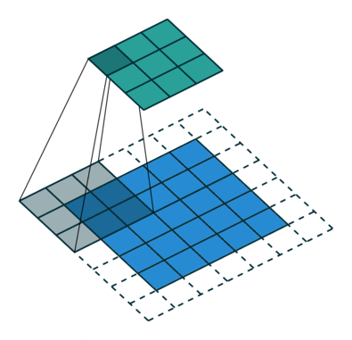

# 卷积

## 对卷积的理解

这里放一个知乎上的回答，我感觉对卷积的说明还是很形象，很感性的。

```markdown
作者：知乎用户
链接：https://www.zhihu.com/question/430129801/answer/1886809110
来源：知乎
著作权归作者所有。商业转载请联系作者获得授权，非商业转载请注明出处。

	问题一：学习到特征，其是这个说法不准确，反向传播是一个更新参数的过程，就是通过loss来计算预测值和真实值间的差距，然后根据这个差距，利用链式法则不断的求偏微分，然后更新模型中的每一个参数。其实更高级的认识，在CNN中梯度下降来更新卷积核参数的过程就是一个反卷积的过程。卷积核的作用是提取图像的特征，然而一个卷积核是不够的，因为一个卷积核只能反应图像的某一个特征，所以我们需要多个卷积核，这些不同的卷积核可以提取到图像不同的特征，从而让我们的模型学习图像特征的能力更强。这也就是越深的CNN越精确的原因，因为有足够的卷积核和足够的参数可以表述原始图像的特征。
	问题二：一张图像的像素是固定的，变得是有很多图像，不同的图像不断地在这个CNN中训练，导致卷积核的参数不断的通过反向传播更新。最后上亿个参数在N此迭代后，彼此都达到了一个可以接受的值，衡量这个接受的程度就是精度，那么模型就训练好了。所以有一个概念很重要，就是参数初始化，因为好的初始化会让模型训练收敛更快，所以不断有文献对于模型参数的初始化提出不同的解决方案。有兴趣可以看一下。顺便补充一个，所谓特征，很多人其实都不理解，实际上你可以理解为图像的某些部分，比如一个卷积核扫过去后（将一个三层的RGB图像变成一个一层的图像），在经过激活函数后，就是对扫过去新的这个图像上每一个像素值做激活函数，这张新的图像中的山的轮廓被凸显了出来，但是除了这个，你也看不到别的东西了，而另一个卷积核扫过去后，水的轮廓被凸显了出来，所以，很直观的，如果你想要知道这张图到底画的是什么，那是不是就需要很多个特征图加在一起，你才能看到原来图像是桂林山水，所以我们就需要很多的卷积核，就是这个意思。
	再补充一个，如果你不用卷积，那么原始图像比如1,024乘以768乘以3，是2,359,296个像素值，下一层的神经元比如是10的5次方个，你想200多万乘以10的5次方是多少个值，因此，卷积神经网络的核心思想是，降维且不损失，即一方面抽象化原始图像，另一方面利用不同的卷积核提取图像不同的特征以保证最大程度逼近原始图像。当你还原每一个卷积后的图像时，越到后面，越是看不出来原始图像，因为已经高度提取了图像的特征，只有计算机可以看出来是什么。这是一个从具体到抽象的过程。换句话说，也就是一个归纳和演绎的辩证过程。
	还有就是可能你会关心卷积过程中参数的数目，比如一个3乘3的卷积核，在扫过一个三通道的图像时，参数是27个，那么如果这样的卷积核有192个，那么就是27乘以192，即5184个参数。还有一个建议，就是多看英文的东西，中文的东西容易把很多概念混淆。如果有说得不对或者有其他问题，欢迎指正和探讨。
```

​	其中有一个对于我自己很关键的理解：在一个图片上会有很多的卷积核，而不是在平时搜到的下面这个经典的卷积图，或者可以说下面这个图的效果，在一个图片上会有几百个乃至上千或更多的个。一个图片会被一堆卷积核卷，并且这些卷了的之后的卷积核会成为下一个卷积层卷的目标，会有一批新的卷积核接着卷上一层卷出来的东西，从而一层层的将图片的信息在保证不缺失的情况下缩放，抽象。从而抽出图形的特征。

