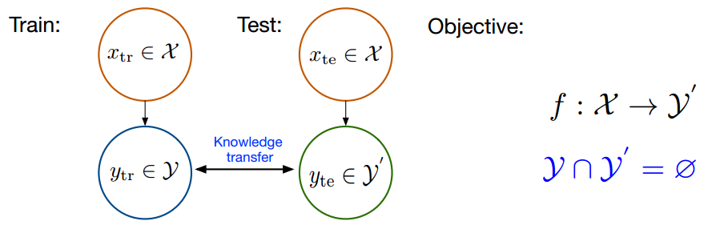

# 基础概念合集

## Zero-shot learing【零次学习】

### 第一版

这个第一版的理解是基于网络上搜到的一个例子：

>  假如模型已经通过学习知道了老虎，马，熊猫三个生物的图片特征，此时我们需要让这个学了上述特征的模型，分辨并告诉我们在一堆图片中哪个图片是斑马，在理想情况下模型会通过之前学到的老虎斑纹的特征，马形状的特征，以及熊猫颜色的特征成功的推理出斑马的特征应该是上述三种特征的综合，并最终给出一个正确的斑马的答案。

​	基于这个例子，其实不难发现Zero-shot learing本质上就是一个难度更高的推理任务【亦或是另一种意义上的迁移学习】，这种思想不仅可以用在图片的推理上，同样的也可以用在nlp以及一些多模态任务中，这种学习的好处是显而易见的，相较于常用的分类器等模型，该模型具有的智能更高，泛用性更高。

#### **较为笼统的定义**

​	模型通过对X1，Y1数据集的学习后【也就是说训练数据集是X1、Y1】，最终被应用在了一个X2，Y2数据集的任务中【也就是说测试数据集是X2、Y2】。其中两个数据集中的类别之间是没有交集的，但是同样的我们会给出对两个数据集中的类别的描述，使模型建立起两个数据集类别之间的联系。



#### **可能存在的问题**

- **领域漂移问题（domain shift problem）**

​	该问题个人认为本质上还是一个泛化性的问题，

> 举一个例子，在模型训练好之后，得到了一个有尾巴的特征。但由于该模型在训练的时候是用的马的数据集进行训练的，所以在识别同样有尾巴的斑马和猪的情况下，对斑马的预测效果就会比较好，对猪的预测效果就会很差。

​	这主要是因为虽然模型都学习到了有尾巴这一特征，但在模型内部的视觉表达上显然猪尾巴的特征与马尾巴的视觉特征相距甚远，模型学习特征时是以像素为单位，所以更注重视觉特征，但二者的视觉特征相差过大，导致泛化性大大降低。

- **枢纽点问题（Hubness problem）**

​	对于该问题这里采用两种表述方式，

1. 比较抽象的：将高维向量投影到低维空间时，会出现中心性问题。这样的投影减少了方差，从而导致投影点聚集成中心点。
2. 符合我自己想象的解释有两种，至于到底是哪种可以由后续版本进行迭代：
   1. 第一种你可以想象高纬向量是一个浓缩的极小的球体，而低维向量则是一个展开了的大平面，我们通过一些投射函数将这个高纬向量投影成为这个大平面，那么此时的枢纽点问题就是由于高纬向量过于浓缩，导致在投影时可移动范围过小，从而导致投射出来的低维都是偏向于训练时语料占比较大那一部分的语义的。
   2. 第二种你可以反过来想，高纬向量就是一大片的平面，而低维向量则是一个较小的球体，我们同样是通过一些投射函数，将这个大平面映射成为这么一个小球。此时的枢纽点问题就变成了，由于投射函数将一个极大的物体投射到了一个小物体上，那么此时小物体中就很难再具有大物体时的一些距离特征，从而导致都聚集在了一个中心点，而在进行预测时往往是取中心点的预测结果，从而导致整体的预测结果变成了原语料中那部分占比更大，那么此时经过浓缩之后就更容易被找到。

​	对于上述我自己的两种想象表达上，我更偏向于第二种，因为在抽象表达中，提到了由于投影函数减少了方差，才导致了枢纽点问题的出现，这与将大物体投影到小物体上的想象更为接近一些【即：由于是一个浓缩的问题，所以大物体上原有的方差被缩小了】。

​	通过上述的表述不难发现，本质上有点类似于过拟合。由于使用了投影函数，导致在进行后续预测时，会出现对于语料占比的重度依赖。

- **语义间隔（semantic gap）**

​	这个问题比较难在细节上给出解释，可以大致理解为由于语言任务在一些方面的劣势，导致出现了类似于Gan网络中的问题【离散的语义无法很好的利用Gan网络的调整效果】，大致来说的话就是：样本的特征往往是视觉特征，比如用深度网络提取到的特征，而语义表示却是非视觉的，这直接反应到数据上其实就是：样本在特征空间中所构成的流型与语义空间中类别构成的流型是不一致的。（如下图所示）


#### 应用

​	目前知道的GPT3应该是用到了zero-shot、one-shot、few-short learning，这也是在我读一个关于p-turning的知乎专栏时知道的，也正是因为这个所以才创了这个章节，专门说一些比较难懂的概念。

#### 参考文章

[知乎专栏](https://www.zhihu.com/tardis/bd/art/34656727?source_id=1001)，该文章还有很多可以深挖的地方，比如真正的代码实现，专栏里给出了部分代码和数学公式，但是由于第一版的认识并不足以支撑我去看懂，所以留着后续进一步展开。

## One-shot learning

### 第一版

这个本质上就是一个样本量极少的迁移学习。或者换一种表达方式，就是在上面zero-shot的基础上【zero-shot是一张相关的图片都没给，从模型中，通过给出的描述直接进行推测】，给了一张图片让他学。而few-shot则是在one-shot的基础上，将学习用的图片添加到了少量。如果添加到一定数量之后就可以认为是一个比较常用的迁移学习了。

## P-Turning

### 第一版

​	这里给出一个我在感性上的认识：这个P-Turning全称应该是：Prompt tuning。其本身是对大模型微调的一种技术，相较于传统微调【这里还不太清楚传统微调是怎么微调的，因为我对微调的第一个认知就是这种微调方式】，这种微调方式采用了冻结大模型的参数方式以便于减少大模型参数对内存和训练空间上的占用。

​	但是这种方式在普通大小的预训练模型下微调出来的效果并不是很好，同时在处理困难的语言序列标注任务时缺少普适性。所以清华的一批学者提出了P-Turning的第二版，具体可以看这个[论文](https://static.aminer.cn/upload/pdf/884/1862/1514/628749175aee126c0ffe1dc1_0.pdf)，对应本地的[p-turning v2.pdf](../article/p-turning v2.pdf)

## 优化器

​	优化器在深度学习中主要担任的作用就是根据loss的值在反向传播之后对模型中的参数进行进一步的优化。如果说深度学习本身是一个尽可能拟合非线性函数的过程，那么优化器本身就是将一个函数不断向目标函数贴近的工具。通过利用优化器，将模型不断的向着某个“正确”的函数拟合。这里一用网络上的一个图，可以将优化器按照类别共分为以下三种。


### 梯度下降法

**概览**

​	这里首先给出一个大概的理解：该方法的基本思想就是不断的通过loss函数算出梯度，结合学习率去更新并得出下一个参数的值，并且不断地迭代下去。具体公式可以参考[这里](#梯度下降)的公式。

#### 梯度下降【GD（Gradient Descent）】

##### 概念

​	该方式作为最基础的优化器方式，这里给出所谓梯度下降的公式，并且根据公式，尝试理解[概览](#梯度下降法)中说明的意思。
$$
W_{t+1}=W_t-\eta_t\Delta J(W_t)
$$

> **符号说明**
>
> ​	t：时间步
>
> ​	η：学习率
>
> ​	J()：损失函数
>
> ​	W：参数
>
> ​	$$\Delta$$：梯度

​	有了上面这些符号说明其实上面这个公式就已经很容易可以看懂了，t是时间步，这个时间步可以理解为RNN中的一步的概念，通过不断的向前走进行迭代。带入上面这个公式便是：

1. 使用损失函数$$J()$$计算出当前时刻的参数$$W_t$$的损失
2. 将1中计算出的损失求偏导数，得到当前时刻的梯度$$J(W_t)$$
3. 将2中得到的梯度乘以学习率，这里可以感性的认识一下学习率：**学习率就是在当前时刻，你想要让下一时刻的参数，下降当前时刻梯度的百分之多少**。而为了保证准确性，所以这里学习率一般设置的都比较小【以免一下子冲过头了，把最优解给忽略过去了】
4. 利用当前时刻的参数$$W_t$$减去3中得到的结果，即可得到下一时刻的参数的值。

​	在上面的叙述过后，给出一个较为感性的认识的话，梯度下降的过程就像是：一个人根据地图（损失函数的梯度），从一个很高的山上（最开始的参数）往下走，每走一步看一眼地图，而具体每一步走多大，则是由学习率决定的，最终我们要达到的目的就是下到这个坑底。

​	此时有小伙伴可能就会有疑问了，上面都说了深度学习的过程本质上就是拟合一个非线性函数，那为什么只有往下走的过程，没有往上走的过程呢？这是因为损失函数本身的计算结果就是你模型预测出来的结果与真实结果之间的差距，而差距当然是越小越好啦。

##### 缺点

1. **训练速度慢**

   ​	之所以会有训练速度慢的问题，主要是因为上面说的为了确保下降的准确性，所以每次的学习率一般都很小，而这也就导致了训练收敛的速度会很慢。你可以想象一下：你在珠穆朗玛峰上，最后要回到海拔为0的地方，而你每走一步都必须看一眼地图。就这样走下去可想而知的慢。

2. **容易陷入最优解**

   ​	这是因为我们需要拟合的函数并一定都是一个完美的凸函数，只要莽着劲一路走下去就一定能到达最低点，比如这里有一个鞍形函数，他中间就有一个较低的平面，如果我们运气不好，就有可能陷入到这个局部最优解中。还是以珠穆朗玛为例，你要往下走了，此时随机的选择了一个方向，根据地图你发现你选的这个方向有一个很低很低的地方，等你过去之后你发现周围的地方都比你这个地方高，你就认为我已经到达海拔为0的地方了，但这明显是错误的【也许你还没有走下珠穆朗玛呢】。

   ​	这也就是为什么经过研究之后大家都发现模型的初始化参数选择非常重要，同样这也是为什么在大模型上进行微调的效果，要好于很多从头开始自己训练的模型【因为大模型经过大量训练其中的参数已经具有了一定的信息量，这就好比有一个仙人给你指路说朝着这个方向走一定可以到达海拔为0的地方一样，肯定是要好于你自己无头苍蝇瞎撞的】。

#### 随机梯度下降【SGD（Stochastic Gradient Descent）】

##### 概念

​	在说明随机梯度下降之前一定要搞清楚一个概念：loss函数计算出来的值一个标量，哪怕放进去计算的参数一个有非常多参数的列表，但最终loss函数也会将他们所有的计算结果相加在输出。
$$
W_{t+1}=W_t-\eta N \Delta J(W_t,X^{(i)},Y^{(i)})
$$

> **符号说明**
>
> ​	t：时间步
>
> ​	η：学习率
>
> ​	J()：损失函数
>
> ​	W：参数
>
> ​	$$\Delta$$：梯度
>
> ​	X：一个批量中的某一个输入的输入值。
>
> ​	Y：一个批量中的某一个输入的真实值。
>
> ​	i：一个批量的下标
>
> ​	N：一个批量的大小

​	相较于之前的梯度下降，随机梯度下降最重要的就是引入了批量（Batch）这个概念，从感性的角度理解，可以看成把一堆数据按照批量的大小打包成为一个批量输入到网络中进行计算，最终在计算loss时也是一批一批的往里送，并最终在loss函数中将算得的一系列loss相加，得到最终的loss。

> **注意：**此时的数据一个X和一个Y加起来算一个数据，X用来输入，Y作为真实值，用来与预测出来的Y_hat进行比较

​	有了上面的铺垫这里带入公式就是以下流程【注意：随机梯度下降里基本单位已经可以从单个数据，转为以批量为单位了】：

1. 使用损失函数$$J()$$，根据给出一个批量中的每一个X和Y，算出这一批量中所有数据此时刻共同对应的参数$$W_t$$的损失。这个参数$$W_t$$本身是通过一个批量的数据计算共同得出，而不是一个批量中每一个数据都算出一个参数$$W_t$$。
2. 将1计算的$$J(W_t,X^{(i)},Y^{(i)})$$求梯度并且乘以此次批量的大小N。
3. 将2中计算的梯度乘以学习率大小，得到这个批量需要下降的梯度。
4. 利用3的计算结果和原有参数$$W_t$$更新新的参数$$W_{t+1}$$

​	可以看出，随机梯度下降相较于上面的梯度下降，唯一添加的新概念就只有批量，将原来的计算数据从一个变成了一批。如果还是以上面珠穆朗玛峰的那个例子来看，从原来你只有一个人找下山的方向，变成了一堆人（具体的人数就是批量的大小）从你们当前的这个点【这里很关键，一定是当前点。如你下到半山腰了，那下次找路也是从这个半山腰的点开始向四面八方找】向着四面八方都去找一个下山的路线，找完之后再都回到之前那个点，汇总一下信息后，你们根据这一批人找到的所有的路线综合出一条最终路线，并沿着这条路线走你们人数那么多步，而后再在新的点重复这个过程。

​	其中需要说明的一点就是汇总信息这一步在模型计算上是如何完成的。这里以一维向量例给出这个过程在空间上的想象方式，见下图：

.png)

​	这里给出一个上图的解释：红黄蓝三色的向量就可以理解为输入到网络中的向量，他们分别找到了一个梯度下降的方向。而后的过程就是先由红和黄两个向量相加得到了紫色的向量【这里可以理解为：经过红和黄向量的商量之后，觉得紫色才是正确的梯度下降方向】，再之后由紫色的向量与蓝色的向量进行相加，得到了靛蓝的向量。所以最终这三个向量综合得出靛蓝的向量的方向就应该是最好的梯度下降方向。

##### 优点

1. **训练速度更快**

   ​	这个训练速度更快是相较于上面的梯度下降方法来说的，因为这里每次梯度更新时的单位已经从一个单独的数据，变成了一个批量的数据，所以在面对大数据集时，训练的速度更快，梯度下降的一般来说也更快。具体原因有可能是以下两点【自己的猜测】：

   1. 在公式中可以看到在学习率之前有乘上一个批量大小N，而这无疑是增大了梯度下降的速度。
   2. 每次都是以批量在数据集中取出数据进行计算的，所以在数据集大小不变的情况下，肯定取出的次数就更少，从而迭代的step肯定也会相应减少。

   **问题：**这里提出一个我自己的疑问，虽然可以用上面的向量图来解释在多个向量同时计算参数$$W_t$$时的空间意义，但如何确保所结合的向量就一定具有正确性呢，换句话说如果上面那个图，正确的梯度下降方式应该是红色向量所在的方向，而此时有一个与红色向量夹角在(90,180]的向量出来进行干扰，那么此时对向量的加法运算就会把结合出来的向量往着错误的方向引导，如果多次迭代都含有这种错误，那是否会导致算出来的向量与正确方向完全相反呢？

2. **对梯度要求更低**

   ​	对梯度的要求更低，就我参考的这个文章而言，他的意思是有大量的实践工作表明：由于引入了噪音，并且在噪音可控的情况下，SGD还是可以很好的收敛的。

   **新问题：**2中的解释可能在一定程度上回答了我在1中的的那个问题。主要就是通过控制引入噪音的大小从而确保模型可以收敛。那么此时就有了一个新问题：如何控制噪音引入大小，或者说如何确保噪音不会因为使用了SGD方法而被引入过多。如果噪音被引入了很多，是否可以通过减小**批大小（batch_size）**来进行控制？

##### 缺点

1. **容易陷入最优解**

   ​	依旧没解决这个问题，可以理解为，你虽然派出了一堆人在四面八方搜索正确的路线，但由于大家都不太聪明，所以最终找到的依旧是一个错误的路线。

**代码**

1. **pytorch版本**

   ```python
   torch.optim.SGD(params, lr=, momentum=0, dampening=0, weight_decay=0, nesterov=False)
   """
   params(iterable)- 参数组(参数组的概念请查看 3.2 优化器基类：Optimizer)，优化器要管理的那部分参数。
   lr(float)- 初始学习率，可按需随着训练过程不断调整学习率。
   momentum(float)- 动量，通常设置为0.9，0.8
   dampening(float)- dampening for momentum ，暂时不了其功能，在源码中是这样用的：buf.mul(momentum).add(1 - dampening, d_p)，值得注意的是，若采用nesterov，dampening必须为 0.
   weight_decay(float)- 权值衰减系数，也就是L2正则项的系数，权重衰减具体见权重衰减那一节【这个值就是其中的lambda】
   nesterov(bool)- bool选项，是否使用NAG(Nesterov accelerated gradient)
   """
   ```

2. **TensorFlow版本**

   ```python
   tf.keras.optimizers.SGD(lr=0.01, momentum=0.0, decay=0.0, nesterov=False)
   """
   lr：大或等于0的浮点数，学习率
   momentum：大或等于0的浮点数，动量参数
   decay：大或等于0的浮点数，每次更新后的学习率衰减值
   nesterov：布尔值，确定是否使用Nesterov动量
   """
   ```

   

   https://blog.csdn.net/caip12999203000/article/details/127455203

## 权重衰减

​	这里的第一版主要引用一下我OneNote上的笔记内容，如果后续有什么新的进展再在第二版中增加。

#### 第一版

​	权重衰退主要的作用就是对过拟合的模型进行调整，因为一个模型如果在训练中出现了过拟合的问题，那么训练集的loss和测试集的loss之间的差距就会呈现的不断加大的情况。也就是训练误差不断下降，但泛化误差下降到一定程度之后就不下降了

> 因为模型通过不断地学习，使参数权重W不断地拟合训练集中的噪音，导致W变得虚高。从而导致训练误差快速下降，但由于其训练出来的参数W，是在拟合了数据集中的噪音而优化的，导致这个训练好的参数W在实际的预测中并没有一个很好的表现。

​	所以这里为了解决这个问题提出了权重衰退，说白了就是给定一个**罚函数**。这个罚函数一般使用的是L2范式的平方。其作用就是将不断增大的参数W重新一步步的拉回他应在的位置。可以理解为损失loss，是不断的拔高参数W的值，而罚函数就是不断降低参数W的值，当二者达到平衡的时候W就会被固定到一个相对合适的值【并不一定是真实的W的值，因为实际中我们无法做到这点】。

#### 第二版

​	这里是在阅读了第一版之后直接更新的第二版，我发现在第一版中有一个十分模糊的点：`可以理解为损失loss，是不断的拔高参数W的值，而罚函数就是不断降低参数W的值`，这一句话与上面我在优化器中利用公式理解的参数$$W_t$$出现了重大误差。本来的权重应该是不断下降的过程，那为什么这里又说权重是被不断拔高的呢？这个问题我也无法给出具体的答案，因为这段话我没记错的话应该是跟着李沐老师的课走的时候写下来的，应该是正确的。虽然我无法给出具体答案，但我可以根据李沐老师的公式从头自己推一遍，从而重新理解一次权重衰退是什么。

​	这里首先给出李沐老师ppt上的公式推导【在看这个参数更新推导之前，一定要看[这里](#概念)的基础参数更新公式】：
$$
loss函数：
l(W,b)+\frac{\lambda}{2}||W||^2\\
梯度计算公式(对W求偏导数)：
\frac{\delta(l(W,b)+\frac{\lambda}{2}||W||^2)}{\delta W}=\frac{\delta l(W,b)}{\delta W}+\lambda W\\
时间t更新参数：\\
W_{t+1}=W_t-\eta\Delta J(W_t,b)\Rightarrow W_t-\eta(\frac{\delta l(W_t,b)}{\delta W_t}+\lambda W)\Rightarrow(1-\eta\lambda)W_t-\eta\frac{\delta l(W_t,b)}{\delta W_t}\Rightarrow(1-\eta\lambda)W_t-\eta\Delta J(W_t,b)
$$

> **符号说明：**
>
> ​	**原有参数**
>
> ​		t：时间步
>
> ​		η：学习率
>
> ​		J()：损失函数
>
> ​		W：参数
>
> ​		$$\Delta$$：梯度【偏导数】
>
> ​	**ppt公式参数**
>
> ​		l()：损失函数
>
> ​		b：偏移，可以理解为参数的一种，只不过不是权重了，举例：y=Wx+b
>
> ​		λ：罚函数罚的“程度”，是一个超参数，越大罚的越狠。
>
> ​			$$\lambda=0$$：无作用
>
> ​			$$\lambda\rightarrow\infty,w\rightarrow0$$ 这里我个人理解，可以将这个λ和w的关系带入到最后的那个公式中，当$$\lambda\rightarrow\infty$$时$$(1-\eta\lambda)\rightarrow0$$，所以我觉得这里的w是代指的表达式$$(1-\eta\lambda)W_t$$。也就是被“罚”的权重。
>
> ​		$$\delta$$：梯度【偏导数】

​	通过上面的公式推导不难发现罚函数本身就是在原来的梯度更新函数上，在原梯度上乘了一个系数。这个系数同时由学习率$$\eta$$和罚函数系数$$\lambda$$决定，并且当$$\lambda=0$$时，则意味着无惩罚。当$$\lambda\rightarrow\infty$$时，由于$$\eta$$再小始终也只是一个常数，所以意味着$$(1-\eta\lambda)W_t\rightarrow0$$。

​	从而可以发现第一版中说的参数W拔高，与其说是被拔高，不如说更像是梯度降不动了，只能通过惩罚原梯度从而使梯度更趋近于正确的区间。

### 罚函数种类

#### L1范式

**公式**
$$
\sum|x|
$$
**pytorch实现**


#### L2范式

**公式**
$$
\frac{\sum{x^2}}{2}\\
or\\
\frac{\sum{||x||}}{2}
$$
**pytroch实现**

