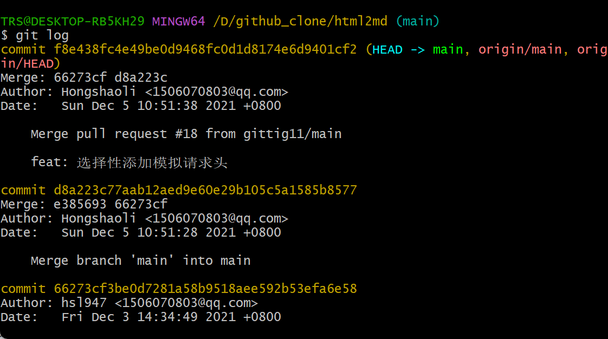

# git理论及流程


# git常用命令

## 基础环境【环境初始配置】

### 配置用户名

```bash
git config --global user.name "username"
```

### 配置邮箱

```bash
git config --global user.email "email"
```

上述两个命令在单环境，不更换环境的情况下，只需要配置一次，但是如果一台服务器上有不止一个git环境时则需要分别配置【如：gitee和github同时存在的环境】。当然也可以通过分别生成密钥并配置到对应的网站来完成操作。

### 密钥生成【与上述二选一】

```bash
#生成 key，将邮件地址替换为你 Gitee 或者 Github 使用的邮件地址
ssh-keygen -t rsa -C "email"
```

使用命令之后，会生成id_rsa_github.pub、id_rsa_github两个文件，二者分别代表了公钥和密钥。将生成的公钥放入github或gitee的对应位置，并在.ssh目录下创建文件config，并在其中写入即可：

```tex
# gitee
Host gitee.com
HostName gitee.com
PreferredAuthentications publickey
IdentityFile ~/.ssh/id_rsa_gitee
 
# github
Host github.com
HostName github.com
PreferredAuthentications publickey
IdentityFile ~/.ssh/id_rsa_github
```

## 库相关环境

### 库的初始化

```bash
git init
git add README.md
git commit -m "first commit"
git branch -M main
git remote add origin https://github.com/srx-2000/gittest.git
git push -u origin main
```

### 库的一次基础提交

```bash
git add -A #将所有的变化了的文件添加
git commit -m "commit"
git push
```

### 库的本地同步【将代码从云端拉下】

```bash
git clone https://github.com/srx-2000/gittest.git #直接在当前文件下clone库
git pull #往往在一个本地库中使用，用于将云端的代码同步到本地
```

### Branch【分支】


### 其余细碎命令

##### git log

查看所有提交的记录



