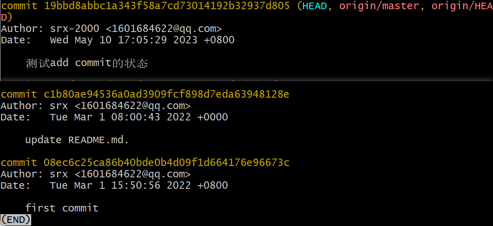

# git理论及流程

[TOC]

## 基本流程及对应命令


### 理解

#### 第一认知

1. 首先要理解一共有四个分区，其中最主要的是本地仓库和远程仓库。本地仓库是通过commit提交的，这也就是为什么每次提交到远程仓库之后都会发现明明是刚push的，但提交时间却显示为几分钟前提交的原因，因为它是以本地仓库的最新提交的时间计算的。

2. 有了上面对本地仓库的理解，就可以实现一个事情：将多次修改都提交到本地仓库，通过维护本地仓库实现本地迭代【之前全部都是将项目单纯复制一份出来直接commit+push一条龙，所以每次代码有一定修改都需要重新复制一份放过去】

3. 同时要注意一个事情，远程仓库和本地仓库的同步问题，如果一个库是多个人维护，那么此时就可能会出现远程仓库的数据与本地仓库不一致的问题，所以每次要对本地仓库进行更改之前最好都走以下的流程：

   1. 在工作目录中编写了新的代码
   2. **git pull**或**git fetch**：将远程仓库的代码同步到本地仓库
   3. **git add -A**：将工作目录中代码加入到缓存区里
   4. **git commit -m "提交注释"**：将缓存区的代码提交到本地仓库
   5. **git push**：将本地仓库的代码同步到远程仓库

   当然上述流程肯定有很多问题，如：如果远程仓库中某一文件的修改与本地工作目录里自己编写的是同一个文件，那么此时如何解决冲突，并合并等。

#### 第二认知

##### .git文件夹的认识

上面虽然说了有两个仓库，一个本地一个远程，但是并没有明确本地仓库位置。其实本地仓库的位置就是每次上传代码时进入的文件夹中的.git文件夹，该文件夹中的文件作用分别是：

1. config文件：远程仓库的分支信息。

   

2. HEAD文件：当前本地仓库指向的远程分支的信息

   

3. index文件：当前本地仓库暂存区的相关信息【使用nodepad打开时乱码】

4. log文件夹：分为远程库和本地库，以及在refs文件夹下还有一个HEAD文件用于保存当前头的log信息

   

   保存的信息，详见[git log指令](#git log)，**本地的版本控制主要就是靠这个文件夹的下的内容实现的**。

5. objects文件夹：用于存储所有代码的数据，也就是快照

   

6. refs文件夹：存储指向数据提交对象的指针

   

   其实看起来和上面的log的文件夹结构类似，但其中保存的东西还是略有差距的，log里不仅保存了每次commit时生成的那个40位的指针，同时还保存了谁提交的，以及提交者在提交时写的一些注释。

   这里给出一个上述的40位指针的形式：

   ```
   81f7b9507b279a9834cd8926f9458bd80d865d89
   ```

##### 四大分区的认识

在上面第一认知的记叙中主要都在写本地仓库而忽略了其余四个部分。这里统一介绍一下；

1. 工作目录：从概念上理解就是你用来写代码的地方，你可以在这个目录下编写，更改你的代码。从实际操作上来讲就是你在git bash上敲出`git init`的那个目录，在你敲出上述命令之后该文件夹里就会多出一个.git文件夹，这就以为着此时该文件夹已被**标识**为一个git的工作目录【没错，标识这个词是重点，因为git本身是一个分布式的版本控制软件，所以重点在于版本控制，而不是存储，git会根据.git中的信息跟踪并进行版本管理】

2. 暂存区：主要作用就是将工作目录中编写好的目录暂时缓存的地方，此时的代码还并未提交到本地仓库。此时就需要引入两个个比较关键的概念：**跟踪**、**快照**。一个文件被从工作目录提交到暂存区再被提交到本地仓库的过程，就是一个文件从未被跟踪到进入暂存区拍摄快照并被跟踪的转变。git做版本管理是通过快照进行的【其实git仓库存储的也都是一个个快照，而非实际的文件，这也就是为什么他是版本控制软件，而不是数据库】，通过对比各个快照之间的区别，对文件进行增删改查。而快照的拍摄时间就是在添加到暂存区的时候。这里举一个极端的例子：一个空文件，每次我在工作目录中为其中添加一个字母之后就直接添加到暂存区中，并不断重复这个过程10次，那么对于这个文件此时就会被拍摄10个快照。每次添加到暂存区时都通过`git diff`查看，发现每次工作目录新更改的文件都会与暂存区中的文件不同，这可不是废话文学，这证明了每次添加到暂存区之后都会拍摄一个快照，而且快照的增删是以行为单位的，同一行的更改，在快照中也会被显示为先删除再添加。同时需要明确的是，暂存区的东西都会被加在

   

   同时这里需要重点说明一个问题：在git的管理下，文件只有两种状态：**已跟踪**和**未跟踪**。文件如果没有添加到暂存区未生成快照时就是**未跟踪**状态，一旦文件提交到暂存区时，就会生成快照并被跟踪。整个流程见下图。

   

   而与缓存区相关的命令主要有：

   ```bash
   # filename为需要添加到暂存区的文件，也可以替换为-A或.用以添加所有文件。
   git add filename
   # 将现在暂存区还原到上一次本地仓库的版本【工作目录(此时工作目录是在git add之后更改了某些东西的版本)和本地仓库都不会更改】
   git reset HEAD # 其中包含了默认参数--mixed
   # 最软的重置，此时暂存区，工作目录，本地仓库都不会有任何更改，仅是用来移动当前的头指针的，退回到某个版本
   git reset --soft HEAD
   # 将暂存区与工作目录都回到上一次版本，并删除之前的所有信息提交【这里指的提交是将工作区中的代码通过git add添加到暂存区，而非使用git commit将暂存区的代码提交到本地仓库】，当前 HEAD 指针、工作区和暂存区内容全部改变
   git reset --hard HEAD
   ```

3. 本地仓库：本地仓库就是第一个正式的存储点，但与数据库不同的是，其中存储的并不是真正的数据文件，而是一个个的快照文件。与上述的工作区和暂存区都是在本地的。其中每次使用`git commit`提交之后都是真正的将一个快照提交到了“仓库”中，而提交到了仓库中也就意味着git开始正式追踪他了，换句话说此时git就已经为你生成了那个标识你一次提交的40位指针码，而这是永久的。如果想要删除就无法像上面那种直接使用reset就能清空了。同样举一个极端的例子：我是一个特别喜欢在本地仓库修改代码的人，所以我每次将本地仓库代码同步到远程仓库时都是我在本地仓库多次commit之后的，此时我使用`git push`将我这段时间所有的commit都一次性推上云端，那么将会出现在远端仓库一次性的多出了很多次的commit次数。换句话说不论是gitee还是github【以二者举例】上的commit次数都是与你本地仓库的提交次数相同的，而非与你提交到远端仓库的次数相同。

   **git push之前**

   

   

   **git push之后**

   

   

4. 远程仓库：远程仓库作为第二个正式存储点，每次可以使用`git push`将本地仓库的代码上传到远程仓库，但与本地仓库不同的是，这次上传的与本地仓库的提交是不同的，本地仓库的提交只是修改一些快照信息，而远程仓库的提交则是真的将文件上传到远端的仓库。当然后续对远程仓库的修改以及远程仓库到本地的同步，都是通过本地仓库（.git）中的[6种文件及文件夹](#.git文件夹的认识)进行通信的。

##### git对象

git对象一共有三种对象：commit对象、tree对象、blob对象。三者的对应关系如下图所示：


1. **blob对象**

   blob对象对应的就是文件快照中那些发生变化的文件内容

2. **tree对象**

   tree对象则记录了文件快照中各个目录和文件的结构关系，它指向了被跟踪的快照

3. **commit对象**

   commit对象则记录了每次提交到本地仓库的文件快照

​	从上图看出commit对象中有两个指针，一个指向tree对象，一个则指向上一个commit对象【commit parent】。

​	其中指向tree的指针代表的是当前提交【注意这里的提交是commit，而非add】下的快照文件的目录文件结构关系。换句话说：每次commit之前都需要add进行快照生成，快照生成之后就会有一个tree对象对这个快照下的文件目录结构进行管理，而当这些快照被提交的时候，就会创建一个commit对象，并有一个指针指向这个tree对象。

​	而另一个指向commit parent对象的指针，则是指向了上一次的commit对象。用来方便进行上一个头文件的检索【类似于双向链表，找prev的操作】。这里给出一个实际的例子：

​	这里两个红框圈出的部分是一样的，是因为第二行作为第二次commit，他的commit parent是第一行的commit对象。而这里也有一个比较特殊的点，就是第一次提交，由于他已经是头结点了【以链表的思路带入】，所以他的commit parent只能标识为全0。

​	而使用上述这种包含commit parent的结构，可以使我们在对HEAD对象进行操作时十分方便，每次只需要找到上一个commit对象的指针即可，哪怕二者相隔多代，也可以通过不断地找到commit parent指针获取到。

##### git分支概念

​	这里在说分支之前先给出之前没有分支概念时【即所有提交都在master上时】的分支概念图：




​	接下来引入分支的概念后的概念图就变成了这样


​	下面结合上面这个图解释一下分支的创建和切换等概念。首先要明确一件事——所有的分支操作都是在操作指针，而所有分支上的文件都不是真的文件，而是一个个的commit对象。首先是创建分支，一般创建分支有两种情况，一种情况是直接使用命令`git branch 分支名`创建分支，此时默认是基于当前分支进行分支创建，而另一种情况是明确指明在某一个分支的基础上创建一个新的分支，命令见[下方](#创建分支)，那么此时新创建的分支就会的commit对象指针就会指向原分支的commit，注意这里指向的是创建新分支时最新的那个commit对象，如上图中的情况就应该是新的分支在08ec6c这个时刻创建的。

​	既然这样那后面的c1b80ae这个commit又是怎么回事呢？其中主要涉及的就是分支点切换了。所谓的分支切换其实主要切换的就是各个指针，分支在创建的时候主要就是创建了一个新的指针，指向新的commit，而原来分支上的指针会停留在原来分支的最新的commit上，还是以上图举例：

> 在08ec6c时刻创建新分支后，origin pointer就停留在了08ec6c这个commit对象上，然后用户在新的分支上提交了1c3de36，此时HEAD指针应该指向的就是1c3de36对象。随后用户又切换到了Master分支上，提交了c1b80ae这个commit。此时origin pointer和HEAD都指向了该对象，再然后用户又切回了new Branch，并提交了81f7b75这个分支，所以最终的new Branch pointer和HEAD就都停留在了这上面。

​	通过上面的例子不难发现，用户在哪个分支上工作，HEAD就会跟随到哪个分支，而每个分支都会有一个属于自己的指针，并且个分支的指针都会指向自己最新的一次commit对象。

​	然后便是分支的分类，与上面的分区一样，分支也分为：本地分支，远程分支，跟踪分支。

1. 本地分支就是本地仓库的分支，也是我们执行`git branch`一系列命令时操作的分支。

2. 而远程分支则是github或gitee上的分支，该分支是无法通过本地的`git branch`命令操作的，只能通过不断的与远程服务器进行交互来实现对分支的操作【具体是怎么操作还不是很清楚】。

3. 最后便是跟踪分支，这种分支有点类似于默认分支，这里指的默认分支是用来将本地分支和远程分支联系起来用的。跟踪分支是与本地分支和远程分支直接联系的，如果用户处于本地的跟踪分支上直接使用`git push`则git会直接利用跟踪分支将数据推送到与自己关联的远程分支，同理当用户直接使用`git pull`时跟踪分支则会直接将跟自己关联的远程分支的数据拉到本地分支上。可以看出来本身跟踪分支类似于一座桥，本地和远程都保存了一个默认分支，如果用户没有特别的指定分支，则会直接利用保存好的默认分支进行数据的上传和下载，这也使得git可以开箱即用了。

   > 这里补充一下：在github第一次提交的时候，官网给的最终push命令是：git push -u origin main，而这里的-u的意思就是将现在这个库的本地分支：**origin**与远程分支：**main**进行关联。这样下次再在origin这个本地分支进行push的时候，就会直接提交到main这个远程分支上。这也是为什么在单分支仓库中，只需要敲一次-u origin main之后再使用push都是直接用git push就行了的原因。

##### git分支合并

​	**下面会介绍两中分支合并方法，虽然rebase方法可以简化分支网络图，同时也可以减少如：`Merge: e579040 7cdc7f6`这种无意义的提交记录，但同时由于它是直接在主分支后直接接入新的提交，所以也会导致主分支历史的被篡改。所以一般还是merge用的更多一些。**

###### merge


​	在说分支合并之前首先需要重申两个问题：1.任何分支的创建都是基于某一个分支进行的，即便是直接使用`git branch 分支名`这个简单的命令也是默认使用当前HEAD指针所在的分支进行创建的。2.所以每一次的分支合并最终也要落实到一个分支上，重点在于“一个”，所以合并分支时一定有一个主分支，其他的分支是往这个分支上合并，同时最后提交的时候【这里的提交不仅只commit，同时还可以指push】都需要在这个主分支上进行。

​	有了以上的认识之后再看上图，首先是new branch是基于Master branch创建的，而后分别在两个分支上对同一个文件提交了两次不同的结果，这就导致这个文件在两个分支的内容不同，从而为后续分支合并时出现冲突埋下伏笔。完成上述四次提交之后我们便可以在主分支上【这里使用Master当主分支】使用命令：`git merge 另一个分支名`从而将另一个分支合并到主分支上。而此时不出所料的发生了冲突。【**这里提一嘴，在合并之前，你在哪个分支上时，使用`git log`命令就只能查看这个分支上的提交记录**】


​	在发生冲突之后使用`git status`查看主分支上的暂存区状态就会出现以下的情况【注：在合并之前主分支上的暂存区是清空的】：


​	这里主要是因为在合并的时候ab.txt文件的二者不同，导致其无法直接合并并在暂存区拍摄快照。而我们则需要解决上述的冲突，打开ab文件就会出现以下的景象：


​	这里我创建的新的分支叫做merge_test，同时由于此时我是在Master这个分支上进行工作的，所以HEAD指针是指向Master的【也就是说你在合并的时候HEAD指针指向的就是主分支】，所以这里直接使用HEAD代表了Master分支。有了以上的解释就不难发现，分支直接的冲突以`=======`为分界线，上面是主分支的内容，下面是被合并分支的内容。`>>>>>>`和`<<<<<<<`分别代表了被合并分支和主分支的分支名称。我们需要做的只是看着两个分支保存自己需要的，然后将`=======`还有`>>>>>>> merge_test`和`<<<<<<< HEAD`都删掉即可。处理完成之后再次使用命令`git add`、`git commit -m "fix merge conflict"`提交即可。

​	此时我们再使用`git log`查看提交日志时就会发现，原本只显示Master提交记录的，此时已经变成既显示Master提交记录，又显示merge_test提交记录，同时最新的提交记录会在上面添加一个`Merge: e579040 7cdc7f6`其中e579040和7cdc7f6分别是Master的最新commit号和merge_test的最新commit号。


​	通过上图我们还可以发现一个细节merge_test这个分支的名字停留在了7cdc7f6这个提交记录上，而HEAD-->Master则是停留在了最新的合并记录上，所以这里也就是[图1](#merge)最后画出的样子。

​	此时远程仓库同样的会将两个分支的提交记录以及合并记录都显示：


###### rebase


​	rebase作为git的另一种分支合并手段，其本质就是将新的分支中的所有提交接到主分支的最新提交之后，其与merge最大的区别在于rebase是真的将分支衔接到了主分支中，这点从网络图中可以比较直观看出：


​	上图中10那个点开始创建了一个merge_test的分支，并且最终在相隔两个点后重新合并到了主分支中，可以看见有一个明显的分支支出去了，并最后插回了主分支。

​	但这里没显示的是在“fix branch merge conflict on master”这次提交之后我又创建了一个新的分支“rebase_test”，并且在这之后在主分支上修改并提交了一次ab.txt文件，随后又在rebase_test分支中分别修改并提交了两次，此时出现了冲突，而后在master分支上执行了`git rebase rebase_test`的命令，并在解决冲突后提交了“fix conflict with rebase”，但是此时可以发现并没有像merge一样支出一个新的分支，而是直接将rebase_test分支上的两次提交直接接入到了master分支之后。

# git常用命令

## 基础环境【环境初始配置】

### 配置用户名

```bash
git config --global user.name "username"
```

### 配置邮箱

```bash
git config --global user.email "email"
```

上述两个命令在单环境，不更换环境的情况下，只需要配置一次，但是如果一台服务器上有不止一个git环境时则需要分别配置【如：gitee和github同时存在的环境】。当然也可以通过分别生成密钥并配置到对应的网站来完成操作。

### 密钥生成【与上述二选一】

```bash
#生成 key，将邮件地址替换为你 Gitee 或者 Github 使用的邮件地址
ssh-keygen -t rsa -C "email"
```

使用命令之后，会生成id_rsa_github.pub、id_rsa_github两个文件，二者分别代表了公钥和密钥。将生成的公钥放入github或gitee的对应位置，并在.ssh目录下创建文件config，并在其中写入即可：

```tex
# gitee
Host gitee.com
HostName gitee.com
PreferredAuthentications publickey
IdentityFile ~/.ssh/id_rsa_gitee
 
# github
Host github.com
HostName github.com
PreferredAuthentications publickey
IdentityFile ~/.ssh/id_rsa_github
```

## 库相关环境

### 库的初始化

```bash
git init
git add README.md
git commit -m "first commit"
git branch -M main
git remote add origin https://github.com/srx-2000/gittest.git
git push -u origin main
```

### 库的一次基础提交

```bash
# git add . # 保存新的添加和修改，但是不包括删除
# git add -u # 保存修改和删除，但是不包括新建文件。
git add -A # 将所有的变化了的文件添加到缓存，所以git add -A=git add .+git add -u
git commit -m "commit"
git push
```

### 库的本地同步【将代码从云端拉下】

```bash
git clone https://github.com/srx-2000/gittest.git #直接在当前文件下clone库
git pull #往往在一个本地库中使用，用于将云端的代码同步到本地
# 这里对上述的pull命令进行一个补充：git pull本身也是一个省略参数的命令，全称应该是：git pull --merge，而另一个参数就是--rebase【rebase和merge的具体区别可以看：git分支合并】
git pull --rebase
# 同时git pull其实是以下两个命令的组合
git fetch
git merge FETCH_HEAD
# 而git pull --rabase其实是以下两个命令的组合
git fetch
git rebase FETCH_HEAD
```

### Branch【分支】

#### 切换分支

```bash
git checkout master # master可替换为任意分支名称
```

#### 创建分支

```bash
git checkout -b dev origin/master # 基于主分支创建dev分支

git branch dev # 基于当前分支创建dev分支
```

#### 删除分支

```bash
git branch -d dev # 删除dev分支
```

#### 分支合并（rebase）

```bash
# 省略将分支切换到主分支的步骤
git rebase 被合并分支名
# 解决分支文件冲突
.....
git add -A
git commit -m "fix conflict with rebase"
# 下面这一步不能省略，如果省略则会发现现在的HEAD指针指向的并不是任何一个已有分支，而是指向的(no branch, rebasing master)执行之后便会将HEAD指针重新指回主分支
git rebase --continue
```

#### 分支合并（merge）

```bash
# 省略将分支切换到主分支的步骤
git merge 被合并分支名
# 解决分支文件冲突
.....
git add -A
git commit -m "fix conflict with rebase"
```

### 其余细碎命令

##### git log【注意与git status区分】

查看所有提交的记录，这个命令主要显示的状态是**本地仓库**的操作状态。


##### git status【注意与git log区分】

查看仓库当前状态，这个命令主要显示的状态是**缓存区**的操作状态。缓存区与本地仓库的具体区别见上面的[四大分区的认识](#四大分区的认识)


## .gitignore

这东西一言以蔽之就是一个文件匹配器，被他匹配到的文件都会在commit提交到远程库的时候忽略掉。具体的匹配机制：

对于文件直接写文件名即可

对于文件夹，在文件夹名后加一个`/`即可

其中通配符是：`*`

反选符是：`!`

其余部分就是一个简单的路径匹配，想要忽略啥，就往里面放想要忽略的路径即可，配合好通配符和反选符就行，每行一个【或一批（一批时是使用通配符匹配的一批，而不是堆堆在一起）】匹配对象。
