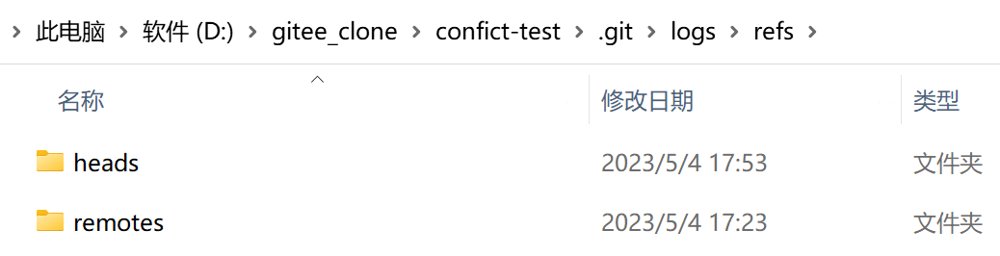
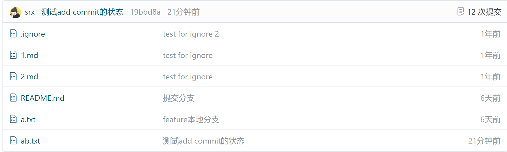

# git理论及流程

[TOC]

## 基本流程及对应命令


### 理解

#### 第一认知

1. 首先要理解一共有四个分区，其中最主要的是本地仓库和远程仓库。本地仓库是通过commit提交的，这也就是为什么每次提交到远程仓库之后都会发现明明是刚push的，但提交时间却显示为几分钟前提交的原因，因为它是以本地仓库的最新提交的时间计算的。

2. 有了上面对本地仓库的理解，就可以实现一个事情：将多次修改都提交到本地仓库，通过维护本地仓库实现本地迭代【之前全部都是将项目单纯复制一份出来直接commit+push一条龙，所以每次代码有一定修改都需要重新复制一份放过去】

3. 同时要注意一个事情，远程仓库和本地仓库的同步问题，如果一个库是多个人维护，那么此时就可能会出现远程仓库的数据与本地仓库不一致的问题，所以每次要对本地仓库进行更改之前最好都走以下的流程：

   1. 在工作目录中编写了新的代码
   2. **git pull**或**git fetch**：将远程仓库的代码同步到本地仓库
   3. **git add -A**：将工作目录中代码加入到缓存区里
   4. **git commit -m "提交注释"**：将缓存区的代码提交到本地仓库
   5. **git push**：将本地仓库的代码同步到远程仓库

   当然上述流程肯定有很多问题，如：如果远程仓库中某一文件的修改与本地工作目录里自己编写的是同一个文件，那么此时如何解决冲突，并合并等。

#### 第二认知

##### .git文件夹的认识

上面虽然说了有两个仓库，一个本地一个远程，但是并没有明确本地仓库位置。其实本地仓库的位置就是每次上传代码时进入的文件夹中的.git文件夹，该文件夹中的文件作用分别是：

1. config文件：远程仓库的分支信息。

   

2. HEAD文件：当前本地仓库指向的远程分支的信息

   

3. index文件：当前本地仓库暂存区的相关信息【使用nodepad打开时乱码】

4. log文件夹：分为远程库和本地库，以及在refs文件夹下还有一个HEAD文件用于保存当前头的log信息

   

   保存的信息，详见[git log指令](#git log)，**本地的版本控制主要就是靠这个文件夹的下的内容实现的**。

5. objects文件夹：用于存储所有代码的数据，也就是快照

   

6. refs文件夹：存储指向数据提交对象的指针

   

   其实看起来和上面的log的文件夹结构类似，但其中保存的东西还是略有差距的，log里不仅保存了每次commit时生成的那个40位的指针，同时还保存了谁提交的，以及提交者在提交时写的一些注释。

   这里给出一个上述的40位指针的形式：

   ```
   81f7b9507b279a9834cd8926f9458bd80d865d89
   ```

##### 四大分区的认识

在上面第一认知的记叙中主要都在写本地仓库而忽略了其余四个部分。这里统一介绍一下；

1. 工作目录：从概念上理解就是你用来写代码的地方，你可以在这个目录下编写，更改你的代码。从实际操作上来讲就是你在git bash上敲出`git init`的那个目录，在你敲出上述命令之后该文件夹里就会多出一个.git文件夹，这就以为着此时该文件夹已被**标识**为一个git的工作目录【没错，标识这个词是重点，因为git本身是一个分布式的版本控制软件，所以重点在于版本控制，而不是存储，git会根据.git中的信息跟踪并进行版本管理】

2. 暂存区：主要作用就是将工作目录中编写好的目录暂时缓存的地方，此时的代码还并未提交到本地仓库。此时就需要引入两个个比较关键的概念：**跟踪**、**快照**。一个文件被从工作目录提交到暂存区再被提交到本地仓库的过程，就是一个文件从未被跟踪到进入暂存区拍摄快照并被跟踪的转变。git做版本管理是通过快照进行的【其实git仓库存储的也都是一个个快照，而非实际的文件，这也就是为什么他是版本控制软件，而不是数据库】，通过对比各个快照之间的区别，对文件进行增删改查。而快照的拍摄时间就是在添加到暂存区的时候。这里举一个极端的例子：一个空文件，每次我在工作目录中为其中添加一个字母之后就直接添加到暂存区中，并不断重复这个过程10次，那么对于这个文件此时就会被拍摄10个快照。每次添加到暂存区时都通过`git diff`查看，发现每次工作目录新更改的文件都会与暂存区中的文件不同，这可不是废话文学，这证明了每次添加到暂存区之后都会拍摄一个快照，而且快照的增删是以行为单位的，同一行的更改，在快照中也会被显示为先删除再添加。同时需要明确的是，暂存区的东西都会被加在

   

   同时这里需要重点说明一个问题：在git的管理下，文件只有两种状态：**已跟踪**和**未跟踪**。文件如果没有添加到暂存区未生成快照时就是**未跟踪**状态，一旦文件提交到暂存区时，就会生成快照并被跟踪。整个流程见下图。

   

   而与缓存区相关的命令主要有：

   ```bash
   # filename为需要添加到暂存区的文件，也可以替换为-A或.用以添加所有文件。
   git add filename
   # 将现在暂存区还原到上一次本地仓库的版本【工作目录(此时工作目录是在git add之后更改了某些东西的版本)和本地仓库都不会更改】
   git reset HEAD # 其中包含了默认参数--mixed
   # 最软的重置，此时暂存区，工作目录，本地仓库都不会有任何更改，仅是用来移动当前的头指针的，退回到某个版本
   git reset --soft HEAD
   # 将暂存区与工作目录都回到上一次版本，并删除之前的所有信息提交【这里指的提交是将工作区中的代码通过git add添加到暂存区，而非使用git commit将暂存区的代码提交到本地仓库】，当前 HEAD 指针、工作区和暂存区内容全部改变
   git reset --hard HEAD
   ```

3. 本地仓库：本地仓库就是第一个正式的存储点，但与数据库不同的是，其中存储的并不是真正的数据文件，而是一个个的快照文件。与上述的工作区和暂存区都是在本地的。其中每次使用`git commit`提交之后都是真正的将一个快照提交到了“仓库”中，而提交到了仓库中也就意味着git开始正式追踪他了，换句话说此时git就已经为你生成了那个标识你一次提交的40位指针码，而这是永久的。如果想要删除就无法像上面那种直接使用reset就能清空了。同样举一个极端的例子：我是一个特别喜欢在本地仓库修改代码的人，所以我每次将本地仓库代码同步到远程仓库时都是我在本地仓库多次commit之后的，此时我使用`git push`将我这段时间所有的commit都一次性推上云端，那么将会出现在远端仓库一次性的多出了很多次的commit次数。换句话说不论是gitee还是github【以二者举例】上的commit次数都是与你本地仓库的提交次数相同的，而非与你提交到远端仓库的次数相同。

   **git push之前**

   

   

   **git push之后**

   

   

4. 远程仓库：远程仓库作为第二个正式存储点，每次可以使用`git push`将本地仓库的代码上传到远程仓库，但与本地仓库不同的是，这次上传的与本地仓库的提交是不同的，本地仓库的提交只是修改一些快照信息，而远程仓库的提交则是真的将文件上传到远端的仓库。当然后续对远程仓库的修改以及远程仓库到本地的同步，都是通过本地仓库（.git）中的[6种文件及文件夹](#.git文件夹的认识)进行通信的。

##### git对象

# git常用命令

## 基础环境【环境初始配置】

### 配置用户名

```bash
git config --global user.name "username"
```

### 配置邮箱

```bash
git config --global user.email "email"
```

上述两个命令在单环境，不更换环境的情况下，只需要配置一次，但是如果一台服务器上有不止一个git环境时则需要分别配置【如：gitee和github同时存在的环境】。当然也可以通过分别生成密钥并配置到对应的网站来完成操作。

### 密钥生成【与上述二选一】

```bash
#生成 key，将邮件地址替换为你 Gitee 或者 Github 使用的邮件地址
ssh-keygen -t rsa -C "email"
```

使用命令之后，会生成id_rsa_github.pub、id_rsa_github两个文件，二者分别代表了公钥和密钥。将生成的公钥放入github或gitee的对应位置，并在.ssh目录下创建文件config，并在其中写入即可：

```tex
# gitee
Host gitee.com
HostName gitee.com
PreferredAuthentications publickey
IdentityFile ~/.ssh/id_rsa_gitee
 
# github
Host github.com
HostName github.com
PreferredAuthentications publickey
IdentityFile ~/.ssh/id_rsa_github
```

## 库相关环境

### 库的初始化

```bash
git init
git add README.md
git commit -m "first commit"
git branch -M main
git remote add origin https://github.com/srx-2000/gittest.git
git push -u origin main
```

### 库的一次基础提交

```bash
git add -A #将所有的变化了的文件添加到缓存
git commit -m "commit"
git push
```

### 库的本地同步【将代码从云端拉下】

```bash
git clone https://github.com/srx-2000/gittest.git #直接在当前文件下clone库
git pull #往往在一个本地库中使用，用于将云端的代码同步到本地
```

### Branch【分支】

#### 切换分支

```bash
git checkout master # master可替换为任意分支名称
```

#### 创建分支

```bash
git checkout -b dev origin/master # 基于主分支创建dev分支
```

### 其余细碎命令

##### git log【注意与git status区分】

查看所有提交的记录，这个命令主要显示的状态是**本地仓库**的操作状态。


##### git status【注意与git log区分】

查看仓库当前状态，这个命令主要显示的状态是**缓存区**的操作状态。缓存区与本地仓库的具体区别见上面的[四大分区的认识](#四大分区的认识)


