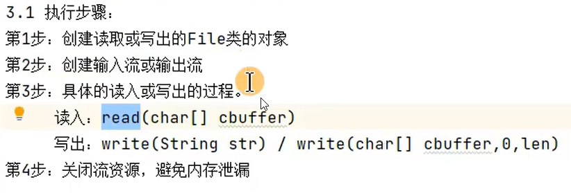

# File

## 构造器


## 常用方法

### 获取文件和目录基本信息


### 列出目录下一级


### 文件重命名以及移动


> 注意：这个renameTo()方法本身还可以作为文件移动函数。和linux中的mv函数一样，既可以作为重命名函数用，又可以作为移动函数用。

### 判断功能的方法


### 创建、删除功能


# IO流

## 流的分类


**理解**：

1. 字节流和字符流之间的主要区别在于数据源存储的内容的形式不同，传输的流的种类也不同
2. 节点流和处理流之间的区别在于节点流是真正传输的数据，而处理流则一般多指包裹在节点流之外做一些冗余处理后的流。

## 流的API

**基类**

| （抽象基类） |   输入流    |    输出流    |
| :----------: | :---------: | :----------: |
|    字节流    | InputStream | OutputStream |
|    字符流    |   Reader    |    Writer    |

主要注意：所有使用Stream传输的都是字节流【暂时可以理解为二进制数据】，所有使用Reader或Writer传输的都是字符流【暂时可以理解为一个个的字符】

**派生类**


### 流的API的使用步骤规范

#### 字符流

##### 读入文件【Reader（字符流）】

1. 创建File类的对象，指明要读入的文件的名称
2. 创建输入行的字符流，用于读取文件
3. 读取数据，并进行相关处理
4. 流资源的关闭操作（必须关闭，否则内存泄露）

**例子【使用File流举例】：**

```java
import java.io.File;
import java.io.FileNotFoundException;
import java.io.FileReader;
import java.io.IOException;

public class FIleStream {
    public static void main(String[] args) {
        FileReader fr = null;
        try {
            File file = new File("D:\\idea\\IntelliJ IDEA 2019.3.3\\workplace\\java_rebuild\\src\\stream\\test.txt");
            fr = new FileReader(file);
            char[] cbuffer = new char[5];
            int len;
            while ((len = fr.read(cbuffer)) != -1) {
                for (int i = 0; i < len; i++) {
                    System.out.print(cbuffer[i]);
                }
            }
        } catch (IOException e) {
            e.printStackTrace();
        } finally {
            try {
                if (fr != null)
                    fr.close();
            } catch (IOException e) {
                e.printStackTrace();
            }
        }
    }

}
```

> **注意**：上面读入内存时使用的是fr.read(char[])这个方法，主要是为了尽可能减少与磁盘进行交互的次数。同时在while循环内部的for循环的遍历条件时，一定要注意是i<len，而非cbuffer.length()。其中len指的是此次磁盘交互下有多少个新的字符被读入到了cbuffer中，如果等于-1，则证明已经读完了。

##### 写出文件【Writer（字节流）】

1. 创建File类的对象，指明要写出的文件的名称
2. 创建输出流，用于读取文件
3. 进行相关处理，并输出
4. 流资源的关闭操作（必须关闭，否则内存泄露）

**例子**

```java
@Test
    public void test1() {
        File file = new File("testWrite.txt");
        FileWriter fw = null;
        try {
            fw = new FileWriter(file);
            String content = "test for write";
            fw.write(content);
        } catch (IOException e) {
            e.printStackTrace();
        } finally {
            try {
                if (fw != null)
                    fw.close();
            } catch (IOException e) {
                e.printStackTrace();
            }
        }
    }
```

#### 总体流程步骤



#### 字节流

InputStream（字节流）和outputStream（字节流）与上述字符流的操作做步骤完全相同，仅是将原有的读入内存的缓存从`char[] cbuffer=char[length]`替换成为了`byte[] buffer=new buffer[length]`，其余步骤不变。


#### 处理流

BufferedInputStream（字节流）和BufferedoutputStream（字节流）与上述字符流和字符流的操作做步骤完全相同，只不过需要在上述两种流的基础上再用Buffered的构造器再包一下，并且在读取或写入数据时使用Buffered构造器制造的对象进行处理即可。在流关闭的时候优先关闭外层的Buffered流，一旦外层流关闭，内层流【被包裹的字符流或字节流】会自动关闭。


> 注意：所有的流对象都具有一个flush()方法，该方法主要的作用与close方法类似，主要是用在将数据的写入文件中时，每次调用都会将内存中的数据写入文件。相较于close方法，flush方法可以更频繁的调用，因为其并不会直接将文件关闭。