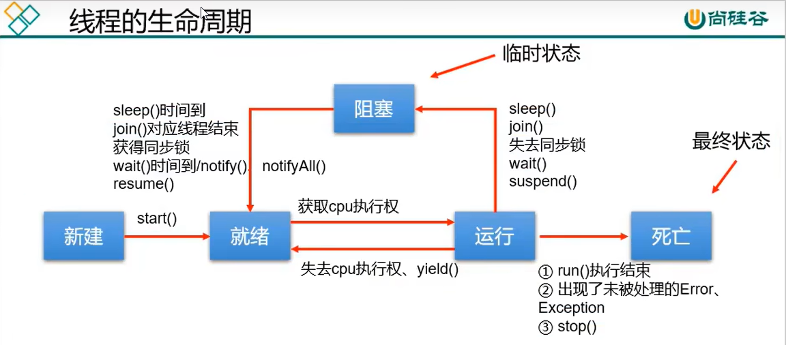
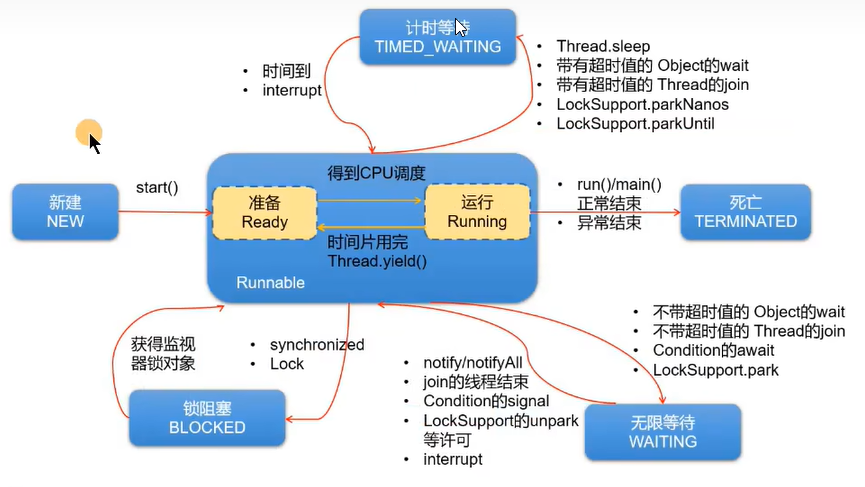

## 1.创建和启动线程

### 方式1：继承Thread类

**步骤：**

1. 创建一个继承与Thread类的子类
2. 重写Thread类的run()方法，将此线程要执行的操作，声明在此方法中
3. 创建上述子类对象
4. 通过对象调用start()方法：1. 启动线程 2. 调用当前线程的run()方法

> 注意：
>
> 1. 虽然在调用start()方法的本质还是调用了run()方法，但如果我们直接调用上述子类中的run()方法，而非使用start()启动，那么此时并没有启动线程这一步，所以该程序还是单线程的。
> 2. 已经启动（准确来说是正在运行的线程）的线程无法启动多次

**例子1**：

```java
public class EvenNumberTest {
    public static void main(String[] args) {
        PrintNumber thread1 = new PrintNumber();
        PrintNumber thread2 = new PrintNumber();
        thread1.start();
        thread2.start();
    }

}

class PrintNumber extends Thread {
    @Override
    public void run() {

        for (int i = 0; i < 10000; i++) {
            if (i % 2 == 0) {
                System.out.println(Thread.currentThread().getName() + ":" + i);
            }
        }
    }
}
```

**例子2【匿名类】**：

```java
public static void main(String[] args) {
        new Thread() {
            @Override
            public void run() {
                for (int i = 0; i < 10000; i++) {
                    if (i % 2 == 0) {
                        System.out.println(Thread.currentThread().getName() + ":" + i);
                    }
                }
            }
        }.start();
        new Thread() {
            @Override
            public void run() {
                for (int i = 0; i < 10000; i++) {
                    if (i % 2 != 0) {
                        System.out.println(Thread.currentThread().getName() + ":" + i);
                    }
                }
            }
        }.start();
    }
```


### 方式2：实现Runnable接口

**步骤：**

1. 创建一个实现Runnable接口的类
2. 实现接口中的run() -->将此线程要执行的操作，声明在此方法中
3. 创建当前实现类的对象
4. 将此对象作为参数传递到Thread类构造器中，创建Thread类的实例
5. 通过创建的Thread类的实例调用start()方法：1. 启动线程 2. 调用当前线程的run()方法

> 注意：
>
> 1. 这里相对于上面多出的部分是：将实现了Runnable接口的类作为Thread构造器的参数传递到Thread中，以此来创建一个Thread对象。

**例子1**

```java
public class EvenNumberTest {
    public static void main(String[] args) {
        PrintNumber printNumber = new PrintNumber();
        Thread thread1 = new Thread(printNumber);
        Thread thread2 = new Thread(printNumber);
        thread1.start();
        thread2.start();
    }

}

class PrintNumber implements Runnable {
    @Override
    public void run() {

        for (int i = 0; i < 10000; i++) {
            if (i % 2 == 0) {
                System.out.println(Thread.currentThread().getName() + ":" + i);
            }
        }
    }
}
```

**例子2【匿名类】**

```java
public static void main(String[] args) {
        new Thread(new Runnable() {
            @Override
            public void run() {
                for (int i = 0; i < 10000; i++) {
                    if (i % 2 == 0) {
                        System.out.println(Thread.currentThread().getName() + ":" + i);
                    }
                }
            }
        }).start();
        new Thread(new Runnable() {
            @Override
            public void run() {
                for (int i = 0; i < 10000; i++) {
                    if (i % 2 != 0) {
                        System.out.println(Thread.currentThread().getName() + ":" + i);
                    }
                }
            }
        }).start();
    }

```

### 两种方式对比

**共同点：**

1. 启动线程，使用的都是Thread类中定义的start()方法
2. 创建的线程对象，都是Thread类或其子类的实例。

**不同点：**一个是类的继承，一个是接口的实现。

> 建议：建议使用Runnable接口的方式，Runnable接口实现的好处：
>
> 1. 实现方式，避免了类的单继承的局限性
> 2. 更适合处理有共享数据的问题【实现Runnable接口的类由于是作为参数传递到Thread构造方法中，所以可以在多个线程构造中使用同一个Runnable实现类，从而使该类中的属性可以被共享】
> 3. 实现了代码和数据的分离

**联系：**源码中使用到了代理模式


## 2.线程的常用结构

### 线程中的构造器

- public Thread()：分配一个新的线程对象
- public Thread(String name)：分配一个指定名字的新的线程对象
- public Thread(Runnable target)：指定创建线程的目标对象，它实现了Runnable接口中的run()方法
- public Thread(Runnable target,String name)：分配一个带有指定目标的线程对象并指定名字。

### 线程中的常用方法

1. start()：1. 启动线程 2. 调用线程的run()
2. run()：将线程要执行的操作，声明在run()中。
3. currentThread()：静态方法，获取当前执行代码对应的线程【注意：返回的是线程本身】
4. getName()：获取线程名
5. setName()：设置线程名
6. sleep(long millis)：静态方法，调用时，可以使得当前线程睡眠指定的毫秒数
7. yield()：静态方法，一旦执行此方法，就释放CPU的执行权
8. join()：在线程a中通过线程b调用join()，意味着线程a进入阻塞状态，直到线程b执行结束，线程a才结束阻塞状态，继续执行
9. isAlive()：判断当前线程是否存活。

### 线程的优先级

getPriority()：获取线程优先级

setPriority()：设置线程优先级，范围[1,10]

> 注意：高优先级只是在抢占CPU时，获取到CPU的概率更大一些，并不意味着最高优先级会一直抢占着CPU不放。

**Thread类内部声明的三个常量**：

- MAX_PRIORITY(10)：最高优先级
- MIN_PRIORITY(1)：最低优先级
- NORM_PRIORITY(5)：普通优先级，默认情况下main线程具有普通优先级


## 3.线程的生命周期

**JDK5之前**



**JDK5之后**




## 4.线程安全问题的解决

### 方式1：同步代码块

synchronized（同步监视器）{

​	需要被同步的代码

}

>  **说明：**
>
> 需要被同步的代码块，即为操作共享数据的代码。
>
> 共享数据：即多个线程需要操作的数据【一般多指需要更改数据的场景】
>
> 需要被同步的代码，在被synchronized包裹以后，就使得一个线程在操作这些代码的过程中，其他线程必须等待。
>
> 同步监视器，俗称锁。哪个线程获取了锁，哪个线程就能执行需要被同步的代码。
>
> 同步监视器，可以使用任何一个类的对象充当，但是多个线程必须共用同一个同步监视器。

**例子**

```java
class SaleTicket implements Runnable {
    int ticket = 100;

    @Override
    public void run() {
        while (true) {
            //这里的this充当同步监视器，因为在main中只创建了一个SaleTicket对象s，所以this是唯一的，如果创建了多个SaleTicket对象，则不应使用this来充当锁【一般是使用实现Runnable接口方式时使用】,此时应该使用SaleTicket.class来充当锁【一般是使用Thread继承的方式时使用】。
            synchronized (this) {
                try {
                    Thread.sleep(10);
                } catch (InterruptedException e) {
                    e.printStackTrace();
                }
                if (ticket > 0) {
                    System.out.println("线程" + Thread.currentThread().getName() + "正在售票，票号为：" + ticket);
                    ticket--;
                } else {
                    break;
                }
            }
        }
    }
}

public class WindowTest {
    public static void main(String[] args) {
        SaleTicket s = new SaleTicket();
        Thread thread1 = new Thread(s);
        Thread thread2 = new Thread(s);
        Thread thread3 = new Thread(s);
        thread1.start();
        thread2.start();
        thread3.start();
    }

}
```

> 注意：
>
> - 在使用Thread继承的方式实现多线程时应使用SaleTicket（类名）.class来充当锁。
>
> - 在使用实现Runnable接口的方式实现多线程时应使用this来充当锁。

### 方式2：同步方法

public synchronized void method1(){

​	需要同步的代码；

}

> 说明：
>
> 1. 如果操作共享数据的代码完整的声明在一个方法中，那么我们就可以将此方法声明为同步方法即可。
> 2. 非静态的同步方法，默认同步监视器是this。
> 3. 静态的同步方法，默认同步监视器是类名.class。

**例子**

```java
class SaleTicket implements Runnable {
    int ticket = 100;
    boolean flag = true;

    @Override
    public void run() {
        while (flag) {
            try {
                Thread.sleep(50);
            } catch (InterruptedException e) {
                e.printStackTrace();
            }
            method1();
        }
    }

    public synchronized void method1() {
        try {
            Thread.sleep(10);
        } catch (InterruptedException e) {
            e.printStackTrace();
        }
        if (ticket > 0) {
            System.out.println("线程" + Thread.currentThread().getName() + "正在售票，票号为：" + ticket);
            ticket--;
        } else {
            flag = false;
        }
    }
}
public class WindowTest {
    public static void main(String[] args) {
        SaleTicket s = new SaleTicket();
        Thread thread1 = new Thread(s);
        Thread thread2 = new Thread(s);
        Thread thread3 = new Thread(s);
        thread1.start();
        thread2.start();
        thread3.start();
    }

}
```

> 注意：
>
> 1. 非静态的同步方法，默认同步监视器是this。
> 2. 静态的同步方法，默认同步监视器是类名.class。
>
> 所以如果使用继承Thread类的方式实现多线程的话，同时创建了多个Thread子类对象的话，那么此时使用synchronized关键字修饰方法将无法起到锁的作用。
>
> 如果想要实现相同的效果，则需要在该方法中使用第一种同步代码块的方式将该方法中需要实现同步的部分进行包裹。或者将该方法改为静态方法。

### synchronized利弊

**好处**：解决了线程安全问题。

**弊端**：在操作共享数据时，多线程其实是串行执行的，意味着性能低。

## 5.死锁

### 诱发死锁的原因

- 互斥条件
- 占用且等待
- 不可抢夺
- 循环等待

以上4个条件，同时出现就会触发死锁

### 解决死锁

针对条件1：互斥条件基本上无法破坏。

针对条件2：可以考虑一次性申请所有的所需资源，这样就不存在等待问题。

针对条件3：占用部分资源的线程在进一步申请其他资源时，如果申请不到，就主动释放掉已经占有的资源。

针对条件4：可以将资源改为线性循序。申请资源时，现申请序号较小的，这样避免循环等待问题。

## 6.Lock锁

### Lock锁的应用

`private static final ReentrantLock lock=new ReentrantLock();`

`lock.lock();`

​	需要同步的代码

`lock.unlock();`

**例子**

```java
import java.util.concurrent.locks.ReentrantLock;

public class LockTest {
    public static void main(String[] args) {
        SaleTicket s=new SaleTicket();
        Thread t1=new Thread(s);
        Thread t2=new Thread(s);
        t1.start();
        t2.start();
    }
}

class SaleTicket implements Runnable {
    int ticket = 100;
    private ReentrantLock rl = new ReentrantLock();
    @Override
    public void run() {
        while (ticket > 0) {
            try {
                rl.lock();
                if (ticket > 0) {
                    System.out.println("线程" + Thread.currentThread().getName() + "正在售票，票号为：" + ticket);
                    ticket--;
                } else {
                    break;
                }
            } finally {
                rl.unlock();
            }
        }
    }
}
```

> 注意：
>
> 1. 创建Lock的实例，需要确保多个线程共用同一个Lock实例，需要考虑将此对象声明为static final【如果是实现Runnable接口的，则不需要，因为并没有创建多个实例对象，Lock本身就是唯一的】
> 2. lock.lock()和lock.unlock()中间夹住的代码就是需要同步的代码
> 3. 其中一般为了确保unlock()方法被调用，会使用try{}final{}方法，并将unlock()方法放入final中。

### synchronized和Lock对比

synchronized不管是同步代码块还是同步方法，都需要在一对{}之后，才能释放对同步监视器的调用。

Lock是通过两个方法控制需要被同步的代码，更加灵活一些。

Lock作为接口，可以提供更多的实现类，适合更多更复杂的场景，效率更高。

## 7.线程的通信

### 涉及到的三个方法

- wait()：线程一旦执行此方法，就会进入等待状态。同时会释放对同步监视器的调用
- notify()：一旦执行此方法，就会唤醒被wait()的线程中优先级最高的那一个线程。被唤醒的线程从当初wait的位置继续执行。
- notifyAll()：一旦执行此方法，就会唤醒被wait()的所有线程。

> 注意：
>
> 1. 上述三个方法的使用，必须是在同步代码块或同步方法中【Lock需要配合Condition实现线程通信】。
> 2. 此三个方法的调用者，必须是同步监视器，否则会报异常。
> 3. 此三个方法都声明在object类中，因为任何一个类都可以作为同步监视器，而object又是所有类的父类。

**wait()和sleep()的区别**

**相同点**：一旦执行，当前线程都会进入阻塞状态。

**不同点**：

1. 声明的位置：wait()：声明在Object类中

   ​						sleep()：声明在Thread类中，静态的

2. 使用的场景不同：wait()：只能使用在同步代码块和同步方法中

   ​								sleep()：可以在任何需要使用的场景

3. 使用在同步代码块和同步方法中：wait()：一旦执行，就会释放对同步监视器。

​																 sleep()：一旦执行，不会释放同步监视器。

4. 结束阻塞的方式：wait()：到达指定时间自动结束阻塞，或通过被notify唤醒，结束阻塞

   ​								sleep()：到达指定时间自动结束阻塞


