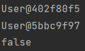

# 次要笔记【主要看 [spring6.md](spring6.md) 笔记】

## 基础案例

**Maven的pom文件**

```xml
<dependency>
    <groupId>org.springframework</groupId>
    <artifactId>spring-context</artifactId>
    <version>6.0.3</version>
</dependency>
```

**java的Bean**

```java
public class User {
    private User() {
        System.out.println("执行了User的私有的空参构造方法");
    }
    public void test() {
        System.out.println("执行了User的test方法");

    }
}
```

```java
package Beier.com;
public class Admin {
    public Admin(){
        System.out.println("执行了Admin的公有的空参构造函数");
    }
    public void admin(){
        System.out.println("执行了Admin的admin函数");
    }
}
```

**Spring的xml配置文件**

```xml
<?xml version="1.0" encoding="UTF-8"?>
<beans xmlns="http://www.springframework.org/schema/beans"
       xmlns:xsi="http://www.w3.org/2001/XMLSchema-instance"
       xsi:schemaLocation="http://www.springframework.org/schema/beans
                           http://www.springframework.org/schema/beans/spring-beans.xsd">
    <bean id="user" class="User"></bean>
    <bean id="admin" class="Beier.com.Admin"></bean>
</beans>
```

**测试文件**

```java
@Test
public void test1() {
    ApplicationContext context = new ClassPathXmlApplicationContext("bean.xml");
    User user = (User) context.getBean("user");
    Admin admin = (Admin) context.getBean("admin");
    user.test();
    admin.admin();
}
```

**运行结果**

```xml
执行了User的私有的空参构造方法
执行了Admin的公有的空参构造函数
执行了User的test方法
执行了Admin的admin函数
```

**原理：**

​	本质上是使用反射创建对象。

**步骤分析**

1. 加载bean.xml配置文件

2. 对xml文件进行解析操作

3. 获取xml文件bean的标签属性值id属性值和class属性值。

4. 使用反射根据类的全路径创建对象

   1. ```java
      Class clazz = Class.forName("Beier.com.Admin");
      ```

   2. ```java
      Constructor declaredConstructor = clazz.getDeclaredConstructor();
      ```

   3. ```java
      Admin o = (Admin) declaredConstructor.newInstance();
      ```

   4. ```java
      o.admin();
      ```

5. 创建好的对象会放在一个叫做：beanDefinitionMap的结构中，其属于一种Map对象，key是**Spring的xml配置文件**中的`id`属性，而Value则是`class`属性对应的类的一些描述信息。

## 容器：IOC【详情见文件 [spring6.md](spring6.md) 】

**概念**

IoC 是 Inversion of Control 的简写，译为“控制反转”，它不是一门技术，而是一种设计思想，是一个重要的面向对象编程法则，能够指导我们如何设计出松耦合、更优良的程序

Spring 通过 **IoC 容器**来管理所有 Java 对象的实例化和初始化，控制对象与对象之间的依赖关系。我们将由 IoC 容器管理的 Java 对象称为 Spring Bean，它与使用关键字 new 创建的 Java 对象没有任何区别。


## 注意：

### 获取bean

1. 如果在spring配置文件中同时声明了两个相同类，但是id不同的bean对象时，使用ApplicationContext中的getBean(“id”)分别创建对象时，创建出来的对象是不同的对象【如果是同一个id创建出来的对象，应该是地址相同的，也就是说spring的IOC容器中默认是使用单例模式进行对象管理的】。

   **注意：**

   1. 如果发生了上述spring配置文件中的问题时，是无法使用ApplicationContext中的getBean(“class”)方法创建对象的，会报错。
   2. 同理，如果是一个接口有多个实现类，并且各个实现类都在spring的配置文件中配置了bean标签，那么此时再使用ApplicationContext中的getBean(“class【其中该class是接口的类】”)是，会报上述同样的错误。

> **例子**
>
> ```xml
> <bean id="user" class="User"></bean>
> <bean id="user1" class="User"></bean>
> ```
>
> ```java
> private ApplicationContext context = new ClassPathXmlApplicationContext("bean.xml");
> @Test
>     public void testUserSingleton() {
>         User user = (User) context.getBean("user");
>         User user1 = (User) context.getBean("user1");
>         System.out.println(user);
>         System.out.println(user1);
>         System.out.println(user == user1);
>     }
> ```
>
> 

### 依赖注入（DI）

#### 基于set方法注入

**例子**

**java类**

```java
public class Student {
    private Integer id;
    private String name;
    private Integer age;
    private String sex;
    public Student() {
    }
    public Integer getId() {
        return id;
    }
    public void setId(Integer id) {
        this.id = id;
    }
    public String getName() {
        return name;
    }
    public void setName(String name) {
        this.name = name;
    }
    public Integer getAge() {
        return age;
    }
    public void setAge(Integer age) {
        this.age = age;
    }
    public String getSex() {
        return sex;
    }
    public void setSex(String sex) {
        this.sex = sex;
    }
    @Override
    public String toString() {
        return "Student{" +
                "id=" + id +
                ", name='" + name + '\'' +
                ", age=" + age +
                ", sex='" + sex + '\'' +
                '}';
    }
}
```

**spring配置文件**

```xml
<bean id="studentOne" class="com.atguigu.spring6.bean.Student">
    <!-- property标签：通过组件类的setXxx()方法给组件对象设置属性 -->
    <!-- name属性：指定属性名（这个属性名是getXxx()、setXxx()方法定义的，和成员变量无关） -->
    <!-- value属性：指定属性值 -->
    <property name="id" value="1001"></property>
    <property name="name" value="张三"></property>
    <property name="age" value="23"></property>
    <property name="sex" value="男"></property>
</bean>
```

**测试**

```java
@Test
public void testDIBySet(){
    ApplicationContext ac = new ClassPathXmlApplicationContext("spring-di.xml");
    Student studentOne = ac.getBean("studentOne", Student.class);
    System.out.println(studentOne);
}
```

这里可以看到这个依赖注入，其实就是在spring的xml配置文件中直接进行值的指定，这主要是因为在spring的IOC容器管理中，主要是使用的单例模式进行对象的管理，所以一般只需要指定固定值即可，如果还想要更加灵活一些可以将想要配置的值写在另一个配置文件中，这样以后再进行对象值的修改时，直接更改相应配置文件中的值即可，如我之前discussion项目中配置druid连接池时的样子。

```xml
<bean class="com.alibaba.druid.pool.DruidDataSource" id="dataSource">
        <!--   配置基础属性-->
        <property name="username" value="${druid.username}"/>
        <property name="password" value="${druid.password}"/>
        <property name="url" value="${druid.url}"/>
        <property name="driverClassName" value="${druid.driver}"/>
        <!--配置其他属性-->
        <property name="maxActive" value="${druid.MaxActivity}"/>
    </bean>
```

**druid.properties**

```properties
druid.username=root
druid.password=srx62600
druid.driver=com.mysql.cj.jdbc.Driver
druid.url=jdbc:mysql://localhost:3306/discussion?serverTimezone=UTC&urlSSL=False&rewriteBatchedStatements=TRUE
druid.MaxActivity=20
```

通过上面的例子以及说明不难发现，由于使用的是单例模式，而且本身属性值不易修改，所以如果是在xml文件中直接使用property标签进行依赖注入的，一般都是池对象，或者工厂对象之类的，全局只需要一个对象，且其中属性不会概念的类型。

#### 基于构造器方法注入

**例子**

**java类**

```java
public Student(Integer id, String name, Integer age, String sex) {
    this.id = id;
    this.name = name;
    this.age = age;
    this.sex = sex;
}
```

**配置bean**

```xml
<bean id="studentTwo" class="com.atguigu.spring6.bean.Student">
    <constructor-arg value="1002"></constructor-arg>
    <constructor-arg value="李四"></constructor-arg>
    <constructor-arg value="33"></constructor-arg>
    <constructor-arg value="女"></constructor-arg>
</bean>
```

> 注意：
>
> constructor-arg标签还有两个属性可以进一步描述构造器参数：
>
> - index属性：指定参数所在位置的索引（从0开始）
> - name属性：指定参数名