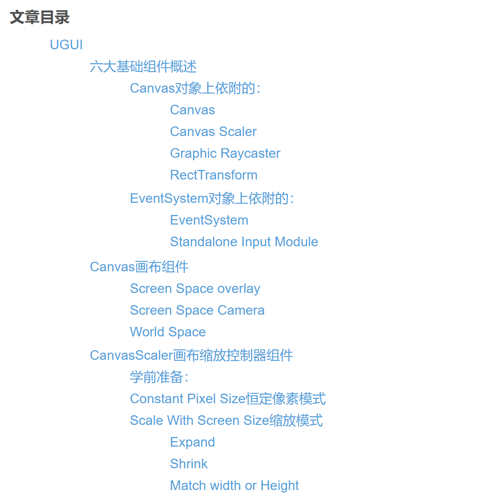

# 画布

## 基础知识

### [文章](https://blog.csdn.net/BraveRunTo/article/details/117732018)

### 回忆截图：

# 协同程序【协程】

## 基础介绍

### [文章](https://blog.csdn.net/Go_Accepted/article/details/127115101)

### 回忆截图

## 详解版

### [文章](https://blog.csdn.net/qq_42705793/article/details/127652498)【这个版本更推荐优先看，上面的基础介绍就是抄的这篇，而且还没抄全】

这个文章里对线程和协程直接的区别说的还是很清楚的，主要就是下面这个图：

同时在文章中明确说明了unity虽然可以开启多线程但是多线程下非主线程是不能访问任何unity相关物体的，甚至包括在非主线程中使用Debug.Log()都做不到。所以一般都是使用协程去完成一系列的操作。

### 回忆截图

