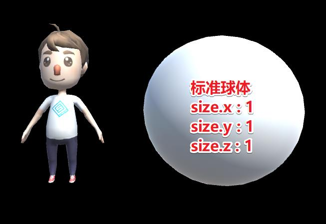
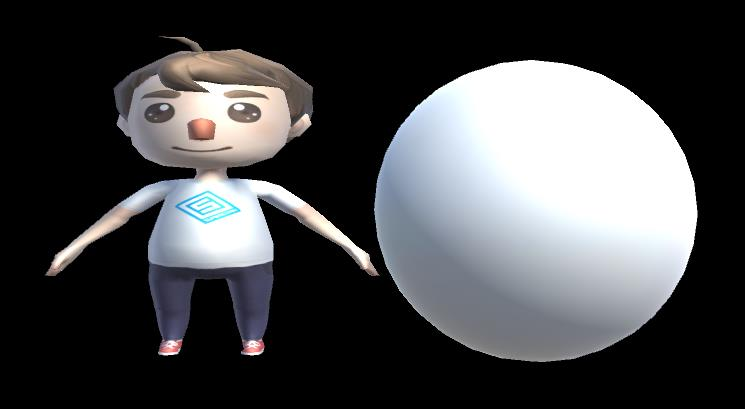
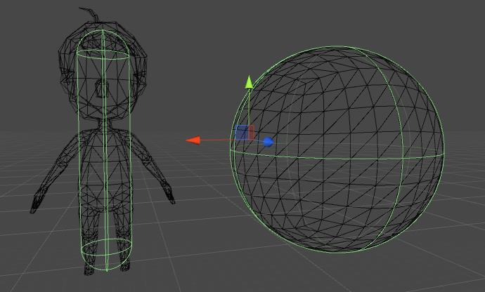
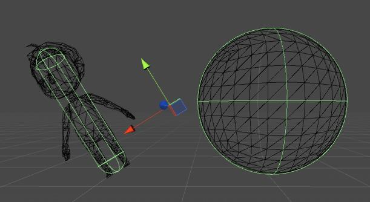

## 获取尺寸的三种方法

如下，标准球体旁边有个人物模型，目测人的宽度是`0.5`，高度是`1`，下面我们通过程序来获取人物的真实`size`。



### 方法1 Renderer.bounds.size

这个值的结果真实反应出有`MeshRenderer`这个组件的模型的尺寸。不须要再乘以`localScale`。

```csharp
// transform为人物模型的MeshRenderer的transform
var size = transform.GetComponent<Renderer>().bounds.size;
Debug.Log ("x: " + size.x + ",y: " + size.y);
```

输出结果：

```string
x: 0.5940213,y: 1.102448
```

此时我们把人物模型的`scale`的`x`改为`2`



输出结果为：

```string
x: 1.188043,y: 1.102448
```

所以用这个方法获取的尺寸是会随着`scale`的放大缩小而变化的。

### 方法2 MeshFilter.mesh.bounds.size

通过`MeshFilter`获得原始模型的`mesh`，该值返回的结果是原始`mesh`的尺寸。

```csharp
// transform为人物模型的MeshFilter的transform
var size = transform.GetComponent<MeshFilter>().mesh.bounds.size;
Debug.Log ("x: " + size.x + ",y: " + size.y);
```

此时不管人物怎么缩放，输出结果都是一样

```string
x: 0.5940213,y: 1.102448
```

### 方法3 Collider.bounds.size

为物体加入`Collider`，然后使用`Collider.bounds.size`。**不过这个不能非常好的反应物体的大小**，`bounds`获得的是物体的外包矩形，**并且这个外包矩形的`X,Y,Z`和世界坐标一致。因此，若物体有旋转，获得的尺寸就不能反应出物体的真实大小，仅仅是其外包矩形的大小。**如下，人物身上有一个胶囊碰撞体。



```csharp
// transform为人物模型的MeshFilter的transform
var size = transform.GetComponent<Collider>().bounds.size;
Debug.Log ("x: " + size.x + ",y: " + size.y);
```

输出结果如下：

```string
x: 0.2,y: 1
```

现在，我们把人物倾斜一下：



输出结果如下：

```string
x: 0.6194265,y: 0.8812351
```