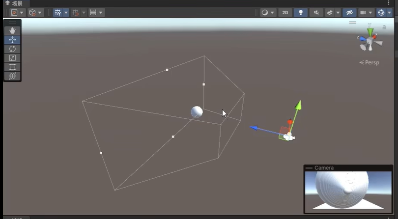

# 概念

[TOC]

## 虚拟轴

​	所谓虚拟轴主要是用于对多端设备进行适配的，如一个物体的移动，在pc端可能就是wasd，但是放到手柄上可能就是推动摇杆，而在手机端又是新的虚拟摇杆，所以为了适配这些多种多样的设备，这里引入一个虚拟轴的概念。以物体的左右移动为例，其本身就是一个[-1,1]区间内的轴，当用户按下A这个键【pc端】的时候，这个虚拟轴的值就会逐渐从0增长到-1，当按下D的时候刚好相反。有了这个就可以适配pc端和手柄端的问题了，同样的轴还有很多，甚至还有虚拟键用于模拟跳跃。该模块的具体位置见下面。

当然这个虚拟轴同样也可以使用代码去控制。这个可以直接从api文档轴查到，这里给出一小段API文档中的演示：

## 光源

## 摄像机

​	主要担任在游戏中游戏画面的展示工作。举个例子，一般第一人称视角的话，都是直接将摄像机固定在主角头部，这样就可以实现主角视角了，同时还需要注意一点，一个场景内可以安排多个摄像机，就如同一个**层级**中可以安排多个场景一样，这里做一个猜想：有一种制作方法就是通过切换摄像机达成某种效果。而摄像机本身也分为两种，一种是透视摄像机，另一种是正交摄像机

### 透视摄像机

和生活中的摄像机一样，具有近大远小的特点。多用于3d游戏制作。

### 正交摄像机

这种摄像机本身就不遵循近大远小的特点了。多用于2d游戏制作。

### 应用即组件属性介绍

#### 切换

摄像机的切换可以按照下述步骤走。

#### 天空盒

​	天空和主要用于修改场景中的天空，换句话说一个游戏的天空是作为一个特殊的对象组件交由摄像机去控制的，而不是像之前想象的那种通过创建一个新的游戏对象对完成的。

​	可以通过在相机对象的组件中添加Skybox组件添加天空材质【材质可以通过商城等地方进行购买或下载】

​	而后在相机的Camera组件中的清除标志处选择是否使用天空盒，如果使用则会自动使用Skybox中选择的材质进行渲染。当然也可以选择纯色等其他背景。

##### 纯色

所谓纯色就是选择一种颜色，将相机中没有游戏对象的部分全部填充为这个颜色。效果类似于这种

##### 不清除

不清除现阶段的理解是，直接将背景中没有对象物体的部分填充为黑色，感觉上和普通的纯色，用黑色填充效果一样。

##### 仅深度

​	这个模式相对复杂，在涉及多个摄像机时，我们可以通过调节**深度**，来实现具体使用哪个摄像机作为主视角。而**深度**值越大的摄像机就会被越优先拍摄到。而仅深度模式则是说：当有多个摄像机在拍摄不同的对象以及角度时，深度大的摄像机如果使用仅深度模式，则会在拍摄出自己所拍摄物体的同时，将背景替换为其余摄像机拍摄的东西【也可以这样理解：纯色模式就是用单一演示填充摄像机空白部分，天空盒模式就是用一个天空材质填充摄像机的空白部分，而仅深度模式则是在多个摄像机的情况下，用**低深度值**的摄像机拍摄的东西去填充**高深度值**摄像机的空白部分】。举个例子：

​	这里Main camera摄像机设置的深度值为-1，camera1设置的深度值为0，所以最开始是以camera1为主视角【这里指的主视角是游戏画面展示的视角】。而后在main camera和camera1两个摄像机的视角中分别创建一个平台和一个求【二者视角中都看不到对方视角中创建的东西】，由于我这里设置的camera1的深度值大于main camera的值，所以游戏画面在一开始时仅会展示一个球体。而在我选择仅深度模式后，则会用main camera的视角【也就是那个平台】来填充camera1的空白。所以才会产生上图的效果。

**补充**

​	当摄像机的数量进一步增加，如有三个摄像机，分别拍着三个不同的物体时，那么此时我给深度最大的那个摄像机设置仅深度模式的时候，我是只能看到比他小一级的摄像机视角，还是所有比他小的摄像机都可以看到呢？

答案是：只能看到比他小一级的，如果想进一步再下一级物品时，就需要在第二级的清除标志中也选择仅深度模式才可以，以此类推。

​	如上图中，我设置了三个摄像机，深度分别是main camera：-1，camera1：0，camera2：1。那么此时如果我只给camera2设置仅深度，效果则是上图显示的样子，如果此时我再给camera1设置仅深度，则效果是下图显示的样子。

#### 剪裁平面

主要作用就是设置相机前后拍摄距离的，看下图很直观。

#### Viewport矩形

主要作用是规定摄像机拍摄画面的大小以及所在位置的，如下图就是将x和y同比缩小0.5倍之后的效果。W，H则是用于规定摄像机位置的【如果摄像机调整了x、y那么此时画面肯定是无法填充整个屏幕的，此时就需要通过调整w、h来将画面固定在一个位置上】。**这个东西可以用来做小地图【也就是单独拿一个摄像机在场景中进行上帝视角拍摄，然后利用这个功能将拍摄的内容缩小并固定在左上角即可】，当然也可以做多视角游戏中的多视角效果【双人成行】**。

## 画布【canvas】

​	这里主要说一下画布的概念，具体有关画布相关的编写代码可以看my_card这个项目。

### 概念

​	首先是画布的概念，画布就是一个2维的平面，我们可以在这个平面上摆放一些不可交互的UI，同时也可以摆放一些按钮，下拉列表等可以交互的UI。同时我们还可以再上面摆放Event【这个Event就是用来使玩家可以与按钮等互动UI进行交互的】。如果粗略的理解的话，可以把画布理解成一个有限制范围的2D场景，但是不同的是你在画布上的所有作画默认情况下都是显示在镜头的最上面的，会覆盖场景下的其余游戏物体【当然你可以通过更改画布上的渲染模式来更改这个情况】。

### 应用

​	画布在绝大多数情况下都是用来做游戏的UI界面的【各种游戏中的背包，角色面板】。

### 一些误区

1. 就目前阶段的认知来说，一般在一个场景下就只会有一个canvas，而UI界面本质上就是将一个个的预制体pia到这个画布上。
2. 上面提到了预制体，干说可能还没有概念，这里给出几个预制体的效果。

> 首先看下全局预览效果【也就是游戏做完之后的效果】，记住这个效果。然后看下各个预制体在全局预览中的位置，以及相对于画布的位置。

#### 全局预览

#### 各个预制体

​	通过各个预制体和全局预览的对比其实不难发现这些预制体中都有一个位于中心的白色方块，这个白色方块就是画布，所以这些预制体本质上就是将一些UI组件摆放到一个canvas的相对位置上，当需要加载这些预制体的时候他们就会出现在相机对应的位置上。也就是canvas的那个白框可以近似等于是主摄像机拍到的东西【当然也有不是的，如上图中的1/3那个图标和100/100的那个图标，二者分别表示手里还有的费用和怪物血量，这两个都没有在对应位置，主要是因为其附属的东西还没加载出来】。

#### 运行实例

​	这里再给一个运行实例，首先需要知道的是：点击之前平面显示的是一个Login的**UI canvas预制体**，整个流程就是，在点击开始游戏之前**游戏**画面上应该显示登录界面，而在点击开始游戏后会加载level1这个**游戏对象预制体**【注意level1不是一个canvas预制体，而是一个游戏对象预制体，这两个是有区别的，比如canvas预制体直接拖拽到场景中时是不会显示的，而游戏对象预制体在拖拽到场景中是会显示游戏对象的。】

​	首先看**游戏**的显示，可以看到显示的效果就是一个普通的登录界面。此时有以下几个点可以说说：

1. **Q**：此时游戏的主摄像机在哪？

   **A**：在level1游戏对象内部，向着level1这个预制体的内部拍摄，这就是为什么点击开始游戏之后会显示一个广角效果的墙壁的原因。

2. **Q**：此时的Login界面在游戏场景的哪【准确来说在哪个对象下】？

   **A**：在Canvas对象下，这也就是之前说的所有的界面UI都会pia在Canvas上，而这个Canvas则是一直存在的，游戏进行中来回切换以及销毁的都是pia在这个Canvas上的素材【所以这里在写代码的时候会用一个UIList来维护pia在上面的UI】。

3. **Q**：此时的level1在哪【准确来说是在**场景**的哪里】？

   **A**：此时的level1在**场景**中红圈圈出的地方。神奇吧？由于上面说的Canvas会显示在所有的游戏对象之前的效果，所以即使Canvas比实际的游戏物体level1大这么多，在主摄像头中的效果也是一个普通界面的效果。所以这里可以进一步理解一下Canvas在默认情况下的效果：主摄像机会优先根据**渲染模式**、**Canvas scaler**来决定摄像机拍谁【渲染模式决定】，以及拍多大【拍多大，使用屏幕大小缩放模式时的效果就是根据屏幕分辨率以及**锚点**的相对位置自动适配（一般也就是使用这个模式）】。

​	而后便是点击之后的效果，从**游戏**上看的效果是直接进入到了level1这个场景之下，而实际上真正做的事情是将LoginUI这个放在Canvas上的UI给销毁了，而既然放在Canvas上的UI被销毁了，那么此时主摄像机自然就拍摄到了之前所摆设的位置的游戏物体了。此时再看**场景**里面则是只有一个Canvas的白框了，而右侧列表中Canvas下的子对象LoginUI也被销毁了。

##### 点击之前

##### 点击之后

# 使用技巧

该模块主要列举一些可能会用到的小技巧，有的是可以提升性能的，有些也有可能是优化代码架构的。

## 画布【canvas】

### 嵌套画布

#### 概念

​	所谓嵌套画布就是在一个基础画布的基础上，在其下创建一个新的子物体，并给这个子物体挂载上canvas组件，这样这个子物体就变成了一个子画布，而我们可以将一些动态的，需要频繁禁用的UI挂载在这个子画布上。[参考视频](https://www.bilibili.com/video/BV1Sr4y117Hj/?spm_id_from=333.999.0.0&vd_source=fc7ee585e1ddf246f30a0860b09ef366)。

#### 好处

1. 可以更灵活的调整子画布的大小

   > 单层画布组件是无法调整RectTransform大小位置的

2. 可以优化GPU(CPU)渲染性能

   > 视频中给出的解释是：unity在对游戏物体进行渲染的时候是将UI划分为两种不同的类别：动态UI、静态UI。所以如果可以使用嵌套画布将静态UI和动态UI分开，则在后续的渲染时仅会对动态UI进行实时批处理，而静态UI则会在第一次加载时就进入内存，后续只会进行读取，不需要多余处理。这样动态UI和静态UI之间的批处理就被分开了。

3. 在UI的加载以及脚本的挂载上更加灵活

   > 有的时候我们需要禁用掉一个大UI中的部分UI，此时如果没有使用嵌套画布我们就需要将整个画布容器禁用掉，此时挂载在该画布下的脚本就会失效，而这可能会造成代码架构上的一些消极影响。而此时如果使用的是嵌套UI，我们则只需要禁用掉子对象中的Canvas组件就可以让这部分UI消失。同时也不会影响到该物体上挂载的别的脚本的运行。
   >
   > 
   >
   > 同时由于这里并没有禁用掉整个画布容器，所以此时画布的缓存并不会被销毁从而可以略过UI缓存重建的步骤，同时也避免了游戏对象的OnEnable()和OnDisable()函数的调用。【这也算是一种UI优化了】

#### 应用

1. 首先创建根画布【这一步与往常一样即可】。
2. 在根画布下创建一个空的游戏对象。
3. 在这个游戏对象上挂载Canvas组件。
4. 将切分出来的UI拖拽到该对象上，使其成为对象子物体即可。

