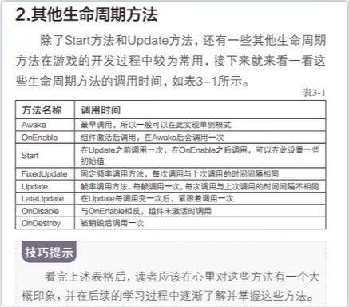
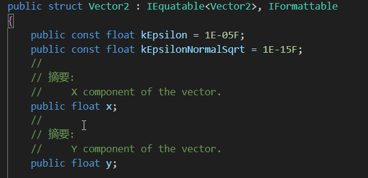
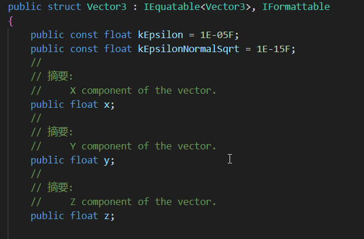

# 概念

## 初印象

​	首先最开始的一个概念就是在unity引擎中，是以组件为单位进行脚本编写的，如果用javaweb中的一个概念来说的话【面向接口编程】，就是**面向组件编程**，在unity中有两个基础概念，一个是物体对象，即一个场景中的物体。而另一个则是组件，所谓的游戏的编写，其实可以粗糙的理解为在一个个的场景中，创建一个个物体对象，并在这些物体对象上搭载上各种的组件，使其拥有各种各样的效果。如：当一个矩形物体搭载上一个重力组件时就会具有重力组件的效果【这里的重力组件是unity内置的一个脚本】，同样的我们在编写游戏的时候也可以自己编写一系列的脚本，并将这些脚本挂载到各个物体上。

​	还有一个比较重要的理解就是，unity内置了很多组件，这些组件花里胡哨的一大堆，看着都特别复杂，但其本质也都是一个个用代码编写的脚本而已，只不过暴露出了很多参数可以供使用者修改。

# 基础

## 脚本的生命周期

> **注意：**	

> 1. 其中Awake方法是一个脚本只要挂载在一个对象上之后，只要这个对象第一次出现就会调用，不论是否启用，但同时也只会调用一次。
> 2. 而OnEable方法则是在脚本挂载到一个对象之上后，点击启用后就会调用一次，如果我多次在启用和关闭之前横跳，那么这个方法同样也会被反复调用，但同样的如果没有上述的反复横跳的话，这个方法同样也只会被调用一次。
> 3. onDisable这个方法主要是与OnEnable进行对应的，OnEnable是启用组件时调用，OnDisable则是关闭组件时调用
> 4. OnDestroy这个方法一定要注意是在组件被销毁时调用的，而非对象被销毁时调用的，这也就说明后续肯定有API是可以只销毁某个对象上的某个组件而不销毁对象的。

## 脚本编写

### 结构体

​	所谓结构体本质上有些类似于java中的抽象类，但其中的所有方法皆是抽象方法，其中定义了一些基础属性【但这些基础属性并不能赋予初值】，以及这个结构体可以调用的方法之类的，以下面的Vector的Vector2举例，其中定义了x和y用以标识对象的向量及坐标。而后便是：构造器【结构体必须在构造器中给所有属性赋值，类的构造器则不需要】，right，left，down，up，one，zero等一系列上下左右移动的方法。

#### Vector

​	其中包含各种Vector，主要区分在于每种Vector中的变量数量不同，举个例子：Vector3中就包含了三个基础变量：x，y，z分别代表三个轴，主要应用于3D。以此类推可以得出Vector2是应用于2D的向量。其可以代表的东西有：坐标，向量，旋转【欧拉角，根据传入的角度旋转】，缩放【根据传入的比例进行缩放】

##### Vector2

##### Vector2Int

​	相较于上面的Vector2，主要区别在于Vector2中对xy的向量坐标是可以使用浮点数的，而Vector2中则是只能使用Int类型来表示xy的向量坐标。

##### Vector3

##### Vector3Int

​	相较于上面的Vector3，主要区别在于Vector3中对xyz的向量坐标是可以使用浮点数的，而Vector3Int中则是只能使用Int类型来表示xyz的向量坐标。

##### Vector4

### 类

​	在C#中同样也定义了类这个概念，其概念与java中的类完全相同，但这也导致其与结构体很难相互分清楚，这里罗列几个二者的区别：

1. 结构体是值类型，类是引用类型，所以结构体相较于类更轻量，执行效率更高，成本更低。
2. 结构体是存储在栈结构中的，类是存储在堆结构中的，而堆的空间更大，访问速度也更慢。
3. 类是可以继承的，结构体是无法继承的
4. 类在定义其中属性时可以对其中定义的属性直接赋值，而结构体则不行。
5. 类可以有空构造器，而结构体则必须在构造器中将之前声明的所有属性进行赋值。
6. 结构体可以不使用new关键字声明出新的对象，但相应新声明出的对象中的属性是没有初始值的【当然可以声明之后再赋值】。

#### Application

​	Application对象可以想象成为你写的这个游戏本身，其中存放了一些有关游戏的属性，如：persistentDataPath【持久化路径】、dataPath【游戏数据路径（只读）】，runlnBackground【游戏是否在后台运行】等等。具体还有很多，直接在unity中文API文档查询Application即可。