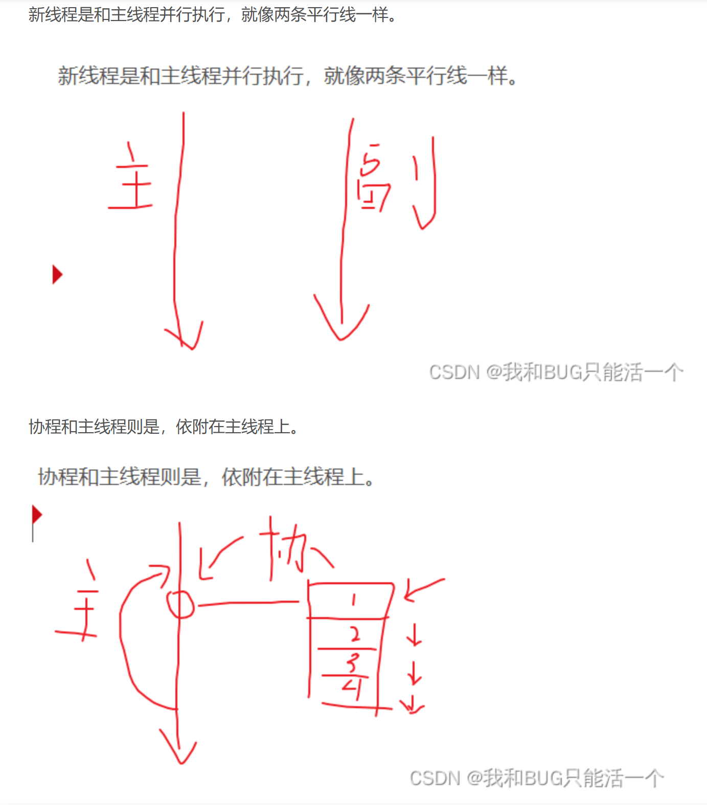

# 概念

## 初印象

​	首先最开始的一个概念就是在unity引擎中，是以组件为单位进行脚本编写的，如果用javaweb中的一个概念来说的话【面向接口编程】，就是**面向组件编程**，在unity中有两个基础概念，一个是物体对象，即一个场景中的物体。而另一个则是组件，所谓的游戏的编写，其实可以粗糙的理解为在一个个的场景中，创建一个个物体对象，并在这些物体对象上搭载上各种的组件，使其拥有各种各样的效果。如：当一个矩形物体搭载上一个重力组件时就会具有重力组件的效果【这里的重力组件是unity内置的一个脚本】，同样的我们在编写游戏的时候也可以自己编写一系列的脚本，并将这些脚本挂载到各个物体上。

​	还有一个比较重要的理解就是，unity内置了很多组件，这些组件花里胡哨的一大堆，看着都特别复杂，但其本质也都是一个个用代码编写的脚本而已，只不过暴露出了很多参数可以供使用者修改。

# 基础

## 脚本的生命周期


> **注意：**	

> 1. 其中Awake方法是一个脚本只要挂载在一个对象上之后，只要这个对象第一次出现就会调用，不论是否启用，但同时也只会调用一次。
> 2. 而OnEable方法则是在脚本挂载到一个对象之上后，点击启用后就会调用一次，如果我多次在启用和关闭之前横跳，那么这个方法同样也会被反复调用，但同样的如果没有上述的反复横跳的话，这个方法同样也只会被调用一次。
> 3. onDisable这个方法主要是与OnEnable进行对应的，OnEnable是启用组件时调用，OnDisable则是关闭组件时调用
> 4. OnDestroy这个方法一定要注意是在组件被销毁时调用的，而非对象被销毁时调用的，这也就说明后续肯定有API是可以只销毁某个对象上的某个组件而不销毁对象的。

## 脚本编写

​	由于每种结构体和类后面相关的方法和属性太多了，所以后面在写的时候，仅将类或结构体的大类列出，并给出这个大类的作用，具体细节可以在后续代码编写时，按需通过这个大类的名称在API文档中查询。

### 结构体

​	所谓结构体本质上有些类似于java中的抽象类，但其中的所有方法皆是抽象方法，其中定义了一些基础属性【但这些基础属性并不能赋予初值】，以及这个结构体可以调用的方法之类的，以下面的Vector的Vector2举例，其中定义了x和y用以标识对象的向量及坐标。而后便是：构造器【结构体必须在构造器中给所有属性赋值，类的构造器则不需要】，right，left，down，up，one，zero等一系列上下左右移动的方法。

#### Vector

​	其中包含各种Vector，主要区分在于每种Vector中的变量数量不同，举个例子：Vector3中就包含了三个基础变量：x，y，z分别代表三个轴，主要应用于3D。以此类推可以得出Vector2是应用于2D的向量。其可以代表的东西有：坐标，向量，旋转【欧拉角，根据传入的角度旋转】，缩放【根据传入的比例进行缩放】

##### Vector2


##### Vector2Int

​	相较于上面的Vector2，主要区别在于Vector2中对xy的向量坐标是可以使用浮点数的，而Vector2中则是只能使用Int类型来表示xy的向量坐标。

##### Vector3


##### Vector3Int

​	相较于上面的Vector3，主要区别在于Vector3中对xyz的向量坐标是可以使用浮点数的，而Vector3Int中则是只能使用Int类型来表示xyz的向量坐标。

##### Vector4

​	目前知道的应用好像主要用于存储四元数，四元数就是一种旋转角度的表示方式，在unity中可以与欧拉角【就是0-360度的那种角】相互转换，其相对于欧拉角的优点在于性能更好，但缺点在于可读性更差。

#### Scene

​	场景，一个游戏是由多个游戏场景组成的，而每个场景中又可以包含多个对象，而每个对象又可以包含多个脚本【或者说组件】，所以场景可以粗略的理解成除了游戏本身外，在游戏开发中最大的概念了。需要注意的是场景是可以多个组合着用的，也就说有可能一个场景中会包含或组合另一个场景以达到某种效果，具体应用还得等实战。而在游戏的过程中肯定是要有多个场景之间的切换的，而这个切换的工作主要就交给了[SceneManager](#SceneManager)去完成。

### 类

​	在C#中同样也定义了类这个概念，其概念与java中的类完全相同，但这也导致其与结构体很难相互分清楚，这里罗列几个二者的区别：

1. 结构体是值类型，类是引用类型，所以结构体相较于类更轻量，执行效率更高，成本更低。
2. 结构体是存储在栈结构中的，类是存储在堆结构中的，而堆的空间更大，访问速度也更慢。
3. 类是可以继承的，结构体是无法继承的
4. 类在定义其中属性时可以对其中定义的属性直接赋值，而结构体则不行。
5. 类可以有空构造器，而结构体则必须在构造器中将之前声明的所有属性进行赋值。
6. 结构体可以不使用new关键字声明出新的对象，但相应新声明出的对象中的属性是没有初始值的【当然可以声明之后再赋值】。

#### Application

​	Application对象可以想象成为你写的这个游戏本身，其中存放了一些有关游戏的属性，如：persistentDataPath【持久化路径】、dataPath【游戏数据路径（只读）】，runlnBackground【游戏是否在后台运行】等等。具体还有很多，直接在unity中文API文档查询Application即可。

#### Input

​	在unity中Input的作用和python中的input类似，都是用于接收用户输入的，不论是键盘【key】输入还是鼠标【mouse】输入，甚至是为了适配手机端的触摸【touch】输入。一般获取用户的输入都是放到update方法里，因为update方法是每帧刷新，而游戏对象需要每帧都能实时获取用户输入才是正道。

#### GameObject

​	即游戏物体，一般可以通过gameObject方法直接获取到一个GameObject对象，所以很多情况下创建GameObject对象都是通过gameObject匿名调用的。但需要注意的是，GameObject才是真正的类，而gameObject只是一个方法用于返回一个GameObject类型的变量。当然我们也可以使用游戏物体的：名称，tag，图层获取我们想要的特定的游戏物体。有了游戏物体之后我们自然就可以获取其上的：Transform【当然这个也属于组件的一种，只不过过于特殊，单拎出来而已】，component。也可以向这个游戏物体上添加一些component等等。

​	**这里说一个特别重要的点：gameObject这个东西基本就等于java中的this，python中的self。在脚本中使用gameObject这个对象，也就意味着，我调用了挂载我这个脚本的这个对象**。

##### GameObject和gameObject之间的区别

​	在编写脚本时有的函数在GameObject和gameObject中都是有的，所以这里区分一下他们俩。

​	GameObject是一个类，如果一个方法可以通过GameObject调用，那么这个方法肯定是一个静态方法。而非静态方法是无法直接使用GameObject调用的，需要先实例化为一个实例再调用【如：AddComponent方法就只能用实例去调用】。

​	gameObject如果是放到一个脚本中直接使用的情况下，那么这个gameObject指代的就是挂载了该脚本的那个游戏对象。既然是一个游戏对象，那gameObject自然本身就已经是一个实例了。或者换一种说法，如果一个脚本中出现了直接使用gameObject对象的情况，那么证明这个脚本后面是一定会挂载到一个对象上的【不论是使用脚本动态挂载的，还是直接拖拽静态挂载的】。

#### Transform

​	即游戏物体的位置，但值得说明的是：其不仅掌控了游戏物体的位置，还掌握了游戏物体的旋转角度，大小缩放，父子组件关系【可以通过transform对象拿到，添加，删除父子组件】

##### Transform和transform之间的区别

​	与GameObject和gameObject之间的区别一样。

#### SceneManager

​	场景管理器，用于管理场景，场景的概念可以看[这里](#Scene)，其实说是管理，最主要的还是场景的切换，而场景的切换主要有两种方法，一种常规切换：即场景的切换与加载在主线程中进行，遇到大的场景切换时进程大概率会卡住，直到大场景加载完毕继续。另一种方式则是异步切换：即场景的切换是单独开一个线程去进行，而主线程则继续当前任务，直到场景线程将场景加载完毕后，生成的场景就可以加入到摄像机中了。

> 这里为了后续查询时方便，优先给出异步加载场景时可以会需要用到的几个关键词，方便后续查询：
>
> ```c#
> public AsyncOperation operation;
> IEnumerator loadSence()
>  {
>      SceneManager.LoadSceneAsync(1); //这里的1是场景编号
>      yield return operation;
>  }
> void Start()
>  {
>      StartCoroutine(loadSence());
>  }
> 
> void update()
> {
>     Debug.Log(operation.progress) //其中operation.progress可以用于场景加载时的进度条
> }
> ```

### 枚举

#### KeyCode

​	主要用于PC端的开发，用于映射键盘上的按键，对于26个字母也可以使用字母的小写直接代替其中的枚举对象。

### 关键词

#### [SerializeField]和[HideInInspector]

​	这两个关键词一般用于在一个变量的声明前，主要用于控制该变量是否要显示在检查器【检查器就是点击一个物体之后他跳出来的右侧那个可以设定数值的栏】中。

​	这个东西还有一些比较反直觉的东西：

1. 这两个关键词都不是C#这个语言中的关键词，而是unity自定义的API。

2. 有了上面这个前提其实就不难想到，那么这两个词也肯定就不是java中的那种用于网络传输作用的关键词Serialize了。

3. [SerializeField]关键词最常用的场景是：

   > ​	你想不对类外暴露一个属性时肯定会使用private或protected这两个关键词之一，但是一旦使用了这两个关键词之后unity的Inspector就无法显示这两个属性了，那么此时你又想在Inspector给这两个值赋值怎么办？
   >
   > ​	[SerializeField]就是用来干这个的，在一个私有变量前加上[SerializeField]就可以强制把这个属性暴露到Inspector中，但是他对其他类依然是private权限的

4. [HideInInspector]关键词最常用的场景是：

   > 恰恰与上面[SerializeField]关键词相反，当你想要声明一个public变量用来给所有的类都可以使用但同时又不想让他暴露在Inspector上时就可以用这个变量将这个public权限的变量从Inspector上藏起来。

## 协同程序【协程】

### 概念

​	首先需要明确的一件事情是unity本身是可以使用多线程的。但是unity使用多线程会有很多问题：

1. 由于unity本身就是一个编辑软件，所以在unity的脚本中开启的多线程如果没有手动关闭的话，即使游戏场景被中断了，线程依旧会跑下去。

> **举个例子**：我这里有一个用来初始化怪物的脚本，而我为了加载大量怪物，在怪物的private void Start() 这个回调函数中开启了线程。然后我进入unity的场景中，点击开始运行游戏，此时由于怪物脚本被挂载到了怪物身上，所以调用了start方法，线程也就随着打开了。但是此时如果我点击退出运行，那么此时虽然游戏已经终止了，但是之前在start里开的那个线程还是在跑。
>
> ​	所以为了避免上面这种问题的存在，一般都是在这个脚本的private void OnDestroy回调方法中手动销毁线程。

2. unity里的多线程是无法获取或使用unity所有相关对象和方法的。也就是说无法在开启的线程中获取到如gameObject，transform等对象。甚至无法在其中调用Debug.Log()方法打印日志。

> **注意：**虽然无法获取游戏对象，但是多线程还是可以完成一些如A*算法、网格计算，复杂的计算可能会卡住主线程的逻辑计算的。

​	所以针对上面的这第二个问题，unity就提出了协同程序这个概念。如果是粗略的认识的话，可以将他理解为一个伪线程。效果上与多线程类似，但是在协同程序中是可以获取到unity对象和方法的。其本质是一个迭代器【这里给出最开始的感性认知：类似于一个循环（但是他不影响主线程的运行），每隔一段协程就去看看之前的程序运行的怎么样了，如果运行好了就把结果迭代到最新】。

### 协程和线程的区别

最直观的就是下面这张图，[原文](https://blog.csdn.net/qq_42705793/article/details/127652498)。



### 协程的使用

​	协程主要有两个关键词：IEnumerator和yield return，IEnumerator主要用来声明方法是协程方法，而yield return则是类似于断点的存在，可以通过在不同的地方插入不同的yield return来控制协程的运行流程。

#### 1. 声明协程函数

```C#
IEnumerator FunctionName(Parameter p){
    // do something
    yield return null;
}
```

#### 2. 开启协程函数

```C#
// 关闭其余协程【非必要】
StopAllCoroutines();
// 开启协程，共有三种方式
// 方式1：直接传入函数名字符串，一般用于无参数函数
StartCoroutine(str(FunctionName));
// 方式2：直接传入函数名的字符串和参数对象，一般用于有参数函数，该方法不常用，多用方式3替代
StartCoroutine(str(FunctionName),p);
// 方式3：传入函数名以及参数，最常用
StartCoroutine(FunctionName(p));
```

可以看到和线程的开启方式还是很像的。同时需要注意协程也是可以多次执行多次的。


可以通过返回值来对协程进行管理：

```C#
Coroutine c1 = StartCoroutine(MyCoroutine(1, "123"));
Coroutine c2 = StartCoroutine(MyCoroutine(1, "123"));
Coroutine c3 = StartCoroutine(MyCoroutine(1, "123"));
StopCoroutine(c1);
```

#### 3. 关闭协程函数

```C#
// 关闭所有协程
StopAllCoroutines();
// 关闭指定协程
StopCoroutine(c1);
```

### yield return的分类

#### 1. 下一帧执行

**在Update和LateUpdate之间执行**

```C#
yield return null;
// 这里的这个数字并不会有任何影响都可以直接等价于null
yield return 数字;
```

> **注意**：这里的下一帧执行的是yield return null的下一句。比如说前面有10句，在这一帧就全部执行完了，但是由于这10句后面添加了一句yield return null，那么第11句也会等到下一帧再执行。
>
> 这里以及下面的Update和LateUpdate都是脚本生命周期中的那个回调函数，详情见[图片](#脚本的生命周期)

#### 2. 等待指定秒后执行

**等待5秒之后，在Update和LateUpdate之间执行**

```C#
// 这里的5可以替换为想要间隔的时长
yield return new WaitForSeconds(5)
```

#### 3. 等待下一个固定物理帧更新时执行

**FixUpdate和碰撞检测相关函数之后执行**

```c#
// 这里的FixUpdate是脚本声明周期中的一环，是一个以固定频率调用的回调函数
// FixUpdate与Update的区别在于，Update是根据帧进行更新，而帧率这个东西是跟设备性能相关的，如果一个设备性能特别差，那么可能帧数就会特别少，从而使得Update的调用次数很少，而如果此时使用FixUpdate的话，我们就可以在项目的基础设置中自己设置每秒更新多少帧，而这个自己设置的帧数在更新的时候就会调用FixUpdate这个回调函数。
yield return new WaitForFixedUpdate()
```

#### 4. 等待摄像机和GUI渲染完成后执行

 **在LateUpdate之后的渲染相关处理完毕后执行。**

```C#
// 这个主要是用于等待摄像机和GUI渲染的，一般游戏内自带的拍照或截图功能会用到这个功能
yield return new WaitForEndOfFrame()
```

#### 5. 异步加载相关的内容

​	一些特殊类型的对象，比如异步加载相关函数返回的对象（一般在Update和LateUpdate之间执行），这一部分与异步加载资源/场景，网络加载时有关

#### 6. 跳出协程

在使用这个语句跳出协程之后，这个语句后面的代码则不会执行。

```C#
yield break;
```

#### 7. 协程函数

yield return除了上面一些通用的返回对象，同时也可以返回另一个协程函数。或者换句话说这里迭代的东西除了上面的通用对象，应该绝大数多数东西都可以返回。

[实例](#案例2)：返回另一个协程函数。

### 协程的活性

​	当一个挂载了协程脚本的物体失活时协程同样也会随着失活

​	当一个挂载了协程脚本的物体的其他不包含协程的组件失活时，协程会并不会失活，如果包含协程的组件失活时，则协程同样也会失活

### 总结

1. Unity支持多线程，但是新开的线程无法访问主线程中的unity相关内容，所以一般主要用于进行复杂逻辑运算或者网络消息接收等等。

   > **注意**：unity中的多线程需要手动关闭。

2. 协同程序不是真正意义上的多线程，他是将线程中的逻辑进行分时执行，从而避免卡顿。

3. 继承MonoBehavior的类都可以使用协程

4. 开启协程的方法，关闭协程的方法见[这里](#协程的使用)

5. yield return 返回的内容对于我们的意义，以及不同的分类

6. 协程只有当**组件【注意：这个组件等价于脚本】**单独失活【这里的单独失活指的是不包含协程的脚本，如果包含了协程的脚本失活了那协程本身也会失活】时不受影响，其他情况协程会停止。

### 案例

#### 案例1

这里给出一个用协程创建大量cube不会造成游戏卡顿的案例，虽然当你把1w个的数量加大到10w时游戏会卡一些，但是他一批批生成的那种效果着实不错，有种在构建的生成感。

```C#
   // 声明协程方法
    IEnumerator CreateCube(int num)
    {
        for (int i = 0; i < num; ++i)
        {
            // 创建基础单元，这里是创建cube这个基础单元
            GameObject obj = GameObject.CreatePrimitive(PrimitiveType.Cube);
            // 给创建的单元物体随机在（-100,100）的范围内挑选一个位置并移动过去
            obj.transform.position = new Vector3(Random.Range(-100, 100), Random.Range(-100, 100), Random.Range(-100, 100));
            // 每1000个更新迭代一次
            if (i % 1000 == 0)
                yield return null;
        }
    }
// 在第一次Update前开启协程
    void Start()
    {
        // 开启协程创建1w个小方块
        StartCoroutine(CreateCube(10000));

    }
```

#### 案例2

上面说的以及案例中演示的的`yield return`都是简单的返回值，这个案例会给出一个`yield return IEnumerator()`的案例。

```C#
// 执行敌人行动
public IEnumerator DoAction()
    {
        hideActionUI();
        // 播放怪物行动动画
        animator.Play("attack");
        // 等待某一时间的后执行对应的行为（他在说什么勾八东西，完全没读懂，所以直接抄下来了）
        //这里他写死了，属实是意义不明，这两句话莫名其妙，但是他这里用的逻辑就是等待0.5秒
        yield return new WaitForSeconds(0.5f);
        switch (type)
        {
            case ActionType.None:
                break;
            case ActionType.Defend:
                defend += 1;
                UpdateDefend();
                break;
            case ActionType.Attack:
                // 扣玩家血量
                FightManager.Instance.HitPlayer(Attack);
                // 摄像机震动，参数说明：
                // 第一个参数：震动时长
                // 第二个参数：震动强度
                // 第三个参数：
                // 第四个参数：震动随机程度
                Camera.main.DOShakePosition(0.1f, 0.2f, 5, 45);
                break;
        }
    }

 // 执行所有活着的怪物的行动
    public IEnumerator DoAllEnemyAction()
    {
        for (int i = 0; i < enemyList.Count; i++)
        {
            // 这里循环迭代的竟然是协程方法。头一次见
            yield return FightManager.Instance.StartCoroutine(enemyList[i].DoAction());
        }
    }
```

这里可以看到第二个协程函数的yield return对象竟然是第一个协程函数。所以现在的认识从原来的只能返回那特定的六种，变成了那六种是一些特殊的通用返回值，实际上的yield return是可以返回所有的类型的对象的。

