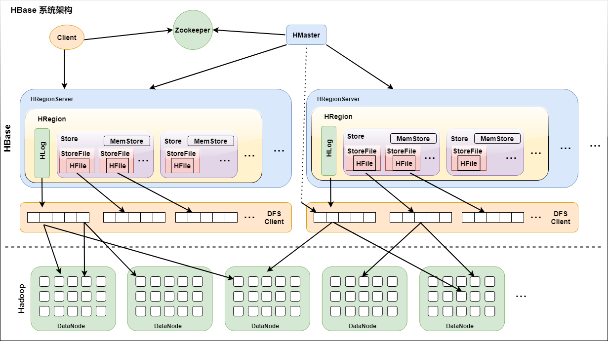

# HBase

## 一图流

.png)

上图中涉及到的几个图片

## Zookeeper和HDFS大致了解

[zookeeper](https://mp.weixin.qq.com/s?__biz=MzA3MDc1MDcxNQ==&mid=2447685297&idx=1&sn=e84afc965af540bcc27d580f1c9a3755&chksm=8b280e25bc5f8733d617a009fe089cad937964e4c24a2dee7903206135e6a053d213a7cf65aa&scene=21#wechat_redirect)

[HDFS](https://mp.weixin.qq.com/s?__biz=MzA3MDc1MDcxNQ==&mid=2447687947&idx=1&sn=ce94d95064666f43a83b3260065f0f02&chksm=8b28799fbc5ff089be9509fa29db093df185fa2ceb416fb254ed06d17b4f0d83c5cf7b00a4da&scene=21#wechat_redirect)