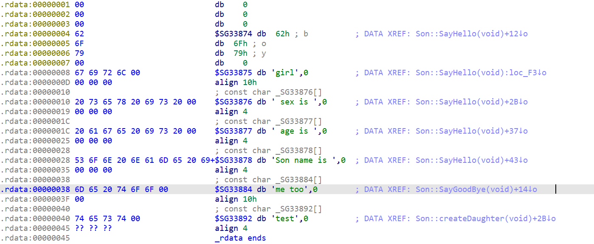
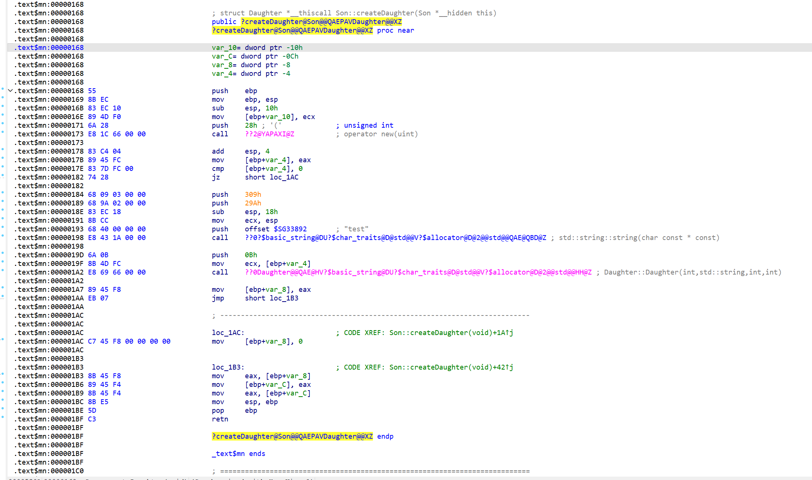
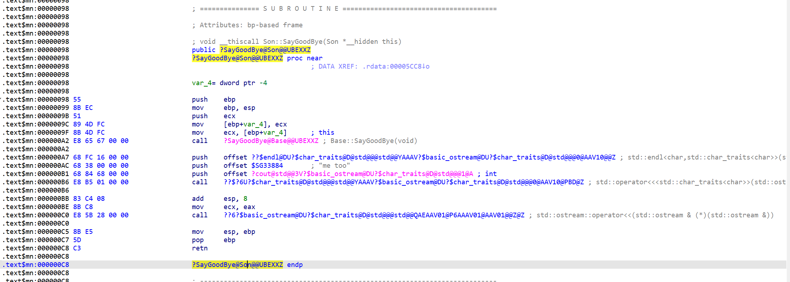
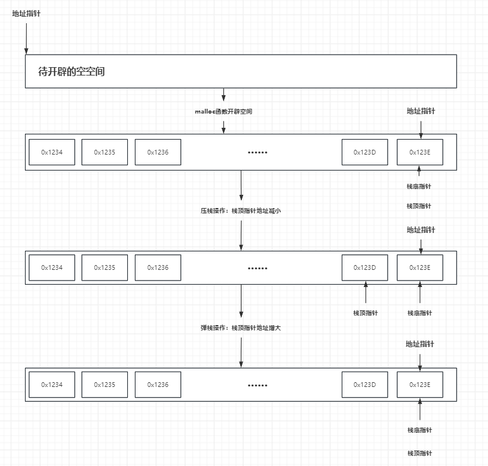
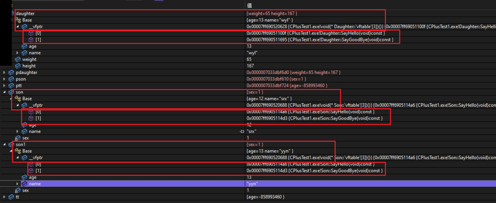
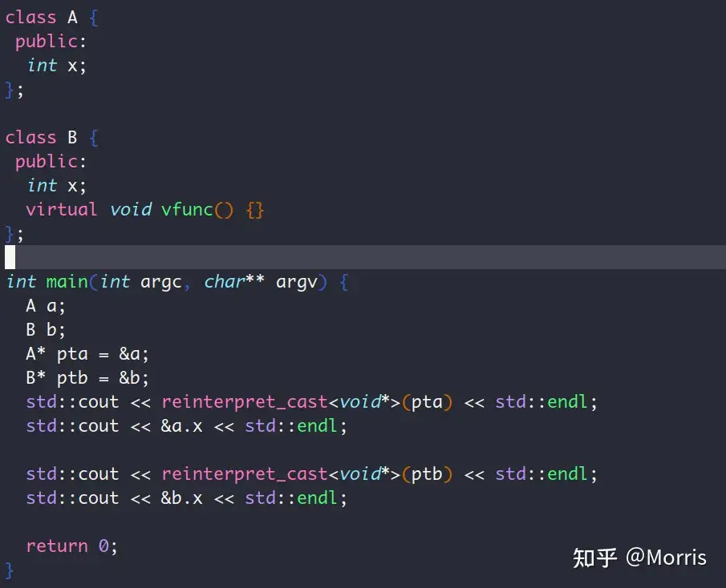
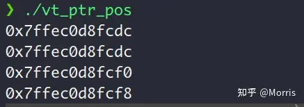
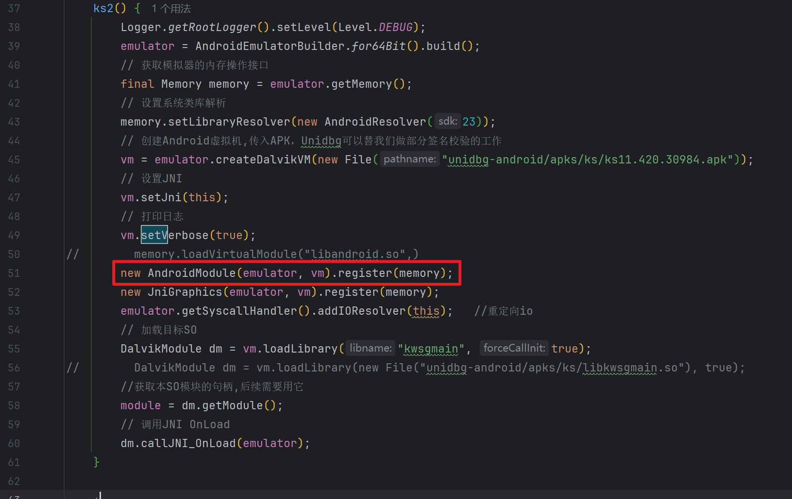
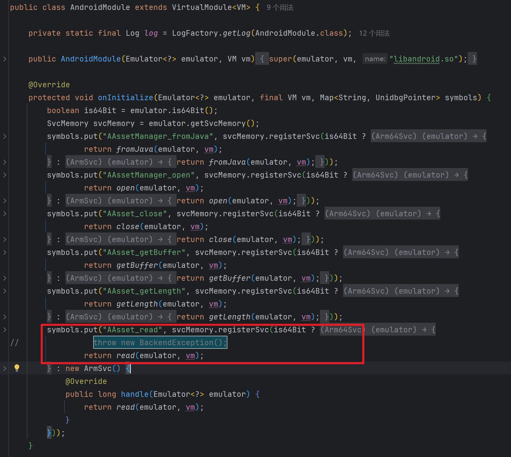

# 逆向杂烩

## 常见生命周期

### C++

#### C++编译后类的文件建构，及内存分布

​	在C++中一个类在被编译并加载到内存中运行的过程中，会将整个类拆分成多个部分【或者可以说是一个类以及其实例化对象在内存中是如何存放的】：

一个类在编译之后，代码就基本可以分为数据段、代码段、堆、栈。

​	其中数据段和代码段是用于存储类信息，以及类中函数代码的。而堆与栈则是在程序运行时，用于存储类创建的实例的。具体在栈与堆上创建实例的区别可以参考[C++基础.md](./C++基础.md)中的**内存中的数据结构第一条**。

​	其次便是：数据段、代码段。这两部分是直接写死在编译后的obj文件中。其中代码段时负责整个程序运行的，而数据段则还会分为RDATA和IDATA，RDATA是只读数据，这些数据通常是程序在运行时需要访问但不需要修改的数据。例如，常量、静态数组等数据可以放置在RDATA段中。而IDATA段包含的是导入的数据，主要用于存储程序运行时需要从外部库（如DLL文件）导入的数据项。例如，函数指针、全局变量等通常会存放在IDATA段中。

> 值得注意的是：下面章节中的提到的[虚函数表](#虚函数表指针)就是在编译阶段，写在数据段中的。

​	这里有一个从内存角度来理解成员函数指针的示例。通过这个示例可能有助于理解上面的分段，以及成员函数指针本身。

```c++
#include<iostream>
class A {
public:
    void func1() {
        std::cout << "function1 called" << std::endl;
    }
    int func2(int a) {
        std::cout << "function2 called" << std::endl;
        return a;
    }
    int* func3(int a) {
        std::cout << "function3 called" << std::endl;
        return &a;
    }
};
int main()
{
    A a;
    void (A:: * func1ptr)() = &A::func1;
    int (A:: * func2ptr)(int) = &A::func2;
    int* (A:: * func3ptr)(int) = &A::func3;
    (a.*func1ptr)();
    int a_num = (a.*func2ptr)(1);
    std::cout << a_num << std::endl;
    int* a_num_ptr = (a.*func3ptr)(2);
    std::cout << a_num_ptr << std::endl;
    return 0;
}
```

**说明**

1. 上面例子中的成员函数指针的声明格式如下：

   `返回类型 (类名::* 成员函数指针名)(参数类型) = &类名::函数名;`

   其中的`类名::*`本质上就是一个指向**类**的指针，与`int*`在本质上没有区别，只不过看着有点反直觉。而`&类名::函数名;`则是想要获取的成员函数的地址。所谓地址就是指针，指针就是地址嘛。

2. 而后便是上面这个成员函数指针在内存中到底指向的是哪里？

   1. 就如上面所说C++代码在经过编译之后，obj文件会被分为几个部分，其中**类信息【包含了一些成员变量、成员函数的*定义*、虚函数表等】**这部分会被放到数据段部分，如下图所示。

   

   上图是我定义的一个Son类，其中包含了SayHello、SayGoodBye两个空返回值的方法。同时还包含了换一个CreateDaughter，返回值为Daughter【另一个文件中的类】的方法。

   2. 而上面这三个方法真正的逻辑实现，则是放到了代码段中【注意，类信息中只是定义了这个类有这个函数，并没有真正实现这些函数的逻辑】，如下图所示：

   **CreateDaughter**：

   

   **SayGoodBye：**

   

   **SayHello**：

   太长了就不截图了。

   **总结**

   经过上面三个函数的说明，应该不难发现，最终的成员函数指针应该指向的是数据段，声明函数的那个位置。

#### 构造函数初始化列表和函数体

​	在C++当中，构造函数并不是像java那样只有一个构造函数体，在类被实例化的时候直接执行构造函数体就完事了的。他还细分为了：**构造函数初始化列表**和**函数体**两部分。当一个类在进行实例化的时候，是优先调用**构造函数初始化列表**的，再调用**函数体**的。根据GPT给出的说法，在**构造函数初始化列表**中进行初始化相较于在**函数体**中进行初始化的优势主要有以下几点：

1. 更有效率

   > 相当于省略了java中的默认构造方法

2. 初始化常量成员和引用成员：常量成员（`const`）和引用成员（`&`）只能在初始化列表中进行初始化，不能在构造函数体内赋值。

3. 基类初始化：派生类可以在初始化列表中调用基类的构造函数来初始化基类部分。这对继承层次结构的正确初始化至关重要。

   > 这里可以理解成省略了一个java中的super的步骤，直接在**构造函数初始化列表**中就调用了基类的构造方法。

#### 栈指针的弹栈与压栈流程

​	“栈指针”是一个用于跟踪当前栈顶位置的指针。在许多硬件架构和操作系统中，栈指针是一个特殊的寄存器。也被称为“堆栈指针”或“栈针”。

​	对于x86和x86-64架构，栈指针由“ESP”寄存器和“RSP”寄存器管理。ESP和RSP的概念见[x86-x64汇编常用指令及寄存器.md](..\逆向\安卓\底层&汇编\x86-x64汇编常用指令及寄存器.md)中的**寄存器**章节。

​	这个指针永远指向栈顶。每当引入或弹出一个元素时，栈指针都会做相应的移动。栈指针是实现**函数调用**、**参数传递**以及**局部变量存储**等操作的关键。

> 注意：栈是向下增长的，也就是说，当你向栈中添加一个新元素时，栈指针将会减小（假设地址空间从上到下排列），繁殖当从栈中弹出一个元素时，栈指针将会增大，具体的流程可以参考下图。**下图可能会有些问题，因为我不是很确定地址指针是否与栈底指针是指向同一个地址，这个可能还需要实验**。



#### 虚函数表指针

##### 基础说明

​	虚函数本身的说明，参考[c++基础](./C++基础.md)中的虚函数章节，而虚函数表则是存在在每一个类中的一个隐藏表。其中记录了这个类里面的所有虚方法。之所以会有这个表，还因为在后续实现多态的时候，可以通过虚函数表中指针的地址不同来指向不同类对同一个虚函数的不同实现【见[实验结果](#实验结果)】。

> **注意**：
>
> 1. 虚函数表是从属于类，而非实例的。也就是说同一个类创建的不同的实例最终的虚函数表**指针**都会指向同一个虚函数表。
> 2. 虚函数表**指针**是从属于实例的。也就说如果一个类中包含了虚函数表，则使用这个类创建的各个实例都会比没有虚函数表的类的实例多一个指向虚函数表的**指针**。
> 3. 如果一个类中没有虚函数，则也就不会存在这个虚函数表，进而可以得到，使用这个类创建的实例中并不会包含虚函数表**指针**

##### 实验结果



​	这里我创建了一个基类base，并在其中创建了一个名叫SayHello的虚函数，以及一个名叫SayGoodBye的纯虚函数。并且创建了两个类Son和Daughter子类都继承了Base这个基类。并且分别对上述两个虚函数进行了实现。

​	最后在main函数中创建了两个Son的实例【其中传入的属性不相同】，同时创建了一个Daughter实例，然后打开断点就可以看见上图的结果。可以很明显的看到以下几个点：

1. 所谓的虚函数表本身就是一个在基类下的指针数组。而这个指针数组下存放着两个指向虚函数**实现**的指针
2. 值得注意的是同一个类的两个不同示例的虚函数表的指针，以及其下的虚函数**实现**的指针都相同。
3. 而不同类之间的虚函数表的指针，以及虚函数**实现**的指针都不相同。即使两个类都是继承自同一个基类。
4. 通过上面的总结我们也可以得到：虚函数表指针下的虚函数指针，分别指向的都是他们各自的**实现**，这里一再强调实现是因为他们的地址不同。如果指向的并非是实现的话，那么不同类的指针也应该是相同的，因为他们继承自同一个基类。

##### 所在位置及大小

​	虚函数表**指针**本身就是一个指针。所以他的大小也与指针相同，在64位的机器上时，其大小是8字节。在32位机器上时，其大小是4字节。

​	虚函数表**指针**在实例中的继续位置。虚函数表指针的位置位于整个实例的最开始。优先于所有的属性及方法。这里直接引用[知乎文章](https://zhuanlan.zhihu.com/p/682680244)中给出的例子及结果：





​	这里可以看到，当类A是一个没有虚函数表的类时，其属性x所在的地址\与\引用对象指针\所在的起始地址\一致。而B类作为一个有函数表的类时，器属性x所在的地址是在\引用对象指针\所在的起始地址\的基础上加了一个指针的偏移。结合虚函数表指针的大小，不难发现虚函数表指针就在实例对象的起始位置。

##### 虚函数指针的初始化

​	虚函数指针作为一个实例中的属性，必然也是需要进行初始化的。而其初始化的时机同样也是最早的，甚至是早于构造函数执行初始化列表和函数体之前。下面是一个具有虚函数的类实例化一个对象时的流程：

1. **分配内存**。其中包含了虚函数指针在内的各种属性、方法。

2. **虚函数表指针初始化**。该指针的初始化还需要细分为两种，一种是基类的初始化，一种是子类的初始化

   1. 基类对象初始化：

      虚函数表**指针**指向基类的虚函数表。

   2. 子类对象的初始化：

      子类的虚函数表指针优先指向基类的虚函数表、而后当子类执行构造函数**前【这里之所以用前，是因为上面说的虚函数指针的初始化是要早于构造函数和初始化列表的】**再更新为指向子类的虚函数表。

3. **构造函数的初始化列表**。

4. **构造函数体的执行。**

   > 这里还有一个细节，就是构造函数的初始化列表是紧接着虚函数指针初始化的，当初始化列表执行完毕之后，才是执行构造函数体【也就是构造函数中的逻辑】。

## 常见二进制文件结构

## ida反汇编

## 杂烩中的杂烩

### unidbg

#### AndroidModule VirtualModule执行上的一些小问题

[issue](https://github.com/zhkl0228/unidbg/issues/646)

在64位模拟器中执行下面这个代码：

```java
new AndroidModule(emulator, vm).register(memory);
```

调用VirtualModule补libandroid.so的时候，如果加密so用到AAsset_read这个函数，那么可能会遇到下面这种异常：

```text
[11:20:39 109]  WARN [com.github.unidbg.linux.ARM64SyscallHandler] (ARM64SyscallHandler:412) - handleInterrupt intno=2, NR=192, svcNumber=0x1f0, PC=unidbg@0xfffe1734[libandroid.so]0x734, LR=RX@0x40038c4c[libkwsgmain.so]0x38c4c, syscall=null com.github.unidbg.arm.backend.BackendException at com.github.unidbg.virtualmodule.android.AndroidModule$11.handle(AndroidModule.java:90) at com.github.unidbg.linux.ARM64SyscallHandler.hook(ARM64SyscallHandler.java:121) at com.github.unidbg.arm.backend.UnicornBackend$11.hook(UnicornBackend.java:345) at unicorn.Unicorn$NewHook.onInterrupt(Unicorn.java:128) at unicorn.Unicorn.emu_start(Native Method) at com.github.unidbg.arm.backend.UnicornBackend.emu_start(UnicornBackend.java:376) at com.github.unidbg.AbstractEmulator.emulate(AbstractEmulator.java:378) at com.github.unidbg.thread.Function64.run(Function64.java:39) at com.github.unidbg.thread.MainTask.dispatch(MainTask.java:19) at com.github.unidbg.thread.UniThreadDispatcher.run(UniThreadDispatcher.java:175) at com.github.unidbg.thread.UniThreadDispatcher.runMainForResult(UniThreadDispatcher.java:99) at com.github.unidbg.AbstractEmulator.runMainForResult(AbstractEmulator.java:341) at com.github.unidbg.arm.AbstractARM64Emulator.eFunc(AbstractARM64Emulator.java:262) at com.github.unidbg.Module.emulateFunction(Module.java:163) at com.github.unidbg.linux.LinuxModule.callFunction(LinuxModule.java:262) at com.ks.ks2.callByAddress(ks2.java:79) at com.ks.ks2.main(ks2.java:175)
```

此时可能需要修改`AndroidModule`类中的`onInitialize`方法，将其中的`throw new BackendException();`给替换为`return read(emulator, vm);`

**调用点**



**修改点**


