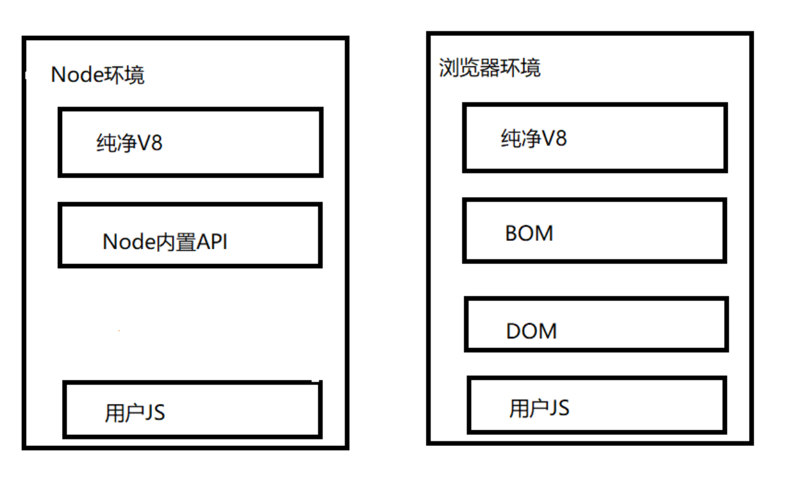
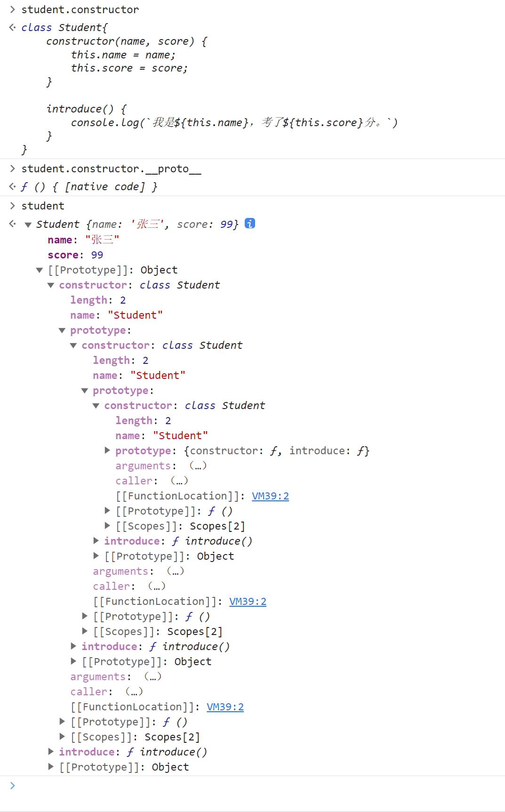
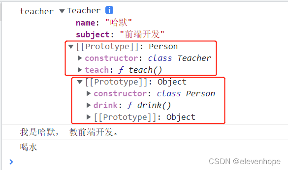
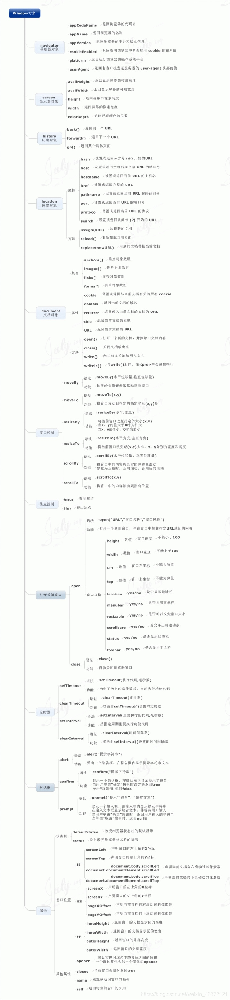

# JS逆向

## JS相关概念

### 浏览器环境

​	一般在做js逆向的时候肯定或多或少都听说过“补环境”，那么这个环境到底指的是什么？

​	这里一般将环境分为两个大种类，一种是浏览器环境，另一种是Node环境。二者有部分交集，也有一些差异。而一般我们时长说的“补环境”，就是将Node环境中相较于浏览器环境中缺少的那部分补全，以使JS代码可以正确的运行。

​	具体DOM和BOM基本操作的思维导图可以看[附录](#附录)的[BOM](#BOM)和[DOM](#DOM)

**浏览器环境**

1. ECMAScript：描述了JS的语法和基本对象。在绝大数情况下可以等同于V8。二者只有在少数的边缘情况下有一定的区别。
2. BOM（浏览器对象）：与浏览器交互的方法和对象，像常用的window就是BOM的核心，window不仅担当了js访问浏览器窗口的一个接口，还是一个全局对象，所以这也就是[这里](#log断点的使用)定义window对象的原因，方便管理。
3. DOM(文档对象模型)：处理网页内容的方法和接，也可以理解为，你所有浏览的**网页**本质上都是一个大对象，这个大对象就是DOM。你所有对**网页【注意：这里不包括对浏览器的操作】**的操作都是对DOM的操作。
4. 用户的JS脚本

**Node环境**

1. ECMAScript：描述了JS的语法和基本对象。在绝大数情况下可以等同于V8。二者只有在少数的边缘情况下有一定的区别。
2. Node内置API
3. 用户的JS脚本



​	通过上面的介绍和图片不难发现补环境本身就是补充Node环境下没有的DOM和BOM对象中的一些属性或子对象。

### 原型和原型链

#### 原型

​	在说原型之前首先要明确一件事：在JS中所有的对象【函数也算对象】都会有原型，而在JS原型特指prototype或\_\_proto\_\_，其含义有一点像模板，其中\_\_proto\_\_被称为**隐式原型**，这个\_\_proto\_\_属性指向的是这个对象的构造函数的**prototype**，被称为**显式原型**。这里举一个例子可能更直观一些：

```js
class Student{
    constructor(name, score) {
        this.name = name;
        this.score = score;
    }

    introduce() {
        console.log(`我是${this.name}，考了${this.score}分。`)
    }
}

const student = new Student('张三', 99)
console.log('student', student); // student Student { name: '张三', score: 99}
student.introduce(); // 我是张三，考了99分。
```

​	在上面这个例子对象student就有`__proto__`属性，它指向Student这个类的prototype，也就是二者是相等的`student.__proto__==Student.prototype`的结果是True。在`__proto__`中可以清楚的看到student这个实例所对应的Student类中到底有那些方法，如下图所示：


​	前面不是说了所有的对象包括函数都会有原型么，那么此时如果我查看constructor【Student的构造函数，之前说过所有的`__proto__`都是指向构造函数的】的`__proto__`会得到什么呢？



​	通过上面的图片发现递归了！同时这里还可以给出一个结论，对所有的函数对象使用`__proto__`属性得到的都会是`ƒ () { [native code] }`这是因为他们没有具体的构造方法。

#### 原型链

​	**当访问一个对象的属性或方法时，首先对象会从自身去找，如果找不到，就会往原型中去找，即`__proto__`，也就是它构造函数的prototype中；如果原型中找不到，即构造函数中也没有该属性，因为构造函数也是对象，也有`__proto__`，就会往原型的原型上去找，这样就形成了链式的结构，称为原型链，本质描述的是对象的一种继承关系**。

​	这个与java的继承很类似，就是一顿继承。这里给个博文的例子：

```js
class Person {
    constructor(name) {
        this.name = name;
    }

    drink(){
        console.log('喝水');
    }
}

class Teacher extends Person {
    constructor(name, subject) {
        super(name);
        this.subject = subject;
    }

    teach() {
        console.log(`我是${this.name}， 教${this.subject}。`)
    }
}

const teacher = new Teacher('哈默', '前端开发')
console.log('teacher', teacher);
teacher.teach();
teacher.drink();
```




## JS补环境

目前补环境主要有两种主流手段：利用Proxy定制补环境、通过积累构造完美浏览器环境。[参考](https://www.cnblogs.com/spiderman6/p/16969391.html)可以学到很多东西，值得反复看看，尤其是实战部分，看看能不能学着构建一个自己的虚拟环境。

### 介绍

#### 利用Proxy定制补环境

​	**Proxy**是ES6提供的代理器，用于创建一个对象的代理，从而实现基本操作的拦截和自定义（如属性查找、赋值、枚举、函数调用等）。 它可以代理任何类型的对象，包括原生数组，函数，甚至另一个代理；拥有递归套娃的能力！！也就是说 我们代理某个对象后，我们就成了它的中间商，**任何JS代码对它的任何操作都可以被我们所拦截！！**

**伪代码例子：**

```python
# 对navigator对象进行代理，并设置拦截后的操作
var handler = {set:funcA,get:funcB,deleteProperty:funcC,has:funcD ...};
navigator = new Proxy(navigator,handler);
# 对代理后的navigator进行各种操作都会被拦截并触发对应处理函数
navigator.userAgent 会被拦截并触发 get  funcB
navigator.userAgent = "xx" 会被拦截并触发 set funcA
delete navigator; 会被拦截并触发 deleteProperty funC
"userAgent" in navigator  会被拦截并触发 has funD ...
#等等... 任何操作都可以被拦截
```

​	通过上面这个例子可以发现，这种方法有一些类似于下面会讲到的[hook](#hook)，只不过把js注入，变成了通过代理拦截。

​	递归嵌套**Proxy**以此来代理浏览器所有的**BOM、DOM对象及其属性**，再配合**node vm2模块**提供的**纯净V8环境**，就相当于在node中，对整个浏览器环境对象进行了代理，JS代码使用任何**浏览器环境** api都能被我们所拦截。然后我们针对拦截到的环境检测点去补。

​	通过这种方法补出来的环境，主要有以下几个问题：

1. 不能通用，因为你是通过proxy拦截并补充的，所以每遇到一个新的环境就得重新拦截。
2. 遇到复杂，数量多的环境相当棘手，会很麻烦。
3. 二次开发上线比较低。

#### 通过积累构造完美浏览器环境

​	介绍了上面方法的缺点当然是为了介绍下面这种方法的优点而准备的。

1. 具有高通用性质，因为该种方法本质就是通过不断的积累，慢慢的补全一个完整的浏览器环境，你遇到的需要补环境的网页越多，补得越全，到后面在遇到一些常用的环境时直接掏出这个环境模板，替换掉其中部分的代码即可直接运行。
2. 遇到复杂的，你破解出来之后可以直接累加到前面补好的其他的环境中，这样慢慢的就没有复杂的环境了。
3. 二次开发只需要替换运行的代码即可，环境几乎不用有太大变化
4. 可以在Chrome浏览器进行无浏览器环境调试。

​	通过上面的几个优点也不难发现，本质就是通过不断的积累之前补的环境，最终构造出一个能解决绝大数问题的完美环境。如果遇见之前环境中没有的，就破解了补进去，这样下次在遇到这种环境的就不需要再次破解了。

​	目前补环境最主流的还是利用第二种方式进行。

### 实战


## 混淆与反混淆

### 介绍

​	该章节主要说一种前端反爬的方式：js混淆。防御者可以通过对js代码中的变量，控制流程，方法名称等一系列的代码进行修改，从而使得js代码变得不可读。但是同样的攻击者也可以通过一些常用的工具进行反混淆。

​	首先这里给出一个混淆与反混淆的大致介绍，文章中也给出了几种常用的混淆方式：[文章](https://cloud.tencent.com/developer/article/2235877?from=15425&areaSource=102001.2&traceId=09j0NjlmfEtV-sPmq5YBn)

### 常用反混淆工具

​	其次是一些常用的反混淆工具以及网站。

​	首先反混淆里面比较常用的一个技术是AST，该技术可以将js代码抽象并转化成一颗语法树，从而实现后续对混淆代码的一系列的删减等。

​	此外还有一个技术是hook，即通过将一些代码在页面加载前注入到网页的js代码中从而实现一些操作，这里以瑞数加密举例的话：由于瑞数本身的加密都放在了cookie中，而其对cookie的加密和修改并不是直接写在js中的，而是通过一个特别长的乱码动态转换，并将转换出来的代码通过一个函数直接调用，所以导致在监控cookie的变化时就会比较困难。而有了hook之后，只要cookie发生变化即可以将cookie抽出，并利用一个debugger()打一个基础断点，而后根据函数调用栈即可跟踪到cookie生成出的代码。

​	还有一些比较常用的混淆方式：

1. 三目表达式

   > 防止debug，因为三目表达式在debug时会一次性执行，举个例子：依旧是瑞数，其中最核心对cookie的控制流程加密代码，其放在了一个200行的大三目表达式中，所以当你debug此处时，你会发现虽然理论上流程应该根据流程控制词【一般是一个数字】的变化进行分支跳转，但实际上他一步就执行完了。

2. 控制流平坦化

   > 增加无用语句，从而增加debug难度

​	而后便是常用工具推荐：

1. [ast生成树](https://astexplorer.net/)：将给出的代码转化成为ast树
2. hook油猴插件： [JS Cookie Monitor/Debugger Hook](https://github.com/CC11001100/js-cookie-monitor-debugger-hook) 
3. [js混淆工具](https://obfuscator.io/)：将给出的正常js代码通过提供的一系列参数转化成不可读的混淆代码


## hook

​	hook这个技术本身是利用一个钩子函数来监控我们想要获取的一些变量，以便在这些变量改变时可以及时的监控到，或是打上断点。以最常用的全局hook cookie为例，那么此时hook干的事情就是当cookie被改变或第一次赋值时获取到cookie赋到的值，亦或是找到cookie赋值的具体位置。需要注意的是hook相当于在页面加载之前将一段代码注入到js中，所以在使用时最好配合刷新使用【当然临时hook会在刷新时被刷掉，所以建议存储一下】，[参考](https://www.cnblogs.com/andy0816/p/15087187.html)这里面说了很多有意思的东西。

### 局部hook

​	对于局部hook我暂时的理解很少，只知道常用于一些有闭包的函数。所以仅给出一段伪代码

```javascript
function a() {
    function b(a) {
        return a
    }
//hook b的argument a为5的时候大断点
    b_bk = b;
    b = function (val) {
        if (val === 5) {
            debugger;
        }
        return b_bk()

    }

    b(1);
    b(2);
    b(5);
}
a()
```

### 全局hook

​	最常用的一种hook，主要用来抓取监控window，document这种全局变量。一般最常用的是监控cookie的变化【也是我最开始接触的hook】，下面给出一个基础例子：

```javascript
//该hook代码是在一个油猴插件中复制下来的，当然也可以直接在console中直接使用
(function () {
    // 严谨模式 检查所有错误
    'use strict';
    // document 为要hook的对象 这里是hook的cookie
    var cookieTemp = "";
    Object.defineProperty(document, 'cookie', {
        // hook set方法也就是赋值的方法
        set: function (val) {
            // 这样就可以快速给下面这个代码行下断点
            // 从而快速定位设置cookie的代码
            console.log('Hook捕获到cookie设置->', val);
            debugger;
            cookieTemp = val;
            return val;
        },
        // hook get 方法也就是取值的方法
        get: function () {
            return cookieTemp;
        }
    });
})();
```

​	通过对上面代码的观察应该不难发现，hook本质就是检索一个变量，然后覆写他的set、get函数，并在这两个函数中做一些操作而已。

> **defineProperty的解释**
>
> ```tex
> defineProperty
> 先看下这个单词： define：定义 property：属性
> defineProperty即给对象定义属性
> 
> 语法：Object.defineProperty(obj,property,descriptor)
> 
> 参数一：obj
> 绑定属性的目标对象
> 参数二：property
> 绑定的属性名
> 参数三：descriptor
> 属性描述（配置），且此参数本身为一个对象
> 
> 属性值1：value
> 设置属性默认值
> 属性值2：writable
> 设置属性是否能够修改
> 属性值3：enumerable
> 设置属性是否可以枚举，即是否允许遍历
> 属性值4：configurable
> 设置属性是否可以删除或编辑
> 属性值5：get
> 获取属性的值
> 属性值6：set
> 设置属性的值
> ```

### hook流程

#### 函数hook

```javascript
//用一个新声明的变量old_func接收一下老的函数，func为要hook的函数
old_func=func;
//对老的函数进行覆写
func=function(argument){
    //在这里执行一些自己的任务，可以是console.log()来监控变量变化，也可以是debugger找到调用堆栈
    my_task;
    //重新返回并执行一下上面的那个变量，因为上面那个变量代表的就是老的函数，这里return一下相当于进行了一个拼接，而拼接前后我们把my_task这个我们自己的任务给插入进去了，这样使用就不会影响老函数的逻辑。
    return old_func.apply(arguments)
}
```

**注意：**

> 有些时候，通过打印一个函数的toString，可能判断出来和原来的不一致，我们hook了之后会被识别出来，那么就修改他的原型链，然后伪装一下，让他识别不出来是被hook了，至于具体如何修改原型链回头再查。

#### 属性hook

上面全局hook的cookie就是用的这种方法

```javascript
//与函数hook相同都是用一个新变量暂存老对象的属性，具体使用方法可以参考全局hook的那个例子
old_attr=obj.attr
//利用defineProperty给对象绑定属性，并在最后的一个对象中做一些操作。
Object.defineProperty(obj,'attr',{
    //该对象的该属性在获取时调用该方法
    get:function(){
        my_task;
        return old_attr;
    },
    //该对象的该属性在赋值时调用该方法，如果是想跟踪堆栈，则可以在这里使用debugger方法
    set:function(val){
        return .....
    }
})
```


## 调试小技巧

### 遇见debugger;

​	遇见这种在代码中直接写一个debugger;的，在打开F12后会直接进入一个死循环，从而无法调试，这里最直接的解决方法是，利用chrome或其他浏览器自带的调试器，直接打一个条件断点，其中条件直接置为false即可。当然也可以通过fiddler抓到响应包之后，修改js代码重发的方式进行，但肯定是越方便越好，所以我选择第一种方式。

### log断点的使用

​	在遇见一些比较大的流程控制时，时常会发现一个超大的while或for循环，并且里面各种if，else来回跳，此时最方便的方法是使用log断点，直接在while或for循环之前打一个log断点，并让其中输出流程控制词【一般都是一个数字】以及之前你debug到的加密字符串的那个变量。

​	这样直接在打出的日志中，观察加密字符串生成前的流程控制词的值即可。而后再在该处添加一个流程控制词的条件断点，并将流程控制词的值设为加密字符串生成前的那个值即可。

​	同样的这里也有trick，因为有很大可能该流程控制词不止一次等于一个词，但我们只需要最后一次控制词等于这个值的时刻。举个例子：通过log我们发现当流程控制词等于10的时候加密字符串生成了，而其之前的流程控制词是3，那么此时我们就应该在循环之前打一个`流程控制次==3`的条件断点，但此时你又发现，只要鼠标一动，该控制词就被置为了3，那此时怎么办呢？这里提供一种解决思路：

```js
//声明一个全局数组tl，并将每一次的流程控制词都放入tl数组中
window.tl.push(_$i8);
//锚定加密字符串生成之前的3~4个流程控制词，当之前3~4个流程控制词的值都与目的流程一致时即为我们要的流程
//如果上述锚定还不够的话，还可以进一步锚定加密字符串生成前一时刻的值，也就是下面代码里的： _$_I[2] == 5
if (window.tl[window.tl.length - 1] == 31 && window.tl[window.tl.length - 2] == 3 && window.tl[window.tl.length - 3] == 22 && _$_I[2] == 5) {
    true
}

//其中window.tl这个变量的声明需要再console中执行，即：window.tl=[]，而后再重投具有加密的请求，当需要多次调试时，记得每次重投请求之前哦度重置一次window.tl
```

## 附录

### BOM



### DOM


