## app抓包可能会遇见的问题

### 个别app抓不到数据包

这里说的情况是明明fiddler和模拟器已经全部配置好了，同时抓取别的app的包完全没有问题。但是只有在抓这个app的个别含有重要信息的包的时候抓不到。

​	这种情况主要有可能是以下两种问题

1. app内置了代理服务器【或无代理模式】

   这就导致用户在访问一些接口的时候走的并不是模拟器里指定的那个fiddler代理。

   **具体细节【无代理模式实现】**

   以最常用的okhttp来举例的话：

   ```kotlin
   private fun inOkHttp(){
       val intercept=HttpLoggingInterceptor()
       intercept.level=HttpLoggingInterceptor.Level.BODY
       if(mOkHttpClient=null)
       	mOkHttpClient=new OkHttpClient()
       mOkHttpClient=OkhttpClient.Builder()
       	.retryOnConnectionFailure(True)
       	.addInterceptor(Object:Interceptor{
             override fun intercept(chain:Interceptor.Chain?):Response{
                   val header=chain!!.request().newBuilder()
                 			.addHeader("Content-Type","application/x-www-form-")
                 			.addHeader("Connection","keep-alive")
                 			.addHeader("Accept","*/*")
                 			。addHeader("Cookie","add cookies here")
               }
           })
       	.proxy(Proxy.NO_PROXY)
       	.addInterceptor(intercept)
       	.connectTimeout(15,TimeUnit.SECONNDS)
       
   }
   ```

   其中最关键的点就是：`.proxy(Proxy.NO_PROXY)`，这里设置的是无代理模式，也就是说设置这个之后app则不会走fiddler等抓包软件设置的代理了，也不会与手机中安装的安全证书进行交互了。

   **解决方法：**

   需要再模拟器的手机中安装一个全局代理工具，如：proxydroid、drony等，同时在比较简单的情况下可以尝试使用HttpCannary这个软件。最后的最后还有wireshark这个网卡级的抓包工具。但是相对于上述三个软件wireshark分析起来会不方便很多。

2. ssl pining ssl证书校验

   就是app对服务端的证书做校验，我们也叫做单向认证，而fiddler上面肯定是没有这个证书的，所以app会校验不过，为什么浏览器不会出现这个问题，因为浏览器不会校验这个证书，而app是公司自己开发的，可以加这个校验的功能

   **解决方法：**

   逆向app扣出里面的证书，这个工程量就大了

## 通用解决方法

**解决方案：**使用postern+Charles解决

**原因分析：**之所以很多app抓不到包是因为在app的源码中有对代理的检测，检测到代理后app会直接将走代理的请求全部拦截下来，有的app会走自己内部的代理继续获取数据【此时由于走的不是我们指定的代理，所以抓不到任何包】，而有的app则是选择了摆烂【直接打不开或是打开后页面空白，并不发包】。

**解决原理：**原理是通过postern可以使用socket5进行代理，从而绕过对http请求的检测。而Charles则可以在代理设置中设置以赢得socket接口，进而可以与postern进行配合，最终达到抓包的效果。

### 搭建过程

#### 软件下载

首先是postern和charles的下载：

**postern：**https://github.com/postern-overwal/postern-stuff

**charles【破解自己搜】：**https://www.charlesproxy.com/

**Mt管理器【用于安装证书】：**应用宝直接搜就可以下到

#### 软件设置

想要使用上述两个软件配合抓包，首先确定一件事：手机【或模拟器】与电脑在同一个局域网下。解决方案也很简单，电脑开热点让手机连接电脑热点就OK了。

##### 证书安装及转换【需要root权限】

​	证书的安装方式有两种，一种是在手机上通过将手机的wifi代理设置为【电脑代理:8888（详见[下方](#postern)）】访问[链接](https://chls.pro/ssl/)自动下载获取，但是通过这个方法获取到的证书只能安装到用户中，并没有办法安装到系统中。而另一种则是通过charles导出的证书配合openssl以及mt管理器进行系统证书的安装。

###### 证书导出

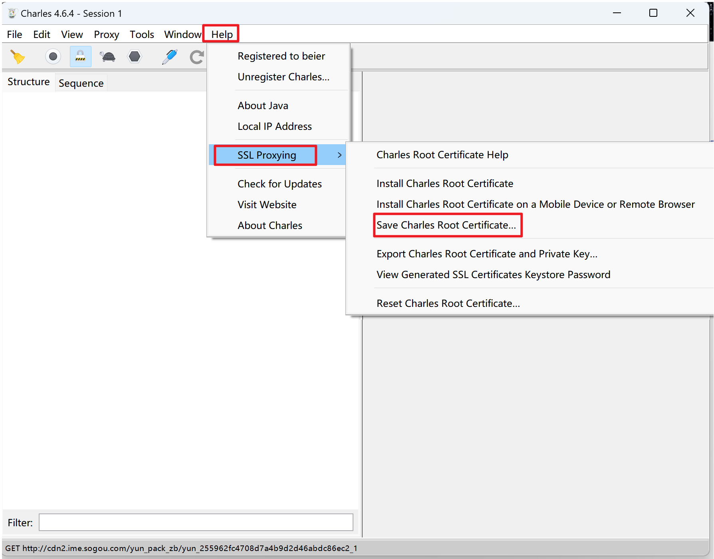

最终导出的证书应该是一个.pem文件。

###### 获取证书hash值&修改证书

**下载Openssl：**

​	Openssl下载地址：https://slproweb.com/products/Win32OpenSSL.html，进入页面之后选择Win64 OpenSSL v3.1.2下面的exe下载并按流程安装即可。安装成功之后应该是可以直接在Win+S下搜索到Openssl的

**使用Openssl获取证书hash**

​	通过Win+S搜索Openssl，并打开直到其安装路径下【路径参考见下图】，cd到该路径下使用命令行获取


**命令**

```bash
# 如果是charles证书直接执行下面这个命令，就可以获取一个hash值，将证书的名字改成这个hash值.0即可。
openssl x509 -subject_hash_old -in 证书.pem
# 如果是fiddler证书要导入则需要多一步将cer转为pem，然后再执行上面的命令获取hash值即可。
openssl x509 -inform DER -in FiddlerRoot.cer -out cacert.pem
```

###### 证书安装【需要root权限】

将手机【模拟器】链接到电脑上，使用命令将证书push到手机上。使用mt管理器【需要root权限】找到证书，并将其复制到`/system/etc/security/cacerts`路径下即可。

**命令**

```bash
adb push 证书 /sdcard
```

##### charles

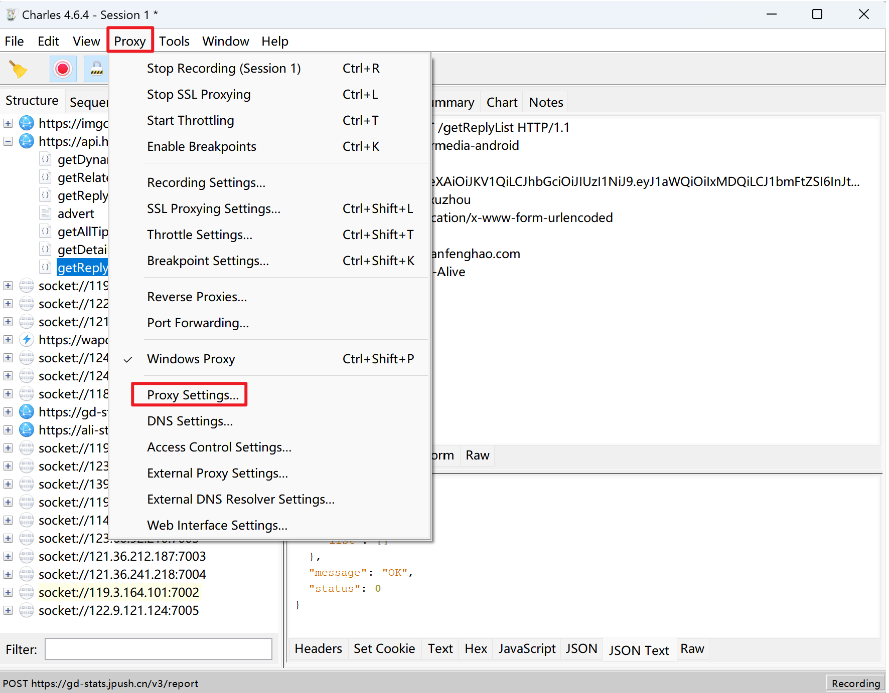

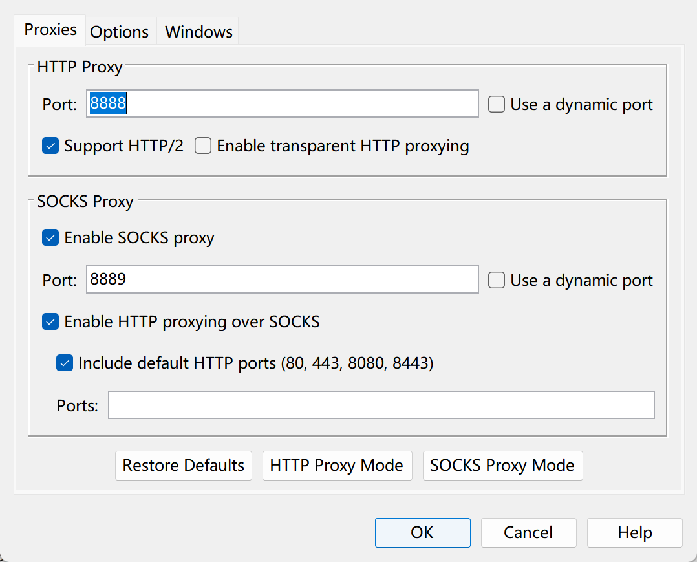

上图中主要设置的是Sockets Proxy这个属性中的port。这个端口在后续postern中需要进行配置。

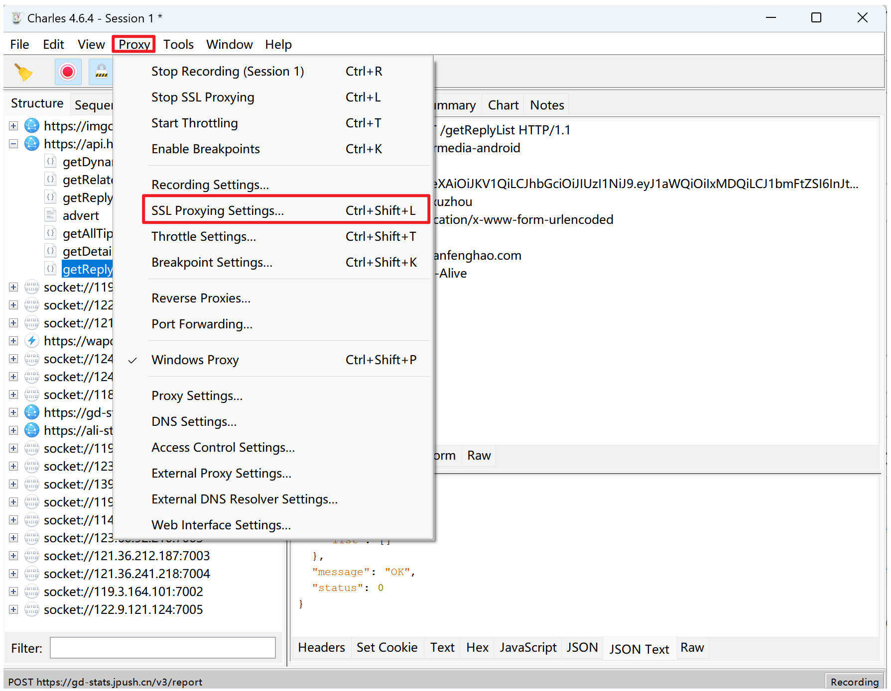

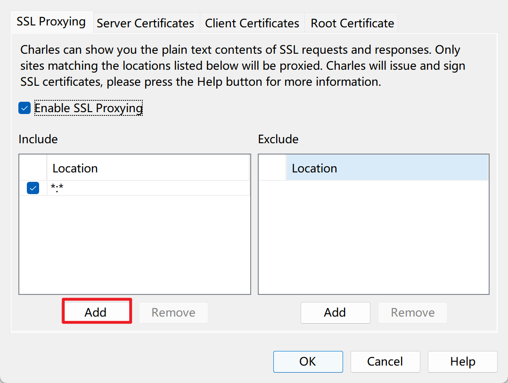

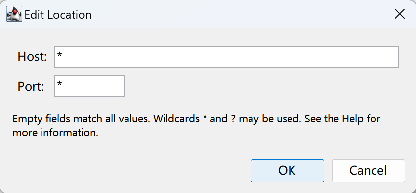

##### postern

通过在电脑的cmd中输入`ipconfig`，查看电脑的ip，然后跟着图片做就OK了

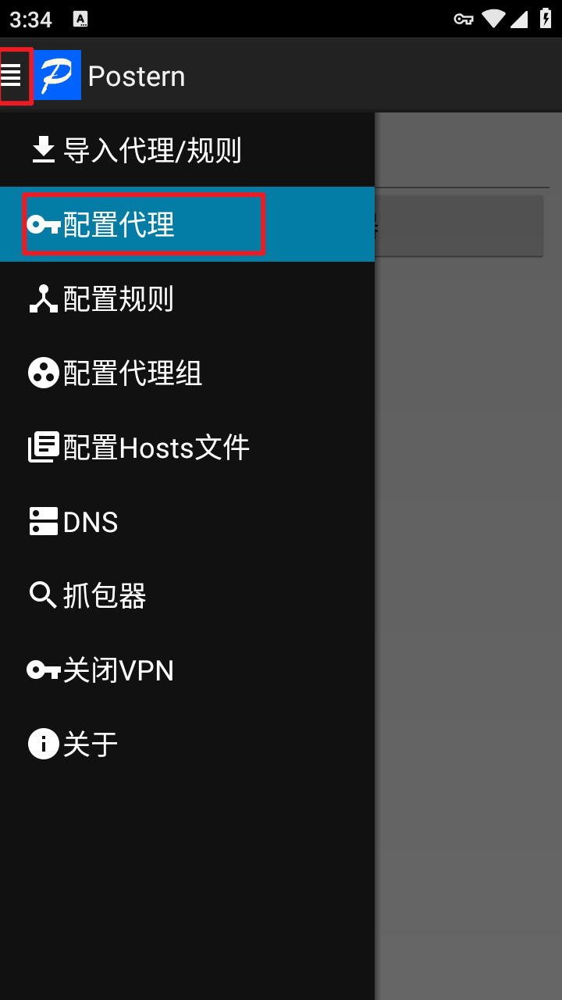

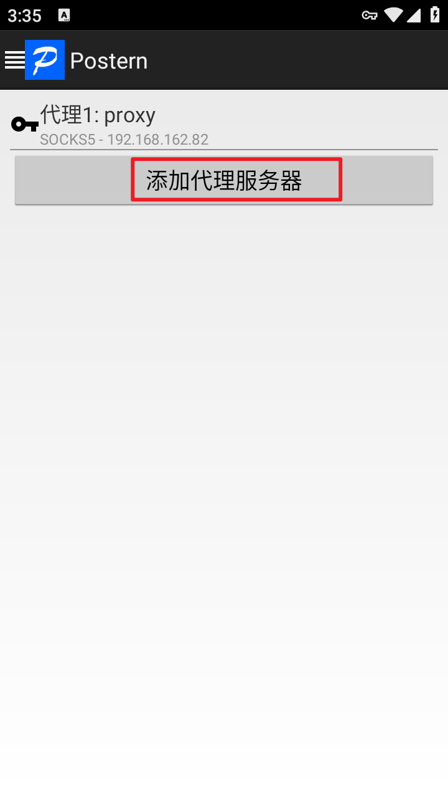

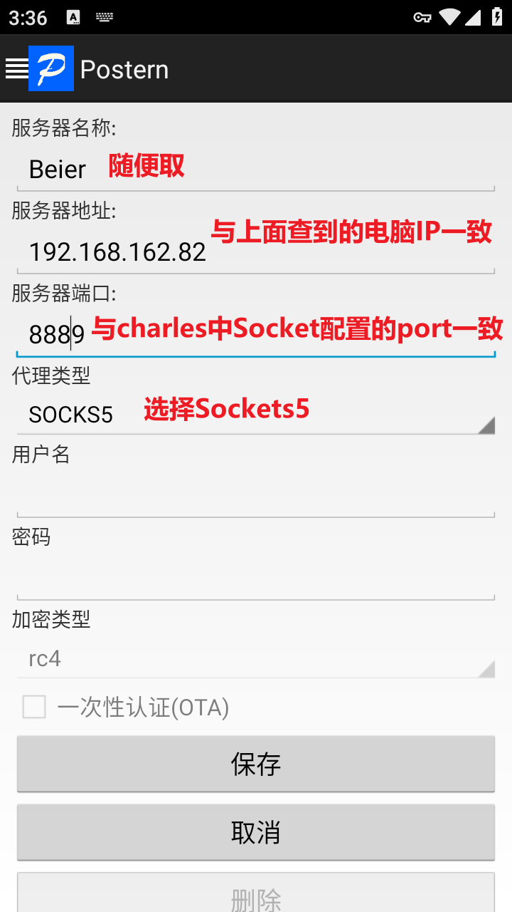

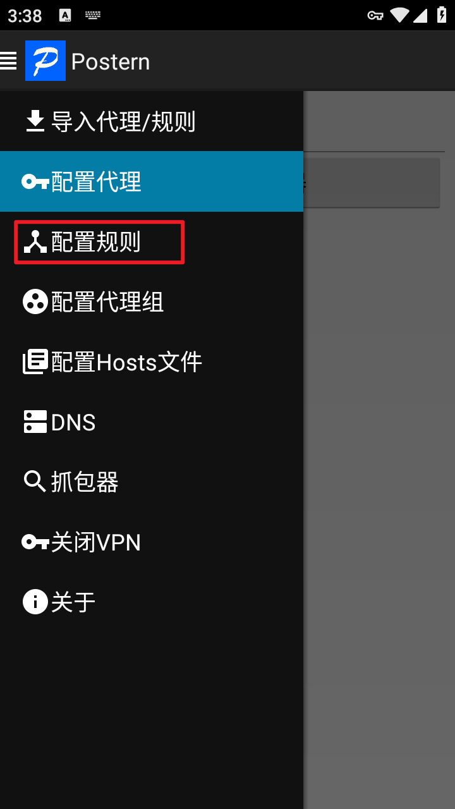

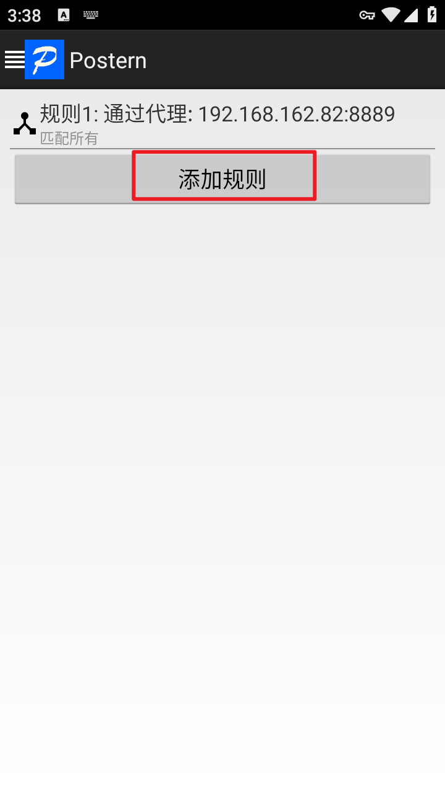

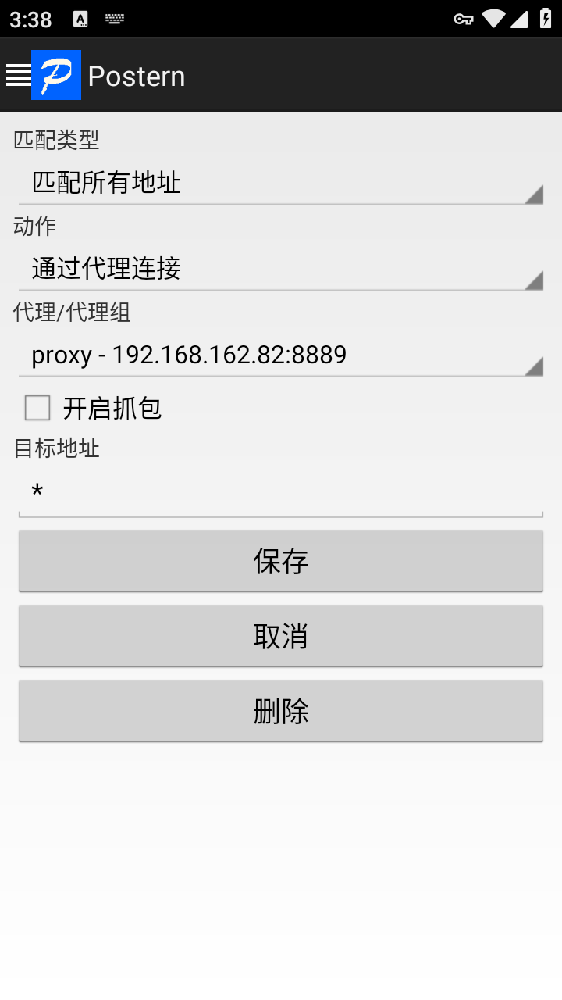

关闭VPN时如果直接清理后台仍有钥匙图案则需要再postern中点击关闭VPN进行关闭。
