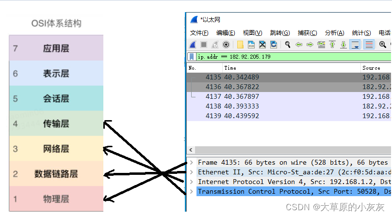

# wireshark使用指南

​	首先要确定一件事，wireshark是网卡级的抓包工具，而且多用于对传输层的数据表进行抓取，如果想要抓取https或者http这种应用层协议的数据包，还是fiddler和Chrome的开发者工具更方便一些，而且通过网络上查询到的资料都说wireshark是没有对https解密的功能的。

​	但同样的由于wireshark是网卡级的抓包，所以可以抓到一些自己设置了代理服务器的应用，如：青海观察【手机app】。

## wireshark如何抓包及筛选

1. 如何指定抓哪个网卡【如图】

2. 如何利用wireshark带的过滤器筛选出想要的请求【如图】，一般比较常用的是利用ip来筛选，当然前提是你知道对面服务器的ip是多少，而这只需要通过Chrome浏览器访问一下接口即可得到【也可以使用命令行ping一下想要爬取的域名】，实在不行紧盯着点wireshark并重新请求接口即可。这个筛选器一般是必须的，因为由于wireshark是抓的网卡的包，所以大多数情况下会有非常多杂乱的请求，需要通过筛选器专注你想要获取的那个应用的数据包

# wireshark的数据包如何分析

​	由于wireshark抓完的数据表多是传输层的数据包，所以看起来会比较费劲所以下面会给出一个TCP包中所包含的东西都由哪几个部分组成。

### 结构分析

**http请求**

**TCP请求**

通过上述两个部分不难发现在七层模型中与wireshark抓到的包的结构刚好是逆向对应的。

### 数据提取

暂时还没有比较好的办法读懂上述结构中传输层结构中的数据。虽然可以知道TCP首部固定长度是20，其余部分是TCP数据，同时也是应用层封装过后的UDP，但其中数据都是使用16进制和二进制填装的，而数据又不能像TCP首部那样固定长度的，解析二进制编码以获取有用的信息。所以该部分暂定由后续补充。