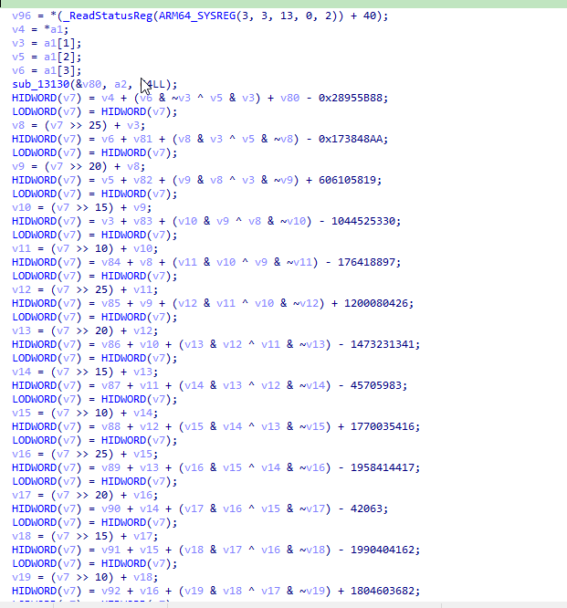
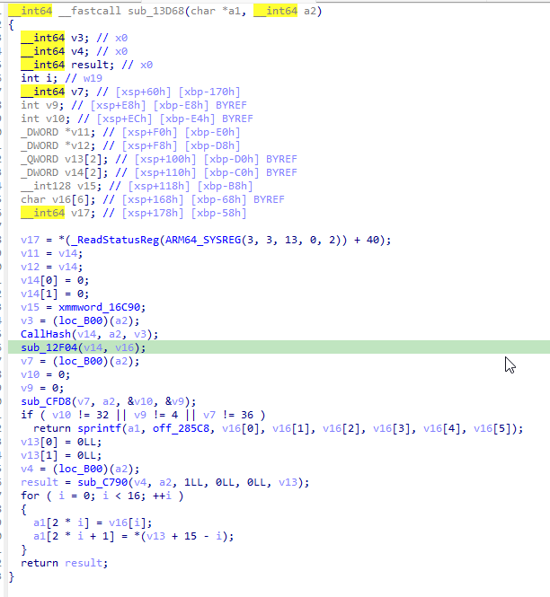
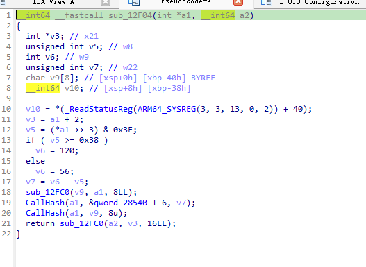
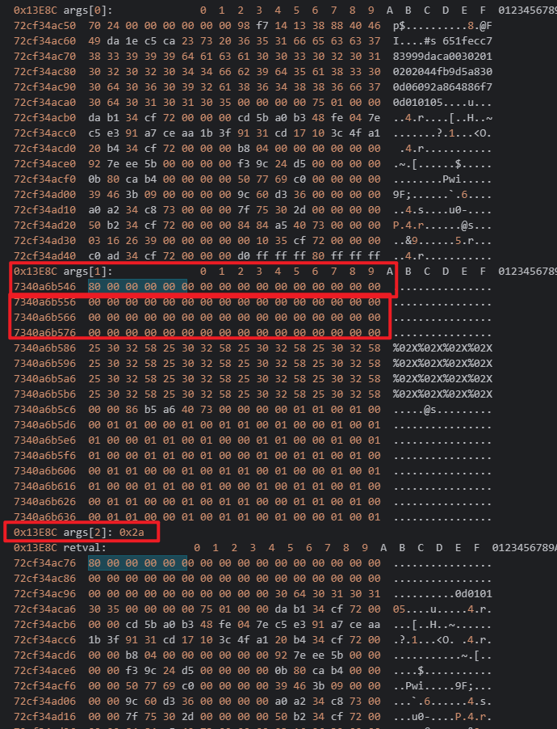

# MD5 hash的C++实现

## 标准实现

```c++
#include <stdafx.h>

void Hash( BYTE *field, const BYTE *param )
{
	unsigned int a = *((unsigned int *)(field +  0));
	unsigned int b = *((unsigned int *)(field +  4));
	unsigned int c = *((unsigned int *)(field +  8));
	unsigned int d = *((unsigned int *)(field + 12));

	a = ((b & c) | (~b & d)) + *((unsigned int *)(param + 0x00)) + a - 0x28955B88;
	a = ((a << 0x07) | (a >> 0x19)) + b;
	d = ((a & b) | (~a & c)) + *((unsigned int *)(param + 0x04)) + d - 0x173848AA;
	d = ((d << 0x0c) | (d >> 0x14)) + a;
	c = ((d & a) | (~d & b)) + *((unsigned int *)(param + 0x08)) + c + 0x242070DB;
	c = ((c << 0x11) | (c >> 0x0f)) + d;
	b = ((c & d) | (~c & a)) + *((unsigned int *)(param + 0x0c)) + b - 0x3E423112;
	b = ((b << 0x16) | (b >> 0x0a)) + c;
	a = ((b & c) | (~b & d)) + *((unsigned int *)(param + 0x10)) + a - 0x0A83F051;
	a = ((a << 0x07) | (a >> 0x19)) + b;
	d = ((a & b) | (~a & c)) + *((unsigned int *)(param + 0x14)) + d + 0x4787C62A;
	d = ((d << 0x0c) | (d >> 0x14)) + a;
	c = ((d & a) | (~d & b)) + *((unsigned int *)(param + 0x18)) + c - 0x57CFB9ED;
	c = ((c << 0x11) | (c >> 0x0f)) + d;
	b = ((c & d) | (~c & a)) + *((unsigned int *)(param + 0x1c)) + b - 0x02B96AFF;
	b = ((b << 0x16) | (b >> 0x0a)) + c;
	a = ((b & c) | (~b & d)) + *((unsigned int *)(param + 0x20)) + a + 0x698098D8;
	a = ((a << 0x07) | (a >> 0x19)) + b;
	d = ((a & b) | (~a & c)) + *((unsigned int *)(param + 0x24)) + d - 0x74BB0851;
	d = ((d << 0x0c) | (d >> 0x14)) + a;
	c = ((d & a) | (~d & b)) + *((unsigned int *)(param + 0x28)) + c - 0x0000A44F;
	c = ((c << 0x11) | (c >> 0x0f)) + d;
	b = ((c & d) | (~c & a)) + *((unsigned int *)(param + 0x2C)) + b - 0x76A32842;
	b = ((b << 0x16) | (b >> 0x0a)) + c;
	a = ((b & c) | (~b & d)) + *((unsigned int *)(param + 0x30)) + a + 0x6B901122;
	a = ((a << 0x07) | (a >> 0x19)) + b;
	d = ((a & b) | (~a & c)) + *((unsigned int *)(param + 0x34)) + d - 0x02678E6D;
	d = ((d << 0x0c) | (d >> 0x14)) + a;
	c = ((d & a) | (~d & b)) + *((unsigned int *)(param + 0x38)) + c - 0x5986BC72;
	c = ((c << 0x11) | (c >> 0x0f)) + d;
	b = ((c & d) | (~c & a)) + *((unsigned int *)(param + 0x3c)) + b + 0x49B40821;
	b = ((b << 0x16) | (b >> 0x0a)) + c;

	a = ((b & d) | (~d & c)) + *((unsigned int *)(param + 0x04)) + a - 0x09E1DA9E;
	a = ((a << 0x05) | (a >> 0x1b)) + b;
	d = ((a & c) | (~c & b)) + *((unsigned int *)(param + 0x18)) + d - 0x3FBF4CC0;
	d = ((d << 0x09) | (d >> 0x17)) + a;
	c = ((d & b) | (~b & a)) + *((unsigned int *)(param + 0x2c)) + c + 0x265E5A51;
	c = ((c << 0x0e) | (c >> 0x12)) + d;
	b = ((c & a) | (~a & d)) + *((unsigned int *)(param + 0x00)) + b - 0x16493856;
	b = ((b << 0x14) | (b >> 0x0c)) + c;
	a = ((b & d) | (~d & c)) + *((unsigned int *)(param + 0x14)) + a - 0x29D0EFA3;
	a = ((a << 0x05) | (a >> 0x1b)) + b;
	d = ((a & c) | (~c & b)) + *((unsigned int *)(param + 0x28)) + d + 0x02441453;
	d = ((d << 0x09) | (d >> 0x17)) + a;
	c = ((d & b) | (~b & a)) + *((unsigned int *)(param + 0x3c)) + c - 0x275E197F;
	c = ((c << 0x0e) | (c >> 0x12)) + d;
	b = ((c & a) | (~a & d)) + *((unsigned int *)(param + 0x10)) + b - 0x182C0438;
	b = ((b << 0x14) | (b >> 0x0c)) + c;
	a = ((b & d) | (~d & c)) + *((unsigned int *)(param + 0x24)) + a + 0x21E1CDE6;
	a = ((a << 0x05) | (a >> 0x1b)) + b;
	d = ((a & c) | (~c & b)) + *((unsigned int *)(param + 0x38)) + d - 0x3CC8F82A;
	d = ((d << 0x09) | (d >> 0x17)) + a;
	c = ((d & b) | (~b & a)) + *((unsigned int *)(param + 0x0c)) + c - 0x0B2AF279;
	c = ((c << 0x0e) | (c >> 0x12)) + d;
	b = ((c & a) | (~a & d)) + *((unsigned int *)(param + 0x20)) + b + 0x455A14ED;
	b = ((b << 0x14) | (b >> 0x0c)) + c;
	a = ((b & d) | (~d & c)) + *((unsigned int *)(param + 0x34)) + a - 0x561C16FB;
	a = ((a << 0x05) | (a >> 0x1b)) + b;
	d = ((a & c) | (~c & b)) + *((unsigned int *)(param + 0x08)) + d - 0x03105C08;
	d = ((d << 0x09) | (d >> 0x17)) + a;
	c = ((d & b) | (~b & a)) + *((unsigned int *)(param + 0x1c)) + c + 0x676F02D9;
	c = ((c << 0x0e) | (c >> 0x12)) + d;
	b = ((c & a) | (~a & d)) + *((unsigned int *)(param + 0x30)) + b - 0x72D5B376;
	b = ((b << 0x14) | (b >> 0x0c)) + c;

	a = (b ^ c ^ d) + *((unsigned int *)(param + 0x14)) + a - 0x0005C6BE;
	a = ((a << 0x04) | (a >> 0x1c)) + b;
	d = (a ^ b ^ c) + *((unsigned int *)(param + 0x20)) + d - 0x788E097F;
	d = ((d << 0x0b) | (d >> 0x15)) + a;
	c = (d ^ a ^ b) + *((unsigned int *)(param + 0x2c)) + c + 0x6D9D6122;
	c = ((c << 0x10) | (c >> 0x10)) + d;
	b = (c ^ d ^ a) + *((unsigned int *)(param + 0x38)) + b - 0x021AC7F4;
	b = ((b << 0x17) | (b >> 0x09)) + c;
	a = (b ^ c ^ d) + *((unsigned int *)(param + 0x04)) + a - 0x5B4115BC;
	a = ((a << 0x04) | (a >> 0x1c)) + b;
	d = (a ^ b ^ c) + *((unsigned int *)(param + 0x10)) + d + 0x4BDECFA9;
	d = ((d << 0x0b) | (d >> 0x15)) + a;
	c = (d ^ a ^ b) + *((unsigned int *)(param + 0x1c)) + c - 0x0944B4A0;
	c = ((c << 0x10) | (c >> 0x10)) + d;
	b = (c ^ d ^ a) + *((unsigned int *)(param + 0x28)) + b - 0x41404390;
	b = ((b << 0x17) | (b >> 0x09)) + c;
	a = (b ^ c ^ d) + *((unsigned int *)(param + 0x34)) + a + 0x289B7EC6;
	a = ((a << 0x04) | (a >> 0x1c)) + b;
	d = (a ^ b ^ c) + *((unsigned int *)(param + 0x00)) + d - 0x155ED806;
	d = ((d << 0x0b) | (d >> 0x15)) + a;
	c = (d ^ a ^ b) + *((unsigned int *)(param + 0x0c)) + c - 0x2B10CF7B;
	c = ((c << 0x10) | (c >> 0x10)) + d;
	b = (c ^ d ^ a) + *((unsigned int *)(param + 0x18)) + b + 0x04881D05;
	b = ((b << 0x17) | (b >> 0x09)) + c;
	a = (b ^ c ^ d) + *((unsigned int *)(param + 0x24)) + a - 0x262B2FC7;
	a = ((a << 0x04) | (a >> 0x1c)) + b;
	d = (a ^ b ^ c) + *((unsigned int *)(param + 0x30)) + d - 0x1924661B;
	d = ((d << 0x0b) | (d >> 0x15)) + a;
	c = (d ^ a ^ b) + *((unsigned int *)(param + 0x3c)) + c + 0x1fa27cf8;
	c = ((c << 0x10) | (c >> 0x10)) + d;
	b = (c ^ d ^ a) + *((unsigned int *)(param + 0x08)) + b - 0x3B53A99B;
	b = ((b << 0x17) | (b >> 0x09)) + c;

	a = ((~d | b) ^ c)  + *((unsigned int *)(param + 0x00)) + a - 0x0BD6DDBC;
	a = ((a << 0x06) | (a >> 0x1a)) + b; 
	d = ((~c | a) ^ b)  + *((unsigned int *)(param + 0x1c)) + d + 0x432AFF97;
	d = ((d << 0x0a) | (d >> 0x16)) + a; 
	c = ((~b | d) ^ a)  + *((unsigned int *)(param + 0x38)) + c - 0x546BDC59;
	c = ((c << 0x0f) | (c >> 0x11)) + d; 
	b = ((~a | c) ^ d)  + *((unsigned int *)(param + 0x14)) + b - 0x036C5FC7;
	b = ((b << 0x15) | (b >> 0x0b)) + c; 
	a = ((~d | b) ^ c)  + *((unsigned int *)(param + 0x30)) + a + 0x655B59C3;
	a = ((a << 0x06) | (a >> 0x1a)) + b; 
	d = ((~c | a) ^ b)  + *((unsigned int *)(param + 0x0C)) + d - 0x70F3336E;
	d = ((d << 0x0a) | (d >> 0x16)) + a; 
	c = ((~b | d) ^ a)  + *((unsigned int *)(param + 0x28)) + c - 0x00100B83;
	c = ((c << 0x0f) | (c >> 0x11)) + d; 
	b = ((~a | c) ^ d)  + *((unsigned int *)(param + 0x04)) + b - 0x7A7BA22F;
	b = ((b << 0x15) | (b >> 0x0b)) + c; 
	a = ((~d | b) ^ c)  + *((unsigned int *)(param + 0x20)) + a + 0x6FA87E4F;
	a = ((a << 0x06) | (a >> 0x1a)) + b; 
	d = ((~c | a) ^ b)  + *((unsigned int *)(param + 0x3c)) + d - 0x01D31920;
	d = ((d << 0x0a) | (d >> 0x16)) + a; 
	c = ((~b | d) ^ a)  + *((unsigned int *)(param + 0x18)) + c - 0x5CFEBCEC;
	c = ((c << 0x0f) | (c >> 0x11)) + d; 
	b = ((~a | c) ^ d)  + *((unsigned int *)(param + 0x34)) + b + 0x4E0811A1;
	b = ((b << 0x15) | (b >> 0x0b)) + c; 
	a = ((~d | b) ^ c)  + *((unsigned int *)(param + 0x10)) + a - 0x08AC817E;
	a = ((a << 0x06) | (a >> 0x1a)) + b; 
	d = ((~c | a) ^ b)  + *((unsigned int *)(param + 0x2c)) + d - 0x42C50DCB;
	d = ((d << 0x0a) | (d >> 0x16)) + a; 
	c = ((~b | d) ^ a)  + *((unsigned int *)(param + 0x08)) + c + 0x2AD7D2BB;
	c = ((c << 0x0f) | (c >> 0x11)) + d; 
	b = ((~a | c) ^ d)  + *((unsigned int *)(param + 0x24)) + b - 0x14792C6F;
	b = ((b << 0x15) | (b >> 0x0b)) + c;

	*((unsigned int *)(field +  0)) += a;
	*((unsigned int *)(field +  4)) += b;
	*((unsigned int *)(field +  8)) += c;
	*((unsigned int *)(field + 12)) += d;
}

void CallHash( BYTE *key, const BYTE *challenge, int len ) 
{
	unsigned int *ptr1, *ptr2;
	unsigned int a, b, c;

	ptr1 = (unsigned int *)(key + 16);
	ptr2 = (unsigned int *)(key + 20);

	a = *ptr1;
	b = (a >> 3) & 0x3f;
	a += len * 8;
	*ptr1 = a;

	if ( a < (len << 3) )
		ptr2 += 4;

	*ptr2 = *ptr2 + (len >> 0x1d);

	a = 64 - b;
	c = 0;

	if ( a <= len )
	{
		memcpy( key + b + 24, challenge, a );
		Hash( key, key + 24 );

		c = a;
		a += 0x3F;

		while ( a < len )
		{
			Hash( key, challenge + a - 0x3f );
			a += 64;
			c += 64;
		}

		b = 0;
	}

	memcpy( key + b + 24, challenge + c, len - c );
}

void CalcResponse( BYTE *result, BYTE *field )
{
	BYTE buf1[0x80];
	BYTE buf2[0x80];
	int i;

	memset( buf1, 0, 0x80 );

	*buf1 = 0x80;

	memcpy( buf2, field + 16, 8 );

	i = ( int(*((unsigned int *)(buf2))) >> 3 ) & 0x3f;

	if ( i < 56 )
		i = 56 - i;
	else
		i = 120 - i;

	CallHash( field, buf1, i );
	CallHash( field, buf2, 8 );

	memcpy( result, field, 16 );
}

void MD5( const BYTE* data, int dataLen, BYTE *hash )
{
	BYTE field[0x80];

	memset( field, 0, 0x80 );

	field[0x0] = 0x01;
	field[0x1] = 0x23;
	field[0x2] = 0x45;
	field[0x3] = 0x67;
	field[0x4] = 0x89;
	field[0x5] = 0xAB;
	field[0x6] = 0xCD;
	field[0x7] = 0xEF;
	field[0x8] = 0xFE;
	field[0x9] = 0xDC;
	field[0xA] = 0xBA;
	field[0xB] = 0x98;
	field[0xC] = 0x76;
	field[0xD] = 0x54;
	field[0xE] = 0x32;
	field[0xF] = 0x10;

	CallHash( field, data, dataLen );
	CalcResponse( hash, field );
}
```


## ida及frida hook特征

### ida特征

在ida中看到标准的以下格式即可断定，该函数最终会是一个md5，同时需要意识到目前看到的这个sub函数是上述[标准实现](#标准实现)中的Hash函数部分，而真正封装好的md5函数还需要向上找两层，也即：CallHash和MD5。



这里有一个可以辅助判断CallHash函数的方式：查看CallHash函数调用的下面是否有一个两个形参的sub函数，如果有那么基本可以断定该函数就是CallHash函数了，而他的父函数就是MD5，如下方的这个sub_13D68就是[标准实现](#标准实现)中的MD5函数，而sub_12F04就是CalcResponse函数了。





### frida hook特征

首先如果，在hook时发现函数是三参数的函数，同时最后一位是数据长度，同时第二个参数在近结尾处还包含0x80以及很多0x00，且这些0x00还把参数2填充为了一个64整数倍的字节块的时候，则可以合理怀疑该函数就是[标准实现](#标准实现)中的CallHash函数了。

