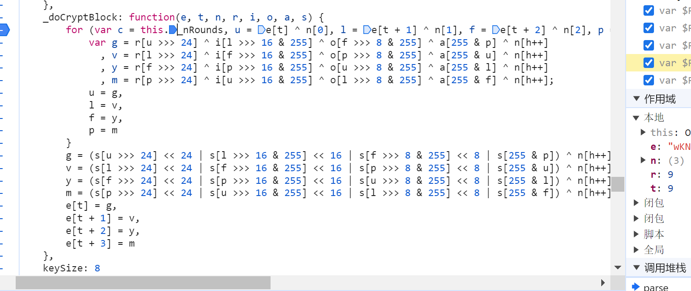
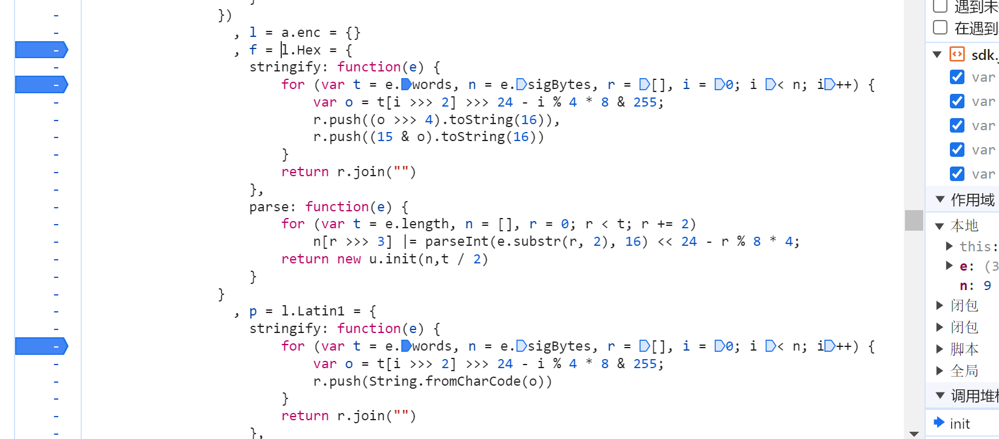
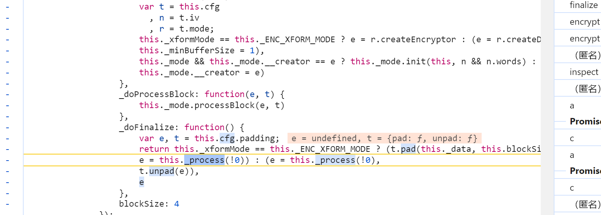
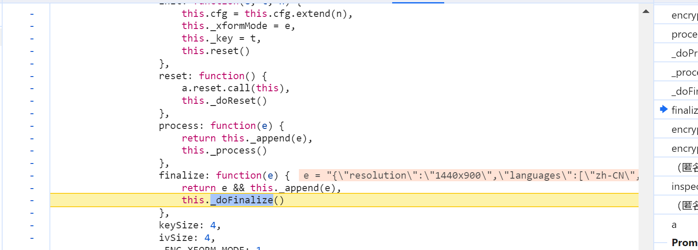
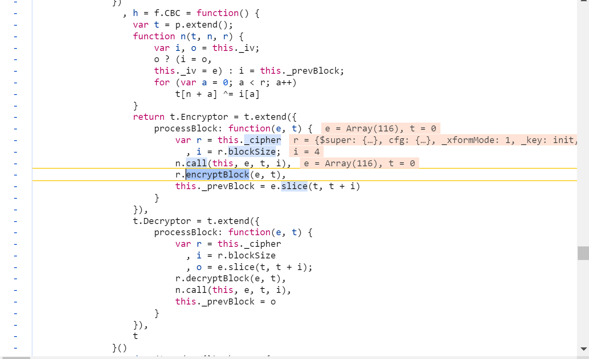

# 常用基础加密

## 取盐校验【识别方式：硬记，无法处理加盐】

​	这种加密最显著的特征就是不可逆，但相同明文加密出来的密文 的值是相同的，即无法通过密文还原出明文。

### MD系列

​	之前接触最多的就是MD5，以至于很长一段时间内以为只有MD5这一种加密是不可逆加密。但实际上就MD系列就有MD5、MD2、MD4等。

​	以最常用的MD5加密为例，常见的MD5加密的位数有16,32,40位之分。并且三者的关系是32位包含16位，40位包含32位。

```js
// 123456
e10adc3949ba59abbe56e057f20f883e //32位
        49ba59abbe56e057 //16位
// 通过上面的例子不难看出32位加密实在16位的前后分别加入了一些新的值组成的。
```

#### MD5示例

​	由于MD5对于固定明文的加密是固定的值，所以这里我们在辨别加密具体使用的是否是MD5加密时可以有一个取巧的方法：记住一个固定值的加密前几位和后几位，而后每次遇到怀疑是MD5加密的就可以以该值进行试探。

```js
// Qwe123456.
a1e759364c65276ebaa2c459a528092d //32位加密
4c65276ebaa2c459 // 16位加密
```

### sha系列

​	sha加密与md加密类似都是取盐不可逆且密文固定的加密，所以这里依旧是给出几个常见的sha加密的结果，记下来，用于日后加密识别。

#### sha示例

```js
// Qwe123456.
7ffbc40aac7debdfd2d17db111611c67af10d791 //sha1加密【40位】
e598e797b381a5eba82e4d7f5a5c45aca0f1e2e517517d87df969f0e13153942 //sha256加密【64位】
788042f968b61289ad31eef9dbaa430d54f7dc8ac7cb5a82302234d067c6925d9802c828bd1dc53c268e3565e170ac4aef250e3ec5d8e9efc45ff32fcfb13bab //sha512加密【128位】
```

## 对称加密【怀疑方式：非取盐校验常用位数+密文最大字符为f】

​	所谓对称加密就是明文和密文可以相互转换的一种加密，可以使用常见的[解密工具](https://spidertools.cn/#/crypto)进行解密。有时加密可能会有密钥，但正常来说对称加密的密钥相对于非对称加密的密钥是公开的，应该可以在js或是安卓代码中找到。

​	在有密钥的情况下。明文-密钥-密文这三者是一一对应的。换句话说同一段密文经过同一个密钥加密后得到的密文也是相同的。

​	常见加密：AES，DES，3DES。

## 非对称加密【怀疑方式：非取盐校验常用位数+密文最大字符为f】

​	非对称加密一般指的是RSA加密，其特点是由两种密钥进行加密和解密的。一种是公钥，另一种是私钥，与对称加密相反，非对称加密是一段明文通过公钥可以加密成不同的多个密文，而密钥则可以通过不同的密文解密出相同的明文。

## 常用加密的格式判断

### JS

​	在js逆向时如果遇见了形如下图等一系列的代码基本就可以断定是成熟的某种加密【就不用傻傻的去跟栈了】：









