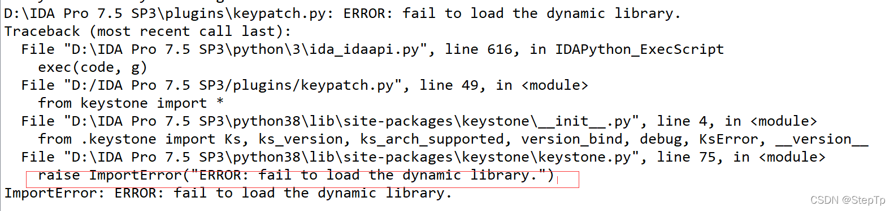

# ida插件

## keypatch

​	主要用于对反编译出来的文件进行patch，可以实现批量patch。该工具是跨平台【跨架构】的，可以实现arm、x86多架构的patch。

### 安装

#### github库

​	https://github.com/keystone-engine/keypatch

#### 相关库安装

```bash
pip install six -i https://pypi.tuna.tsinghua.edu.cn/simple
pip install keystone-engine -i https://pypi.tuna.tsinghua.edu.cn/simple
```

#### 插件安装

​	去上面的的github库，找到目录下的[keypatch.py](https://github.com/keystone-engine/keypatch/blob/master/keypatch.py)文件，单独下下来，然后放到ida的plugins目录下即可。

### 报错

​	完成上述安装后，重新打开ida，如果底下的控制台没有报任何错误，那么就证明安装成功了。如果报了以下错误，则需要安装vc++。官方文档有在Note里提及这个问题：https://github.com/keystone-engine/keypatch?tab=readme-ov-file#2-install



安装vc++的地址：https://www.microsoft.com/en-gb/download/details.aspx?id=40784