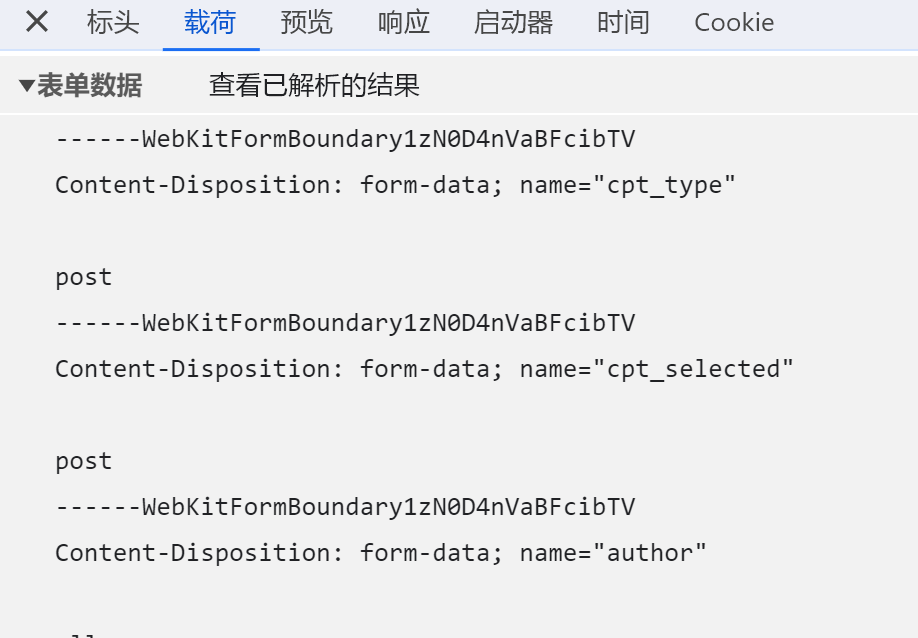

# 好用的python爬虫工具库

## curl_cffi

### 介绍

​	这个库主要作用是模拟一些浏览器指纹：ja3，五秒盾等。

### 使用体验

- [x] 过五秒盾

> 可以过一部分，具体区分：直接使用python的requests请求得到【403】just a moment，使用无痕浏览器访问需要验证的网站，如果网站弹出五秒盾页面则该网站无法使用该库绕过。如果访问验证网站发现并没有弹出五秒盾页面，并且cookie里包含cf_clearance则可以尝试使用该库绕过。

### 安装

```bash
pip install curl_cffi -i https://pypi.tuna.tsinghua.edu.cn/simple
```

### 示例

##### 过五秒盾

```python
from curl_cffi import requests
impersonate_list = ["chrome99", "chrome100", "chrome101", "chrome104", "chrome107", "chrome110",
                    "chrome99_android", "edge99", "edge101", "safari15_3", "safari15_5"]
impersonate = random.choice(impersonate_list)
result_html = requests.get(url_html, impersonate=impersonate, timeout=30).text
```

## requests_toolbelt

### 介绍

​	这个库目前我个人只使用到了其中的MultipartEncoder模块。用于填充一些特殊的表单。这种表单无法直接使用requests的字典表格进行请求。

### 使用体验

- [x] MultipartEncoder模块填充复杂表单

​	效果立竿见影

### 安装

```bash
pip install curl_cffi -i https://pypi.tuna.tsinghua.edu.cn/simple
```

### 示例

#### MultipartEncoder模块填充复杂表单

##### 复杂表单示例



##### 代码

```python
from requests_toolbelt import MultipartEncoder
# 原requests的data字典
data = {
    "cpt_type": "post",
    "cpt_selected": "post",
    "author": "all",
    "term": "13",
    "action": "get_cpt_topics",
    "nonce": "SEZXVCxBX1hwdWAyKS9sdnMrTjdnLUIhVm9NbDY6MVZiczEqTGc8PCFyOVEpZG1XeCVlT3dtYnEoUkhIITs8Mg==",
    "search": "display",
    "paged": "1"
}
# 表单分解符，用于复杂表单每一项之间的分割
boundary = "----WebKitFormBoundaryE7wTZ3p9cQuE96Qd"
# 使用MultipartEncoder重新组合复杂表单
form_data = MultipartEncoder(fields=data, boundary=boundary)
# 如果使用的请求库在data参数中仅接收dict，str则可以使用以下方法将表单转为str
# form_data = MultipartEncoder(fields=data, boundary=boundary).to_string()
```

##### 注意

1. 一般复杂表单的一个标志就是header中包含`"content-type": "multipart/form-data; boundary=----WebKitFormBoundaryxxxxxxx"`
2. 在使用MultipartEncoder时，其中的表单分隔符boundary的值需要与header中content-type的`boundary=`的值相同
3. `WebKitFormBoundaryxxxxxxx`中xxxxx的值看似在一直变化，其实本身并不会校验，所以可以确定为一个固定值

## z3求解器【微软z3求解器】

### 介绍

这个库主要的作用是对方程进行求解，比如有一个二元一次方程组：

```python
a + b == 10
a + 3 * b == 12
```

然后让你去求a和b，此时就可以使用z3求解器去解开这个方程组，获取到a和b。

复杂一些的加解密也是可以完成的：比如有一个经过复杂混淆过得加密器，在我们知道经过这个加密器后得到的结果的前提下，我们就可以使用z3库，从结果反推出其加密之前的值。

> 所有的非白盒加密，在知道起加密表达式的前提下，皆可以使用该方法获取到加密前的输入。因为绝大多数加密在进行加密计算时都会转化为数字进行各种计算。所以从广义的角度上来说，所有的非白盒加密都可以转化成各种复杂的方程组，从而使用z3进行求解。

### 安装

```python
pip install z3-solver -i https://pypi.tuna.tsinghua.edu.cn/simple
```

### 示例

#### 简单案例

```python
from z3 import *
# 创建两个未知数a和b
a, b = Ints('a b')

s = Solver()  # 创建一个解的对象s
s.add(a + b == 10)  # 添加约束条件
s.add(a + 3 * b == 12)

if s.check() == sat:  # check() 检查解是否存在，存在会return 'sat'
    result = s.model()  # 输出

print(result)

print(result[a])
print(result[b])
```

#### 复杂案例1

根据给出的约束表达式，算出最终的flag

```python
from z3 import *

v4 = [Int("input[%d]" % i) for i in range(31)]  # 以数组形式设置了变量

s = Solver()
s.add(334 * v4[28] + 100 * v4[27] + 369 * v4[26] + 124 * v4[25] + 278 * v4[24] + 158 * v4[23] + 162 * v4[
    22] + 145 * v4[19] + 27 * v4[17] + 91 * v4[15] + 195 * v4[14] + 342 * v4[13] + 391 * v4[10] + 204 * v4[
          9] + 302 * v4[8] + 153 * v4[7] + 292 * v4[6] + 382 * v4[5] + 221 * v4[4] + 316 * v4[3] + 118 * v4[
          2] + 295 * v4[1] + 247 * v4[0] + 236 * v4[11] + 27 * v4[12] + 361 * v4[16] + 81 * v4[18] + 105 * v4[
          20] + 65 * v4[21] + 67 * v4[29] + 41 * v4[30] == 596119
      )
s.add(
    371 * v4[29] + 338 * v4[28] + 269 * v4[27] + 312 * v4[26] + 67 * v4[25] + 299 * v4[24] + 235 * v4[23] + 294 *
    v4[22] + 303 * v4[21] + 211 * v4[20] + 122 * v4[19] + 333 * v4[18] + 341 * v4[15] + 111 * v4[14] + 253 * v4[
        13] + 68 * v4[12] + 347 * v4[11] + 44 * v4[10] + 262 * v4[9] + 357 * v4[8] + 323 * v4[5] + 141 * v4[
        4] + 329 * v4[3] + 378 * v4[2] + 316 * v4[1] + 235 * v4[0] + 59 * v4[6] + 37 * v4[7] + 264 * v4[
        16] + 73 * v4[17] + 126 * v4[30] == 634009
)
s.add(
    337 * v4[29] + 338 * v4[28] + 118 * v4[27] + 82 * v4[26] + 239 * v4[21] + 58 * v4[20] + 304 * v4[19] + 330 *
    v4[18] + 377 * v4[17] + 306 * v4[16] + 221 * v4[13] + 345 * v4[12] + 124 * v4[11] + 272 * v4[10] + 270 * v4[
        9] + 229 * v4[8] + 377 * v4[7] + 373 * v4[6] + 297 * v4[5] + 112 * v4[4] + 386 * v4[3] + 90 * v4[
        2] + 361 * v4[1] + 236 * v4[0] + 386 * v4[14] + 73 * v4[15] + 315 * v4[22] + 33 * v4[23] + 141 * v4[
        24] + 129 * v4[25] + 123 * v4[30] == 685705
)
s.add(
    367 * v4[29] + 55 * v4[28] + 374 * v4[27] + 150 * v4[24] + 350 * v4[23] + 141 * v4[22] + 124 * v4[21] + 366 *
    v4[20] + 230 * v4[19] + 307 * v4[18] + 191 * v4[17] + 153 * v4[12] + 383 * v4[11] + 145 * v4[10] + 109 * v4[
        9] + 209 * v4[8] + 158 * v4[7] + 221 * v4[6] + 188 * v4[5] + 22 * v4[4] + 146 * v4[3] + 306 * v4[
        2] + 230 * v4[1] + 13 * v4[0] + 287 * v4[13] + 257 * v4[14] + 137 * v4[15] + 7 * v4[16] + 52 * v4[
        25] + 31 * v4[26] + 355 * v4[30] == 557696
)
s.add(
    100 * v4[29] + 191 * v4[28] + 362 * v4[27] + 55 * v4[26] + 210 * v4[25] + 359 * v4[24] + 348 * v4[21] + 83 *
    v4[20] + 395 * v4[19] + 350 * v4[16] + 291 * v4[15] + 220 * v4[12] + 196 * v4[11] + 399 * v4[8] + 68 * v4[
        7] + 84 * v4[6] + 281 * v4[5] + 334 * v4[4] + 53 * v4[3] + 399 * v4[2] + 338 * v4[0] + 18 * v4[1] + 148 *
    v4[9] + 21 * v4[10] + 174 * v4[13] + 36 * v4[14] + 2 * v4[17] + 41 * v4[18] + 137 * v4[22] + 24 * v4[
        23] + 368 * v4[30] == 538535
)
s.add(188 * v4[29] + (v4[26] * 128) + 93 * v4[25] + 248 * v4[24] + 83 * v4[23] + 207 * v4[22] + 217 * v4[
    19] + 309 * v4[16] + 16 * v4[15] + 135 * v4[14] + 251 * v4[13] + 200 * v4[12] + 49 * v4[11] + 119 * v4[
          10] + 356 * v4[9] + 398 * v4[8] + 303 * v4[7] + 224 * v4[6] + 208 * v4[5] + 244 * v4[4] + 209 * v4[
          3] + 189 * v4[2] + 302 * v4[1] + 395 * v4[0] + 314 * v4[17] + 13 * v4[18] + 310 * v4[20] + 21 * v4[
          21] + 67 * v4[27] + 127 * v4[28] + 100 * v4[30] == 580384
      )
s.add(293 * v4[29] + 343 * v4[28] + 123 * v4[27] + 387 * v4[26] + 114 * v4[25] + 303 * v4[24] + 248 * v4[
    23] + 258 * v4[21] + 218 * v4[20] + 180 * v4[19] + 196 * v4[18] + 398 * v4[17] + 398 * v4[14] + 138 * v4[
          9] + 292 * v4[8] + 38 * v4[7] + 179 * v4[6] + 190 * v4[5] + 57 * v4[4] + 358 * v4[3] + 191 * v4[
          2] + 215 * v4[1] + 88 * v4[0] + 22 * v4[10] + 72 * v4[11] + 357 * v4[12] + 9 * v4[13] + 389 * v4[
          15] + 81 * v4[16] + 85 * v4[30] == 529847
      )
s.add(
    311 * v4[29] + 202 * v4[28] + 234 * v4[27] + 272 * v4[26] + 55 * v4[25] + 328 * v4[24] + 246 * v4[23] + 362 *
    v4[22] + 86 * v4[21] + 75 * v4[20] + 142 * v4[17] + 244 * v4[16] + 216 * v4[15] + 281 * v4[14] + 398 * v4[
        13] + 322 * v4[12] + 251 * v4[11] + 357 * v4[8] + 76 * v4[7] + 292 * v4[6] + 389 * v4[5] + 275 * v4[
        4] + 312 * v4[3] + 200 * v4[2] + 110 * v4[1] + 203 * v4[0] + 99 * v4[9] + 21 * v4[10] + 269 * v4[
        18] + 33 * v4[19] + 356 * v4[30] == 631652
)
s.add(
    261 * v4[29] + 189 * v4[26] + 55 * v4[25] + 23 * v4[24] + 202 * v4[23] + 185 * v4[22] + 182 * v4[21] + 285 *
    v4[20] + 217 * v4[17] + 157 * v4[16] + 232 * v4[15] + 132 * v4[14] + 169 * v4[13] + 154 * v4[12] + 121 * v4[
        11] + 389 * v4[10] + 376 * v4[9] + 292 * v4[6] + 225 * v4[5] + 155 * v4[4] + 234 * v4[3] + 149 * v4[
        2] + 241 * v4[1] + 312 * v4[0] + 368 * v4[7] + 129 * v4[8] + 226 * v4[18] + 288 * v4[19] + 201 * v4[
        27] + 288 * v4[28] + 69 * v4[30] == 614840
)
s.add(
    60 * v4[29] + 118 * v4[28] + 153 * v4[27] + 139 * v4[26] + 23 * v4[25] + 279 * v4[24] + 396 * v4[23] + 287 *
    v4[22] + 237 * v4[19] + 266 * v4[18] + 149 * v4[17] + 193 * v4[16] + 395 * v4[15] + 97 * v4[14] + 16 * v4[
        13] + 286 * v4[12] + 105 * v4[11] + 88 * v4[10] + 282 * v4[9] + 55 * v4[8] + 134 * v4[7] + 114 * v4[
        6] + 101 * v4[5] + 116 * v4[4] + 271 * v4[3] + 186 * v4[2] + 263 * v4[1] + 313 * v4[0] + 149 * v4[
        20] + 129 * v4[21] + 145 * v4[30] == 510398
)
s.add(
    385 * v4[29] + 53 * v4[28] + 112 * v4[27] + 8 * v4[26] + 232 * v4[25] + 145 * v4[24] + 313 * v4[23] + 156 *
    v4[22] + 321 * v4[21] + 358 * v4[20] + 46 * v4[19] + 382 * v4[18] + 144 * v4[16] + 222 * v4[14] + 329 * v4[
        13] + 161 * v4[12] + 335 * v4[11] + 50 * v4[10] + 373 * v4[9] + 66 * v4[8] + 44 * v4[7] + 59 * v4[
        6] + 292 * v4[5] + 39 * v4[4] + 53 * v4[3] + 310 * v4[0] + 154 * v4[1] + 24 * v4[2] + 396 * v4[15] + 81 *
    v4[17] + 355 * v4[30] == 558740
)
s.add(
    249 * v4[29] + 386 * v4[28] + 313 * v4[27] + 74 * v4[26] + 22 * v4[25] + 168 * v4[24] + 305 * v4[21] + 358 *
    v4[20] + 191 * v4[19] + 202 * v4[18] + 14 * v4[15] + 114 * v4[14] + 224 * v4[13] + 134 * v4[12] + 274 * v4[
        11] + 372 * v4[10] + 159 * v4[9] + 233 * v4[8] + 70 * v4[7] + 287 * v4[6] + 297 * v4[5] + 318 * v4[
        4] + 177 * v4[3] + 173 * v4[2] + 270 * v4[1] + 163 * v4[0] + 77 * v4[16] + 25 * v4[17] + 387 * v4[
        22] + 18 * v4[23] + 345 * v4[30] == 592365
)
s.add(
    392 * v4[29] + 385 * v4[28] + 302 * v4[27] + 13 * v4[25] + 27 * v4[24] + 99 * v4[22] + 343 * v4[19] + 324 *
    v4[18] + 223 * v4[17] + 372 * v4[16] + 261 * v4[15] + 181 * v4[14] + 203 * v4[13] + 232 * v4[12] + 305 * v4[
        11] + 393 * v4[10] + 325 * v4[9] + 231 * v4[8] + 92 * v4[7] + 142 * v4[6] + 22 * v4[5] + 86 * v4[
        4] + 264 * v4[3] + 300 * v4[2] + 387 * v4[1] + 360 * v4[0] + 225 * v4[20] + 127 * v4[21] + 2 * v4[
        23] + 80 * v4[26] + 268 * v4[30] == 619574
)
s.add(
    270 * v4[28] + 370 * v4[27] + 235 * v4[26] + 96 * v4[22] + 85 * v4[20] + 150 * v4[19] + 140 * v4[18] + 94 *
    v4[17] + 295 * v4[16] + 19 * v4[14] + 176 * v4[12] + 94 * v4[11] + 258 * v4[10] + 302 * v4[9] + 171 * v4[
        8] + 66 * v4[7] + 278 * v4[6] + 193 * v4[5] + 251 * v4[4] + 284 * v4[3] + 218 * v4[2] + (
            v4[1] * 64) + 319 * v4[0] + 125 * v4[13] + 24 * v4[15] + 267 * v4[21] + 160 * v4[23] + 111 * v4[
        24] + 33 * v4[25] + 174 * v4[29] + 13 * v4[30] == 480557
)
s.add(
    87 * v4[28] + 260 * v4[27] + 326 * v4[26] + 210 * v4[25] + 357 * v4[24] + 170 * v4[23] + 315 * v4[22] + 376 *
    v4[21] + 227 * v4[20] + 43 * v4[19] + 358 * v4[18] + 364 * v4[17] + 309 * v4[16] + 282 * v4[15] + 286 * v4[
        14] + 365 * v4[13] + 287 * v4[12] + 377 * v4[11] + 74 * v4[10] + 225 * v4[9] + 328 * v4[6] + 223 * v4[
        5] + 120 * v4[4] + 102 * v4[3] + 162 * v4[2] + 123 * v4[1] + 196 * v4[0] + 29 * v4[7] + 27 * v4[
        8] + 352 * v4[30] == 666967
)
s.add(61 * v4[29] + 195 * v4[28] + 125 * v4[27] + (v4[26] * 64) + 260 * v4[25] + 202 * v4[24] + 116 * v4[
    23] + 230 * v4[22] + 326 * v4[21] + 211 * v4[20] + 371 * v4[19] + 353 * v4[16] + 124 * v4[13] + 188 * v4[
          12] + 163 * v4[11] + 140 * v4[10] + 51 * v4[9] + 262 * v4[8] + 229 * v4[7] + 100 * v4[6] + 113 * v4[
          5] + 158 * v4[4] + 378 * v4[3] + 365 * v4[2] + 207 * v4[1] + 277 * v4[0] + 190 * v4[14] + 320 * v4[
          15] + 347 * v4[17] + 11 * v4[18] + 137 * v4[30] == 590534
      )
s.add(
    39 * v4[28] + 303 * v4[27] + 360 * v4[26] + 157 * v4[25] + 324 * v4[24] + 77 * v4[23] + 308 * v4[22] + 313 *
    v4[21] + 87 * v4[20] + 201 * v4[19] + 50 * v4[18] + 60 * v4[17] + 28 * v4[16] + 193 * v4[15] + 184 * v4[
        14] + 205 * v4[13] + 140 * v4[12] + 311 * v4[11] + 304 * v4[10] + 35 * v4[9] + 356 * v4[8] + 23 * v4[
        5] + 85 * v4[4] + 156 * v4[3] + 16 * v4[2] + 26 * v4[1] + 157 * v4[0] + 150 * v4[6] + 72 * v4[7] + 58 *
    v4[29] == 429108
)
s.add(
    157 * v4[29] + 137 * v4[28] + 71 * v4[27] + 269 * v4[26] + 161 * v4[25] + 317 * v4[20] + 296 * v4[19] + 385 *
    v4[18] + 165 * v4[13] + 159 * v4[12] + 132 * v4[11] + 296 * v4[10] + 162 * v4[7] + 254 * v4[4] + 172 * v4[
        3] + 132 * v4[0] + 369 * v4[1] + 257 * v4[2] + 134 * v4[5] + 384 * v4[6] + 53 * v4[8] + 255 * v4[
        9] + 229 * v4[14] + 129 * v4[15] + 23 * v4[16] + 41 * v4[17] + 112 * v4[21] + 17 * v4[22] + 222 * v4[
        23] + 96 * v4[24] + 126 * v4[30] == 563521
)
s.add(
    207 * v4[29] + 83 * v4[28] + 111 * v4[27] + 35 * v4[26] + 67 * v4[25] + 138 * v4[22] + 223 * v4[21] + 142 *
    v4[20] + 154 * v4[19] + 111 * v4[18] + 341 * v4[17] + 175 * v4[16] + 259 * v4[15] + 225 * v4[14] + 26 * v4[
        11] + 334 * v4[10] + 250 * v4[7] + 198 * v4[6] + 279 * v4[5] + 301 * v4[4] + 193 * v4[3] + 334 * v4[
        2] + 134 * v4[0] + 37 * v4[1] + 183 * v4[8] + 5 * v4[9] + 270 * v4[12] + 21 * v4[13] + 275 * v4[
        23] + 48 * v4[24] + 163 * v4[30] == 493999
)
s.add(393 * v4[29] + 176 * v4[28] + 105 * v4[27] + 162 * v4[26] + 148 * v4[25] + 281 * v4[24] + 300 * v4[
    23] + 342 * v4[18] + 262 * v4[17] + 152 * v4[12] + 43 * v4[11] + 296 * v4[10] + 273 * v4[9] + 75 * v4[
          6] + 18 * v4[4] + 217 * v4[2] + 132 * v4[1] + 112 * v4[0] + 210 * v4[3] + 72 * v4[5] + 113 * v4[
          7] + 40 * v4[8] + 278 * v4[13] + 24 * v4[14] + 77 * v4[15] + 11 * v4[16] + 55 * v4[19] + 255 * v4[
          20] + 241 * v4[21] + 13 * v4[22] + 356 * v4[30] == 470065
      )
s.add(369 * v4[29] + 231 * v4[28] + 285 * v4[25] + 290 * v4[24] + 297 * v4[23] + 189 * v4[22] + 390 * v4[
    21] + 345 * v4[20] + 153 * v4[19] + 114 * v4[18] + 251 * v4[17] + 340 * v4[16] + 44 * v4[15] + 58 * v4[
          14] + 335 * v4[13] + 359 * v4[12] + 392 * v4[11] + 181 * v4[8] + 103 * v4[7] + 229 * v4[6] + 175 * v4[
          5] + 208 * v4[4] + 92 * v4[3] + 397 * v4[2] + 349 * v4[1] + 356 * v4[0] + (v4[9] * 64) + 5 * v4[
          10] + 88 * v4[26] + 40 * v4[27] + 295 * v4[30] == 661276
      )
s.add(
    341 * v4[27] + 40 * v4[25] + 374 * v4[23] + 201 * v4[22] + 77 * v4[21] + 215 * v4[20] + 283 * v4[19] + 213 *
    v4[18] + 392 * v4[17] + 224 * v4[16] + v4[15] + 270 * v4[12] + 28 * v4[11] + 75 * v4[8] + 386 * v4[
        7] + 298 * v4[6] + 170 * v4[5] + 287 * v4[4] + 247 * v4[3] + 204 * v4[2] + 103 * v4[1] + 21 * v4[
        0] + 84 * v4[9] + 27 * v4[10] + 159 * v4[13] + 192 * v4[14] + 213 * v4[24] + 129 * v4[26] + 67 * v4[
        28] + 27 * v4[29] + 361 * v4[30] == 555288
)
s.add(106 * v4[29] + 363 * v4[28] + 210 * v4[27] + 171 * v4[26] + 289 * v4[25] + 240 * v4[24] + 164 * v4[
    23] + 342 * v4[22] + 391 * v4[19] + 304 * v4[18] + 218 * v4[17] + 32 * v4[16] + 350 * v4[15] + 339 * v4[
          12] + 303 * v4[11] + 222 * v4[10] + 298 * v4[9] + 47 * v4[8] + 48 * v4[6] + 264 * v4[4] + 113 * v4[
          3] + 275 * v4[2] + 345 * v4[1] + 312 * v4[0] + 171 * v4[5] + 384 * v4[7] + 175 * v4[13] + 5 * v4[
          14] + 113 * v4[20] + 19 * v4[21] + 263 * v4[30] == 637650
      )
s.add(
    278 * v4[29] + 169 * v4[28] + 62 * v4[27] + 119 * v4[26] + 385 * v4[25] + 289 * v4[24] + 344 * v4[23] + 45 *
    v4[20] + 308 * v4[19] + 318 * v4[18] + 270 * v4[17] + v4[16] + 323 * v4[15] + 332 * v4[14] + 287 * v4[
        11] + 170 * v4[10] + 163 * v4[9] + 301 * v4[8] + 303 * v4[7] + 23 * v4[6] + 327 * v4[5] + 169 * v4[
        3] + 28 * v4[0] + 365 * v4[1] + 15 * v4[2] + 352 * v4[12] + 72 * v4[13] + 140 * v4[21] + 65 * v4[
        22] + 346 * v4[30] == 572609
)
s.add(
    147 * v4[29] + 88 * v4[28] + 143 * v4[27] + 237 * v4[26] + 63 * v4[24] + 281 * v4[22] + 388 * v4[21] + 142 *
    v4[20] + 208 * v4[19] + 60 * v4[18] + 354 * v4[15] + 88 * v4[14] + 146 * v4[13] + 290 * v4[12] + 349 * v4[
        11] + 43 * v4[10] + 230 * v4[9] + 267 * v4[6] + 136 * v4[5] + 383 * v4[4] + 35 * v4[3] + 226 * v4[
        2] + 385 * v4[1] + 238 * v4[0] + 348 * v4[7] + 20 * v4[8] + 158 * v4[16] + 21 * v4[17] + 249 * v4[
        23] + 9 * v4[25] + 343 * v4[30] == 603481
)
s.add(
    29 * v4[29] + 323 * v4[26] + 159 * v4[25] + 118 * v4[20] + 326 * v4[19] + 211 * v4[18] + 225 * v4[17] + 355 *
    v4[16] + 201 * v4[15] + 149 * v4[14] + 296 * v4[13] + 184 * v4[12] + 315 * v4[11] + 364 * v4[10] + 142 * v4[
        9] + 75 * v4[8] + 313 * v4[7] + 142 * v4[6] + 396 * v4[5] + 348 * v4[4] + 272 * v4[3] + 26 * v4[
        2] + 206 * v4[1] + 173 * v4[0] + 155 * v4[21] + 144 * v4[22] + 366 * v4[23] + 257 * v4[24] + 148 * v4[
        27] + 24 * v4[28] + 253 * v4[30] == 664504
)
s.add(
    4 * v4[29] + 305 * v4[28] + 226 * v4[27] + 212 * v4[26] + 175 * v4[25] + 93 * v4[24] + 165 * v4[23] + 341 *
    v4[20] + 14 * v4[19] + 394 * v4[18] + (v4[17] * 256) + 252 * v4[16] + 336 * v4[15] + 38 * v4[14] + 82 * v4[
        13] + 155 * v4[12] + 215 * v4[11] + 331 * v4[10] + 230 * v4[9] + 241 * v4[8] + 225 * v4[7] + 186 * v4[
        4] + 90 * v4[3] + 50 * v4[2] + 62 * v4[1] + 34 * v4[0] + 237 * v4[5] + 11 * v4[6] + 336 * v4[21] + 36 *
    v4[22] + 29 * v4[30] == 473092
)
s.add(
    353 * v4[29] + 216 * v4[28] + 252 * v4[27] + 8 * v4[26] + 62 * v4[25] + 233 * v4[24] + 254 * v4[23] + 303 *
    v4[22] + 234 * v4[21] + 303 * v4[20] + (v4[19] * 256) + 148 * v4[18] + 324 * v4[17] + 317 * v4[16] + 213 *
    v4[15] + 309 * v4[14] + 28 * v4[13] + 280 * v4[11] + 118 * v4[10] + 58 * v4[9] + 50 * v4[8] + 155 * v4[
        7] + 161 * v4[6] + (v4[5] * 64) + 303 * v4[4] + 76 * v4[3] + 43 * v4[2] + 109 * v4[1] + 102 * v4[
        0] + 93 * v4[30] == 497492
)
s.add(
    89 * v4[29] + 148 * v4[28] + 82 * v4[27] + 53 * v4[26] + 274 * v4[25] + 220 * v4[24] + 202 * v4[23] + 123 *
    v4[22] + 231 * v4[21] + 169 * v4[20] + 278 * v4[19] + 259 * v4[18] + 208 * v4[17] + 219 * v4[16] + 371 * v4[
        15] + 181 * v4[12] + 104 * v4[11] + 392 * v4[10] + 285 * v4[9] + 113 * v4[8] + 298 * v4[7] + 389 * v4[
        6] + 322 * v4[5] + 338 * v4[4] + 237 * v4[3] + 234 * v4[0] + 261 * v4[1] + 10 * v4[2] + 345 * v4[
        13] + 3 * v4[14] + 361 * v4[30] == 659149
)
s.add(361 * v4[29] + 359 * v4[28] + 93 * v4[27] + 315 * v4[26] + 69 * v4[25] + 137 * v4[24] + 69 * v4[23] + 58 *
      v4[22] + 300 * v4[21] + 371 * v4[20] + 264 * v4[19] + 317 * v4[18] + 215 * v4[17] + 155 * v4[16] + 215 *
      v4[15] + 330 * v4[14] + 239 * v4[13] + 212 * v4[12] + 88 * v4[11] + 82 * v4[10] + 354 * v4[9] + 85 * v4[
          8] + 310 * v4[7] + 84 * v4[6] + 374 * v4[5] + 380 * v4[4] + 215 * v4[3] + 351 * v4[2] + 141 * v4[
          1] + 115 * v4[0] + 108 * v4[30] == 629123
      )
if s.check() == sat:
    m = s.model()
    for i in range(31):
        print(chr(int(str(m[v4[i]]))), end='')
# moectf{y0u_s0lv3d_Equati0ns!!!}

```

#### 复杂案例2

这个案例可以理解为，从乱码字符串中还原出原本字符串，可以用于解一些魔改了算法的字符串混淆。

```python
from z3 import *
from binascii import b2a_hex, a2b_hex


def decrypt():
    r = "0064736c707d6f510020646b73247c4d0068202b4159516700502a214d24675100"
    r_result = bytearray(a2b_hex(r))
    print(r_result)
    for i in range(int(len(r_result) / 2)):
        c = r_result[i]
        r_result[i] = r_result[len(r_result) - i - 1]
        r_result[len(r_result) - i - 1] = c
    print(b2a_hex(r_result))
    x = [BitVec(f'x{i}', 32) for i in range(len(r_result))]  # 声明单个8位的变量
    s = Solver()
    for i in range(len(r_result)):
        print(i, hex(r_result[i]))
        s.add(((x[i] >> (i % 8)) ^ x[i]) == r_result[i])
    if s.check() == sat:
        m = s.model()
        # print(m)
        flag = ""
        for i in range(len(x)):
            if m[x[i]] != None:
                temp_num = m[x[i]].as_long().real
                if m[x[i]].as_long().real > 256:
                    # 上面的约束不知道为什么有时候算出来的是补码，所以这里添加一个补码的运算
                    temp_num = 2 ** 32 - m[x[i]].as_long().real - 1
                print(x[i], temp_num)
                flag += chr(temp_num)
            else:
                flag += " "
        print("'" + flag + "'")
        print(len(flag))


if __name__ == '__main__':
    decrypt()
# ' ay I *P EASE* h ve the  assword '
```

### 参考

[b站视频](https://www.bilibili.com/video/BV1te41127L3/)

[对应文章](https://lancer0rz.github.io/2024/01/05/z3%E5%AD%A6%E4%B9%A0/)
