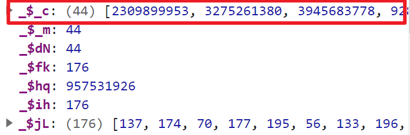

	首先需要知道的是最终的cookie是由一个176位的数字数组经过一个函数加密成为一个字符数组，并最终通过join函数获取到的。可以直接看`C:\Users\TRS\Desktop\spider\甘肃省财政厅\finally\key_encode.js`文件中的`_$lu`函数的解析

​	其次是这个176位的数字数组是怎么来的。现在可以确定的他的前身是一个5位数组，形状大概是[Array(16),0,242,242,15]，下面是对上面这个数组是怎么变成176那个数组的跟踪，不一定全对仅做记录。

```js
// 这个函数最终数组返回的值就是一个176个元素的数组，其中传入的_$_c是一个44位的大数字数组
// 如果后续还想找到这个函数可以使用正则表达式：“>>> \S* &”，并且找到与这个函数最相似的即可，注意这个函数较为简单，但同时又不是最简单的那个
function _$iV(_$_c) {
        var _$dN, _$_m, _$fk, _$ih, _$hq, _$jL;
        _$dN = _$_c[_$kA[39]],
        _$_m = 0,
        _$fk = 0,
        _$ih = _$_c[_$kA[39]] * _$ku[21],
        _$jL = new _$ca(_$ih);
        while (_$_m < _$dN)
            _$hq = _$_c[_$_m++],
            _$jL[_$fk++] = (_$hq >>> _$ku[39]) & _$ku[30],
            _$jL[_$fk++] = (_$hq >>> _$ku[27]) & _$ku[30],
            _$jL[_$fk++] = (_$hq >>> _$ku[12]) & _$ku[30],
            _$jL[_$fk++] = _$hq & _$ku[30];
        return _$jL;
    }

// 同时需要注意：在在这里打断点的时候，可以打到return _$jL;上，并且要打条件断点：
// _$jL.length==176
// 要不然还是会有很多问题
```



然后便是处理上面这个函数传入的\_$\_c到底是怎么来的了。


这里就是生成`_$_c`的函数了，下面这个函数中的`_$ip`就是上面函数的`_$_c`，

```javascript
// 用于生成下面函数的那4个大数，其中_$kH为固定值=4294967295，而_$iE()本质上就是一个random函数，_$kn[_$bE[44]]则是js函数中的floor函数，作用是：返回小于等于x的最大整数:
// Math.floor(1.6)=1
function _$dF(_$kH) {
        return _$kn[_$bE[44]](_$iE() * _$kH);
    }
//用于生成最开始的那4个大数用的，他们统一调用的都是上面的_$dF函数，传入的_$n$[45]是一个固定值，而值就是key_encode.js`文件中的_$kX的45的值=4294967295
	function _$i7() {
        return [_$dF(_$n$[45]), _$dF(_$n$[45]), _$dF(_$n$[45]), _$dF(_$n$[45])];
    }
    function _$_x(_$kH, _$a$) {
        var _$aO, _$kM, _$gM, _$$n, _$ip;
        _$aO = _$iL(),
        _$kM = _$aO[0],
        _$gM = _$aO[1],
        !_$kM[0][0] && !_$kM[0][1] ? _$ai(_$a$, _$kM, _$gM) : 0,
        _$$n = _$lr(_$kH, _$kM, _$gM);
        function _$lv(_$kH, _$a$) {
            var _$aO, _$lv, _$fb, _$ip, _$_b, _$dP, _$_p, _$_X;
            _$aO = _$kn[_$bE[44]](_$kH[_$bE[39]] / _$n$[27]) + 1,
            _$ip = [],
            _$_b = _$n$[27] - (_$kH[_$bE[39]] % _$n$[27]),
// 这里是对_$ip第一次赋值，赋值使用的是上面的_$i7函数，这个函数最后会返回4个大数，也就是通过这一步_$ip中已经包含了4个初始的大数了。后面会通过一个for循环，再往这个数组中推入40个大数。
            _$a$ ? _$ip = _$dP = _$i7() : 0,
            _$_X = _$kH[_$bE[40]](0),
            _$_p = _$kH[_$bE[39]] + _$_b;
// 这个循环的本质就是将一个145位的普通数组中填满，填成一个160为的数组，而后添的15个数的值都是15，至于这个15怎么来的，是这里来的：_$_b = _$n$[27] - (_$kH[_$bE[39]] % _$n$[27])
            for (_$lv = _$kH[_$bE[39]]; _$lv < _$_p; )
                _$_X[_$lv++] = _$_b;
// 这里生成的_$_X在下面的推入过程中有用到，其本身就是一个有着40大数元素的数组，其生成方法见下面
            _$_X = _$fG(_$_X);
            for (_$lv = 0; _$lv < _$aO; ) {
// 这里的_$n$就是key_encode.js`文件中的_$kX。
                _$_p = _$_X[_$bE[40]](_$lv << _$n$[41], (++_$lv) << _$n$[41]),
                _$_p = _$dP ? _$bj(_$_p, _$dP) : _$_p,
                _$dP = _$lj(_$$n, _$_p, 0, _$kM);
                for (_$fb = 0; _$fb < _$dP[_$bE[39]]; _$fb++)
// 这里就是上面说的推入40个大数的地方，是一个for循环嵌套，其中第一个for循环的_$aO值为10
                    _$ip[_$bE[57]](_$dP[_$fb]);
            }
            return _$lN(_$ip);
        }
        
        
// 再说一下这里怎么检索，以及如何打断点：
// 检索直接搜索：“[45]),” 就会直接导到_$i7()函数，其中_$dF()函数的检索方法：正则表达式：”\[44]]\(.*\*.*\);“检索后找到有传入参数的那个函数就是dF函数了
// 打断点的方式：找到函数中的_$a$，并且在函数任意一个位置【因为_$a$是传入的参数，值在函数中不会改变】，打一个条件断点，条件是：“_$a$”，即当这个值为true时就是我们要的点了。
```

然后就是上面说到的`_$_X`生成40个大数数组的方法：

```js
// 这里传入的参数就是上面使用15填满160位的那个数组
function _$j2(_$_Y) {
        var _$a8, _$c8, _$mR, _$fn, _$ny;
        _$a8 = _$_Y[_$bd[39]] / _$h$[21],
        _$c8 = 0,
        _$mR = 0,
        _$fn = _$_Y[_$bd[39]],
        _$ny = new _$lE(_$a8);
        while (_$c8 < _$fn)
            _$ny[_$mR++] = ((_$_Y[_$c8++] << _$h$[39]) | (_$_Y[_$c8++] << _$h$[27]) | (_$_Y[_$c8++] << _$h$[12]) | (_$_Y[_$c8++]));
        return _$ny;
    }
```

然后便是145位的那个数组怎么来的了，以及查看下面那个函数可以发现，他传入的那个用于判断的值是写死true的，也就是说这个函数是唯一的，内部没有分支的好处就是在打断点的时候可以直接打到这个函数上，因为只要进入了这个函数，那证明就一定是最终的分支了。

```js
function _$iw(_$aY, _$_k, _$jb) {
        var _$ff;
        typeof _$aY === _$mu[17] ? _$aY = _$$E(_$aY) : 0,
        _$ff = _$mf(_$_k, _$jb);
   // 注意这里的_$ff._$ny()函数就是上面的_$_x函数，同时可以看到_$_x中的_$a$值是在这里写死的，所以以后打断点可以直接打到这个函数中就行。而_$aY就是这个145位的数组。
        return _$ff._$ny(_$aY, true);
}

//说一下检索方法：使用正则表达式：“return .*\..*, true\);”，然后选择检索到的两个中的那个有typeof的那个即可。

```

