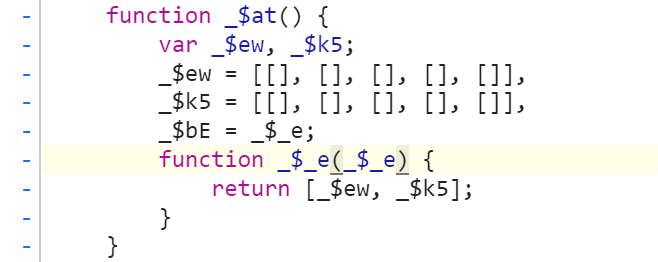

	首先需要知道的是最终的cookie是由一个176位的数字数组经过一个函数加密成为一个字符数组，并最终通过join函数获取到的。可以直接看`C:\Users\TRS\Desktop\spider\甘肃省财政厅\finally\key_encode.js`文件中的`_$lu`函数的解析

​	其次是这个176位的数字数组是怎么来的。现在可以确定的他的前身是一个5位数组，形状大概是[Array(16),0,242,242,15]，下面是对上面这个数组是怎么变成176那个数组的跟踪，不一定全对仅做记录。

#### 两用函数

```js
// 这个函数最终数组返回的值就是一个176个元素的数组，其中传入的_$_c是一个44位的大数字数组
// 如果后续还想找到这个函数可以使用正则表达式：“>>> \S* &”，并且找到与这个函数最相似的即可，注意这个函数较为简单，但同时又不是最简单的那个
function _$iV(_$_c) {
        var _$dN, _$_m, _$fk, _$ih, _$hq, _$jL;
        _$dN = _$_c[_$kA[39]],
        _$_m = 0,
        _$fk = 0,
        _$ih = _$_c[_$kA[39]] * _$ku[21],
        _$jL = new _$ca(_$ih);
        while (_$_m < _$dN)
            _$hq = _$_c[_$_m++],
            _$jL[_$fk++] = (_$hq >>> _$ku[39]) & _$ku[30],
            _$jL[_$fk++] = (_$hq >>> _$ku[27]) & _$ku[30],
            _$jL[_$fk++] = (_$hq >>> _$ku[12]) & _$ku[30],
            _$jL[_$fk++] = _$hq & _$ku[30];
        return _$jL;
    }

// 同时需要注意：在在这里打断点的时候，可以打到return _$jL;上，并且要打条件断点：
// _$jL.length==176
// 要不然还是会有很多问题
```


然后便是处理上面这个函数传入的\_$\_c到底是怎么来的了。


这里就是生成`_$_c`的函数了，下面这个函数中的`_$ip`就是上面函数的`_$_c`，

```javascript
// 用于生成下面函数的那4个大数，其中_$kH为固定值=4294967295，而_$iE()本质上就是一个random函数，_$kn[_$bE[44]]则是js函数中的floor函数，作用是：返回小于等于x的最大整数:
// Math.floor(1.6)=1
function _$dF(_$kH) {
        return _$kn[_$bE[44]](_$iE() * _$kH);
    }
//用于生成最开始的那4个大数用的，他们统一调用的都是上面的_$dF函数，传入的_$n$[45]是一个固定值，而值就是key_encode.js`文件中的_$kX的45的值=4294967295
	function _$i7() {
        return [_$dF(_$n$[45]), _$dF(_$n$[45]), _$dF(_$n$[45]), _$dF(_$n$[45])];
    }
    function _$_x(_$kH, _$a$) {
        var _$aO, _$kM, _$gM, _$$n, _$ip;
        _$aO = _$iL(),
        _$kM = _$aO[0],
        _$gM = _$aO[1],
        !_$kM[0][0] && !_$kM[0][1] ? _$ai(_$a$, _$kM, _$gM) : 0,
        _$$n = _$lr(_$kH, _$kM, _$gM);
        function _$lv(_$kH, _$a$) {
            var _$aO, _$lv, _$fb, _$ip, _$_b, _$dP, _$_p, _$_X;
            _$aO = _$kn[_$bE[44]](_$kH[_$bE[39]] / _$n$[27]) + 1,
            _$ip = [],
            _$_b = _$n$[27] - (_$kH[_$bE[39]] % _$n$[27]),
// 这里是对_$ip第一次赋值，赋值使用的是上面的_$i7函数，这个函数最后会返回4个大数，也就是通过这一步_$ip中已经包含了4个初始的大数了。后面会通过一个for循环，再往这个数组中推入40个大数。
            _$a$ ? _$ip = _$dP = _$i7() : 0,
            _$_X = _$kH[_$bE[40]](0),
            _$_p = _$kH[_$bE[39]] + _$_b;
// 这个循环的本质就是将一个145位的普通数组中填满，填成一个160为的数组，而后添的15个数的值都是15，至于这个15怎么来的，是这里来的：_$_b = _$n$[27] - (_$kH[_$bE[39]] % _$n$[27])
            for (_$lv = _$kH[_$bE[39]]; _$lv < _$_p; )
                _$_X[_$lv++] = _$_b;
// 这里生成的_$_X在下面的推入过程中有用到，其本身就是一个有着40大数元素的数组，其生成方法见下面
            _$_X = _$fG(_$_X);
            for (_$lv = 0; _$lv < _$aO; ) {
// 这里的_$n$就是key_encode.js`文件中的_$kX。
                _$_p = _$_X[_$bE[40]](_$lv << _$n$[41], (++_$lv) << _$n$[41]),
                _$_p = _$dP ? _$bj(_$_p, _$dP) : _$_p,
                _$dP = _$lj(_$$n, _$_p, 0, _$kM);
                for (_$fb = 0; _$fb < _$dP[_$bE[39]]; _$fb++)
// 这里就是上面说的推入40个大数的地方，是一个for循环嵌套，其中第一个for循环的_$aO值为10
                    _$ip[_$bE[57]](_$dP[_$fb]);
            }
            return _$lN(_$ip);
        }
        
        
// 再说一下这里怎么检索，以及如何打断点：
// 检索直接搜索：“[45]),” 就会直接导到_$i7()函数，其中_$dF()函数的检索方法：正则表达式：”\[44]]\(.*\*.*\);“检索后找到有传入参数的那个函数就是dF函数了
// 打断点的方式：找到函数中的_$a$，并且在函数任意一个位置【因为_$a$是传入的参数，值在函数中不会改变】，打一个条件断点，条件是：“_$a$”，即当这个值为true时就是我们要的点了。
```

然后就是上面说到的`_$_X`生成40个大数数组的方法：

```js
// 这里传入的参数就是上面使用15填满160位的那个数组
function _$j2(_$_Y) {
        var _$a8, _$c8, _$mR, _$fn, _$ny;
        _$a8 = _$_Y[_$bd[39]] / _$h$[21],
        _$c8 = 0,
        _$mR = 0,
        _$fn = _$_Y[_$bd[39]],
        _$ny = new _$lE(_$a8);
        while (_$c8 < _$fn)
            _$ny[_$mR++] = ((_$_Y[_$c8++] << _$h$[39]) | (_$_Y[_$c8++] << _$h$[27]) | (_$_Y[_$c8++] << _$h$[12]) | (_$_Y[_$c8++]));
        return _$ny;
    }
```

然后便是145位的那个数组怎么来的了，以及查看下面那个函数可以发现，他传入的那个用于判断的值是写死true的，也就是说这个函数是唯一的，内部没有分支的好处就是在打断点的时候可以直接打到这个函数上，因为只要进入了这个函数，那证明就一定是最终的分支了。

```js
function _$iw(_$aY, _$_k, _$jb) {
        var _$ff;
        typeof _$aY === _$mu[17] ? _$aY = _$$E(_$aY) : 0,
        _$ff = _$mf(_$_k, _$jb);
   // 注意这里的_$ff._$ny()函数就是上面的_$_x函数，同时可以看到_$_x中的_$a$值是在这里写死的，所以以后打断点可以直接打到这个函数中就行。而_$aY就是这个145位的数组。
        return _$ff._$ny(_$aY, true);
}

//说一下检索方法：使用正则表达式：“return .*\..*, true\);”，然后选择检索到的两个中的那个有typeof的那个即可。

```


下面这个函数就是用来生成最终145数组的那个方法，其传入的参数分别是一个4位的数组，和一个141位的数组，然后函数的主要功能就是将传入的第二个数组推入第一个数组中，最终形成一个145位的数组。

```js
// 在最终拼成145数组的时候，是 _$_j+_$aR，也就是4位数组在前，141数组在后。
function _$kr(_$_j, _$aR) {
        var _$bB, _$bl;
        for (_$bB = 0; _$bB < _$aR[_$hW[39]]; _$bB++)
            _$bl = _$aR[_$bB],
            typeof _$bl !== _$hW[23] || _$bl < 0 ? _$bl = 0 : _$bl > _$d_[30] ? _$bl = _$d_[30] : 0,
            _$_j[_$hW[57]](_$aR[_$bB]);
    }


// 检索方法：正则表达式：“typeof .* !== .* |\| .*\? .* = 0 : .* > .*\[30\] \? .* = .*\[30\] : 0,”
// 利用上面表达式检索，之后选择第六个，也可以找一下与上面这个函数最相似的那个函数就行。
```


下面这两个函数就是上面那个141数组的来源。

```js
// 首先是这第一个函数，这个函数是一个新函数
// 该函数传入的两个参数分别是一个44位和一个96位的数组，而整体逻辑就是根据传入的96位数组的长度向44位数组中添加一个数字，这个数字应该是固定的，因为下面判断都是通过传入的96位数组的长度来进行的，而96本身又是固定的，所以走的逻辑分支一定，同时往里面加的数字，也是从之前那个208位的数组中取得的固定值。具体取得多少这里暂时不表，其实只要将下面的代码展开，然后看一下96走的哪个分支就行了。由于传入的两个参数由于是更高一级函数中的变量，所以其中的值会直接被改变，所以经过这个函数之后_$ld就变成了一个45个数字的数组，_$bs依旧是一个96位的数组
function _$kw(_$ld, _$bs) {
        typeof _$bs !== _$mE[23] || _$bs < 0 ? _$bs = 0 : _$bs > _$_V[45] ? _$bs = _$_V[45] : 0,
        _$bs <= _$_V[44] ? _$ld[_$mE[57]](_$bs) : _$bs <= _$_V[78] ? (_$ld[_$mE[57]](((_$bs >> _$_V[12]) & _$_V[30]) | _$_V[8]),
        _$ld[_$mE[57]](_$bs & _$_V[30])) : _$bs <= _$_V[68] ? (_$ld[_$mE[57]](((_$bs >> _$_V[27]) & _$_V[30]) | _$_V[25]),
        _$ld[_$mE[57]]((_$bs >> _$_V[12]) & _$_V[30]),
        _$ld[_$mE[57]](_$bs & _$_V[30])) : _$bs <= _$_V[82] ? (_$ld[_$mE[57]](((_$bs >> _$_V[39]) & _$_V[30]) | _$_V[24]),
        _$ld[_$mE[57]]((_$bs >> _$_V[27]) & _$_V[30]),
        _$ld[_$mE[57]]((_$bs >> _$_V[12]) & _$_V[30]),
        _$ld[_$mE[57]](_$bs & _$_V[30])) : (_$ld[_$mE[57]](_$_V[4]),
        _$ld[_$mE[57]]((_$bs >> _$_V[39]) & _$_V[30]),
        _$ld[_$mE[57]]((_$bs >> _$_V[27]) & _$_V[30]),
        _$ld[_$mE[57]]((_$bs >> _$_V[12]) & _$_V[30]),
        _$ld[_$mE[57]](_$bs & _$_V[30]));
    }

// 其次是这个旧函数，这个函数也是上面把141和4这俩数组拼接到一起的那个数组：所以这里本质上还是将上面生成的45位的数组_$ld和96位的数组_$bs进行了一个拼接。从而形成了141位的数组。
    function _$ms(_$ld, _$bs) {
        var _$_S, _$m1;
        for (_$_S = 0; _$_S < _$bs[_$mE[39]]; _$_S++)
            _$m1 = _$bs[_$_S],
            typeof _$m1 !== _$mE[23] || _$m1 < 0 ? _$m1 = 0 : _$m1 > _$_V[30] ? _$m1 = _$_V[30] : 0,
            _$ld[_$mE[57]](_$bs[_$_S]);
    }


// 但是这里需要注意一下：最终的那个141位的数组值是45+96，也就是说_$ld在前，_$bs在后
```


现在需要找的就是44这个数组和96数组怎么生成的，现在知道44数组，是由一个11的数组和一个32的数组拼接而成，在二者拼接的中间添加了一个32，整体流程应该与上面的两次拼接类似，同时需要注意的是上面在拼接成141的时候_$kw函数中不是把44位变成了45位嘛，此时中间添加的那一位数就是96，因为同样的在11和32拼接时中间添加的那个数字是32。

然后接着上面的说，32现在可以确定是一个超级大的数组中的一部分，暂时还不知道是怎么获取到的，而11这个数组则是通过以下代码一步步生成出来的

```js
// 该代码的作用是将传进来的时间戳_$gC和空数组_$aC进行计算，以得到一个数组，这个数组在后续会逐渐从4位扩展到11位的数组，扩展的流程为：
// 1.前8位都是通过下面这个函数计算得到，分别取两次时间戳，然后算出四个值，最终拼起来，其中_$fc为208位的固定数组
// 2.有了前8位之后，直接在后面拼接一个0
// 3.有了前9位之后，会有一个固定的2，然后利用上面说到的那个逻辑在2后面拼接一个9【与11+32时拼接32,44+96时拼接96同理】，而由于后面这个9位的数组本身长度是固定的，同时2也是固定的，所以在写的时候可以直接通过下面这个函数获取两个不同时间戳生成出来的4位数组，并拼接成8位数组之后，后拼0，前拼29即可。
function _$jO(_$aC, _$gC) {
        typeof _$gC !== _$m_[23] ? _$gC = 0 : 0,
        _$aC[_$m_[57]]((_$gC >> _$fc[39]) & _$fc[30]),
        _$aC[_$m_[57]]((_$gC >> _$fc[27]) & _$fc[30]),
        _$aC[_$m_[57]]((_$gC >> _$fc[12]) & _$fc[30]),
        _$aC[_$m_[57]](_$gC & _$fc[30]);
    }
```


接着上面的说，32位的数组是通过一个3000多位的大数组中切出来的，先大概猜测是固定切值为[11:43]，然后剩下的事情就是这个大数组是如何生成的了。


这里接着说，上面不是说要求那个3000+的大数组嘛，然后通过检索可以发现这个大数组是由另一个与这个大数组相同位数的大数组通过一个函数转化而来的，而那个函数就是最大的那个while(1)循环【这里由于那个while(1)循环太大了，所以没跟下去回头再说】，在检索的时候可以检索$_ts.aebi所对应的那个形参，如：这次生成的函数这个形参的名字是`_$js`，那么此时我们要想找到那个while循环只需要检索`_$js[1]`下面那个大循环就是了。


然后接着上面的说，至于那个转换前的3000+的大数组又是怎么来的呢，这个大数组就又是由一个更大一些的大数组切片得到的，具体流程可以看下面的截图。

**生成32位数组的那个3000+大数组【简称大数组1】**


这里可以看到选中的部分就是32位数组，由于这个数组3000+所以就没截全，但是可以通过图二的array(3750)，知道这个大数组的长度，这个长度是会变化的，并不是固定的3750。

**生成大数组1的3000+大数组【简称大数组2】**


注意，此时这个3000+的大数组虽然与上面大数组1中包含的元素不同，但是他们中包含的元素的数量还是相同的，都是3750。

**生成大数组2的3000+大数组【简称大数组3】**


这个大数组3就是生成大数组2的那个最终的数组了，大数组2是在大数组3的基础上进行切片得到的，图二中选中的就是大数组2的部分，可以看到这个大数组3的长度是要高于大数组1和大数组2的。


这里说一下后续的发现，虽说大数组3包含了大数组2的大部分，但是大数组2的后续有一部分还是没有在大数组3中的，但是感觉我们只需要那32位数组的话，好像也不需要管后面的部分。


**大数组3的生成**

最后便是大数组3的生成了，终于到这步了，而这个大数组是由$_ts.aebi中的cd那个字符串经过下面这个函数生成的。


```js
// 这个函数用于生成下面那个函数中用到的6个关键数组，这里用到的数组就都是常用数组了，_$$g是208数组，_$hT是函数中新命名的【不要与下面的那个_$hT搞混】，_$bO是上图中的86位字符数组，之前在加密中也遇到过，应该是固定的，_$m_就是96位用来存储所有运算函数的数组，_$_h就是chatAt函数。所以_$b$ = _$_h[_$m_[26]](_$bO[_$hT], 0)的意思就是：_$b$=_$bO[_$hT].chartAt(0)，说白了取86位字符数组对应的数字。
function _$bj() {
        var _$hT, _$b$;
        for (_$hT = 0; _$hT <= _$$g[30]; _$hT++)
            _$$$[_$hT] = _$$g[47];
        for (_$hT = 0; _$hT < _$bO[_$m_[39]]; _$hT++)
            _$b$ = _$_h[_$m_[26]](_$bO[_$hT], 0),
            _$g0[_$b$] = _$hT << _$$g[41],
            _$g1[_$b$] = _$hT >> _$$g[21],
            _$$A[_$b$] = (_$hT & _$$g[26]) << _$$g[21],
            _$jt[_$b$] = _$hT >> _$$g[41],
            _$cq[_$b$] = (_$hT & _$$g[0]) << _$$g[52],
            _$$$[_$b$] = _$hT;
    }
// 输入的参数就是上面那个图里的cd，最终输出值会是一个3000+的大数组，也就是大数组3，其中_$$g就是那个208位数字的数组，_$m_就是96位用来存储所有运算函数的数组。而在for循环中的_$g0、_$g1、_$$A、_$jt、_$cq、_$$$，这6个关键的数组，则是由上面_$bj函数生成的。_$_h是chartAt函数。
function _$aa(_$hT) {
        var _$b$, _$dH, _$a3, _$av, _$eX, _$a6, _$$F, _$$h, _$$r;
        if (!_$hT || typeof (_$hT) != _$m_[17])
            return [];
        _$b$ = _$hT[_$m_[39]],
        _$dH = new _$nr(_$dq[_$m_[44]](_$b$ * _$$g[0] / _$$g[21])),
        _$$F = 0,
        _$$h = 0,
        _$$r = _$b$ - _$$g[0];
        for (_$$F = 0; _$$F < _$$r; )
            _$a3 = _$_h[_$m_[26]](_$hT, _$$F++),
            _$av = _$_h[_$m_[26]](_$hT, _$$F++),
            _$eX = _$_h[_$m_[26]](_$hT, _$$F++),
            _$a6 = _$_h[_$m_[26]](_$hT, _$$F++),
            _$dH[_$$h++] = _$g0[_$a3] | _$g1[_$av],
            _$dH[_$$h++] = _$$A[_$av] | _$jt[_$eX],
            _$dH[_$$h++] = _$cq[_$eX] | _$$$[_$a6];
        _$$F < _$b$ ? (_$a3 = _$_h[_$m_[26]](_$hT, _$$F++),
        _$av = _$_h[_$m_[26]](_$hT, _$$F++),
        _$dH[_$$h++] = _$g0[_$a3] | _$g1[_$av],
        _$$F < _$b$ ? (_$eX = _$_h[_$m_[26]](_$hT, _$$F),
        _$dH[_$$h++] = _$$A[_$av] | _$jt[_$eX]) : 0) : 0;
        return _$dH;
    }
```


再就是96位数字数组的生成，这个数组最终追踪到的函数是上面用来生成176位数组的那个[函数](#两用函数)，如果要生成的是96位的数组的时候，传入的参数就是一个24位的数组，所以检索条件不变的情况下，打断点的方式变成了：`_$ih==96`

然后这里对上面那个函数做一个大的补充：

```js
// 整体还是那个函数没有问题，问题是之前漏了很多小的函数，可以与上面的那个函数对应着看
function _$gR(_$_N, _$_x) {
        var _$mr, _$iA, _$by, _$gp, _$lL;
        _$mr = _$eF(),
        _$iA = _$mr[0],
        _$by = _$mr[1],
        !_$iA[0][0] && !_$iA[0][1] ? _$lD(_$_x, _$iA, _$by) : 0,
        _$gp = _$cU(_$_N, _$iA, _$by);
        function _$jN(_$_N, _$_x) {
            var _$mr, _$jN, _$gH, _$lL, _$_Z, _$jX, _$$$, _$ht;
            _$mr = _$aX[_$iQ[44]](_$_N[_$iQ[39]] / _$gm[27]) + 1,
            _$lL = [],
            _$_Z = _$gm[27] - (_$_N[_$iQ[39]] % _$gm[27]),
            _$_x ? _$lL = _$jX = _$m4() : 0,
            _$ht = _$_N[_$iQ[40]](0),
            _$$$ = _$_N[_$iQ[39]] + _$_Z;
            for (_$jN = _$_N[_$iQ[39]]; _$jN < _$$$; )
                _$ht[_$jN++] = _$_Z;
            _$ht = _$cM(_$ht);
            for (_$jN = 0; _$jN < _$mr; ) {
                _$$$ = _$ht[_$iQ[40]](_$jN << _$gm[41], (++_$jN) << _$gm[41]),
// 首先是这里的_$le函数，这个函数补充在了下面的补充函数1
                _$$$ = _$jX ? _$le(_$$$, _$jX) : _$$$,
// 然后是这里的_$io函数，这里函数补充在了下面的补充函数2
                _$jX = _$io(_$gp, _$$$, 0, _$iA);
                for (_$gH = 0; _$gH < _$jX[_$iQ[39]]; _$gH++)
                    _$lL[_$iQ[57]](_$jX[_$gH]);
            }
            return _$a1(_$lL);
        }
        
// 补充函数1，这里传入的两个参数分别是上次for循环得到的4个值，与这次for循环得到的4个值。
function _$le(_$_N, _$_x) {
        return [(_$_N[0] ^ _$_x[0]), (_$_N[1] ^ _$_x[1]), (_$_N[2] ^ _$_x[2]), (_$_N[3] ^ _$_x[3])];
    }
    
// 补充函数2，这个函数传入的参数分别是两个44位的大数数组，上面for循环算出来的一个4位数组，以及5个256位的大数数组。暂时还不知道这个256的大数数组怎么来的，在函数内部看是直接调用了_$eF()方法直接得到的，但_$eF()函数本身就是一个直接返回，见下图，不知道他这两个值怎么来的。而那两个44位的大数数组也是通过另一个5个256大数数组作为参数调用下面这个方法来的。
function _$io(_$_N, _$_x, _$mr, _$jN) {
        var _$gH, _$lL, _$_Z, _$jX, _$$$, _$ht, _$h5, _$gX, _$db, _$c9, _$fB, _$gn, _$d5, _$bP, _$jz, _$m3, _$iW;
        _$gH = _$_N[_$mr],
        _$lL = _$_x[0] ^ _$gH[0],
        _$_Z = _$_x[_$mr ? _$gm[0] : 1] ^ _$gH[1],
        _$jX = _$_x[2] ^ _$gH[2],
        _$$$ = _$_x[_$mr ? 1 : _$gm[0]] ^ _$gH[3],
        _$db = _$gH[_$iQ[39]] / _$gm[21] - _$gm[41],
        _$fB = _$gm[21],
        _$gn = [0, 0, 0, 0],
        _$d5 = _$jN[0],
        _$bP = _$jN[1],
        _$jz = _$jN[2],
        _$m3 = _$jN[3],
        _$iW = _$jN[4];
        for (_$c9 = 0; _$c9 < _$db; _$c9++)
            _$ht = _$d5[_$lL >>> _$gm[39]] ^ _$bP[_$_Z >> _$gm[27] & _$gm[30]] ^ _$jz[_$jX >> _$gm[12] & _$gm[30]] ^ _$m3[_$$$ & _$gm[30]] ^ _$gH[_$fB],
            _$h5 = _$d5[_$_Z >>> _$gm[39]] ^ _$bP[_$jX >> _$gm[27] & _$gm[30]] ^ _$jz[_$$$ >> _$gm[12] & _$gm[30]] ^ _$m3[_$lL & _$gm[30]] ^ _$gH[_$fB + 1],
            _$gX = _$d5[_$jX >>> _$gm[39]] ^ _$bP[_$$$ >> _$gm[27] & _$gm[30]] ^ _$jz[_$lL >> _$gm[12] & _$gm[30]] ^ _$m3[_$_Z & _$gm[30]] ^ _$gH[_$fB + _$gm[41]],
            _$$$ = _$d5[_$$$ >>> _$gm[39]] ^ _$bP[_$lL >> _$gm[27] & _$gm[30]] ^ _$jz[_$_Z >> _$gm[12] & _$gm[30]] ^ _$m3[_$jX & _$gm[30]] ^ _$gH[_$fB + _$gm[0]],
            _$fB += _$gm[21],
            _$lL = _$ht,
            _$_Z = _$h5,
            _$jX = _$gX;
        for (_$c9 = 0; _$c9 < _$gm[21]; _$c9++)
            _$gn[_$mr ? _$gm[0] & -_$c9 : _$c9] = _$iW[_$lL >>> _$gm[39]] << _$gm[39] ^ _$iW[_$_Z >> _$gm[27] & _$gm[30]] << _$gm[27] ^ _$iW[_$jX >> _$gm[12] & _$gm[30]] << _$gm[12] ^ _$iW[_$$$ & _$gm[30]] ^ _$gH[_$fB++],
            _$ht = _$lL,
            _$lL = _$_Z,
            _$_Z = _$jX,
            _$jX = _$$$,
            _$$$ = _$ht;
        return _$gn;
    }
```



然后就是找上面说的那2组5个256个元素的数组。

这里找到那2组5个256元素的数组哪来的【这个数组是固定的】：

```js
// 这个函数就是上面以及上面那个两用函数，但是这里有一个最关键的点我一直忽略了，导致我在这里浪费了3个小时，其中_$kA()函数就是一个初始化函数，在这个函数里就是直接返回2组5个的空数组，详情见下图1，而后他会使用_$bh，_$ci分别取值，然后取值之后他发现是空的，所以使用了!_$bh[0][0] && !_$bh[0][1] ? _$nz(_$eR, _$bh, _$ci) : 0,这一句，这一句一直都是我忽视的一句，这句就是在_$bh和_$ci为空时对这两个数组进行复制，而赋值函数则是下面的补充函数1
function _$$e(_$hl, _$eR) {
        var _$_Z, _$bh, _$ci, _$$F, _$if;
        _$_Z = _$kA(),
        _$bh = _$_Z[0],
        _$ci = _$_Z[1],
        !_$bh[0][0] && !_$bh[0][1] ? _$nz(_$eR, _$bh, _$ci) : 0,
        _$$F = _$gl(_$hl, _$bh, _$ci);
        function _$e9(_$hl, _$eR) {
            var _$_Z, _$e9, _$a1, _$if, _$kH, _$aB, _$$z, _$cN;
            _$_Z = _$fG[_$kM[44]](_$hl[_$kM[39]] / _$jy[27]) + 1,
            _$if = [],
            _$kH = _$jy[27] - (_$hl[_$kM[39]] % _$jy[27]),
            _$eR ? _$if = _$aB = _$kh() : 0,
            _$cN = _$hl[_$kM[40]](0),
            _$$z = _$hl[_$kM[39]] + _$kH;
            for (_$e9 = _$hl[_$kM[39]]; _$e9 < _$$z; )
                _$cN[_$e9++] = _$kH;
            _$cN = _$$k(_$cN);
            for (_$e9 = 0; _$e9 < _$_Z; ) {
                _$$z = _$cN[_$kM[40]](_$e9 << _$jy[41], (++_$e9) << _$jy[41]),
                _$$z = _$aB ? _$j8(_$$z, _$aB) : _$$z,
                _$aB = _$nM(_$$F, _$$z, 0, _$bh);
                for (_$a1 = 0; _$a1 < _$aB[_$kM[39]]; _$a1++)
                    _$if[_$kM[57]](_$aB[_$a1]);
            }
            return _$hf(_$if);
        }
    
    
// 补充函数1：该函数主要就是利用208位数字数组进行一顿运算之后就可以得到那两组数组了，没有其他的多余函数或是变量。
    function _$nz(_$hl, _$eR, _$_Z) {
        var _$e9, _$a1, _$if, _$kH, _$aB, _$$z, _$cN, _$an, _$_P, _$b$, _$fe, _$mD, _$m3;
        _$e9 = _$eR[4],
        _$a1 = _$_Z[4],
        _$$z = [],
        _$cN = [];
        for (_$if = 0; _$if < _$jy[58]; _$if++)
            _$cN[(_$$z[_$if] = _$if << 1 ^ (_$if >> _$jy[7]) * _$jy[100]) ^ _$if] = _$if;
        for (_$kH = _$aB = 0; !_$e9[_$kH]; _$kH ^= _$an || 1,
        _$aB = _$cN[_$aB] || 1)
            _$fe = _$aB ^ _$aB << 1 ^ _$aB << _$jy[41] ^ _$aB << _$jy[0] ^ _$aB << _$jy[21],
            _$fe = _$fe >> _$jy[12] ^ _$fe & _$jy[30] ^ _$jy[173],
            _$e9[_$kH] = _$fe,
            _$a1[_$fe] = _$kH,
            _$an = _$$z[_$kH];
        for (_$if = 0; _$if < _$jy[58]; _$if++)
            _$a1[_$e9[_$if]] = _$if;
        for (_$kH = 0; _$kH < _$jy[58]; _$kH++) {
            _$fe = _$e9[_$kH],
            _$b$ = _$$z[_$_P = _$$z[_$an = _$$z[_$kH]]],
            _$m3 = _$b$ * _$jy[128] ^ _$_P * _$jy[91] ^ _$an * _$jy[93] ^ _$kH * _$jy[70],
            _$mD = _$$z[_$fe] * _$jy[93] ^ _$fe * _$jy[70];
            for (_$if = 0; _$if < _$jy[21]; _$if++)
                _$eR[_$if][_$kH] = _$mD = _$mD << _$jy[39] ^ _$mD >>> _$jy[12],
                _$_Z[_$if][_$fe] = _$m3 = _$m3 << _$jy[39] ^ _$m3 >>> _$jy[12];
        }
        for (_$if = 0; _$if < _$jy[19]; _$if++)
            _$eR[_$if] = _$eR[_$if][_$kM[40]](0),
            _$_Z[_$if] = _$_Z[_$if][_$kM[40]](0);
    }
```

图1


然后就是传入的那个94位的数组是怎么来的。

