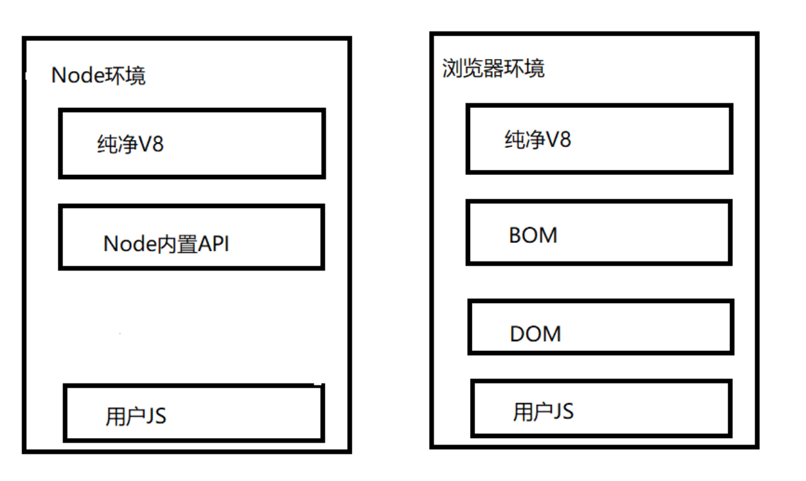

# JS逆向

[TOC]

## JS相关概念

### 浏览器环境

​	一般在做js逆向的时候肯定或多或少都听说过“补环境”，那么这个环境到底指的是什么？

​	这里一般将环境分为两个大种类，一种是浏览器环境，另一种是Node环境。二者有部分交集，也有一些差异。而一般我们时长说的“补环境”，就是将Node环境中相较于浏览器环境中缺少的那部分补全，以使JS代码可以正确的运行。

​	具体DOM和BOM基本操作的思维导图可以看[附录](#附录-2)的[BOM](#BOM)和[DOM](#DOM)

**浏览器环境**

1. ECMAScript：描述了JS的语法和基本对象。在绝大数情况下可以等同于V8。二者只有在少数的边缘情况下有一定的区别。
2. BOM（浏览器对象）：与浏览器交互的方法和对象，像常用的window就是BOM的核心，window不仅担当了js访问浏览器窗口的一个接口，还是一个全局对象，所以这也就是[这里](#log断点的使用)定义window对象的原因，方便管理。
3. DOM(文档对象模型)：处理网页内容的方法和接，也可以理解为，你所有浏览的**网页**本质上都是一个大对象，这个大对象就是DOM。你所有对**网页【注意：这里不包括对浏览器的操作】**的操作都是对DOM的操作。
4. 用户的JS脚本

**Node环境**

1. ECMAScript：描述了JS的语法和基本对象。在绝大数情况下可以等同于V8。二者只有在少数的边缘情况下有一定的区别。
2. Node内置API
3. 用户的JS脚本



​	通过上面的介绍和图片不难发现补环境本身就是补充Node环境下没有的DOM和BOM对象中的一些属性或子对象。

### 原型和原型链

#### 原型【这里说的其实还是有一些问题的，具体可以看下面的[补充](#重要补充)】

​	在说原型之前首先要明确一件事：在JS中所有的对象【函数也算对象】都会有原型，而在JS原型特指prototype或\_\_proto\_\_，其含义有一点像模板，其中\_\_proto\_\_被称为**隐式原型**，这个\_\_proto\_\_属性指向的是这个对象的构造函数的**prototype**，被称为**显式原型**。这里举一个例子可能更直观一些。

> **注意：**上面所说的**隐式原型**，即`__proto__`属性，实际上是只能通过实例对象进行调用的。而**显式原型**，即prototype属性，实际上只能通过原型调用。这里一定要区分好原型和原型对象以及实例对象这三者的关系。具体例子还是看下面的[补充](#重要补充)部分写的那个例子吧。

```js
class Student{
    constructor(name, score) {
        this.name = name;
        this.score = score;
    }

    introduce() {
        console.log(`我是${this.name}，考了${this.score}分。`)
    }
}

const student = new Student('张三', 99)
console.log('student', student); // student Student { name: '张三', score: 99}
student.introduce(); // 我是张三，考了99分。
```

​	在上面这个例子对象student就有`__proto__`属性，它指向Student这个类的prototype，也就是二者是相等的`student.__proto__==Student.prototype`的结果是True。在`__proto__`中可以清楚的看到student这个实例所对应的Student类中到底有那些方法，如下图所示：


​	前面不是说了所有的对象包括函数都会有原型么，那么此时如果我查看constructor【Student的构造函数，之前说过所有的`__proto__`都是指向构造函数的】的`__proto__`会得到什么呢？


​	通过上面的图片发现递归了！同时这里还可以给出一个结论，对所有的函数对象使用`__proto__`属性得到的都会是`ƒ () { [native code] }`这是因为他们没有具体的构造方法。

##### 重要补充

这里做一个类比和补充。

1. 原型不仅仅可以通过关键字Class来创建，同时也可以使用函数来创建

   ```js
   //下面这个函数本身也可以作为一个原型存在
   function User(){
       
   }
   console.log("原型：",User);
   //我们可以通过User.prototype这个关键字为这个原型添加一些属性和方法
   User.prototype.username="test";
   User.prototype.password="123456";
   User.prototype.login=function(username,password){
       //这里$符的应用类似于python中的f"{username}"，不同的是这个$需要在""里面   
       console.log("${username}")
   }
   console.log("原型对象：",User.prototype);
   // 同时也可以用new+原型的方式创建实例对象，但是创建的实例对象是一个空对象，其中的属性并不会被赋上原型对象的初值。
   let user=new User();
   console.log("实例对象：",user);
   
   // 使用原型对象获取到原型的方法：
   // 这里值得注意的有两点：
   // 1.使用User.prototype拿到的起始是原型对象
   // 2.上面在声明原型时，使用的是一个function，其中并没有定义construtor构造器，但是这里却可以用construtor来获取到原型本身
   console.log(User.prototype.constructor);
   
   // 使用实例对象获取原型对象【所以这里就可以发现上面说的其实有问题，上面说的原型本身其实是既包含了原型有包含了原型对象，不够准确】
   // 同时需要注意上面所说的显示对象，即prototype只能使用原型.prototype才可以调用，而隐式对象则也只能用实例对象.__proto__进行调用。
   console.log(user.__proto__);
   // 慢慢的上面这个方法会被淘汰，现在更推荐使用下面的方法来获取
   console.log(Object.getPrototypeOf(user))
   
   ```

2. 如果使用java类比的话：

   > 1. 原型等同于一个类，声明了一个类的存在
   > 2. 原型对象类似于java中使用反射：object.class.getDeclaredFields()，object.class.getDeclaredMethods()拿到的一系列属性和方法。
   > 3. 实例对象则就是于java中的正常对象一样

#### 原型链

​	**当访问一个对象的属性或方法时，首先对象会从自身去找，如果找不到，就会往原型中去找，即`__proto__`，也就是它构造函数的prototype中；如果原型中找不到，即构造函数中也没有该属性，因为构造函数也是对象，也有`__proto__`，就会往原型的原型上去找，这样就形成了链式的结构，称为原型链，本质描述的是对象的一种继承关系**。

​	这个与java的继承很类似，就是一顿继承。这里给个博文的例子：

```js
class Person {
    constructor(name) {
        this.name = name;
    }

    drink(){
        console.log('喝水');
    }
}

class Teacher extends Person {
    constructor(name, subject) {
        super(name);
        this.subject = subject;
    }

    teach() {
        console.log(`我是${this.name}， 教${this.subject}。`)
    }
}

const teacher = new Teacher('哈默', '前端开发')
console.log('teacher', teacher);
teacher.teach();
teacher.drink();
```


### 对象常用方法

```js
// Object对象方法
// Object.create()：创建一个对象【实例对象】
// Object.is()：判断两个对象【实例对象】是否是同一个对象
// obj.hasOwnProperty：判断对象【实例对象】是否包含具体属性，有则返回True，无则返回false，可以使用下面的方法代替
// Object.getOwnPropertyDescriptor():返回指定对象【实例对象】上一个自有属性对象的属性描述符，有则返回，无则返回undefined
// Object.getOwnPropertyDescriptors()：获取一个对象自身所有属性的描述符
// Object.getPrototypeOf()：获取实例对象的原型对象
// Object.setPrototypeOf()：设置一个指定的原型对象给传入的实例对象
// Object.prototype.toString.call()：获取传入对象的类型，比typeof要准确，typeof在面的数组时返回的也是Object类型
// Object.defineProperty()：在一个对象【实例对象】上添加或重置一个属性【已有则重置，没有则添加】

// 使用Document的原型对象创建一个实例对象a，create中的参数必须是一个原型对象
let a=Object.create(Document.prototype)
console.log(a)
//判断对象是否相同，这里的相同与否应该是比对的地址
let b={}
let c={}
console.log(Objcet.is(b,c)) // false，二者地址不同

// 但是window这个对象会和很多对象都是同一个地址
console.log(Objcet.is(window,self)) // true
console.log(Objcet.is(window,top)) // true
console.log(Objcet.is(window.self,self.top.window)) // true

// 获取document对象的属性描述符，注意：document和Document二者并不相同。同时这里的属性描述符既有方法的，又有属性的
// 具体的原型链是：Object->EventTarget->Node->Document->HTMLDocument—>document
// 而cookie这个属性是Document原型中声明的，所以如果是用Object.getOwnPropertyDescriptor(document,"cookie")是拿不到的
console.log(Object.getOwnPropertyDescriptor(document,"cookie")) //undefined
// 但是location这个属性则是cookie下的
console.log(Object.getOwnPropertyDescriptor(document,"location")) //Location Object
//使用__proto__找到其祖类的原型对象
console.log(Object.getOwnPropertyDescriptor(document.__proto__.__proto__,"cookie")) //cookie Object
// 同时需要注意的是Object.getOwnPropertyDescriptor(document,"location")方法的第一个参数既可以是实例对象又可以是原型对象，如果是实例对象则给出值依照实例对象初始化时的值。如果是原型对象则给出的值是原型对象的初始值。

// 获取传入对象全部的属性描述符
console.log(Object.getOwnPropertyDescriptors(document))


// Object.prototype.toString.call()需要传入的参数是一个实例对象。
console.log(Object.prototype.toString.call([]))// [Object Array]
```


```js
// Object.defineProperty()在一个对象【实例对象】上添加或重置一个属性【已有则重置，没有则添加】
// 该方法就是在hook中最常用的一种方法。
let user={
    "name":"test",
}
let temp=15;
// 传入的是三个参数分别是：需要赋值的对象【实例对象】，想要赋值的属性的名字，对这个属性的一系列描述符（本身也是一个对象）
Object.defineProperty(user,"age",{
    // 主要有以下四个属性，其中get，set方法较为重要，一般使用这两个方法进行hook
    // 设置的属性是否可以使用for循环遍历到，一般使用user.age=12和user{"age":"12"}这两种赋值方法时默认都是置为true的
    // 如果置为false，则该属性无法被for循环遍历到
    enumerable:true,
    // 是否可配置，如果这里置为false，则后续在对这个属性的任何修改操作都是会报错。
    configuration:true,
    // 获取方法，当对象使用let age=user.age这种获取操作时被调用。
    get:function(){
        console.log("正在获取值");
        return temp;
    },
    // 设置方法，当对象使用user.age=16这种设置操作是被调用。
    // 这里需要注意不要直接在set方法里面使用this.age=16这种操作，因为会无限递归下去
    // 想要设置值，需要在外面顶一个临时变量，并使用临时变量进行赋值。
    set:function(value){
    	consolle.log("正在设置值")
    	temp=value;
	}
})
```

## JS补环境

目前补环境主要有两种主流手段：利用Proxy定制补环境、通过积累构造完美浏览器环境。[参考](https://www.cnblogs.com/spiderman6/p/16969391.html)可以学到很多东西，值得反复看看，尤其是实战部分，看看能不能学着构建一个自己的虚拟环境。

### 介绍

#### 利用Proxy定制补环境

​	**Proxy**是ES6提供的代理器，用于创建一个对象的代理，从而实现基本操作的拦截和自定义（如属性查找、赋值、枚举、函数调用等）。 它可以代理任何类型的对象，包括原生数组，函数，甚至另一个代理；拥有递归套娃的能力！！也就是说 我们代理某个对象后，我们就成了它的中间商，**任何JS代码对它的任何操作都可以被我们所拦截！！**

**伪代码例子：**

```python
# 对navigator对象进行代理，并设置拦截后的操作
var handler = {set:funcA,get:funcB,deleteProperty:funcC,has:funcD ...};
navigator = new Proxy(navigator,handler);
# 对代理后的navigator进行各种操作都会被拦截并触发对应处理函数
navigator.userAgent 会被拦截并触发 get  funcB
navigator.userAgent = "xx" 会被拦截并触发 set funcA
delete navigator; 会被拦截并触发 deleteProperty funC
"userAgent" in navigator  会被拦截并触发 has funD ...
#等等... 任何操作都可以被拦截
```

​	通过上面这个例子可以发现，这种方法有一些类似于下面会讲到的[hook](#hook)，只不过把js注入，变成了通过代理拦截。

​	递归嵌套**Proxy**以此来代理浏览器所有的**BOM、DOM对象及其属性**，再配合**node vm2模块**提供的**纯净V8环境**，就相当于在node中，对整个浏览器环境对象进行了代理，JS代码使用任何**浏览器环境** api都能被我们所拦截。然后我们针对拦截到的环境检测点去补。

​	通过这种方法补出来的环境，主要有以下几个问题：

1. 不能通用，因为你是通过proxy拦截并补充的，所以每遇到一个新的环境就得重新拦截。
2. 遇到复杂，数量多的环境相当棘手，会很麻烦。
3. 二次开发上线比较低。

#### 通过积累构造完美浏览器环境

​	介绍了上面方法的缺点当然是为了介绍下面这种方法的优点而准备的。

1. 具有高通用性质，因为该种方法本质就是通过不断的积累，慢慢的补全一个完整的浏览器环境，你遇到的需要补环境的网页越多，补得越全，到后面在遇到一些常用的环境时直接掏出这个环境模板，替换掉其中部分的代码即可直接运行。
2. 遇到复杂的，你破解出来之后可以直接累加到前面补好的其他的环境中，这样慢慢的就没有复杂的环境了。
3. 二次开发只需要替换运行的代码即可，环境几乎不用有太大变化
4. 可以在Chrome浏览器进行无浏览器环境调试。

​	通过上面的几个优点也不难发现，本质就是通过不断的积累之前补的环境，最终构造出一个能解决绝大数问题的完美环境。如果遇见之前环境中没有的，就破解了补进去，这样下次在遇到这种环境的就不需要再次破解了。

​	目前补环境最主流的还是利用第二种方式进行。

### proxy代理与reflect反射

​	proxy代理与reflect一般是搭配着使用，通过proxy对一个对象代理，然后在这个代理的Handler对象中实现各种代理方法时使用reflect进行函数还原，以确保通过代理方法后的值与原函数的值相同。其实有点类似于hook中的`let tempFunc=Func; let result=tempFunc(param);return result;`，代理中的reflect就类似于hook中的tempFunc的作用。

### 实战

#### 简单例子

```js
let User = {
    "username": "beier",
    "password": "beierer"
}
let Handler = {
    get: function (target, prop, recevier) {
        // target:被代理的对象
        // prop:被代理对象调用属性时属性的名字
        // recevier:经过new Proxy后的代理接收者，一般在后续使用的时候都会和下面的代码一样让他重新等于被代理对象本身，从而实现后续被代理对象再次被调用时可以通过我们自己写的get方法。
        let result = Reflect.get(target, prop, recevier)
        // 这里之所以使用prop.toString是因为有时对象属性的key是使用symbol这个对象声明的。
        console.log(`[${prop.toString()}]==>【${result}】`)
        return result;
    }
}
User = new Proxy(User, Handler)
console.log(User.username)
```

#### 大致框架

```js
// 该框架只是理论上的，实际用“实际代理代码”下面的代码的情况可能更多一些。
beier = {}

beier.proxy = function (proxyObj, proxyObjName, isProxy) {
    if (!isProxy) {
        return proxyObj
    }
    let headerHandler = {
        get: function (target, prop, receiver) {
            // 参数说明：
            // 1.target:被代理的对象，也就是new Proxy(Obj,Handler)中的Obj
            // 2.prop:代理的属性
            // 3.receiver:代理后的对象，也就是new proxy(Obj,Handler)之后返回的那个对象
            let result = Reflect.get(target, prop, receiver)
            console.log(`正在get|【${proxyObjName}】对象的属性==>${prop.toString()}，结果为==>[${result}]`)
            return result
        },
        set: function (target, prop, value, receiver) {
            let result = Reflect.set(target, prop, value, receiver)
            console.log(`正在set|【${proxyObjName}】对象的属性==>${prop.toString()}，设置的值为==>${value}，结果为==>[${result}]`)
            return result
        },
        getOwnPropertyDescriptor: function (target, propKey) {
            // 1.target:被代理的对象
            // 2.propKey:被代理对象的属性名
            let result = Reflect.getOwnPropertyDescriptor(target, propKey)
            if (result === undefined) {
                console.log(`正在getOwnPropertyDescriptor|对象【${proxyObjName}】并没有==>${propKey}属性`)
            } else {
                console.log(`正在getOwnPropertyDescriptor|【${proxyObjName}】对象的属性描述符==>${propKey.toString()}，结果为==>[${result}]`)
            }
        },
        defineProperty: function (target, prop, descriptor) {
            // 1.target:被代理对象
            // 2.prop:属性
            // 3.descriptor:属性对应的描述符
            let result = Reflect.defineProperty(target, prop, descriptor)
            console.log(`正在defineProperty|【${proxyObjName}】对象的属性==>${prop.toString()}，结果为==>[${result}]`)
            return result;
        },
        // 由于一般代理的都是一个对象，所以这个函数很少被用到，一般只有代理的对象是一个函数时，且该函数被调用时才会调用这个代理
        apply: function (target, thisArgs, argsList) {
            // 参数说明：
            // 1.target:被代理的函数
            // 2.argsThis:调用这个函数的那个this。
            // 3.argsList:调用函数时传入的参数列表
            let result = Reflect.apply(target, thisArgs, argsList)
            console.log(`正在apply|【${proxyObjName}】对象的函数==>${target.name},调用者==>${thisArgs},参数列表==>${argsList},结果为==>[${result}]`)
            return result
        },
        construct: function (target, argArray, newTarget) {
            // target: 函数对象
            // argArray: 构造参数列表
            // newTarget: 代理对象
            let result = Reflect.construct(target, argArray, newTarget)
            console.log(`正在construct|【${proxyObjName}】构造参数==>[${argArray.toString()}]`)
            return result
        }
    }
    proxyObj = new Proxy(proxyObj, headerHandler)
    return proxyObj;
}
window=beier.proxy(window,"window",true)
```

#### 实际代理代码

​	这里之所以在有了大致框架后依然有一个实际代理应用的子标签是因为，虽然上面的框架涉及了很多的代理方法，但是真正在补环境时应用的应该是这个标签下的代码。其本质原因是一般在进行补环境时我们都是使用一个环境名称的字符数组。这个数组中的元素都是字符串，而字符串是无法作为对象放到`new Proxy(Obj,Handler)`的Obj的位置上的，所以这里需要使用eval函数，并且整个代码需要拼接成一个字符串放到eval函数中。

```js
// 这里的环境数组并没有包含所有，这里只是知乎补环境时需要的，实际上这个数组可以通过不断的积累逐渐补全，从而在最终形成一个浏览器全环境数组。
let env_list = ["window", "Document", "document", "navigator", "location", "history", "screen", "div", "script", "canvas", "CanvasRenderingContext2D"]
function proxyEnv(env_list) {
    for (let i = 0; i < env_list.length; i++) {
        console.log(env_list[i])
        eval(env_list[i] + '= new Proxy(' + env_list[i] + `,
        {
            get(target, key, receiver)
            {
                let result = Reflect.get(target, key, receiver)
                console.log('【' + env_list[i] + '】取属性' + key + '值:' + result);
                console.log('=======================')
                return target[key];
            }
        }
        )
        ;`)
    }
}
proxyEnv(env_list)
```

#### 实际补环境操作

具体的实际操作可以看这个[视频](https://www.bilibili.com/video/BV1fr4y1R7XQ/?spm_id_from=333.880.my_history.page.click)，这里给出一个大概的流程：

1. 找到加密的的js代码，并且整段的复制下来保存到本地。

2. 补充相关函数及代码，确定保存下来的代码可以完成最基本的运行

3. 在文件中添加[代理代码](#实际代理代码)并运行

4. 正常来说就会输出某某对象调用了什么，如：`windows取属性__ZH__值：undefined`

   > **注意：**
   >
   > 1. 这里的`__ZH__`是知乎在加密时会用到的一个window下的对象，如果是别的网页并不一定会有
   > 2. 调用**代理代码**时传入的环境列表就是会检测的并输出的，如果在其他网页补环境的时候有其他需要检测的点需要进一步补充这个环境列表

5. 根据上面检测输出的属性名，我们需要到浏览器中打上断点，并使用copy()函数将对应的结果复制出来

6. 在本地的脚本中添加相对应的属性，如：

   ```js
   let window={};
   window.__ZH__={[1,2,3......]};
   window.name="";
   ```

7. 然后便是不断的循环上述操作，知道输出正确的结果。但是同时需要有一些注意点

   > **注意：**
   >
   > 1. 如果在代理的时候发现他有使用document的createElement，那此时就需要写一个hook函数来hook一下这个函数【详情见[附录](#附录-1)】。但是大概率是有对canvas的检测。
   > 2. 如果有对canvas的检测的话，大概率是对CanvasRenderingContext2D这个对象的检测，这个也就是最常见的画布指纹检测。
   > 3. 在补普通代理得到对象时，如果没有特殊需求直接补一个{}即可，即空对象。同样的如果遇见对某个函数的检测时，可以去控制台直接调用这个函数，如果调用失败亦或是调用之后返回的是`function toString() { [native code] }`那么此时就可以补充一个同名函数，但是返回值依旧写一个空对象即可。
   > 4. 当然如果遇见了一些特殊的对象。如：在检测canvas就是调用了getContext()函数，而这个函数返回的值就是一个CanvasRenderingContext2D对象，此时我们就需要新声明一个CanvasRenderingContext2D的空对象，并且将CanvasRenderingContext2D加入到环境检测列表中【因为既然他被返回了，那后续有很大概率要用到它，此时我们就需要看看用到他的地方到底用了他的什么属性或者函数】，而通过进一步补充CanvasRenderingContext2D对象和环境字符串，我们重新检测后发现主要调用CanvasRenderingContext2D这个对象的toString方法。而这个方法返回的是一个[object CanvasRenderingContext2D]，那么此时我们就可以给CanvasRenderingContext2D写一个toString方法，返回值就直接写[object CanvasRenderingContext2D]这个字符串就好。document的toString方法，window的toString方法等都是类似的。
   > 5. 在补环境的时候如果遇见了输出的是constructor这个构造器属性，那么此时就不用管。
   > 6. 如果补完了除constructor以外的所有输出为undefined的属性后，如果还没有输出正确的值。此时，我们可以考虑将本地脚本中包含try..catch..的地方的try catch给注释掉，让他的错误暴露出来。如：知乎在注释掉try..catch之后就暴露出window下还欠缺一个alter函数。

##### 附录

**document hook createElement**

```js
const createElementTemp = document.createElement;
document.createElement = function (tagName) {
    console.log(`正在创建==>${tagName}`)
    // 主要是这里：并没有直接使用createElementTemp(tagName)，而是使用了apply
    const result = createElementTemp.apply(document, arguments)
    console.log(`已创建标签==>${result.outerHTML}`)
    if(tagName=="canvas"){
        debugger;
    }
    return result;
}
```

## 混淆与反混淆

### 介绍

​	该章节主要说一种前端反爬的方式：js混淆。防御者可以通过对js代码中的变量，控制流程，方法名称等一系列的代码进行修改，从而使得js代码变得不可读。但是同样的攻击者也可以通过一些常用的工具进行反混淆。

​	首先这里给出一个混淆与反混淆的大致介绍，文章中也给出了几种常用的混淆方式：[文章](https://cloud.tencent.com/developer/article/2235877?from=15425&areaSource=102001.2&traceId=09j0NjlmfEtV-sPmq5YBn)

### 常用反混淆工具

​	其次是一些常用的反混淆工具以及网站。

​	首先反混淆里面比较常用的一个技术是AST，该技术可以将js代码抽象并转化成一颗语法树，从而实现后续对混淆代码的一系列的删减等。

​	此外还有一个技术是hook，即通过将一些代码在页面加载前注入到网页的js代码中从而实现一些操作，这里以瑞数加密举例的话：由于瑞数本身的加密都放在了cookie中，而其对cookie的加密和修改并不是直接写在js中的，而是通过一个特别长的乱码动态转换，并将转换出来的代码通过一个函数直接调用，所以导致在监控cookie的变化时就会比较困难。而有了hook之后，只要cookie发生变化即可以将cookie抽出，并利用一个debugger()打一个基础断点，而后根据函数调用栈即可跟踪到cookie生成出的代码。

​	还有一些比较常用的混淆方式：

1. 三目表达式

   > 防止debug，因为三目表达式在debug时会一次性执行，举个例子：依旧是瑞数，其中最核心对cookie的控制流程加密代码，其放在了一个200行的大三目表达式中，所以当你debug此处时，你会发现虽然理论上流程应该根据流程控制词【一般是一个数字】的变化进行分支跳转，但实际上他一步就执行完了。

2. 控制流平坦化

   > 增加无用语句，从而增加debug难度

​	而后便是常用工具推荐：

1. [ast生成树](https://astexplorer.net/)：将给出的代码转化成为ast树
2. hook油猴插件： [JS Cookie Monitor/Debugger Hook](https://github.com/CC11001100/js-cookie-monitor-debugger-hook) 
3. [js混淆工具](https://obfuscator.io/)：将给出的正常js代码通过提供的一系列参数转化成不可读的混淆代码


## hook

​	hook这个技术本身是利用一个钩子函数来监控我们想要获取的一些变量，以便在这些变量改变时可以及时的监控到，或是打上断点。以最常用的全局hook cookie为例，那么此时hook干的事情就是当cookie被改变或第一次赋值时获取到cookie赋到的值，亦或是找到cookie赋值的具体位置。需要注意的是hook相当于在页面加载之前将一段代码注入到js中，所以在使用时最好配合刷新使用【当然临时hook会在刷新时被刷掉，所以建议存储一下】，[参考](https://www.cnblogs.com/andy0816/p/15087187.html)这里面说了很多有意思的东西。

### 局部hook

​	对于局部hook我暂时的理解很少，只知道常用于一些有闭包的函数。所以仅给出一段伪代码

```javascript
function a() {
    function b(a) {
        return a
    }
//hook b的argument a为5的时候打断点
    b_bk = b;
    b = function (val) {
        if (val === 5) {
            debugger;
        }
        return b_bk()

    }

    b(1);
    b(2);
    b(5);
}
a()
```

### 全局hook

​	最常用的一种hook，主要用来抓取监控window，document这种全局变量。一般最常用的是监控cookie的变化【也是我最开始接触的hook】，下面给出一个基础例子：

```javascript
//该hook代码是在一个油猴插件中复制下来的，当然也可以直接在console中直接使用
(function () {
    // 严谨模式 检查所有错误
    'use strict';
    // Document 为要hook的对象 这里是hook的cookie
    var cookieTemp = "";
    Object.defineProperty(Document, 'cookie', {
        // hook set方法也就是赋值的方法
        set: function (val) {
            // 这样就可以快速给下面这个代码行下断点
            // 从而快速定位设置cookie的代码
            console.log('Hook捕获到cookie设置->', val);
            debugger;
            cookieTemp = val;
            return val;
        },
        // hook get 方法也就是取值的方法
        get: function () {
            return cookieTemp;
        }
    });
})();
```

​	通过对上面代码的观察应该不难发现，hook本质就是检索一个变量，然后覆写他的set、get函数，并在这两个函数中做一些操作而已。

> **defineProperty的解释**
>
> ```tex
> defineProperty
> 先看下这个单词： define：定义 property：属性
> defineProperty即给对象定义属性
> 
> 语法：Object.defineProperty(obj,property,descriptor)
> 
> 参数一：obj
> 绑定属性的目标对象
> 参数二：property
> 绑定的属性名
> 参数三：descriptor
> 属性描述（配置），且此参数本身为一个对象
> 
> 属性值1：value
> 设置属性默认值
> 属性值2：writable
> 设置属性是否能够修改
> 属性值3：enumerable
> 设置属性是否可以枚举，即是否允许遍历
> 属性值4：configurable
> 设置属性是否可以删除或编辑
> 属性值5：get
> 获取属性的值
> 属性值6：set
> 设置属性的值
> ```

### hook流程

#### 函数hook

```javascript
//用一个新声明的变量old_func接收一下老的函数，func为要hook的函数
old_func=func;
//对老的函数进行覆写
func=function(argument){
    //在这里执行一些自己的任务，可以是console.log()来监控变量变化，也可以是debugger找到调用堆栈
    my_task;
    //重新返回并执行一下上面的那个变量，因为上面那个变量代表的就是老的函数，这里return一下相当于进行了一个拼接，而拼接前后我们把my_task这个我们自己的任务给插入进去了，这样使用就不会影响老函数的逻辑。
    return old_func.apply(arguments)
}
```

**注意：**

> 有些时候，通过打印一个函数的toString，可能判断出来和原来的不一致，我们hook了之后会被识别出来，那么就修改他的原型链，然后伪装一下，让他识别不出来是被hook了，至于具体如何修改原型链回头再查。

#### 属性hook

上面全局hook的cookie就是用的这种方法

```javascript
//与函数hook相同都是用一个新变量暂存老对象的属性，具体使用方法可以参考全局hook的那个例子
old_attr=obj.attr
//利用defineProperty给对象绑定属性，并在最后的一个对象中做一些操作。
Object.defineProperty(obj,'attr',{
    //该对象的该属性在获取时调用该方法
    get:function(){
        my_task;
        return old_attr;
    },
    //该对象的该属性在赋值时调用该方法，如果是想跟踪堆栈，则可以在这里使用debugger方法
    set:function(val){
        return .....
    }
})
```

### 补充

​	hook的本质上就是利用了js对于同一个函数名称的覆盖能力【准确来说hook本质就是】，使得我们可以自己定义一个与要hook的原函数同名的函数，并在这个同名函数中做一些操作【同理，当一个函数或一个属性是不可修改的，**即当configurable=false时则无法hook**】：原函数执行前后输出日志、修改传入参数和结果、利用if(false)这种不可达判断过掉无效代码等。而这里需要说明一点的是，由于我们需要声明一个与原函数同名的函数，所以在声明前，需要将原函数保存在一个临时变量里，方便后续使用该变量对原函数进行调用。

​	hook的时机，一般hook都需要在页面刚刚加载的时候运行，而在浏览器环境下这个时机可以使用：`开发者工具->事件监听断点->脚本->脚本的第一个执行语句`处勾选，当勾选了该选项之后，我们点击进入我们要hook的网页，并且在控制台处观察debug堆栈【如下图】，直到堆栈顶层位`top`即可以开始编写hook脚本，并运行。当然该方法仅用于浏览器自带的全局函数，如果是一些网站js脚本中自己定义的函数，则需要定位到具体函数，并在该函数调用前打上断点，并编写hook代码【这点还不确定，后续再看看】。


#### 简单的hook函数保护

​	上面说了hook函数本身就是对原函数的一种覆写，所以有些网站会对hook有一定的检测

> 检测方法就是利用：Function.prototype.toString.call(function name)的方法输出整个原函数代码，然后检测输出的原函数代码是否发生了变化，如果你hook了，那肯定代码中就包含了你hook的那部分添加代码，那么此时你就被检测出来了，人家就会走另一套逻辑，所以为了防止hook函数被发现，这里就有了hook函数保护

**实例**

```js
// 其实本质也很简单，既然他那边调用了Function.prototype.toString.call(function name)方法获取源代码，那么我们将这个函数也覆写了就OK了
Function.prototpye.toString=function(){
    // 这里以一些浏览器自带的native代码为例，如果有对其他函数检测的，同理，直接将原函数的源代码输出并返回即可。
    // 这里的${this.name}是一个模板字符串，this代指调用了上述方法的函数，所以this.name=function name
    return `function ${this.name}() { [native code] }`;
}
```

#### 函数native化

相当于是上面那个保护的升级版，直接将hook函数的toString、Function.prototype.toString.call等方法输出的结果改为`function ${this.name}() { [native code] }`

```js
//!function(){}()为自执行函数，为了避免setNative这种方法写在外面时会污染其他函数环境
!function () {
    // 获取到原toString方法
    const $toString = Function.prototype.toString;
    // 定义一个Symbol变量，使其后续在作为key的时候在外部无法访问。
    const symbol = Symbol()
    // 定义自己的toString方法，有函数调用toString方法时就会调用该方法，而当调用者为函数时，就会使用this[symbol]这个键，来获取其对应的值【这个值在下面的set_native中被设为了function ${funcName || func.name || ''}() { [native code] }】，而当this[symbol]也是false时【即当没有调用setNative(add, "add")这个方法时】则返回原toString方法
    const myToString = function () {
        return typeof this === 'function' && this[symbol] || $toString.call(this);
    }
	// 给传入的函数绑定一个键位key，值为value的属性。
    function set_native(func, key, value) {
        Object.defineProperty(func, key, {
            enumerable: false,
            configurable: true,
            writable: true,
            value: value
        })
    }
	// 删掉原有的toString方法
    delete Function.prototype.toString;
    // 将函数的toString方法覆写成我们自己写的那个toString方法
    set_native(Function.prototype, "toString", myToString);
    // 将函数的toString的toString方法覆写成native方法
    set_native(Function.prototype.toString, symbol, "function toString() { [native code] }");
    // globalThis===window===global，是一个全局变量，这里就是将setNative设为全局方法
    globalThis.setNative = function (func, funcName) {
        // 如果没有传入funcName，则默认用this.name，如果没找到this.name，则使用''
        set_native(func, symbol, `function ${funcName || func.name || ''}() { [native code] }`);
    }
}()

add = function (a, b) {
    return a + b
}

setNative(add, "add")
console.log(add.toString())
console.log(Function.prototype.toString.call(add))
```

#### 函数重命名

```
renameFunc = function (func, newName) {
    Object.defineProperty(func, "name", {
        configurable: true,
        writable: false,
        enumerable: false,
        value: newName
    })
}

add = function (a, b) {
    return a + b
}
console.log(add.name)
renameFunc(add, "new Add")
console.log(add.name)
```

### hook框架

```js
hook = function (func, funcInfo, isDebug, onEnter, onLeave, isExec) {
    // func: 原函数，真正hook的函数
    // func_info: 一个自定义对象，用于辅助日志输出：{objName:"",funcName:""}
    // isDebug: 是否进行debugger，布尔类型
    // onEnter: 回调函数，在原函数执行前执行的回调函数，可以修改原函数入参，或打印入参
    // onLeave: 回调函数，在原函数执行后执行的回调函数，可以修改原函数返回值，或原函数执行的返回值
    // isExec: 布尔类型，是否执行原函数。可以过无限debugger
    if (typeof func !== "function") {
        return func;
    }
    if (funcInfo === undefined) {
        funcInfo = {};
        funcInfo.objName = "globalThis";
        funcInfo.funcName = func.name || '';
    }
    if (isDebug === undefined) {
        isDebug = false;
    }
    if (!onEnter) {
        onEnter = function (obj) {
            console.log(`{hook | ${funcInfo.objName} [${funcInfo.funcName}] 即将进入，参数=${JSON.stringify(obj.args)}`);
        }
    }
    if (!onLeave) {
        onLeave = function (obj) {
            console.log(`{hook | ${funcInfo.objName} [${funcInfo.funcName}] 执行完成，结果=${obj.result}`);
        }
    }
    if (isExec === undefined) {
        isExec = true;
    }
    // 覆写函数，用该函数覆写原函数，从而实现hook
    hookFunction = function () {
        if (isDebug) {
            debugger;
        }
        let obj = {}
        obj.args = []
        for (let i = 0; i < arguments.length; i++) {
            obj.args[i] = arguments[i]
        }
        // 原函数调用前，这里的this是调用了这个hook函数的函数，也就是func这个参数所代表的函数本身，下面的this同理
        onEnter.call(this, obj)
        // 原函数调用中
        let result;
        if (isExec) {
            result = func.apply(this, obj.args)
        }
        obj.result = result
        // 原函数调用后
        onLeave.call(this, obj)
        return obj.result
    }
    // 返回hook后的函数本身，这样后续在使用hook这个函数得到的就是一个可执行的函数
    return hookFunction
}

function add(a, b) {
    return a + b
}

console.log(`hook之前返回值=${add(1, 3)}`)
// 注意这里hook(add)的返回值是一个函数，是hook之后的函数本身，它本身是可以调用的，
// 同时需要注意hook(add)这个返回值的接收着的名字必须要与原函数同名，因为hook本身就是一种覆写
// 所以两个函数需要同名，而在调用完add = hook(add)后，再调用的add就是hookFunction这个函数了
onEnter = function (obj) {
    console.log(`在hook函数外调用回调函数onEnter，获取到入参为${obj.args}`)
    obj.args[0] = 9
    console.log(`在hook函数外调用回调函数onEnter，将第一个入参修改为${obj.args[0]}`)

}
onLeave = function (obj) {
    console.log(`在hook函数外调用回调函数onLeave`)
    obj.result = 10
    console.log(`在hook函数外调用回调函数onLeave，将最终结果修改为${obj.result}`)
}
funcInfo = {
    objName: "obj",
    funcName: "add"
}
// 是否调试
isDebug = false
isExec = true
add = hook(add, funcInfo, isDebug, onEnter, onLeave, isExec)

console.log(`hook之后返回值=${add(1, 3)}`)
console.log(add.toString())
```

### 整合1【hook框架+函数native化+函数重命名】

```js
// 定义一个全局变量，后续的hook方法和setNative方法都作为这个对象的方法进行声明与调用，可以避免环境污染
beier = {}
// 函数native化
!function () {
    const $toString = Function.prototype.toString;
    const symbol = Symbol()
    const myToString = function () {
        return typeof this === 'function' && this[symbol] || $toString.call(this);
    }

    function set_native(func, key, value) {
        Object.defineProperty(func, key, {
            enumerable: false,
            configurable: true,
            writable: true,
            value: value
        })
    }

    delete Function.prototype.toString;
    set_native(Function.prototype, "toString", myToString);
    set_native(Function.prototype.toString, symbol, "function toString() { [native code] }");
    beier.setNative = function (func, funcName) {
        set_native(func, symbol, `function ${funcName || func.name || ''}() { [native code] }`);
    }
}()


// 函数重命名
beier.renameFunc = function (func, newName) {
    Object.defineProperty(func, "name", {
        configurable: true,
        writable: false,
        enumerable: false,
        value: newName
    })
}


// hook插件
hook = function (func, funcInfo, isDebug, onEnter, onLeave, isExec) {
    // func: 原函数，真正hook的函数
    // func_info: 一个自定义对象，用于辅助日志输出：{objName:"",funcName:""}
    // isDebug: 是否进行debugger，布尔类型
    // onEnter: 回调函数，在原函数执行前执行的回调函数，可以修改原函数入参，或打印入参
    // onLeave: 回调函数，在原函数执行后执行的回调函数，可以修改原函数返回值，或原函数执行的返回值
    // isExec: 布尔类型，是否执行原函数。可以过无限debugger
    // 初始化
    if (typeof func !== "function") {
        return func;
    }
    if (funcInfo === undefined) {
        funcInfo = {};
        funcInfo.objName = "globalThis";
        funcInfo.funcName = func.name || '';
    }
    if (isDebug === undefined) {
        isDebug = false;
    }
    if (!onEnter) {
        onEnter = function (obj) {
            console.log(`{hook | ${funcInfo.objName} [${funcInfo.funcName}] 即将进入，参数=${JSON.stringify(obj.args)}`);
        }
    }
    if (!onLeave) {
        onLeave = function (obj) {
            console.log(`{hook | ${funcInfo.objName} [${funcInfo.funcName}] 执行完成，结果=${obj.result}`);
        }
    }
    if (isExec === undefined) {
        isExec = true;
    }
    // 覆写函数，用该函数覆写原函数，从而实现hook
    hookFunction = function () {
        if (isDebug) {
            debugger;
        }
        let obj = {}
        obj.args = []
        for (let i = 0; i < arguments.length; i++) {
            obj.args[i] = arguments[i]
        }
        // 原函数调用前，这里的this是调用了这个hook函数的函数，也就是func这个参数所代表的函数本身，下面的this同理
        onEnter.call(this, obj)
        // 原函数调用中
        let result;
        if (isExec) {
            result = func.apply(this, obj.args)
        }
        obj.result = result
        // 原函数调用后
        onLeave.call(this, obj)
        return obj.result
    }
    // hook保护【伪装】
    //使用函数native，将hook函数native化
    beier.setNative(hookFunction, funcInfo.funcName)
    //使用函数重命名，将hook函数名称改为hook的原函数的名字
    beier.renameFunc(hookFunction, funcInfo.funcName)
    // 返回hook后的函数本身，这样后续在使用hook这个函数得到的就是一个可执行的函数
    return hookFunction
}

//演示
function add(a, b) {
    return a + b
}

console.log(`hook之前返回值=${add(1, 3)}`)
// 注意这里hook(add)的返回值是一个函数，是hook之后的函数本身，它本身是可以调用的，
// 同时需要注意hook(add)这个返回值的接收着的名字必须要与原函数同名，因为hook本身就是一种覆写
// 所以两个函数需要同名，而在调用完add = hook(add)后，再调用的add就是hookFunction这个函数了
onEnter = function (obj) {
    console.log(`在hook函数外调用回调函数onEnter，获取到入参为${obj.args}`)
    obj.args[0] = 9
    console.log(`在hook函数外调用回调函数onEnter，将第一个入参修改为${obj.args[0]}`)

}
onLeave = function (obj) {
    console.log(`在hook函数外调用回调函数onLeave`)
    obj.result = 10
    console.log(`在hook函数外调用回调函数onLeave，将最终结果修改为${obj.result}`)
}
funcInfo = {
    objName: "obj",
    funcName: "add"
}
// 是否调试
isDebug = false
isExec = true
add = hook(add, funcInfo, isDebug, onEnter, onLeave, isExec)

console.log(`hook之后返回值=${add(1, 3)}`)
// 如果没有上面的hook保护，则这部分会暴露hook函数的源代码和名称，可以尝试注释保护代码看效果
console.log(`测试native-prototype=${Function.prototype.toString.call(add)}`)
console.log(`测试native-tostring=${add.toString()}`)
console.log(`测试hook函数名称=${add.name}`)
```

### 整合2【整合1+hookObj】

​	有了以下框架之后，再想hook某一个对象的某一个属性的时候就可以直接使用`beier.hookObj()`即可，如果想要hook一个对象中的所有属性的话使用一个for循环配合`Object.getOwnPropertyDescriptors()`即可。

```js
// 定义一个全局变量，后续的hook方法和setNative方法都作为这个对象的方法进行声明与调用，可以避免环境污染
beier = {}
// 函数native化
!function () {
    const $toString = Function.prototype.toString;
    const symbol = Symbol()
    const myToString = function () {
        return typeof this === 'function' && this[symbol] || $toString.call(this);
    }

    function set_native(func, key, value) {
        Object.defineProperty(func, key, {
            enumerable: false, configurable: true, writable: true, value: value
        })
    }

    delete Function.prototype.toString;
    set_native(Function.prototype, "toString", myToString);
    set_native(Function.prototype.toString, symbol, "function toString() { [native code] }");
    beier.setNative = function (func, funcName) {
        set_native(func, symbol, `function ${funcName || func.name || ''}() { [native code] }`);
    }
}()

// 函数重命名
beier.renameFunc = function (func, newName) {
    Object.defineProperty(func, "name", {
        configurable: true, writable: false, enumerable: false, value: newName
    })
}

// hook插件
beier.hook = function (func, funcInfo, isDebug, onEnter, onLeave, isExec) {
    // func: 原函数，真正hook的函数
    // func_info: 一个自定义对象，用于辅助日志输出：{objName:"",funcName:""}
    // isDebug: 是否进行debugger，布尔类型
    // onEnter: 回调函数，在原函数执行前执行的回调函数，可以修改原函数入参，或打印入参
    // onLeave: 回调函数，在原函数执行后执行的回调函数，可以修改原函数返回值，或原函数执行的返回值
    // isExec: 布尔类型，是否执行原函数。可以过无限debugger
    if (typeof func !== "function") {
        return func;
    }
    if (funcInfo === undefined) {
        funcInfo = {};
        funcInfo.objName = "globalThis";
        funcInfo.funcName = func.name || '';
    }
    if (isDebug === undefined) {
        isDebug = false;
    }
    if (!onEnter) {
        onEnter = function (obj) {
            console.log(`{hook | ${funcInfo.objName} [${funcInfo.funcName}] 即将进入，参数=${JSON.stringify(obj.args)}`);
        }
    }
    if (!onLeave) {
        onLeave = function (obj) {
            console.log(`{hook | ${funcInfo.objName} [${funcInfo.funcName}] 执行完成，结果=${obj.result}`);
        }
    }
    if (isExec === undefined) {
        isExec = true;
    }
    // 覆写函数，用该函数覆写原函数，从而实现hook
    hookFunction = function () {
        if (isDebug) {
            debugger;
        }
        let obj = {}
        obj.args = []
        for (let i = 0; i < arguments.length; i++) {
            obj.args[i] = arguments[i]
        }
        // 原函数调用前，这里的this是调用了这个hook函数的函数，也就是func这个参数所代表的函数本身，下面的this同理
        onEnter.call(this, obj)
        // 原函数调用中
        let result;
        if (isExec) {
            result = func.apply(this, obj.args)
        }
        obj.result = result
        // 原函数调用后
        onLeave.call(this, obj)
        return obj.result
    }
    // hook保护【伪装】
    //使用函数native，将hook函数native化
    beier.setNative(hookFunction, funcInfo.funcName)
    //使用函数重命名，将hook函数名称改为hook的原函数的名字
    beier.renameFunc(hookFunction, funcInfo.funcName)
    // 返回hook后的函数本身，这样后续在使用hook这个函数得到的就是一个可执行的函数
    return hookFunction
}

// 该工具在运行完成后没有报错就证明hook成功了，后续再对hook的对象的响应属性进行修改，获取等操作时就会有一定的输出
beier.hookObj = function (obj, objName, propName, isDebug) {
    // obj：需要hook的对象，这里传入的是一个原型对象
    // objName：hook对象的名字，这个名称就与传入的原型对象名相同即可
    // propName：需要hook的对象属性名，想要hook上面那个原型的那个属性，这里就传哪个属性名
    // isDebug：是否需要debugger

    // 根据传入的属性名获取对应的属性描述符【就是configuration，get,set那几个】
    let oldDescriptor = Object.getOwnPropertyDescriptor(obj, propName);
    // 定义一个新的描述符，为了后面替换
    let newDescriptor = {};
    // 如果原对象是不可修改的，则证明此时不可以hook，直接返回
    // 注意：要区分configurable和writable的区别
    // configurable是判断这个属性描述符是否可以修改，
    // 而writable则是判断这个实例对象中的属性值是否可以修改
    if (!oldDescriptor.configurable) {
        return;
    }
    // 必要属性描述符的赋值
    // 如果上面那个判断通过了，那么我们也将自己声明出来的描述符的configurable置为true
    newDescriptor.configurable = true;
    // 使新声明的对象描述符的enumerable等于老的的enumerable
    newDescriptor.enumerable = oldDescriptor.enumerable;
    // 如果属性描述符中有writable这个属性，则让新的等于老的
    // 这里之所以要做一个判断，是因为writable这个属性并不像上面两属性一样一定存在
    if (oldDescriptor.hasOwnProperty("writable")) {
        newDescriptor.writable = oldDescriptor.writable;
    }
    if (oldDescriptor.hasOwnProperty("value")) {
        // 获取传入对象以及传入属性的真实值，如果传入的propName对应的是传入对象中的一个方法，
        // 则就会返回一个函数。如果传入的propName对应的是一个数值，则返回的就是一个数值【对象同理】
        let value = oldDescriptor.value
        // 如果传入的对象的这个属性不是一个函数，则直接返回，如果是一个函数则hook
        if (typeof value !== "function") {
            return;
        }
        let funcInfo = {
            "objName": objName,
            "funcName": propName
        }
        // 如果老的属性描述符的value返回的是一个函数，则证明此时传入对象所对应的这个属性本身是一个函数。
        // 那么此时我们调用之前写的hook插件替换掉原来的函数，
        // 当然这里的替换并不是直接替换而是将结果赋值到新的属性描述符的value上。
        newDescriptor.value = beier.hook(value, funcInfo, isDebug)
    }
    if (oldDescriptor.hasOwnProperty("get")) {
        // 获取传入的属性的属性描述符中的get方法
        let get = oldDescriptor.get
        // 由于get本身必定是一个函数，所以就不需要判断是否为函数了
        // 同时这里有一个注意点：get和set方法的函数名称都是get propertyName
        let funcInfo = {
            "objName": objName,
            "funcName": `get ${propName}`
        }
        // hook并替换掉原有的get方法
        newDescriptor.get = beier.hook(get, funcInfo, isDebug)
    }
    if (oldDescriptor.hasOwnProperty("set")) {
        let set = oldDescriptor.set
        let funcInfo = {
            "objName": objName,
            "funcName": `set ${propName}`
        }
        newDescriptor.set = beier.hook(set, funcInfo, isDebug)
    }
    // 用我们上面生成出来的新的属性描述符替换掉原对象中propName对应属性的属性描述符
    Object.defineProperty(obj, propName, newDescriptor)

}
```

## 调试小技巧

### 遇见debugger;

​	遇见这种在代码中直接写一个debugger;的，在打开F12后会直接进入一个死循环，从而无法调试，这里最直接的解决方法是，利用chrome或其他浏览器自带的调试器，直接打一个条件断点，其中条件直接置为false即可。当然也可以通过fiddler抓到响应包之后，修改js代码重发的方式进行，但肯定是越方便越好，所以我选择第一种方式。

### log断点的使用

​	在遇见一些比较大的流程控制时，时常会发现一个超大的while或for循环，并且里面各种if，else来回跳，此时最方便的方法是使用log断点，直接在while或for循环之前打一个log断点，并让其中输出流程控制词【一般都是一个数字】以及之前你debug到的加密字符串的那个变量。

​	这样直接在打出的日志中，观察加密字符串生成前的流程控制词的值即可。而后再在该处添加一个流程控制词的条件断点，并将流程控制词的值设为加密字符串生成前的那个值即可。

​	同样的这里也有trick，因为有很大可能该流程控制词不止一次等于一个词，但我们只需要最后一次控制词等于这个值的时刻。举个例子：通过log我们发现当流程控制词等于10的时候加密字符串生成了，而其之前的流程控制词是3，那么此时我们就应该在循环之前打一个`流程控制次==3`的条件断点，但此时你又发现，只要鼠标一动，该控制词就被置为了3，那此时怎么办呢？这里提供一种解决思路：

```js
//声明一个全局数组tl，并将每一次的流程控制词都放入tl数组中
window.tl.push(_$i8);
//锚定加密字符串生成之前的3~4个流程控制词，当之前3~4个流程控制词的值都与目的流程一致时即为我们要的流程
//如果上述锚定还不够的话，还可以进一步锚定加密字符串生成前一时刻的值，也就是下面代码里的： _$_I[2] == 5
if (window.tl[window.tl.length - 1] == 31 && window.tl[window.tl.length - 2] == 3 && window.tl[window.tl.length - 3] == 22 && _$_I[2] == 5) {
    true
}

//其中window.tl这个变量的声明需要再console中执行，即：window.tl=[]，而后再重投具有加密的请求，当需要多次调试时，记得每次重投请求之前哦度重置一次window.tl
```

## 附录

### BOM


### DOM


### JS运算符优先级


### Js逆向API参考文档

```
https://developer.mozilla.org/zh-CN/docs/Web/API/Navigator
```

