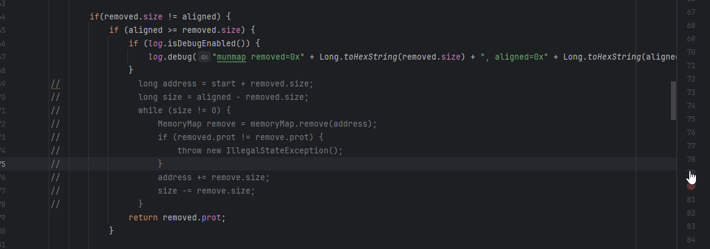

# Unidbg相关技巧

## Android基础知识

### SharedPreferences

​	Android系统下一个轻量级的存储类，特别适合用于保存软件配置参数。**使用`xml`文件存放数据，文件存放在/data/data/<package name>/shared_prefs目录下**。

#### 使用方式

##### 数据存储

1. 使用Activity类的`getSharedPreferences`方法获得SharedPreferences对象
2. 使用SharedPreferences接口的`edit`获得SharedPreferences.Editor对象；
3. 通过SharedPreferences.Editor接口的`putXXX`方法写入key-value对；
4. 通过过SharedPreferences.Editor接口的`commit`方法保存key-value对。

##### 数据读取

1. 使用Activity类的`getSharedPreferences`方法获得SharedPreferences对象；
2. 通过SharedPreferences对象的`getXXX`方法获取数据；

##### 常用方法

1. ##### getSharedPreferences (String name, int mode)

   ```java
   public abstract SharedPreferences getSharedPreferences (String name, int mode)
   ```
   
   > 用于获取SharedPreferences对象。根据name查找SharedPreferences，若已经存在则获取，若不存在则创建一个新的。后面的mode主要用于做程序的权限管理，一般使用MODE_PRIVATE（只能被自己的应用程序访问）。补环境的时候不用管mode。

​	在unidbg补环境时，如果遇到了调用该函数，则说明要程序要创建一个SharedPreferences对象了，可能是读取数据，也可能是写入数据，此时**最关键的点在于name的值**，我们需要在unidbg中利用**`String arg0 = vaList.getObjectArg(0).getValue().toString()`**获取到这个name值。并通过**`vm.resolveClass("android/content/SharedPreferences").newObject(arg0)`**构造一个SharedPreferences对象进行返回。

2. **putXxx()**

   ```java
   //写入boolean类型的数据
   abstract SharedPreferences.Editor   putBoolean(String key, boolean value)
   //写入float类型的数据
   abstract SharedPreferences.Editor   putFloat(String key, float value)
   //写入int类型的数据
   abstract SharedPreferences.Editor   putInt(String key, int value)
   //写入long类型的数据
   abstract SharedPreferences.Editor   putLong(String key, long value)
   //写入String类型的数据
   abstract SharedPreferences.Editor   putString(String key, String value)
   //写入Set<String>类型的数据
   abstract SharedPreferences.Editor   putStringSet(String key, Set<String> values)
   ```

   > 用于完成数据的写入，向刚刚使用getSharedPreferences得到的SharedPreferences中写入键值对。

3. ps：这里省略了remove、clear、commit等操作，如后续再unidbg中遇到，则进行补充【这些操作多是对一个SharedPreferences下的键值对进行操作的】。

4. **getXxx()**

   ```java
   //读取所有数据
   abstract Map<String, ?> getAll()
   //读取的数据为boolean类型
   abstract boolean    getBoolean(String key, boolean defValue)
   //读取的数据为float类型
   abstract float  getFloat(String key, float defValue)
   //读取的数据为int类型
   abstract int    getInt(String key, int defValue)
   //读取的数据为long类型
   abstract long   getLong(String key, long defValue)
   //读取的数据为String类型
   abstract String getString(String key, String defValue)
   //读取的数据为Set<String>类型
   abstract Set<String>    getStringSet(String key, Set<String> defValues)
   ```

   > 用于完成数据读取，根据给出的key，从指定的SharedPreferences中读取数据，如果使用key未能找到数据，则会返回参数2给出的默认值。这里重申一下SharedPreferences和键值对的关系，SharedPreferences的name会指定一个具体的xml文件，存储在/data/data/packname/shared_prefs文件夹中。而上面所有涉及键值对读取的，都是在这个xml文件中进行的。

   ​	在使用unidbg补环境的时候，由于getString、getStringSet、getAll和getSharedPreferences 的返回值都是引用类型，所以会同时被放在callObjectMethodV方法中进行补环境，此时需要注意区分二者参数的区别。

   ​	当补getSharedPreferences时，参数1是SharedPreferences的name，参数2是mode。

   ​	而当补getXxx()时，参数1是上面获取到的SharedPreferences中键值对的key，参数2是当使用key未能获取到值时，返回的默认值。

   ​	getXxx()具体怎么补，还是需要使用frida去hook一下getXxx()这个函数，看他具体返回的是什么，也可以直接通过getSharedPreferences中打印出来的name到对应的包路径下查看对应的xml中的值

### Okio 输入输出流

​	`Okio最初是作为OkHttp的一个组件`出现，是 OkHttp 实现HTTP协议数据构建、解析中使用到的底层 IO 库。其相比于传统的 java.io 和 java.nio ，其在文件、网络等数据读写操作更加便捷、高效。

​	由于Okio这个库主要用于补okhttp相关环境时才会使用，故而这里不进行详解了，直接摆出目前遇到过的几个需要补充的函数他们在开发中是如何使用的【我相信只要会一些java的，看了自然就知道如何补了】，以及目前遇到的补环境demo。

#### okio/Buffer->\<init\>()V

##### 开发代码

```java
Buffer buffer = new Buffer();
```

##### unidbg报错

```java
java.lang.UnsupportedOperationException: okio/Buffer-><init>()V
	at com.github.unidbg.linux.android.dvm.AbstractJni.newObjectV(AbstractJni.java:803)
	at com.xingin.xhs.TestLearn.newObjectV(TestLearn.java:181)
	at com.github.unidbg.linux.android.dvm.AbstractJni.newObjectV(AbstractJni.java:758)
	at com.github.unidbg.linux.android.dvm.DvmMethod.newObjectV(DvmMethod.java:214)
	at com.github.unidbg.linux.android.dvm.DalvikVM64$26.handle(DalvikVM64.java:420)
	at com.github.unidbg.linux.ARM64SyscallHandler.hook(ARM64SyscallHandler.java:121)
	at com.github.unidbg.arm.backend.Unicorn2Backend$11.hook(Unicorn2Backend.java:352)
	at com.github.unidbg.arm.backend.unicorn.Unicorn$NewHook.onInterrupt(Unicorn.java:109)
	at com.github.unidbg.arm.backend.unicorn.Unicorn.emu_start(Native Method)
	at com.github.unidbg.arm.backend.unicorn.Unicorn.emu_start(Unicorn.java:312)
	at com.github.unidbg.arm.backend.Unicorn2Backend.emu_start(Unicorn2Backend.java:389)
	at com.github.unidbg.AbstractEmulator.emulate(AbstractEmulator.java:378)
	at com.github.unidbg.thread.Function64.run(Function64.java:39)
	at com.github.unidbg.thread.MainTask.dispatch(MainTask.java:19)
	at com.github.unidbg.thread.UniThreadDispatcher.run(UniThreadDispatcher.java:175)
	at com.github.unidbg.thread.UniThreadDispatcher.runMainForResult(UniThreadDispatcher.java:99)
	at com.github.unidbg.AbstractEmulator.runMainForResult(AbstractEmulator.java:341)
	at com.github.unidbg.arm.AbstractARM64Emulator.eFunc(AbstractARM64Emulator.java:262)
	at com.github.unidbg.Module.emulateFunction(Module.java:163)
	at com.github.unidbg.linux.android.dvm.DvmObject.callJniMethod(DvmObject.java:135)
	at com.github.unidbg.linux.android.dvm.DvmObject.callJniMethodObject(DvmObject.java:93)
	at com.xingin.xhs.TestLearn.getShield(TestLearn.java:197)
	at com.xingin.xhs.TestLearn.main(TestLearn.java:207)
```

##### unidbg补环境

```java
@Override
public DvmObject<?> newObjectV(BaseVM vm, DvmClass dvmClass, String signature, VaList vaList) {
    switch (signature) {
        case "okio/Buffer-><init>()V":
            System.out.println("beier=>" + dvmClass);
            return dvmClass.newObject(new Buffer());
    }
    return super.newObjectV(vm, dvmClass, signature, vaList);
}
```

##### 说明

​	这里之所以单独把unidbg的报错摆出来，是因为这个报错最终指向的是newObjectV方法，即创建一个新对象。在对这种函数进行补充的时候，主要是利用newObjectV中的dvmClass，该参数就是unidbg给我们反馈回来的缺少的类对象，我们只需要用这个类对象去实例化一个新的实例即可。*我猜测如果一个类对象在实例化时有什么初始化参数，也都会放到VaList中进行返回*【上述猜测有待验证】。

#### okio/Buffer->writeString(Ljava/lang/String;Ljava/nio/charset/Charset;)Lokio/Buffer;

##### 开发代码

```java
Buffer buffer = new Buffer();
buffer.writeString(s, Charset.forName(“utf-8”)); // s为字符串
Source source = Okio.source(buffer.inputStream());
```

##### unidbg补环境

```java
case "okio/Buffer->writeString(Ljava/lang/String;Ljava/nio/charset/Charset;)Lokio/Buffer;":
    Buffer bufferObj = (Buffer) dvmObject.getValue();
    String writeString = vaList.getObjectArg(0).getValue().toString();
    Charset charsetObj = (Charset) vaList.getObjectArg(1).getValue();
    System.out.println("beier=>okio/buffer=>writeString arg0=> " + writeString);
    System.out.println("beier=>okio/buffer=>writeString arg1=> " + charsetObj);
    Buffer resultBuffer = bufferObj.writeString(writeString, charsetObj);
    return vm.resolveClass("okio/Buffer").newObject(resultBuffer);
```

##### 说明

​	主要的关键点就在于使用callObjectMethodV方法提供的dvmObject回调参数获取到传入的buffer对象，然后往这个buffer对象中写入，vaList中的字符串，其中vaList的第一个参数是字符串本身，而第二个参数则是编码格式。


## 固定随机数

​	一般在使用unidbg进行算法还原时，遇见了输入不变的情况下，输出结果依旧在变化的情况，就可以合理的怀疑在算法的过程中有随机数的加入，最常见的两种添加随机数的方式分别是在java层和在so层。其中，在JNI中使用如`currentTimeMillis`、`randomUUID`等函数，而在so中则会使用：`gettimeofday`、`clock_gettime`、`getrandom`这种系统调用，亦或是读取`/dev/urandom`、`/dev/random`、`/dev/srandom`等文件的形式。还有可能会有：读取pid，读取内存中某个固定位置字节等。JNI的随机数固定会比较明显，在补环境的过程中只要看到像是获取uuid或是timestamp的函数直接在补的时候固定住即可，所以下面主要就so层的几个unidbg中的随机数实现进行固定。

### 主要的so层随机数

​	这里有一个确定so文件具体使用了哪个随机方式的方法：在下面几个给出的具体方法上都打上断点，使用idea的debug调试，看他会断在哪个具体的函数，即可确定使用了哪种随机数。当然也可以直接修改下面这些地方的源码加上sout输出。

#### **读取随机文件**

**说明：**

​	程序读取真机上的`/dev/urandom`、`/dev/random`、`/dev/srandom`文件，这三个路径下的文件读取，在unidbg中最后都会归结到一个类中的方法

**unidbg中的路径**

​	`src/main/java/com/github/unidbg/linux/file/RandomFileIO.java` 文件下的`read`方法

**固定方式**

​	注释掉`randBytes(buf);`，后续再有调用，就会直接返回[0,0,0,0]

#### 使用系统调用

**说明**：

​	程序会进行一些常用的系统调用，使用这些系统调用的返回值作为随机变量，如：`gettimeofday`、`clock_gettime`、`getrandom`。

**unidbg中的路径**：

1. `gettimeofday/gettimeofday64`：`src/main/java/com/github/unidbg/unix/UnixSyscallHandler.java`
2. `getrandom`：`src/main/java/com/github/unidbg/unix/UnixSyscallHandler.java`
3. `clock_gettime`：`com/github/unidbg/linux/ARM64SyscallHandler.java`

**固定方式**：

1. `gettimeofday/gettimeofday64`：注释掉`long currentTimeMillis = currentTimeMillis();`，同时声明一个13位长度的时间戳`long currentTimeMillis = 1745767990239L;`
2. `getrandom`：注释掉`random.nextBytes(bytes);`，后续再有调用，就会直接返回[0,0,0,0]
3. `clock_gettime`：暂时未遇到过，理论上是直接将`long offset = clk_id == CLOCK_REALTIME ? currentTimeMillis() * 1000000L : System.nanoTime() - nanoTime;`中的offset固定为一个值即可。

#### 读取进程信息

**说明**：

​	由于程序的pid在每次启动时都会改变，所以有的程序也会将自己的pid作为随机数加入到算法中。

**unidbg中的路径**：

​	`src/main/java/com/github/unidbg/AbstractEmulator.java`中的`getPid`方法

**固定方式**：

​	`this.pid = Integer.parseInt(pid) & 0x7fff;`将这行的this.pid写成一个固定值，需要注意不要超过`0x7fff`。

## Unidbg的一些bug或是小技巧？

### nr=222且报错munmap IllegalStateException

#### 问题

在补环境时如果遇见了下面这种会报nr=222且munmap IllegalStateException的问题，则可以尝试通过修改unidbg代码的方式进行修复。


#### 修复方式

找到`com/github/unidbg/spi/AbstractLoader.java`文件，把其中报错的这部分代码注释掉。


