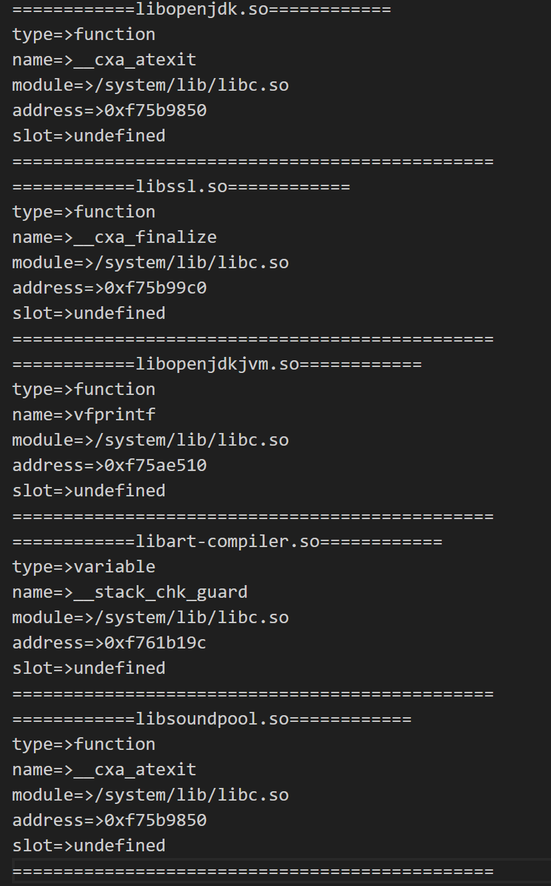

# frida文档

[TOC]

## 安装

1. 确保有python环境

2. 在官方[github仓库](https://github.com/frida/frida/releases)下载对应的server，仅对于Android的使用来说：
   1. 进入adb shell后使用命令：`getprop ro.product.cpu.abi`查看手机cpu架构
      1. 真机：
         1. arm64-v8a：arm 64位架构
         2. armeabi-v7a：arm 32位架构
      2. 模拟器：
         1. x86_64：x86 64位架构
   2. 在仓库下载对应版本的【格式如下】：`frida-server-[version]-android-[cpu 架构].xz`
   3. 使用pip命令下载**对应frida-server版本**的python库：`pip install frida==server version -i https://pypi.tuna.tsinghua.edu.cn/simple`
   4. 当然如果需要去特征的frida也可以尝试，[github仓库](https://github.com/hzzheyang/strongR-frida-android)，经测试16.1.3版本的frida并不好用，如果想要使用可以尝试15.多版本的，或是新版的。
   5. 将下载好的frida-server使用adb推送到手机上存放在固定位置之后，修改权限`chmod 777 path/frida`【需要su模式，所以需要root】
   6. 除此之外还可以安装一些frida官方的frida-tools，里面会有如：frida-ps等常用的frida命令。安装命令如下：`pip install frida-tools -i https://pypi.tuna.tsinghua.edu.cn/simple`

## 基础启动

### 前期准备

1. 确保模拟器或真机上存在frida-server并且运行权限是777后，进入su模式。

2. 确保电脑端有**frida-server对应版本**的frida库

3. 在adb shell中运行frida-server：`./frida`

   由于有些应用会对frida做一些基础的检测，如果检测到了就会被各种处理，所以在这一步也有一些可以避免被检测的操作：

   1. 使用去特征的frida【下载地址见[安装](##安装)的4】
   2. 在启动frida-server时不使用默认端口【默认端口是27042】：`frida-server -l 0.0.0.0:<PORT>`【如果不是本机，则ip改为机器的ip即可】

4. 在电脑端使用命令行进行端口映射：`adb forward tcp:27042 tcp:27042`，如果这里没有使用默认端口启动frida-server，则将端口号改为启动的端口即可。其中第一个`tcp:27042`为电脑的端口，第二个`tcp:27042`为手机【模拟器】端口。

### 使用python脚本启动

```python
import time
import frida
import sys


# js hook中执行的send的回调函数
def on_message(message, data):
    print(message)

# 如果在端口映射时电脑端的端口更改了，则需要host修改一下
# host = "127.0.0.1:8888"

"""
spawn模式，Frida会自动启动并注入目标app，是很早就会进行hook的，但是同样的也有每次运行脚本都会重启app的问题
"""
# 获取设备，默认端口为27042，需要使用命令行：adb forward tcp:27042 tcp:27042进行端口映射
device = frida.get_remote_device()
# 如果在端口映射时电脑端的端口更改了，则需要host修改一下
# device = frida.get_remote_device(host)
# 这里传入的参数为包名，是app的包名
pid = device.spawn(["com.hipu.yidian"])
device.resume(pid)
time.sleep(1)
session = device.attach(pid)

# 如果使用attach模式，则是在当前时机进行hook，其中attach的参数位app的名称
# session = frida.get_remote_device().attach("一点资讯")
## session = frida.get_remote_device(host).attach("一点资讯")
# ./hook_js.js为配套的js脚本hook脚本
with open("./hook.js", "r", encoding="utf8") as f:
    script = session.create_script(f.read())
# 进行回调函数绑定
script.on("message", on_message)
# 加载js脚本
script.load()
sys.stdin.read()
```

### 使用cmd命令行启动

```bash
# 使用默认端口+使用attach模式启动：
frida -U -F -l hook_so_test_1.js
# 使用frida-server修改了端口+attach模式启动：
frida --host 127.0.0.1:27042 -F -l hook_so_test_1.js #这里可以注意到，我端口仍然使用的是27042，这是因为虽然我frida修改了端口，但是我在进行端口映射的时候电脑端的端口仍然用的27042，本以为这样就可以省去指定port的步骤，但最终实验结果来看，只要在启动frida-server是修改了默认端口，哪怕端口映射时电脑端仍然使用默认的27042依旧需要使用-H指定一下。同时需要注意的是-U和-H是冲突的，-U指的是用USB进行连接，-H则是指定特定ip进行远程连接。

# 使用默认端口+使用spawn模式启动：
frida -U -f com.hipu.yidian -l hook_so_test_1.js
# 使用frida-server修改了端口+attach模式启动：
frida -H 127.0.0.1:27042 -f com.hipu.yidian -l hook_so_test_1.js 

# 常用指令options注释：
# frida -h：查看所有options
# frida --version：查看frida版本
# -U,--usb：使用USB连接
# -D 【ID】, --device 【ID】：使用设备ID进行连接，设备ID可以使用 adb devices 查看【与—U冲突】
# -R, --remote：连接远程的frida-server【与—U冲突】
# -H 【HOST】, --host 【HOST】：使用ip:port进行连接【与—U冲突】
# -f 【TARGET】，--file 【TARGET】：spawn 【TARGET】
# -F, --attach-frontmost：attach当前在屏幕上显示的这个app
# -n 【NAME】,--attach-name 【NAME】：attach名字为【Name】的app。注意这个【Name】与【TARGET】的区别，前者是app名字，后者是包名
# -p 【PID】,--attach-pid 【PID】：attach PID为【PID】的app，在安装了frida-tools的前提下，【PID】可以通过frida-ps -U【R】a查看
# -W 【PATTERN】,--await 【PATTERN】：等待直到一个与【PATTERN】匹配的app并spawn上去【暂时没用过，不知道PATTERN是否可以用正则表达式】
# -l 【SCRIPT】, --load 【SCRIPT】：加载要运行的javascript
# -e CODE,--eval CODE：运行一个简短的脚本，类似于JavaScript中的eval，可以直接执行后面的code。
# -q：没有frida那个大图标的一次快速运行，运行完了-l或-e后面的脚本之后会自动退出。
# --pause：在spawn app之后，暂停主线程，其实看很多教程上都在加参数--no-pause以防程序暂停，但是现在frida好像已经改成了默认不暂停，需要手动暂停。
# -o 【LOGFILE】, --output 【LOGFILE】：将frida输出的日志【JavaScript中console.log输出的日志】输出到【LOGFILE】日志文件中


# 不懂或暂时没有试过的参数：
# --auto-perform：使用Java.perform包裹住代码【这个看起来好像很有用的样子，以后写一些较为简单的脚本可以直接写逻辑了，重复的Java.perform就可以省略了】【实测之后并不是很好用，还没搞懂】
# --eternalize：在退出之前将脚本永久化
# --exit-on-error：在SCRIPT中遇到任何异常后以代码1退出
# --kill-on-exit：当frida退出时，杀死spawn的程序
# --auto-reload：启用自动加载所提供的脚本和c模块
# --no-auto-reload：禁用自动加载所提供的脚本和c模块
```

## frida API文档

### Android常用模块

所有的属性都是直接`模块.属性`就可以调出来的，e.g. `Process.id`。

所有的方法都是`模块.方法(args)`调用的，e.g. `Process.enumerateModules()`。

#### [Java](https://frida.re/docs/javascript-api/#java)

##### 属性

###### available

​	是否已加载java虚拟机【Dalvik或ART】，若未加载成功则不要调用任何方法和结构体。

###### androidVersion

​	返回当前真机【虚拟机】的Android版本。

###### vm

​	返回一个java虚拟机对象，包含以下三个方法：

1. **perform(fn)**：

   与`java.perform(fn)`效果一致。

2. **getEnv()**：

   获取当前线程的JNIEnv，如果当前线程没有attach到一个java虚拟机时，抛出异常。

3. **tryGetEnv()**：

   获取当前线程的JNIEnv，如果当前线程没有attach到一个java虚拟机时，返回null。

###### ClassFactory

​	暂时没用到过，也比较复杂可能讲不明白，等后面遇见实例之后再补充。

##### 方法

###### enumerateLoadedClasses(callbacks)

​	枚举当前已加载的所有的java类。可以接收一个callback对象，callback对象中有`onEnter`和`onComplete`两个回调函数，其中`onEnter`包含两个参数：name、handle。name：当前类的name。handle：当前类的地址

e.g.

```javascript
Java.enumerateLoadedClasses({
    onMatch: function (name, handle) {
        // 这里可以配合Java.cast和Java.use创建一个Java Class对象，该对象就是可以调用getDeclaredMethods的那个Java类
        let javaClassObj = Java.cast(ptr(handle), Java.use("java.lang.Class"))
        console.log(javaClassObj)
    },
    onComplete: function () {
    }
})
```

###### enumerateLoadedClassesSync()

​	上面方法的同步版本，上面的方法是异步加载的，该方法是同步方法，会在加载完所有类之前阻塞主线程，相对上面的方法使用频率较低。

###### enumerateClassLoaders(callbacks)

​	与enumerateLoadedClasses方法类似，但是枚举返回的是当前已加载类的类加载器。

e.g.

```javascript
Java.enumerateClassLoaders({
    onMatch: function (loader) {
        console.log(loader)
    },
    onComplete: function () {

    }
})
```

###### enumerateClassLoadersSync()

​	上面方法的同步版本，上面的方法是异步加载的，该方法是同步方法，会在加载完所有类加载器之前阻塞主线程，相对上面的方法使用频率较低。

###### perform(fn)

​	该函数可以确保传入的fn函数，在当前线程下一定会被附着到一个VM上。如果app的类加载器还不可用时，函数fn是不会被执行的。

e.g.

```javascript
Java.perform(() => {
  const Activity = Java.use('android.app.Activity');
  Activity.onResume.implementation = function () {
    console.log('onResume() got called! Let\'s call the original implementation');
    this.onResume();
  };
});
```

###### use(className)

​	使用类名获取类名对应的“**类(class Object)对象**”，而后可以通过这个“**类(class Object)对象**”，使用`$new()`来获取这个“**类(class Object)对象**”对应的**对象实例**。而这个**对象实例**就可以与java中使用一个对象一样了，不论是静态方法还是非静态方法都可以正常调用。

​	同时可以对一个**对象实例**使用`$dispose()`方法，从而手动回收内存，若不手动回收js的垃圾回收机制也会帮忙擦屁股

e.g.

```javascript
Java.perform(() => {
  // 该步骤如果用java代码类比的话等价于：Class<?> ActivityClazz = Class.forName("android.app.Activity");
  const Activity = Java.use('android.app.Activity');
  // 获取java中的异常类
  const Exception = Java.use('java.lang.Exception');
  Activity.onResume.implementation = function () {
    // 创建一个新的异常并抛出，其中$new()这个步骤等价于：
    // Exceptionconstructor = exceptionClass.getConstructor(String.class)
    // Exceptionconstructor.newInstance("Oh noes!")
    throw Exception.$new('Oh noes!');
  };
});
```

###### openClassFile(filePath)

​	通过传入的文件路径打开一个dex文件，返回一个对象，通过这个对象中的`load`方法可以手动将dex包含的类载入VM。并通过`getClassNames`方法获取载入VM后可用的所有**类名**。

1. **load()**：将这个dex中包含的类手动载入到VM中。
2. **getClassNames()**：返回一个包含所有可用类的类名列表。

###### choose(className, callbacks)

​	通过扫描整个java堆栈，查找所有存活的【className】类的实例对象，并在【callbacks】回调对象中通过onMatch处理。

e.g.

```javascript
Java.perform(function () {
        Java.choose("com.example.hellojni.HelloJni", {
            onMatch: function (instance) {
                var result = instance.sign2("0123456789", "abcdef");
                console.log(result);
            }, onComplete: function () {
            }
        });      
 });
```

###### retain(obj)

​	复制一个对象实例，并将这个实例对象进行保留。该函数的主要作用目前来看有两种：

1. 向外传递`JavaScript wrapper obj`，从而实现各个方法之间的对象通信
2. 将一个对象实例保留下来，以免被JavaScript的垃圾回收机制给回收掉

e.g.

```javascript
Java.perform(() => {
  const Activity = Java.use('android.app.Activity');
  let lastActivity = null;
  Activity.onResume.implementation = function () {
    // 这里之所以可以使用this，是因为此时已经进入到onResume方法中了，而onResume又是在Activity这个类下的非静态方法，所以此时的this就是一个Activity的实例对象。
    lastActivity = Java.retain(this);
    this.onResume();
  };
});
```

###### cast(handle, klass)

​	将指针【handle】对应的对象转化为【klass】类型的java对象。需要注意的是参数【handle】是一个指针，而参数【klass】则是使用`Java.use("className")`加载出来的具体java类。

e.g.1

```javascript
// 返回的是指针，通过cast转成java对象，从而读出来，docommand函数不用管是干嘛的
var point_0 = docommand(JNIEnv, ptr(0x0), 10412, argList_0); 
console.log("point_0: " + point_0);
var s_0 = Java.cast(point_0, Java.use("java.lang.Object"));
console.log("result: " + s_0);
```

e.g.2

```javascript
// 官网例子
const Activity = Java.use('android.app.Activity');
const activity = Java.cast(ptr('0x1234'), Activity);
```

###### array(type, elements)

​	根据【type】创建对应类型的数组，数组中的元素为传入的【elements】。

e.g.

```javascript
const values = Java.array('int', [ 1003, 1005, 1007 ]);

const JString = Java.use('java.lang.String');
const str = JString.$new(Java.array('byte', [ 0x48, 0x65, 0x69 ]));
```

###### isMainThread()

​	判断调用者是否在主线程中。

> 用的很少，在看雪上就搜到两个远古贴用到了。52破解上就没找到相关代码。

###### registerClass(spec)

​	可以理解为使用JavaScript创建了一个java类，参数【spec】是一个对象，包含的属性如下：

1. **name**：类名

2. **superClass【选填】**：父类名

   > 需要使用java.use()加载出来

3. **implements【选填】**：实现接口的列表，

   > **注意**：
   >
   > 1. 一个列表，因为java单继承多实现。
   > 2. 同样需要使用java.use()加载出来

4. **fields【选填】**：属性名及类型

   > {
   >
   > ​	fieldName_1: “java.lang.String”,
   >
   > ​	fieldName_2: “int”,
   >
   > }

5. **methods【选填】**：方法声明及实现

   > {                
   >
   > ​	checkClientTrusted: function(chain, authType) {},
   >
   > ​	checkServerTrusted: function(chain, authType) {}, 
   >
   > ​	getAcceptedIssuers: function() {return []; }
   >
   > }

e.g.

```javascript
// 官方例子
const SomeBaseClass = Java.use('com.example.SomeBaseClass');
const X509TrustManager = Java.use('javax.net.ssl.X509TrustManager');

const MyTrustManager = Java.registerClass({
  name: 'com.example.MyTrustManager',
  implements: [X509TrustManager],
  methods: {
    checkClientTrusted(chain, authType) {
    },
    checkServerTrusted(chain, authType) {
    },
    getAcceptedIssuers() {
      return [];
    },
  }
});

const MyWeirdTrustManager = Java.registerClass({
  name: 'com.example.MyWeirdTrustManager',
  superClass: SomeBaseClass,
  implements: [X509TrustManager],
  fields: {
    description: 'java.lang.String',
    limit: 'int',
  },
  methods: {
    $init() {
      console.log('Constructor called');
    },
    checkClientTrusted(chain, authType) {
      console.log('checkClientTrusted');
    },
    checkServerTrusted: [{
      returnType: 'void',
      argumentTypes: ['[Ljava.security.cert.X509Certificate;', 'java.lang.String'],
      implementation(chain, authType) {
        console.log('checkServerTrusted A');
      }
    }, {
      returnType: 'java.util.List',
      argumentTypes: ['[Ljava.security.cert.X509Certificate;', 'java.lang.String', 'java.lang.String'],
      implementation(chain, authType, host) {
        console.log('checkServerTrusted B');
        return null;
      }
    }],
    getAcceptedIssuers() {
      console.log('getAcceptedIssuers');
      return [];
    },
  }
});
```


#### [Process](https://frida.re/docs/javascript-api/#process)

##### 属性

###### id

​	返回**进程**的PID

###### name

​	返回进程的名字，在Android实测返回值为`undefined`。

###### arch

​	返回进程的架构：ia32，x64，arm，arm64

###### platform

​	返回进程的平台：windows，darwin，linux，qnx

###### pageSize【感觉很难用到】

​	返回虚拟页表大小

###### pointerSize【可能会用到】

​	返回操作系统上一个指针的大小，在 32 位系统上，指针大小通常是 4 字节（32 位），而在 64 位系统上，指针大小通常是 8 字节（64 位）

###### mainModule

​	返回一个 `Module` 对象，代表了目标进程的主模块，这个应该返回的是一个so模块，在Android实测返回值为`undefined`。

##### 方法

###### getCurrentDir()

​	返回frida当前的工作目录，在Android实测返回值为`/`。

###### getHomeDir()

​	返回系统用户的home目录，在Android实测返回值为`/data`。

###### getTmpDir()

​	返回系统用户的tmp目录，在Android实测返回值为`/tmp`。

###### isDebuggerAttached()

​	返回attach是否处于debug模式

###### getCurrentThreadId()

​	返回当前**线程**的PID，这个与上面属性中的[id](######id)不同，上面那个返回的是**进程**的PID。

###### enumerateThreads()

​	返回所有**线程**的**`Thread`对象**。

###### findModuleByAddress(address)、findModuleByName(name)

​	通过地址【module名字】返回一个`Module`对象，如果没有找到返回null

###### getModuleByAddress(address)、getModuleByName(name)

​	通过地址【module名字】返回一个`Module`对象，如果没有找到抛出异常

###### enumerateModules()

​	枚举当前已加载入内存的所有`Module`，并返回一个list。其中参数可以接收一个handler，handler中可以使用onMatch、onComplete两个钩子函数

e.g.

```javascript
// onMatch和onComplete两个回调函数必须同时存在
Process.enumerateModules({
    // 对每个匹配的模块执行的回调函数。当找到一个模块时，会调用此函数，并将该模块作为参数传递给回调函数
    onMatch: function (module) {
            // doSomething
    }, 
    // 当枚举完成时调用的回调函数。在所有模块都被遍历后，会调用此函数
    onComplete: function () {
            // doSomething
    }
})
```

###### findRangeByAddress(address)

​	通过地址返回一个`range `对象，该函数应该主要是搭配下面的[enumerateRanges](#####enumerateRanges)函数使用的，该对象主要包含以下属性：

1. **base**：`NativePointer`对象，基址。
2. **size**：大小【byte】
3. **protection**: 权限：rwx、rw-【内存的权限：r=读，w=写，x=执行】
4. **file**：内存块中内容对应的文件
   1. **path**：文件全路径，e.g. `/data/app/com.hipu.yidian-pwh4eCshyxGx1b2b5aiSFw==/lib/arm/libtongdun.so`
   2. **offset**：offset in the mapped file on disk, in bytes【直译过来应该是磁盘上的偏移，不确定是不是内存中的】
   3. **size**：size in the mapped file on disk, in bytes【直译过来应该是磁盘上的大小，不确定是不是内存中的】

###### enumerateRanges(protection|specifier)

​	枚举所有的`range`对象，该对象很迷惑，目前的理解应该就是把内存进行了分块，然后每一个`range`对象都是一块，该函数讲道理来说应该是可以玩出一些花的，因为`range`对象本身中是包含了`base`、`size`、`file.path`，这些属性的，所以理论上来说他应该是可以对整个内存块进行枚举，通过对`range`的`file.path`进行筛选，从而获取一些内存中的文件的存储路径，基址信息等。

​	这里给出一个设想的例子：一个app他有一系列反hook的机制，使你只能知道他有模块加载到了内存中，此时要想检索这个模块就可以尝试使用这个方法【但是事后想了一下，既然我要筛选我肯定就得知道so的名字，那么此时为啥我不直接使用findModuleByName】

###### setExceptionHandler(callback)

​	涉及内存页表，暂时不写了，太深了，后续有用到再写吧。

#### [Thread](https://frida.re/docs/javascript-api/#process)【位于Process模块下】

##### 属性

###### id

​	返回**线程**的PID

###### state

​	running，stopped，waiting，uninterruptible，halted。其中uninterruptible是一种不可中断的资源阻塞，halted应该是frida自定义的一种线程状态，用于更好地进行动态分析和交互

###### context

​	一个上下文对象，对于Android的几种架构而言，其中主要包含pc和sp两个键，调用这两个键会得到一个`NativePointer`对象

##### 方法

###### backtrace([context, backtracer])

​	根据参数中的context和追栈模式，返回当前线程某一个导出函数的调用地址列表【`NativePointer`对象】，配合`DebugSymbol.fromAddress`函数即可打印堆栈。

​	其中context和backtracer参数都是可以省略的，在有context参数时会有更准确的追栈，而backtracer则有两种模式：`Backtracer.FUZZY`和`Backtracer.ACCURATE`，第二种模式是比第一种模式追栈更准确，且在省略时默认为`ACCURATE`模式。

​	最后便是该函数的调用时机，官方文档中说推荐在onEnter和onLeave函数中调用，因为在这两个钩子函数中调用可以传入`this.context`参数，从而时追栈更准确。

e.g.

```javascript
const f = Module.getExportByName(null, 'android_dlopen_ext');
Interceptor.attach(f, {
    onEnter(args) {
        console.log('android_dlopen_ext called from:\n' +
            Thread.backtrace(this.context, Backtracer.ACCURATE)
                // 这里的DebugSymbol.fromAddress是一个frida中的debug函数，map是js中的映射函数
                // DebugSymbol.fromAddress(address)/DebugSymbol.fromAddress(name)
                // 该函数的作用是通过地址或名称向上查找，并返回一个debug对象，该对象包含：
                // address name moduleName fileName lineNumber
                .map(DebugSymbol.fromAddress).join('\n') + '\n');
    }
});
```


###### sleep(delay)

​	使当前线程睡眠【delay】秒，用法与python中的time.sleep()一致，传入的时间单位是秒，可接受浮点小数。

#### [Module](https://frida.re/docs/javascript-api/#module)

​	`Module`对象可以通过四种方法获取：[`Module.load(path)`](######Module.load(path))、[`Process.enumerateModules()`](######enumerateModules())、[` findModuleByAddress(address)【getModuleByAddress(address)】`](######findModuleByAddress(address)、findModuleByName(name))、[`findModuleByName(name)【getModuleByName(name)】`](######getModuleByAddress(address)、getModuleByName(name))

​	下方所有的属性及方法的调用的前缀默认都是`ModuleObj.`，若前缀为`Module.`时会标注出来。

##### 属性

###### name

​	返回`Module`的名称字符串

###### base

​	返回`Module`基址的`NativePointer`对象

###### size

​	返回`Module`的大小，单位byte

###### path

​	返回`Module`的系统全路径

##### 方法

###### findExportByName(exportName)、getExportByName(exportName)

​	根据传入的【exportName】返回对应名字的导出对象的绝对地址。在未找到的情况下，find返回null，get抛异常。

###### enumerateImports()

​	枚举调用`Module`导入的所有对象。就是ida分析中Imports窗口。返回【对象列表】中的对象包含的属性：

> **注意**：根据平台的不同，只有name属性能确保获取到，其余属性都是尽可能获取到。

1. **type**：导入对象的类型。function或variable

2. **name**：导入对象的名称

3. **module**：导入对象所属`Module`的系统全路径

4. **address**：导入对象的绝对地址

   > **注意**：ida中的地址是相对地址

5. **slot**：导入该对象时所在的内存地址，实测Android平台下无法获取这个。

e.g.



###### enumerateExports()

​	枚举调用`Module`导出的所有对象。就是ida分析中Exports窗口。返回【对象列表】中的对象包含的属性：

1. **type**：导入对象的类型。function或variable

2. **name**：导入对象的名称

3. **address**：导入对象的绝对地址

   > **注意**：ida中的地址是相对地址

e.g.【可以看到经常被hook的android_dlopen_ext是从libdl.so导出的，并且有绝对地址（虽然绝对地址好像没啥用）】


###### enumerateSymbols()【仅支持linux/i/macOS(Android是linux体系的系统)】

​	枚举调用`Module`所有**符号**对象，在ida中并没有对应的窗口。返回【对象列表】中的对象包含的属性：

> **符号**：无论是否导出的变量和函数

> **注意**：有一些frida可以hook到的符号在ida中即使使用字符串检索都是检索不到的，比如libart中用于动态注册native函数的函数：`_ZN3art3JNI15RegisterNativesEP7_JNIEnvP7_jclassPK15JNINativeMethodi`，虽然可以使用enumerateSymbols方法hook并筛选出来，但是在ida中无论是64位的还是32位的都是检索不到该字符串的。

1. **isGlobal**：该符号对象是否为全局可见【bool类型】
2. **type**：符号对象类型，下方类型中的一种。若带有【O】，代表并非全平台支持。带有【ELF】，代表该类型是在ELF文件中的类型。
   1. unknown
   2. section
   3. undefined【O】
   4. absolute【O】
   5. prebound-undefined【O】
   6. indirect【O】
   7. object【ELF】
   8. function【ELF】
   9. file【ELF】
   10. common【ELF】
   11. tls【ELF】
3. **section**：如果有该属性则返回，如果没有则返回undefined。由于涉及ELF文件结构，暂时放下，后续遇到再补充。

> **section**：一种ELF文件中特有的数据结构，可以存放代码、数据、符号表等

4. **name**：符号的名称【string类型】
5. **address**：符号所在地址【NativePointer类型】
6. **size**：如果存在，则以字节为单位返回符号大小

###### enumerateRanges(protection)

​	与[`Process.enumerateranges`](######enumerateRanges(protection|specifier))类似，不再重复。

###### Module.load(path)

​	根据传入的【path】加载对应的`Module`并返回一个`Module`对象，如未找到对应的`Module`则抛异常，其中【path】为系统全路径。

###### Module.findBaseAddress(name), Module.getBaseAddress(name)

​	根据传入的【name】返回对应`Module`的基址。若未找到对应的`Module`则抛异常。

###### Module.findExportByName(moduleName|null, exportName), Module.getExportByName(moduleName|null, exportName)

​	与[`findExportByName(exportName)、getExportByName(exportName)`](######findExportByName(exportName)、getExportByName(exportName))功能一致，其中第一个参数【moduleName】可以为null，当传入的值为null时则对所有的模块进行检索。这是一种比较昂贵的搜索，所以应该尽可能避免这种搜索。

###### Module.ensureInitialized(name)【使用不多】

​	确保【name】对应的`Module`已经成功初始化，无返回值。目前只在看雪看到几个远古帖子在脱壳时用到了。

##### 补充

###### Module.enumerateSymbolsSync(ModuleName)

​	与[`enumerateSymbols()`](######enumerateSymbols()【仅支持linux/i/macOS(Android是linux体系的系统)】)功能一致，其中传入的【ModuleName】是`Module`的字符串名字。

#### [Memory](https://frida.re/docs/javascript-api/#memory)

​	下方所有的方法的调用的前缀默认都是`Memory.`。

##### 方法

###### scan

#### [Interceptor](https://frida.re/docs/javascript-api/#interceptor)


#### [NativePointer](https://frida.re/docs/javascript-api/#nativepointer)


#### [ArmWriter](https://frida.re/docs/javascript-api/#armwriter)


#### [Arm64Writer](https://frida.re/docs/javascript-api/#arm64writer)


#### [X86Writer](https://frida.re/docs/javascript-api/#x86writer)


#### Other

##### [Hexdump](https://frida.re/docs/javascript-api/#hexdump)

