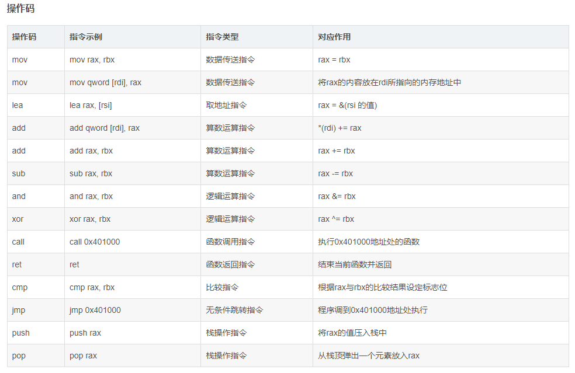

# x86-x64汇编常用指令及寄存器

## 寄存器

[参考文章1](https://blog.csdn.net/m0_61634551/article/details/135708134)：改文章后续的架构约定等等细节也很值得一看。但未能找到原文【怀疑该文章是抄的，但是没有证据】

### x86【32位机器】

**通用寄存器**

EAX：Extended Accumulator Register【扩展累加寄存器】

EBX：Extended Base Register【扩展基址寄存器】

ECX：Extended Counter Register【扩展计数寄存器】

EDX：Extended Data Register【扩展数据寄存器】

ESI：Extended Source Index【扩展源索引】

EDI：Extended Destination Index【扩展目的索引】

**栈顶指针寄存器**

ESP：Extended Stack Pointer【扩展栈指针】

**栈底指针寄存器**

EBP：Extended Base Pointer【扩展基址指针】

**指令计数器（IR）**

EIP：Extended Instruction Pointer【扩展指令指针】

**段寄存器**

CS：Code Segment【代码段】

DS：Data Segment【数据段】

ES：Extra Segment【附加段】

FS：Extra Segment (F Segment)【附加段F】

GS：Extra Segment (G Segment)【附加段G】

SS：stack Segment【栈段】

### x64【64位机器】

把所有的E改成R，命名缩写与上方相同

**通用寄存器**

RAX、RBX、RCX,、RSI,、RDI

同时还包含了：R8-R15八个通用寄存器。

**栈顶指针寄存器**

RSP

**栈底指针寄存器**

RBP

**指令计数器(PC)**

RIP

**段寄存器**

CS、DS、ES、FS、GS、SS

## 指令

### temp【素材暂定，后续遇到需要细写】

