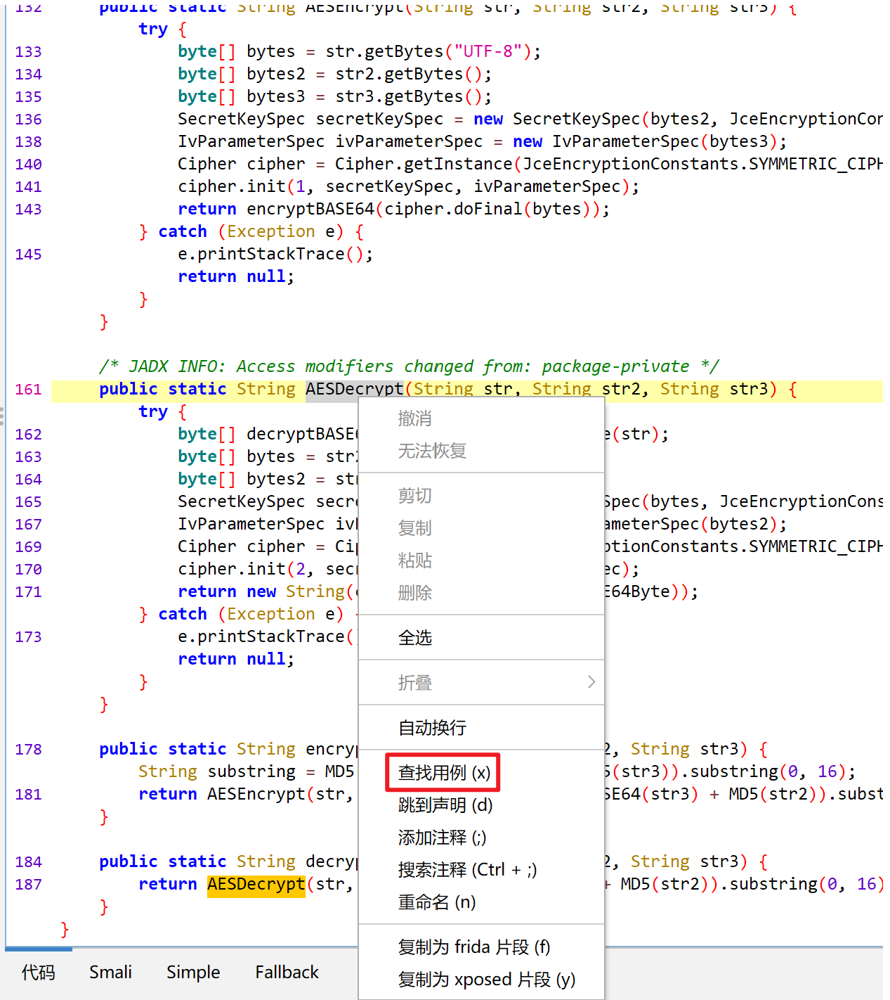
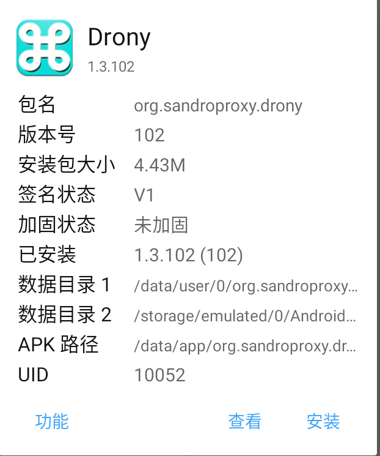
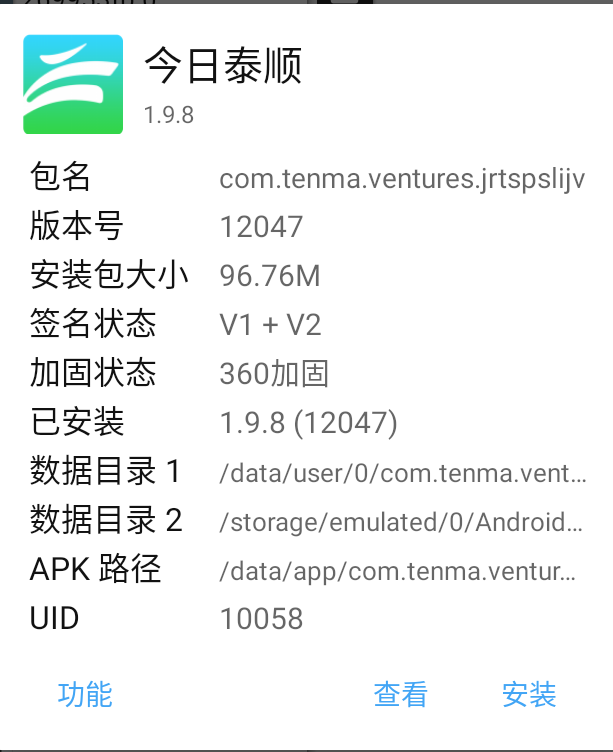

# 安卓逆向

​	在安卓逆向开始之前，有一些比较基础的东西是需要说明的。首先所有的apk本质上都只是一个压缩包，我们可以通过将其后缀改为.zip从而使用各种解压软件直接打开，并查看其中的一些内容。

### jadx工具使用

全局搜索和局部搜索，以及ctrl+左键跳转这种基础用法这里就不介绍了。

#### 用例搜索

​	这种方法相较于全局搜索最大的优势就是可以全局搜索真正用到或声明**这个**变量或方法位置，因为很多时候一个常用的名字会被很多的变量和方法使用，此时如果使用全局搜索就很难定位到想要的位置。用了这个就可以切实的定位到我现在锁定的这个变量或者方法的调用或声明的位置。



#### defpackage是什么？

​	defpackage就是一些常用的工具函数，他们并没有被封装到一个具体的包里，所以jadx在解析后就都统一的给他们放到了defpackage了，那如果此时我想要hook这个包里的某一个类中的函数，应该如何编写use代码呢？答案也很简单直接用类名即可，前面不需要加任何的包名。但经过cctv这个逆向实例后我发现好像defpackage这个包里的类中的方法一般来说基本都hook不到，哪怕他们真的被调用了，也很难hook到。

#### AndroidMainfest.xml

​	该文件是唯一标识这个app资源的文件，在这里你可以找到整个app的存放位置，以及各种Activity，资源存放的路径和包名。在逆向的开始阶段可以在这里找找灵感，利用正则看看是否能匹配到想要找到的Activity等，双击Activity就可以直接跳转到对应的Activity上。当然上述这一切都是在app没有加壳的情况下，如果app本身有加固，则需要参考下面的[查壳和脱壳](#脱壳)方法对apk进行脱壳拿到真实的dex文件，再放到jadx中进行解析。

### 脱壳

​	首先是如何判断app加壳了，最直白的方式就是将apk文件拖拽到jadx中发现，明明一个很大的app，但是只解析出来几个简单类，并且在资源文件夹中找不到dex或找到的dex过少【只有一两个】，那么此时基本就可以判断是被加壳了。需要使用一些工具进行脱壳处理，这里暂时进介绍一些简单的脱壳方法，后续如果还有一些更复杂的再进行补充。

#### 使用MT管理器对app查壳【加固】

​	操作上很简单在mt管理器中找到app的apk安装包，右键即可查询，下面两张图片分别展示了有壳和没壳的效果。查看加固状态即可查询到加的是哪家的壳。





#### 使用firda_dump简单脱壳

首先是使用到的工具：frida、[脱壳工具](app_tool/dump_dex.js)。最终目的是通过脱壳工具找到应用真正存放dex的所在地，在找到并将dex成功拉到电脑上之后便可使用jadx直接解码。

##### 相关命令

```bash
# 使用adb命令获取正在运行的app的包全名
adb shell "dumpsys window | grep mCurrentFocus"
# 打开frida-server,/data/local/tmp为frida-server所在路径fd64为frida-server重命名后的可执行文件
adb shell
su
cd /data/local/tmp
./fd64
# 端口映射【另起一个命令行】，将手机的27042的端口映射到电脑端的27042上，其中27042为frida-server默认端口
adb forward tcp:27042 tcp:27042
# 使用frida和拓客工具获取真实dex所在地，在使用时需要要脱壳的工具是正在运行的。同时在运行之前需要打开frida.server同时需要做端口映射
frida -U (com.xxx.xxx) -l dump_dex.js(脱壳工具路径)

# 开启root
adb root
# 将手机端的dex拉到电脑上，如果在拉取时不成功，可以尝试在/sdcard目录下创建随意一个目录，先把dex拉到这个目录下再拉到电脑上
adb pull 手机端dex路径 电脑端路径
```

### 安卓hook

​	安卓hook主要分为两个流派一个是xposed，另一个则是frida。前者是使用java代码写hook代码，后者是用python调用js写的hook代码。据我查到的资料来看，xposed要比frida更接近安卓底层，但frida相比于xposed则更简单一些。所以这里暂时以frida为例入手安卓hook。

#### 工具安装

​	首先是python的frida库，依旧是使用pip进行安装，只需要在命令行中输入以下命令即可

```bash
# 安装frida的python依赖
pip install frida
# 下面的命令将安装frida的Python bindings以及其他工具，例如frida命令行工具
pip install frida-tools
# 使用以下命令查看安装的frida库的版本，后续需要再github库安装对应版本的frida-server到模拟器或实体机上
pip list
```

​	而后便是对frida-server的安装，该工具是安装在手机模拟器或者实体机上的，在手机上启动后，即可通过上面安装的python的frida库与手机进行连接，从而实现后续的hook等操作。工具安装[链接](https://github.com/frida/frida/releases/)。打开前面的链接并在release中找到一个与自己安装的python的frida库相对应版本的即可。如果是雷电模拟器需要下载`frida-server-xx.x.x-android-x86_64.xz`，如果是实体机的话，则可以下载`frida-server-xx.x.x-android-arm64.xz`【因为模拟器中采用的都是x86架构的，而很多手机现在采用的都是arm架构的】。下载成功后解压并将`frida-server`文件放入模拟器或手机某个文件夹即可。

​	打开adb命令行连接模拟器或手机，找到存放`frida-server`的文件夹，在管理员权限下运行该文件即可`./frida-server`开启手机端的服务。此时需要另开一个命令行工具，并使用以下命令进行端口映射：

```bash
# 将frida-server默认的27042端口与电脑上的27042端口进行映射
adb forward tcp:27042 tcp:27042
```

#### python调用代码

```python
import frida
import sys

# js hook中执行的send的回调函数
def on_message(message, data):
    print(message)
    
"""
spawn模式，Frida会自动启动并注入目标app，是很早就会进行hook的，但是同样的也有每次运行脚本都会重启app的问题
"""
# # 获取设备，默认端口为27042，需要使用命令行：adb forward tcp:27042 tcp:27042进行端口映射
# device = frida.get_remote_device()
# # 这里传入的参数为包名，是app的包名
# pid = device.spawn([""])
# device.resume(pid)
# time.sleep(1)
# session = device.attach(pid)

# 如果使用attach模式，则是在当前时机进行hook，其中attach的参数位app的名称
session = frida.get_remote_device().attach("")
# ./hook_js.js为配套的js脚本hook脚本
with open("./hook_js.js") as f:
    script = session.create_script(f.read())
# 进行回调函数绑定
script.on("message", on_message)
# 加载js脚本
script.load()
sys.stdin.read()
```

#### js hook代码

```js
// 基础hook模板
Java.perform(function () {
    // use 中的参数是要hook的函数所在的包名+.+要hook的函数所在的类
    var classname=Java.use("")
    // use后面的是要hook的函数名【getSmscode为示例】，后面Function中需要加入与被hook函数相同数量的形参
    classname.getSmscode.implementation = function (param1, param2, param3) {
        //这里的console.log也可以改为send(param1, param2, param3)，这样就会调用上面python代码中的on_message回调方法
        console.log(param1, param2, param3)
        return this.getSmscode(param1, param2, param3)
    }
})
```

#### 常用模块代码

##### 打印调用堆栈

```js
// 打印函数调用堆栈，其中入参name是需要打印的方法：例：com.torch.open.signer.sign.b.check，
// 就是com.torch.open.signer.sign.b包下的check方法
function printStack(name) {
    Java.perform(function () {
        // 加载java异常类，后面会用这个手动造一个异常
        var Exception = Java.use("java.lang.Exception");
        // 创建一个新异常
        var ins = Exception.$new("Exception");
        // 追踪异常堆栈
        var straces = ins.getStackTrace();
        if (straces != undefined && straces != null) {
            var strace = straces.toString();
            var replaceStr = strace.replace(/,/g, "\n");
            console.log("=============================" + name + " Stack strat=======================");
            console.log(replaceStr);
            console.log("=============================" + name + " Stack end=======================\r\n");
            // 销毁异常
            Exception.$dispose();
        }
    });
}
```

##### 打印类已声明方法【利用java反射】

```js
// 获取传入的类中所有已声明的方法的方法名
function showDeclareMethods(packageName) {
    Java.Perform(function () {
        Java.choose(packageName, {
            // 当传入的类匹配到了之后的回调函数，其中instance为一个java类的实例对象
            onMatch: function (instance) {
                try {
                    // 使用反射拿到实例的类，并调用getDeclaredMethods拿到类中的方法
                    var ret = instance.class.getDeclaredMethods()
                    for (let i = 0; i < ret.length; i++) {
                        console.log(ret[i])
                    }
                } catch (e) {
                    console.log("error")
                    console.log(e)
                }
            }
        })
    })
}
```

打印类中属性【利用java反射】

```js
// 获取传入类的属性
function showDeclareFields(packageName) {
    Java.Perform(function () {
        Java.choose(packageName, {
            // 当传入的类匹配到了之后的回调函数，其中instance为一个java类的实例对象
            onMatch: function (instance) {
                try {
                    // 使用反射拿到实例的类，并调用getDeclaredMethods拿到类中的方法
                    var ret = instance.class.getDeclaredFields()()
                    for (let i = 0; i < ret.length; i++) {
                        console.log(ret[i])
                    }
                } catch (e) {
                    console.log("error")
                    console.log(e)
                }
            }
        })
    })
}
```

##### 利用Gson打印Object对象

```js
//使用Gson打印hook中的对象[Object object]
{
    var JSONObject = Java.use("com.google.gson.Gson");
    var result = this.getItems()
    var obj = JSONObject.$new()
    console.log(obj.toJson(result))
}
```

### 使用unidbg工具调用So文件

#### unidbg 

unidbg 是一个基于 unicorn 的逆向工具，可以黑盒调用安卓和 iOS 中的 so 文件。unidbg 是一个标准的 java 项目。
由于现在的大多数 app 把签名算法已经放到了 so 文件中，要想破解签名算法，必须能够破解 so 文件。C++ 的逆向远比 Java 的逆向要难得多了，所以好多时候是没法破解的，那么这个时候还可以采用 hook 的方法，直接读取程序中算出来的签名，但是这样的话，需要实际运行这个应用，需要模拟器或者真机，效率又不是很高（比如frida的rpc调用，就需要后台运行应用）。unidbg 就是一个很巧妙地解决方案，他不需要直接运行 app，也无需逆向 so 文件，而是通过在 app 中找到对应的 JNI 接口，然后用 unicorn 引擎直接执行这个 so 文件，所以效率也比较高。

#### 参考文章

unidbg 基础：https://www.52pojie.cn/thread-1322512-1-1.html

unidbg 使用实例：https://blog.csdn.net/chl191623691/article/details/118415796

#### 工具项目

​	unidbg是一个[github](https://github.com/zhkl0228/unidbg)上开源的maven项目，在使用时需要现有java，maven环境。然后将项目clone下来之后，使用标准的maven项目结构打开。而后在`src/test/java/com/xxxx/frameworks/core/encrypt`这个路径下找到`TTEncrypt`测试用例执行里面的main方法，如果没有问题，则会得到下图这样的输出样式

</img>

#### 使用实例

使用时，打开unidbg项目，在其项目下编写脚本【主要之前尝试的maven导入并不是很好用，有些包导入不进来】。

```java
package cn.hestyle;
 
import com.github.unidbg.Module;
import com.github.unidbg.arm.ARMEmulator;
import com.github.unidbg.linux.android.AndroidARMEmulator;
import com.github.unidbg.linux.android.AndroidResolver;
import com.github.unidbg.linux.android.dvm.*;
import com.github.unidbg.memory.Memory;
 
 
import java.io.File;
import java.io.IOException;
 
/**
 * description: EncryptUtils调用so
 *
 * @author hestyle
 * @version 1.0
 * @className unidbg->EncryptUtilsJni
 * @date 2020-05-20 22:01
 **/
public class EncryptUtilsJni extends AbstractJni {
    // ARM模拟器
    private final ARMEmulator emulator;
    // vm
    private final VM vm;
    // 载入的模块
    private final Module module;
 
    private final DvmClass TTEncryptUtils;
 
    /**
     *
     * @param soFilePath   需要执行的so文件路径
     * @param classPath    需要执行的函数所在的Java类路径
     * @throws IOException
     */
    public EncryptUtilsJni(String soFilePath, String classPath) throws IOException {
        // 创建app进程，包名可任意写
        emulator = new AndroidARMEmulator("cn.hestyle");
        Memory memory = emulator.getMemory();
        // 作者支持19和23两个sdk
        memory.setLibraryResolver(new AndroidResolver(23));
        // 创建DalvikVM，利用apk本身，可以为null
        vm = ((AndroidARMEmulator) emulator).createDalvikVM(null);
        // （关键处1）加载so，填写so的文件路径
        DalvikModule dm = vm.loadLibrary(new File(soFilePath), false);
        // 调用jni
        dm.callJNI_OnLoad(emulator);
        module = dm.getModule();
        // （关键处2）加载so文件中的哪个类，填写完整的类路径
        TTEncryptUtils = vm.resolveClass(classPath);
    }
 
    /**
     * 调用so文件中的指定函数
     * @param methodSign 传入你要执行的函数信息，需要完整的smali语法格式的函数签名
     * @param args       是即将调用的函数需要的参数
     * @return 函数调用结果
     */
    private String myJni(String methodSign, Object ...args) {
        // 使用jni调用传入的函数签名对应的方法（）
        Number ret = TTEncryptUtils.callStaticJniMethod(emulator, methodSign, args);
        // ret存放返回调用结果存放的地址，获得函数执行后返回值
        StringObject str = vm.getObject(ret.intValue() & 0xffffffffL);
        return str.getValue();
    }
 
    /**
     * 关闭模拟器
     * @throws IOException
     */
    private void destroy() throws IOException {
        emulator.close();
        System.out.println("emulator destroy...");
    }
 
    public static void main(String[] args) throws IOException {
        // 1、需要调用的so文件所在路径
        String soFilePath = "src/test/resources/myso/libencryptLib.so";
        // 2、需要调用函数所在的Java类完整路径，比如a/b/c/d等等，注意需要用/代替.
        String classPath = "com/.../EncryptUtils";
        // 3、需要调用函数的函数签名，我这里调用EncryptUtils中的getGameKey方法，由于此方法没有参数列表，所以不需要传入
        String methodSign = "getGameKey()Ljava/lang/String;";
        EncryptUtilsJni encryptUtilsJni = new EncryptUtilsJni(soFilePath, classPath);
        // 输出getGameKey方法调用结果
        System.err.println(encryptUtilsJni.myJni(methodSign));
        encryptUtilsJni.destroy();
    }
}
```

