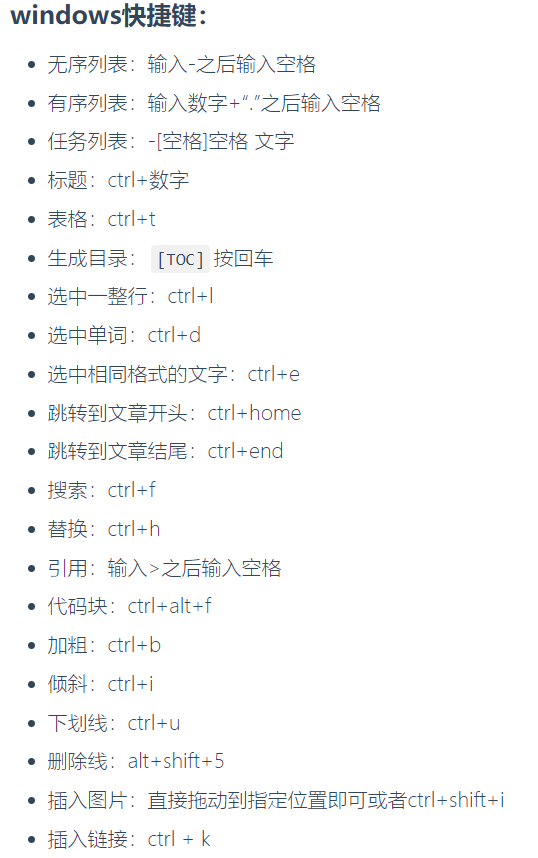
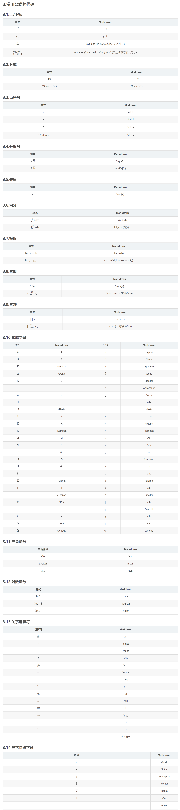
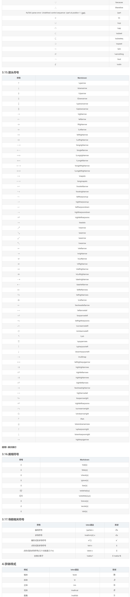

# Beier的工作笔记

## 首页

该页目前仅担任工作笔记起始也，方便在大纲的文件树中管理各个md文件，后续可能会加入一些内容。

[Typora各种跳转教程](https://blog.csdn.net/qq_41907769/article/details/121722716)

Typora快捷键：

Typora数学公式代码：

[公式ctrl+F速查地址](https://blog.csdn.net/qq_37402392/article/details/121348504)

