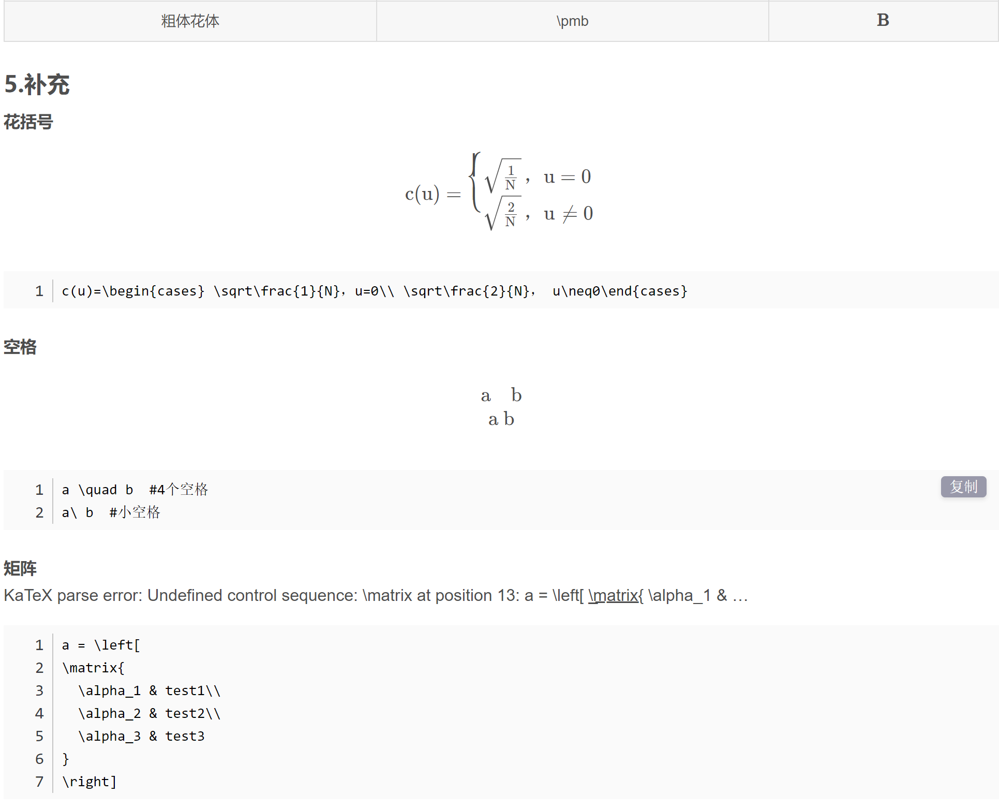

# Beier的工作笔记

## 首页

该页目前仅担任工作笔记起始页，方便在大纲的文件树中管理各个md文件，后续可能会加入一些内容【主要以typora的使用技巧为主】。


[Typora各种跳转教程](https://blog.csdn.net/qq_41907769/article/details/121722716)

如果仅是简单的页内跳转【跳转到标题，如果是跳转到一段文本则无法使用以下方法】的话格式类似于：

```bash
起跳点:
[内容](#git的使用方法)
要达到的终点：
#### git的使用方法

跳转时需要按住ctrl+点击
```

Typora快捷键：


Typora数学公式代码：




[公式ctrl+F速查地址](https://blog.csdn.net/qq_37402392/article/details/121348504)

