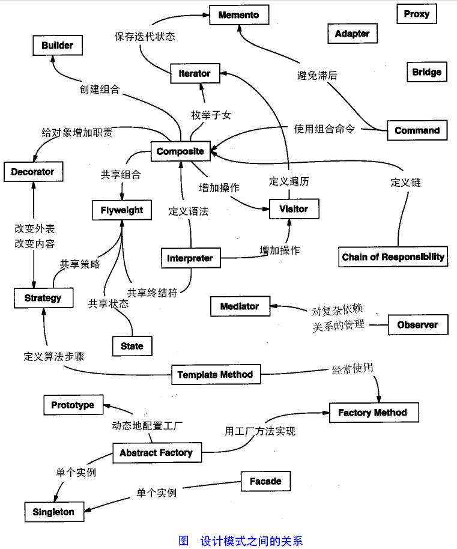

# 设计模式总论

## 设计模式分类

23种设计模式参考[链接](https://blog.csdn.net/guorui_java/article/details/104026988)

### 创建型模式

该类型的模式主要适用于解耦对象的实例化过程。

1. [单例模式（Singleton）](单例模式.md)：某个类只能由一个实例，提供全局的访问点。
2. [抽象工厂模式（AbstractFactory）](抽象工厂模式.md)：创建相关或依赖对象的家族，而无需明确指定具体类。
3. [工厂方法模式（FactoryMethod）](工厂方法模式.md)：一个工厂类根据传入的参量决定创建出哪一种产品类的实例。
3. [创建者模式（Builder）](创建者模式.md)封装一个复杂对象的创建过程，并可以按照步骤构造。
3. [原型模式（Prototype）](原型模式.md)通过复制现有的实例来创建新的实例。

### 结构型模式

1. []()
2. []()
3. []()
4. []()
5. []()
6. []()
7. []()

### 行为型模式

1. []()
2. []()
3. []()
4. []()
5. []()
6. []()
7. []()
8. []()
9. []()
10. []()
11. []()

## 设计模式的几种原则

### 1.单一职责原则：

​	一个类的职责是唯一的。

### 2.接口隔离原则：

​	一个类对另一个类的依赖应该建立在最小的接口上，不应该依赖他不需要的接口。

### 3.里氏代换原则：

​	任何基类出现的方法，子类一定可以出现。基类的衍生类需要实现基类中的所有功能，基类才是真正的被复用了，而同时衍生类可以在基类的基础上继续添加新的行为。换句话说，基类如果是抽象类，那么子类就需要对这个基类中的方法进行具体化【当然通过学习java面向对象，可以得到，子类可以分阶段的实现抽象类中的方法，如顶级父类中有5个抽象法，那么我可以在子类中具体实现其中的2个，并将其余继续保持抽象方法，留给孙子类，并可以一直后延】

### 4.开闭原则：

1. 对于扩展是开放的（Open for extension）
2. 对于修改是关闭的（Closed for modification）

**总结**：总体上来说就是写代码的时候要尽可能在不修改老代码的前提下，在面对有新的功能扩展时可以直接通过加入新代码就完成功能的扩展。

### 5.依赖性倒转原则：	

​	依赖倒转原则指的是程序需要依赖于抽象接口，而非具体的实现类。换句话说一个类的依赖应该是一堆抽象的，未实现的方法，而不应该是一个个具体的方法。【这里的依赖指的是有调用情况发生。】

>  **例子：**
>
> ```java
> public class DependencyInversion {
>     public static void main(String[] args) {
>         Student s = new Student();
>         Human human = new Man();
>         s.studentSleep(human);
>     }
> 
> }
> 
> abstract class Human {
>     public abstract void sleep();
> }
> 
> class Man extends Human {
> 
>     @Override
>     public void sleep() {
>         System.out.println("男人睡觉");
>     }
> }
> 
> class Woman extends Human {
> 
>     @Override
>     public void sleep() {
>         System.out.println("女人睡觉");
>     }
> }
> 
> class Student {
>     public void studentSleep(Human human) {
>         human.sleep();
>         System.out.println("学生睡觉");
>     }
> }
> ```
>
> 这里可以看到studentSleep这个方法中调用的sleep()是面向Human这个抽象类中的抽象接口，而不是Man或者Woman中的任何一个sleep的具体实现。这样在main中使用多态创建Man或Woman的实例对象时，只需要调整这个传入的对象即可实现对方法的不同调用，无需再更改studentSleep方法。

### 6.迪米特原则：

​	迪米特原则又叫最少知识原则，就是说一个独享应当对其他对象尽可能少的了解，不和陌生人说话。【换句话说其实就是一个对象需要尽可能少的调用的接口来完成自己的功能，这样可以保证各个模块不会有大面的耦合】。

### 7.合成复用原则：

​	合成复用原则要求在软件复用时，应该尽量游侠你使用组合或者聚合等关联关系，其次才是考虑使用继承关系来实现，同时如果需要使用到继承关系时需要严格遵守里氏代换原则。

## 设计模式之间的关系【对应上面23种设计模式的英文看】



## 


